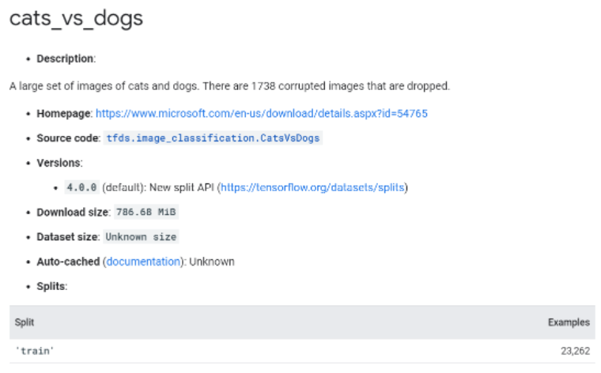
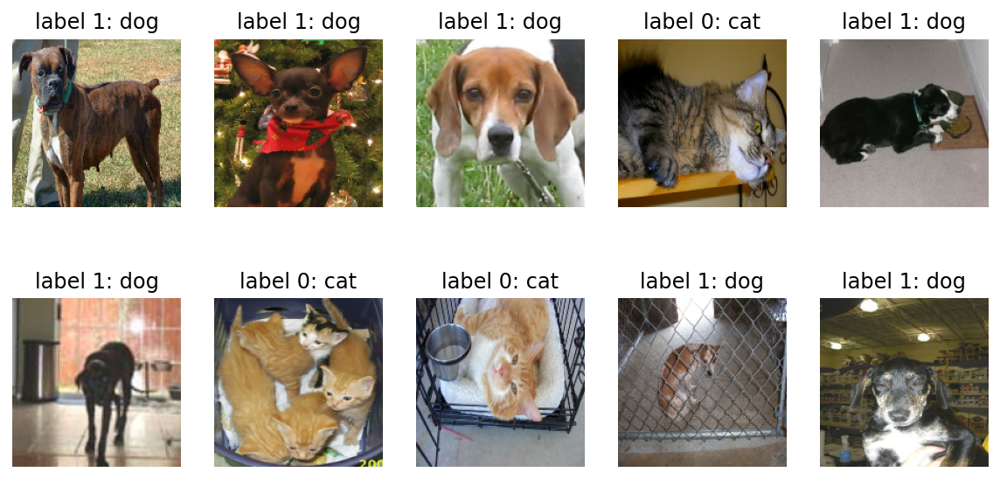
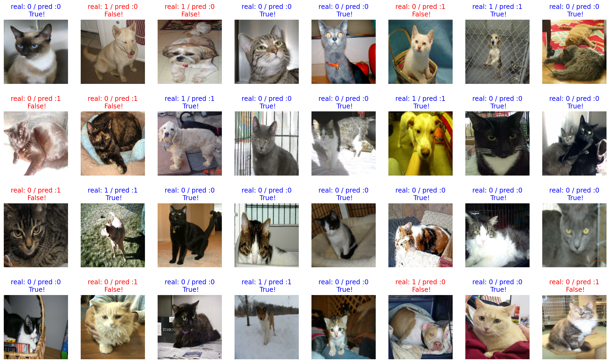

# <span style='background-color: #fff4f5'>인공지능 기초 🚶‍♂️: 사진 분류 프로그램 맛보기</span>

## 강아지 & 고양이 분류 프로그램 제작 !

### Content
1. 데이터 불러오기 (Tensor Flow)
2. 데이터 전처리
3. 모델 생성 (자체 생성 모델)
4. 학습 및 평가


**시작하기에 앞서, 이번 게시글은  
전체적인 인공지능 적용에 대한 맥락을 설명하기 위한 글입니다.  
아주 간단한 Deep Learning Layer 몇 종류를 이용했습니다.**


```python
import tensorflow as tf
print(tf.__version__ , '이미지 분류 모델을 만들 라이브러리 tensor flow 입니다')
```

    2.6.0 이미지 분류 모델을 만들 라이브러리 tensor flow 입니다


```python
import tensorflow_datasets as tfds

tfds.__version__
```


    '4.4.0'


tensor flow 에서는 다양한 데이터셋을 이미 제공하고 있다.  
강아지고양이, 음성, 이미지, 텍스트 데이터셋 보유하고 있으니 세부 내용 확인해보고 싶음 해보기

[tensor flow link](https://www.tensorflow.org/datasets/catalog/overview)


```python
(raw_train, raw_validation, raw_test), metadata = tfds.load(
    'cats_vs_dogs',
    split=['train[:80%]', 'train[80%:90%]', 'train[90%:]'],
    with_info=True,
    as_supervised=True,
)
```

    Downloading and preparing dataset 786.68 MiB (download: 786.68 MiB, generated: Unknown size, total: 786.68 MiB) to /aiffel/tensorflow_datasets/cats_vs_dogs/4.0.0...


    Dl Completed...: 0 url [00:00, ? url/s]


    Dl Size...: 0 MiB [00:00, ? MiB/s]


    Generating splits...:   0%|          | 0/1 [00:00<?, ? splits/s]


    Generating train examples...:   0%|          | 0/23262 [00:00<?, ? examples/s]


    WARNING:absl:1738 images were corrupted and were skipped


    Shuffling cats_vs_dogs-train.tfrecord...:   0%|          | 0/23262 [00:00<?, ? examples/s]


    Dataset cats_vs_dogs downloaded and prepared to /aiffel/tensorflow_datasets/cats_vs_dogs/4.0.0. Subsequent calls will reuse this data.


---
"WARNING:absl:1738 images were corrupted and were skipped"라는 경고가 나타날 수 있습니다. 우선 무시하시면 됩니다.  
1738 장의 사진은 쓸 수 없다는 뜻입니다.  
이런 것들은 tf 사이트 데이터셋 설명에서 확인 가능합니다




1738이 currupted 되어있다 되어있져?  
그리고 밑에 Split을 보면 23262 장의 사진이 있음을 확인 가능합니다.


```python
print(raw_train)
print(raw_validation)
print(raw_test)
```

    <PrefetchDataset shapes: ((None, None, 3), ()), types: (tf.uint8, tf.int64)>
    <PrefetchDataset shapes: ((None, None, 3), ()), types: (tf.uint8, tf.int64)>
    <PrefetchDataset shapes: ((None, None, 3), ()), types: (tf.uint8, tf.int64)>


잘 변수로 지정되어있음을 알 수 있다.

모든 데이터셋은 (image, label)의 형태를 가집니다.  
((None, None, 3), ())가 이를 나타내죠.  

여기에서 앞에 있는 (None, None, 3)은 image의 shape를,  
뒤의 ()는 정답 카테고리인 label의 shape를 의미합니다.  

이미지는 (height, width, channel)로 3차원 데이터이기 때문에  
(None, None, 3)과 같이 나타났습니다.  

이때 height와 width가 None으로 나타난 이유는   
모든 사진들의 크기가 제각각이기 때문입니다.  
하나의 값으로 나타낼 수 없으니 None 으로 표기됩니다.

## 1. 데이터 전처리
자 데이터를 불러왔으니 깔끔하게 처리해야지


```python
import matplotlib.pyplot as plt
%matplotlib inline
%config InlineBackend.figure_format = 'retina'
```

데이터를 어떻게 처리할지 고민하기 위해서 우리가 가져온 데이터를  
스리슬쩍 들여다 보자.


```python
plt.figure(figsize=(10, 5)) #전체 칸바스 크기

get_label_name = metadata.features['label'].int2str 

for idx, (image, label) in enumerate(raw_train.take(10)):  # 10개의 데이터를 따로 가져 옵니다.
    plt.subplot(2, 5, idx+1) #10개의 사진을 꺼내보겠음 판 꺼냄
    plt.imshow(image)
    plt.title(f'label {label}: {get_label_name(label)}')
    plt.axis('off')
```


    

    


자 봐라, 이미지 크기가 다 제각각이네?  

올바른 학습을 위해서는 이미지 사이즈부터 제대로 맞춰줘야 한다.

format_example() 함수로 이미지를 같은 포멧으로 맞춥니다.


```python
IMG_SIZE = 160 # 리사이징할 이미지의 크기

def format_example(image, label):
    image = tf.cast(image, tf.float32)  # image=float(image)같은 타입캐스팅의  텐서플로우 버전입니다.
    image = (image/127.5) - 1 # 픽셀값의 scale 수정
    image = tf.image.resize(image, (IMG_SIZE, IMG_SIZE))
    return image, label
```

픽셀값의 scale 을 수정햇다는 것은 픽셀값을 정규화햇다는 말과 근사하다.  
0~ 255인 픽셀값을 127.5로 나누면 0~ 2가된다. 그걸 1로 뺐으니  
-1~1 사이의 값으로 변했다.


```python
train = raw_train.map(format_example)
validation = raw_validation.map(format_example)
test = raw_test.map(format_example)

print(train)
print(validation)
print(test)
```

    <MapDataset shapes: ((160, 160, 3), ()), types: (tf.float32, tf.int64)>
    <MapDataset shapes: ((160, 160, 3), ()), types: (tf.float32, tf.int64)>
    <MapDataset shapes: ((160, 160, 3), ()), types: (tf.float32, tf.int64)>


map 메서드로 모든 raw_** 의 정보를 format_example 의 함수로 변환시켜주었다.  
변환된 후의 내용물은 다음과 같다.


```python
plt.figure(figsize=(10, 5))


get_label_name = metadata.features['label'].int2str

for idx, (image, label) in enumerate(train.take(10)):
    plt.subplot(2, 5, idx+1)
    image = (image + 1) / 2
    plt.imshow(image)
    plt.title(f'label {label}: {get_label_name(label)}')
    plt.axis('off')
```


    

    


데이터 전처리 끝~

---

## 2 모델 생성 및 학습


```python
from tensorflow.keras.models import Sequential
from tensorflow.keras.layers import Dense, Conv2D, Flatten, MaxPooling2D

```

models 에는 모델 자체를 구축하기 위한 함수가 있고  그 안의 Sequential 함수 안에 여러가지 layer 들이 들어갈 수 있다.  
layers 에는 모델의 구성 요소인 여러가지 종류의 layer(층) 함수들을 가지고 있다.


```python
model = Sequential([
    Conv2D(filters=16, kernel_size=3, padding='same', activation='relu', input_shape=(160, 160, 3)),
    MaxPooling2D(),
    Conv2D(filters=32, kernel_size=3, padding='same', activation='relu'),
    MaxPooling2D(),
    Conv2D(filters=64, kernel_size=3, padding='same', activation='relu'),
    MaxPooling2D(),
    Flatten(),
    Dense(units=512, activation='relu'),
    Dense(units=2, activation='softmax')
])
```

딥러닝에서는 **레이어** 라는 개념을 자세하게 공부한다.  
여기서는
- Conv2D
- MaxPooling2D
- Flatten
- Dense  
라는 네 레이어를 사용했다.


```python
model.summary()
```

    Model: "sequential_1"
    _________________________________________________________________
    Layer (type)                 Output Shape              Param #   
    =================================================================
    conv2d_3 (Conv2D)            (None, 160, 160, 16)      448       
    _________________________________________________________________
    max_pooling2d_3 (MaxPooling2 (None, 80, 80, 16)        0         
    _________________________________________________________________
    conv2d_4 (Conv2D)            (None, 80, 80, 32)        4640      
    _________________________________________________________________
    max_pooling2d_4 (MaxPooling2 (None, 40, 40, 32)        0         
    _________________________________________________________________
    conv2d_5 (Conv2D)            (None, 40, 40, 64)        18496     
    _________________________________________________________________
    max_pooling2d_5 (MaxPooling2 (None, 20, 20, 64)        0         
    _________________________________________________________________
    flatten_1 (Flatten)          (None, 25600)             0         
    _________________________________________________________________
    dense_2 (Dense)              (None, 512)               13107712  
    _________________________________________________________________
    dense_3 (Dense)              (None, 2)                 1026      
    =================================================================
    Total params: 13,132,322
    Trainable params: 13,132,322
    Non-trainable params: 0
    _________________________________________________________________


모델을 만들었으니 학습시켜보자.


```python
learning_rate = 0.0001
model.compile(optimizer=tf.keras.optimizers.RMSprop(lr=learning_rate),
              loss=tf.keras.losses.sparse_categorical_crossentropy,
              metrics=['accuracy'])

```

학습시키기 위해서는 Optimer , Loss, Metrics 가 필요하다.

opt : 학습을 어떤 방식으로 시킬 것인지  
loss : 모델이 학습해나가야 할 방향 (이 경우는 확률분포)  
metrics : [accuracy, precision, recall] 

아직은 실행하기 전이다. 지금은 사전 작업만 거친 상태


```python
BATCH_SIZE = 32
SHUFFLE_BUFFER_SIZE = 1000

train_batches = train.shuffle(SHUFFLE_BUFFER_SIZE).batch(BATCH_SIZE)
validation_batches = validation.batch(BATCH_SIZE)
test_batches = test.batch(BATCH_SIZE)
```

이렇게 train 데이터를 통으로 넣지 않고 32개씩 끊어 넣는 이유는
랜덤한 32개의 사진들을 묶어 여러개의 Decision Tree 를 만들어 ansamble 하기 위함

train_batches 의 데이터를 확인해보자


```python
for image_batch, label_batch in train_batches.take(1):
    pass

image_batch.shape, label_batch.shape
```


    (TensorShape([32, 160, 160, 3]), TensorShape([32]))


모델 학습 전에 초기 모델의 성능을 테스트해볼까? validation data 로 모델을 평가해보자  
20번의 예측을 해보고 loss 와 accuracy를 구해보자


```python
validation_steps = 20
loss0, accuracy0 = model.evaluate(validation_batches, steps=validation_steps)

print("initial loss: {:.2f}".format(loss0))
print("initial accuracy: {:.2f}".format(accuracy0))
```

    10/20 [==============>...............] - ETA: 0s - loss: 0.6924 - accuracy: 0.5156

    Corrupt JPEG data: 162 extraneous bytes before marker 0xd9


    20/20 [==============================] - 3s 32ms/step - loss: 0.6919 - accuracy: 0.5172
    initial loss: 0.69
    initial accuracy: 0.52


    Corrupt JPEG data: 252 extraneous bytes before marker 0xd9


보면 아무것도 하기 전에 모델 evaluate 는 걍 뭐 아무것도 모른다.
이제 이걸 학습시켜보자


```python
EPOCHS = 10
history = model.fit(train_batches,
                    epochs=EPOCHS,
                    validation_data=validation_batches)
```

    Epoch 1/10
    170/582 [=======>......................] - ETA: 18s - loss: 0.5444 - accuracy: 0.7250

    Corrupt JPEG data: 99 extraneous bytes before marker 0xd9


    202/582 [=========>....................] - ETA: 17s - loss: 0.5408 - accuracy: 0.7274

    Warning: unknown JFIF revision number 0.00


    212/582 [=========>....................] - ETA: 16s - loss: 0.5427 - accuracy: 0.7258

    Corrupt JPEG data: 396 extraneous bytes before marker 0xd9


    284/582 [=============>................] - ETA: 13s - loss: 0.5408 - accuracy: 0.7272

    Corrupt JPEG data: 65 extraneous bytes before marker 0xd9


    492/582 [========================>.....] - ETA: 3s - loss: 0.5280 - accuracy: 0.7363

    Corrupt JPEG data: 2226 extraneous bytes before marker 0xd9


    504/582 [========================>.....] - ETA: 3s - loss: 0.5277 - accuracy: 0.7360

    Corrupt JPEG data: 128 extraneous bytes before marker 0xd9


    516/582 [=========================>....] - ETA: 2s - loss: 0.5271 - accuracy: 0.7372

    Corrupt JPEG data: 239 extraneous bytes before marker 0xd9


    542/582 [==========================>...] - ETA: 1s - loss: 0.5269 - accuracy: 0.7374

    Corrupt JPEG data: 1153 extraneous bytes before marker 0xd9


    550/582 [===========================>..] - ETA: 1s - loss: 0.5271 - accuracy: 0.7372

    Corrupt JPEG data: 228 extraneous bytes before marker 0xd9


    582/582 [==============================] - ETA: 0s - loss: 0.5259 - accuracy: 0.7389

    Corrupt JPEG data: 162 extraneous bytes before marker 0xd9
    Corrupt JPEG data: 252 extraneous bytes before marker 0xd9
    Corrupt JPEG data: 214 extraneous bytes before marker 0xd9


    582/582 [==============================] - 29s 48ms/step - loss: 0.5259 - accuracy: 0.7389 - val_loss: 0.5102 - val_accuracy: 0.7502
    Epoch 2/10
    169/582 [=======>......................] - ETA: 18s - loss: 0.4561 - accuracy: 0.7898

    Corrupt JPEG data: 99 extraneous bytes before marker 0xd9


    201/582 [=========>....................] - ETA: 16s - loss: 0.4553 - accuracy: 0.7886

    Warning: unknown JFIF revision number 0.00


    213/582 [=========>....................] - ETA: 16s - loss: 0.4548 - accuracy: 0.7893

    Corrupt JPEG data: 396 extraneous bytes before marker 0xd9


    283/582 [=============>................] - ETA: 13s - loss: 0.4483 - accuracy: 0.7911

    Corrupt JPEG data: 65 extraneous bytes before marker 0xd9


    492/582 [========================>.....] - ETA: 3s - loss: 0.4446 - accuracy: 0.7943

    Corrupt JPEG data: 2226 extraneous bytes before marker 0xd9


    506/582 [=========================>....] - ETA: 3s - loss: 0.4450 - accuracy: 0.7947

    Corrupt JPEG data: 128 extraneous bytes before marker 0xd9


    516/582 [=========================>....] - ETA: 2s - loss: 0.4445 - accuracy: 0.7951

    Corrupt JPEG data: 239 extraneous bytes before marker 0xd9


    542/582 [==========================>...] - ETA: 1s - loss: 0.4437 - accuracy: 0.7953

    Corrupt JPEG data: 1153 extraneous bytes before marker 0xd9


    548/582 [===========================>..] - ETA: 1s - loss: 0.4433 - accuracy: 0.7952

    Corrupt JPEG data: 228 extraneous bytes before marker 0xd9


    580/582 [============================>.] - ETA: 0s - loss: 0.4425 - accuracy: 0.7956

    Corrupt JPEG data: 162 extraneous bytes before marker 0xd9
    Corrupt JPEG data: 252 extraneous bytes before marker 0xd9
    Corrupt JPEG data: 214 extraneous bytes before marker 0xd9


    582/582 [==============================] - 28s 47ms/step - loss: 0.4422 - accuracy: 0.7958 - val_loss: 0.5503 - val_accuracy: 0.7386
    Epoch 3/10
    169/582 [=======>......................] - ETA: 18s - loss: 0.3937 - accuracy: 0.8229

    Corrupt JPEG data: 99 extraneous bytes before marker 0xd9


    201/582 [=========>....................] - ETA: 16s - loss: 0.3927 - accuracy: 0.8232

    Warning: unknown JFIF revision number 0.00


    213/582 [=========>....................] - ETA: 16s - loss: 0.3927 - accuracy: 0.8234

    Corrupt JPEG data: 396 extraneous bytes before marker 0xd9


    283/582 [=============>................] - ETA: 13s - loss: 0.3870 - accuracy: 0.8266

    Corrupt JPEG data: 65 extraneous bytes before marker 0xd9


    492/582 [========================>.....] - ETA: 3s - loss: 0.3836 - accuracy: 0.8281

    Corrupt JPEG data: 2226 extraneous bytes before marker 0xd9


    506/582 [=========================>....] - ETA: 3s - loss: 0.3843 - accuracy: 0.8278

    Corrupt JPEG data: 128 extraneous bytes before marker 0xd9


    516/582 [=========================>....] - ETA: 2s - loss: 0.3836 - accuracy: 0.8281

    Corrupt JPEG data: 239 extraneous bytes before marker 0xd9


    543/582 [==========================>...] - ETA: 1s - loss: 0.3820 - accuracy: 0.8288

    Corrupt JPEG data: 1153 extraneous bytes before marker 0xd9


    549/582 [===========================>..] - ETA: 1s - loss: 0.3814 - accuracy: 0.8292

    Corrupt JPEG data: 228 extraneous bytes before marker 0xd9


    581/582 [============================>.] - ETA: 0s - loss: 0.3800 - accuracy: 0.8289

    Corrupt JPEG data: 162 extraneous bytes before marker 0xd9
    Corrupt JPEG data: 252 extraneous bytes before marker 0xd9
    Corrupt JPEG data: 214 extraneous bytes before marker 0xd9


    582/582 [==============================] - 28s 47ms/step - loss: 0.3799 - accuracy: 0.8290 - val_loss: 0.4954 - val_accuracy: 0.7674
    Epoch 4/10
    169/582 [=======>......................] - ETA: 18s - loss: 0.3449 - accuracy: 0.8460

    Corrupt JPEG data: 99 extraneous bytes before marker 0xd9


    201/582 [=========>....................] - ETA: 16s - loss: 0.3404 - accuracy: 0.8469

    Warning: unknown JFIF revision number 0.00


    213/582 [=========>....................] - ETA: 16s - loss: 0.3395 - accuracy: 0.8480

    Corrupt JPEG data: 396 extraneous bytes before marker 0xd9


    283/582 [=============>................] - ETA: 12s - loss: 0.3357 - accuracy: 0.8520

    Corrupt JPEG data: 65 extraneous bytes before marker 0xd9


    492/582 [========================>.....] - ETA: 3s - loss: 0.3270 - accuracy: 0.8581

    Corrupt JPEG data: 2226 extraneous bytes before marker 0xd9


    506/582 [=========================>....] - ETA: 3s - loss: 0.3273 - accuracy: 0.8581

    Corrupt JPEG data: 128 extraneous bytes before marker 0xd9


    516/582 [=========================>....] - ETA: 2s - loss: 0.3260 - accuracy: 0.8586

    Corrupt JPEG data: 239 extraneous bytes before marker 0xd9


    542/582 [==========================>...] - ETA: 1s - loss: 0.3256 - accuracy: 0.8590

    Corrupt JPEG data: 1153 extraneous bytes before marker 0xd9


    550/582 [===========================>..] - ETA: 1s - loss: 0.3252 - accuracy: 0.8593

    Corrupt JPEG data: 228 extraneous bytes before marker 0xd9


    580/582 [============================>.] - ETA: 0s - loss: 0.3244 - accuracy: 0.8602

    Corrupt JPEG data: 162 extraneous bytes before marker 0xd9
    Corrupt JPEG data: 252 extraneous bytes before marker 0xd9
    Corrupt JPEG data: 214 extraneous bytes before marker 0xd9


    582/582 [==============================] - 28s 47ms/step - loss: 0.3244 - accuracy: 0.8602 - val_loss: 0.4858 - val_accuracy: 0.7825
    Epoch 5/10
    170/582 [=======>......................] - ETA: 18s - loss: 0.2913 - accuracy: 0.8765

    Corrupt JPEG data: 99 extraneous bytes before marker 0xd9


    202/582 [=========>....................] - ETA: 16s - loss: 0.2866 - accuracy: 0.8790

    Warning: unknown JFIF revision number 0.00


    212/582 [=========>....................] - ETA: 16s - loss: 0.2868 - accuracy: 0.8791

    Corrupt JPEG data: 396 extraneous bytes before marker 0xd9


    284/582 [=============>................] - ETA: 12s - loss: 0.2804 - accuracy: 0.8825

    Corrupt JPEG data: 65 extraneous bytes before marker 0xd9


    493/582 [========================>.....] - ETA: 3s - loss: 0.2756 - accuracy: 0.8869

    Corrupt JPEG data: 2226 extraneous bytes before marker 0xd9


    505/582 [=========================>....] - ETA: 3s - loss: 0.2740 - accuracy: 0.8876

    Corrupt JPEG data: 128 extraneous bytes before marker 0xd9


    515/582 [=========================>....] - ETA: 2s - loss: 0.2733 - accuracy: 0.8877

    Corrupt JPEG data: 239 extraneous bytes before marker 0xd9


    543/582 [==========================>...] - ETA: 1s - loss: 0.2732 - accuracy: 0.8886

    Corrupt JPEG data: 1153 extraneous bytes before marker 0xd9


    549/582 [===========================>..] - ETA: 1s - loss: 0.2727 - accuracy: 0.8889

    Corrupt JPEG data: 228 extraneous bytes before marker 0xd9


    581/582 [============================>.] - ETA: 0s - loss: 0.2720 - accuracy: 0.8886

    Corrupt JPEG data: 162 extraneous bytes before marker 0xd9
    Corrupt JPEG data: 252 extraneous bytes before marker 0xd9
    Corrupt JPEG data: 214 extraneous bytes before marker 0xd9


    582/582 [==============================] - 28s 46ms/step - loss: 0.2721 - accuracy: 0.8885 - val_loss: 0.4933 - val_accuracy: 0.7919
    Epoch 6/10
    169/582 [=======>......................] - ETA: 18s - loss: 0.2373 - accuracy: 0.9051

    Corrupt JPEG data: 99 extraneous bytes before marker 0xd9


    201/582 [=========>....................] - ETA: 16s - loss: 0.2335 - accuracy: 0.9083

    Warning: unknown JFIF revision number 0.00


    211/582 [=========>....................] - ETA: 16s - loss: 0.2331 - accuracy: 0.9083

    Corrupt JPEG data: 396 extraneous bytes before marker 0xd9


    283/582 [=============>................] - ETA: 13s - loss: 0.2268 - accuracy: 0.9110

    Corrupt JPEG data: 65 extraneous bytes before marker 0xd9


    493/582 [========================>.....] - ETA: 3s - loss: 0.2216 - accuracy: 0.9123

    Corrupt JPEG data: 2226 extraneous bytes before marker 0xd9


    505/582 [=========================>....] - ETA: 3s - loss: 0.2209 - accuracy: 0.9127

    Corrupt JPEG data: 128 extraneous bytes before marker 0xd9


    516/582 [=========================>....] - ETA: 2s - loss: 0.2196 - accuracy: 0.9133

    Corrupt JPEG data: 239 extraneous bytes before marker 0xd9


    542/582 [==========================>...] - ETA: 1s - loss: 0.2178 - accuracy: 0.9147

    Corrupt JPEG data: 1153 extraneous bytes before marker 0xd9


    548/582 [===========================>..] - ETA: 1s - loss: 0.2171 - accuracy: 0.9150

    Corrupt JPEG data: 228 extraneous bytes before marker 0xd9


    580/582 [============================>.] - ETA: 0s - loss: 0.2163 - accuracy: 0.9152

    Corrupt JPEG data: 162 extraneous bytes before marker 0xd9
    Corrupt JPEG data: 252 extraneous bytes before marker 0xd9
    Corrupt JPEG data: 214 extraneous bytes before marker 0xd9


    582/582 [==============================] - 29s 47ms/step - loss: 0.2162 - accuracy: 0.9153 - val_loss: 0.6168 - val_accuracy: 0.7601
    Epoch 7/10
    169/582 [=======>......................] - ETA: 18s - loss: 0.1858 - accuracy: 0.9310

    Corrupt JPEG data: 99 extraneous bytes before marker 0xd9


    201/582 [=========>....................] - ETA: 16s - loss: 0.1836 - accuracy: 0.9331

    Warning: unknown JFIF revision number 0.00


    213/582 [=========>....................] - ETA: 16s - loss: 0.1820 - accuracy: 0.9341

    Corrupt JPEG data: 396 extraneous bytes before marker 0xd9


    283/582 [=============>................] - ETA: 13s - loss: 0.1783 - accuracy: 0.9361

    Corrupt JPEG data: 65 extraneous bytes before marker 0xd9


    493/582 [========================>.....] - ETA: 3s - loss: 0.1724 - accuracy: 0.9365

    Corrupt JPEG data: 2226 extraneous bytes before marker 0xd9


    505/582 [=========================>....] - ETA: 3s - loss: 0.1717 - accuracy: 0.9369

    Corrupt JPEG data: 128 extraneous bytes before marker 0xd9


    515/582 [=========================>....] - ETA: 2s - loss: 0.1709 - accuracy: 0.9374

    Corrupt JPEG data: 239 extraneous bytes before marker 0xd9


    543/582 [==========================>...] - ETA: 1s - loss: 0.1699 - accuracy: 0.9378

    Corrupt JPEG data: 1153 extraneous bytes before marker 0xd9


    549/582 [===========================>..] - ETA: 1s - loss: 0.1698 - accuracy: 0.9378

    Corrupt JPEG data: 228 extraneous bytes before marker 0xd9


    581/582 [============================>.] - ETA: 0s - loss: 0.1678 - accuracy: 0.9382

    Corrupt JPEG data: 162 extraneous bytes before marker 0xd9
    Corrupt JPEG data: 252 extraneous bytes before marker 0xd9
    Corrupt JPEG data: 214 extraneous bytes before marker 0xd9


    582/582 [==============================] - 28s 47ms/step - loss: 0.1677 - accuracy: 0.9382 - val_loss: 0.6220 - val_accuracy: 0.7627
    Epoch 8/10
    170/582 [=======>......................] - ETA: 18s - loss: 0.1322 - accuracy: 0.9537

    Corrupt JPEG data: 99 extraneous bytes before marker 0xd9


    202/582 [=========>....................] - ETA: 16s - loss: 0.1317 - accuracy: 0.9547

    Warning: unknown JFIF revision number 0.00


    212/582 [=========>....................] - ETA: 16s - loss: 0.1293 - accuracy: 0.9558

    Corrupt JPEG data: 396 extraneous bytes before marker 0xd9


    284/582 [=============>................] - ETA: 13s - loss: 0.1267 - accuracy: 0.9558

    Corrupt JPEG data: 65 extraneous bytes before marker 0xd9


    493/582 [========================>.....] - ETA: 3s - loss: 0.1241 - accuracy: 0.9564

    Corrupt JPEG data: 2226 extraneous bytes before marker 0xd9


    505/582 [=========================>....] - ETA: 3s - loss: 0.1237 - accuracy: 0.9566

    Corrupt JPEG data: 128 extraneous bytes before marker 0xd9


    515/582 [=========================>....] - ETA: 2s - loss: 0.1235 - accuracy: 0.9567

    Corrupt JPEG data: 239 extraneous bytes before marker 0xd9


    542/582 [==========================>...] - ETA: 1s - loss: 0.1223 - accuracy: 0.9574

    Corrupt JPEG data: 1153 extraneous bytes before marker 0xd9


    550/582 [===========================>..] - ETA: 1s - loss: 0.1219 - accuracy: 0.9577

    Corrupt JPEG data: 228 extraneous bytes before marker 0xd9


    580/582 [============================>.] - ETA: 0s - loss: 0.1210 - accuracy: 0.9580

    Corrupt JPEG data: 162 extraneous bytes before marker 0xd9
    Corrupt JPEG data: 252 extraneous bytes before marker 0xd9
    Corrupt JPEG data: 214 extraneous bytes before marker 0xd9


    582/582 [==============================] - 28s 47ms/step - loss: 0.1209 - accuracy: 0.9581 - val_loss: 0.6818 - val_accuracy: 0.7623
    Epoch 9/10
    170/582 [=======>......................] - ETA: 18s - loss: 0.0973 - accuracy: 0.9688

    Corrupt JPEG data: 99 extraneous bytes before marker 0xd9


    202/582 [=========>....................] - ETA: 16s - loss: 0.0932 - accuracy: 0.9711

    Warning: unknown JFIF revision number 0.00


    212/582 [=========>....................] - ETA: 16s - loss: 0.0942 - accuracy: 0.9704

    Corrupt JPEG data: 396 extraneous bytes before marker 0xd9


    284/582 [=============>................] - ETA: 13s - loss: 0.0915 - accuracy: 0.9712

    Corrupt JPEG data: 65 extraneous bytes before marker 0xd9


    492/582 [========================>.....] - ETA: 3s - loss: 0.0893 - accuracy: 0.9715

    Corrupt JPEG data: 2226 extraneous bytes before marker 0xd9


    506/582 [=========================>....] - ETA: 3s - loss: 0.0888 - accuracy: 0.9719

    Corrupt JPEG data: 128 extraneous bytes before marker 0xd9


    516/582 [=========================>....] - ETA: 2s - loss: 0.0883 - accuracy: 0.9721

    Corrupt JPEG data: 239 extraneous bytes before marker 0xd9


    542/582 [==========================>...] - ETA: 1s - loss: 0.0880 - accuracy: 0.9722

    Corrupt JPEG data: 1153 extraneous bytes before marker 0xd9


    550/582 [===========================>..] - ETA: 1s - loss: 0.0874 - accuracy: 0.9725

    Corrupt JPEG data: 228 extraneous bytes before marker 0xd9


    580/582 [============================>.] - ETA: 0s - loss: 0.0875 - accuracy: 0.9725

    Corrupt JPEG data: 162 extraneous bytes before marker 0xd9
    Corrupt JPEG data: 252 extraneous bytes before marker 0xd9
    Corrupt JPEG data: 214 extraneous bytes before marker 0xd9


    582/582 [==============================] - 28s 47ms/step - loss: 0.0874 - accuracy: 0.9725 - val_loss: 0.6500 - val_accuracy: 0.7863
    Epoch 10/10
    170/582 [=======>......................] - ETA: 18s - loss: 0.0692 - accuracy: 0.9783

    Corrupt JPEG data: 99 extraneous bytes before marker 0xd9


    202/582 [=========>....................] - ETA: 17s - loss: 0.0681 - accuracy: 0.9785

    Warning: unknown JFIF revision number 0.00


    212/582 [=========>....................] - ETA: 16s - loss: 0.0674 - accuracy: 0.9788

    Corrupt JPEG data: 396 extraneous bytes before marker 0xd9


    284/582 [=============>................] - ETA: 13s - loss: 0.0648 - accuracy: 0.9798

    Corrupt JPEG data: 65 extraneous bytes before marker 0xd9


    493/582 [========================>.....] - ETA: 3s - loss: 0.0626 - accuracy: 0.9816

    Corrupt JPEG data: 2226 extraneous bytes before marker 0xd9


    505/582 [=========================>....] - ETA: 3s - loss: 0.0624 - accuracy: 0.9817

    Corrupt JPEG data: 128 extraneous bytes before marker 0xd9


    515/582 [=========================>....] - ETA: 2s - loss: 0.0621 - accuracy: 0.9820

    Corrupt JPEG data: 239 extraneous bytes before marker 0xd9


    543/582 [==========================>...] - ETA: 1s - loss: 0.0610 - accuracy: 0.9826

    Corrupt JPEG data: 1153 extraneous bytes before marker 0xd9


    549/582 [===========================>..] - ETA: 1s - loss: 0.0615 - accuracy: 0.9825

    Corrupt JPEG data: 228 extraneous bytes before marker 0xd9


    581/582 [============================>.] - ETA: 0s - loss: 0.0614 - accuracy: 0.9827

    Corrupt JPEG data: 162 extraneous bytes before marker 0xd9
    Corrupt JPEG data: 252 extraneous bytes before marker 0xd9
    Corrupt JPEG data: 214 extraneous bytes before marker 0xd9


    582/582 [==============================] - 29s 47ms/step - loss: 0.0613 - accuracy: 0.9827 - val_loss: 0.6904 - val_accuracy: 0.7889


다음은 학습시킨 모델에 대한 그래프 보고이다


```python
for image_batch, label_batch in test_batches.take(1):
    images = image_batch
    labels = label_batch
    predictions = model.predict(image_batch)
    pass

predictions
```


    array([[9.9999702e-01, 2.9417115e-06],
           [8.3842850e-01, 1.6157144e-01],
           [7.4218982e-01, 2.5781012e-01],
           [9.9970847e-01, 2.9155653e-04],
           [9.9640131e-01, 3.5986665e-03],
           [7.8427315e-02, 9.2157269e-01],
           [1.8649189e-02, 9.8135078e-01],
           [9.1933328e-01, 8.0666728e-02],
           [9.4125561e-02, 9.0587437e-01],
           [7.8091651e-02, 9.2190832e-01],
           [1.1057696e-01, 8.8942307e-01],
           [9.2630666e-01, 7.3693395e-02],
           [9.9996006e-01, 3.9985713e-05],
           [4.6824862e-05, 9.9995315e-01],
           [9.9207205e-01, 7.9279514e-03],
           [9.9890709e-01, 1.0929310e-03],
           [3.1051392e-02, 9.6894866e-01],
           [5.8752208e-09, 1.0000000e+00],
           [8.3172768e-01, 1.6827232e-01],
           [9.9952376e-01, 4.7630019e-04],
           [7.9531687e-01, 2.0468311e-01],
           [9.9072027e-01, 9.2797335e-03],
           [9.9999344e-01, 6.5057743e-06],
           [9.1565454e-01, 8.4345400e-02],
           [9.9570221e-01, 4.2977203e-03],
           [1.0600092e-02, 9.8939985e-01],
           [9.9997663e-01, 2.3377719e-05],
           [1.0107538e-01, 8.9892459e-01],
           [9.9934202e-01, 6.5792818e-04],
           [9.9927968e-01, 7.2028313e-04],
           [9.9999619e-01, 3.7975171e-06],
           [2.8957015e-01, 7.1042985e-01]], dtype=float32)


이것이 바로 우리의 정확도이다.


```python
import numpy as np

predictions = np.argmax(predictions, axis=1)
predictions
```


    array([0, 0, 0, 0, 0, 1, 1, 0, 1, 1, 1, 0, 0, 1, 0, 0, 1, 1, 0, 0, 0, 0,
           0, 0, 0, 1, 0, 1, 0, 0, 0, 1])


이제 32장의 image 와 32개의 label , 32개의 prediction 을 얻었다
최종 확인을 해보자


```python
plt.figure(figsize=(20, 12))

for idx, (image, label, prediction) in enumerate(zip(images, labels, predictions)):
    plt.subplot(4, 8, idx+1)
    image = (image + 1) / 2
    plt.imshow(image)
    correct = label == prediction
    title = f'real: {label} / pred :{prediction}\n {correct}!'
    if not correct:
        plt.title(title, fontdict={'color': 'red'})
    else:
        plt.title(title, fontdict={'color': 'blue'})
    plt.axis('off')
```


    

    


```python
count = 0   # 정답을 맞춘 개수
for image, label, prediction in zip(images, labels, predictions):
    correct = label == prediction
    if correct:
        count = count + 1

print(count / 32 * 100)
```

    71.875


중간에 들어가있는 딥러닝 모델이 단순한 구조이기 때문에  
좋은 결과가 나오고 있지는 않다.  

다만 중간의 모델구조를 변경한다면 더 좋은 결과를  
끌어낼 수 있을 것이다.  

```toc

```


```python

```
