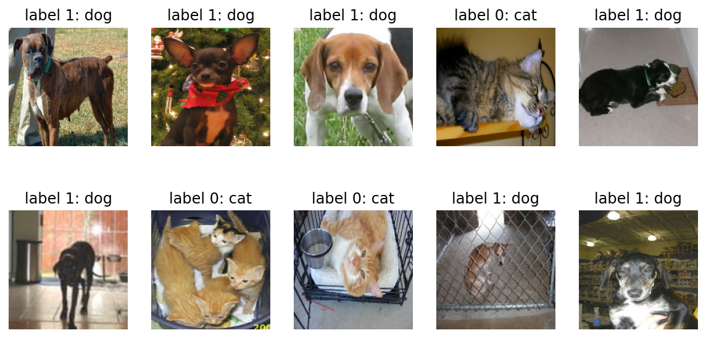
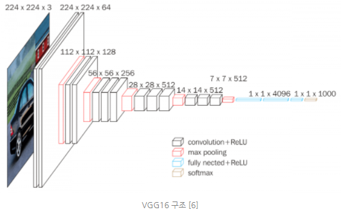

# <span style='background-color: #fff5b1'>딥러닝모델 VGG-16  🚶🏽‍♂️</span>

오늘 구현한 모델은 VGG-16 이다.


## 목차

1. 데이터 불러오기
2. VGG-16 생성
3. 본인의 과업에 맞게 VGG-16 개선

이 모델은 미국에서 진행한 이미지 인식 대회 ILSVRC 에서  
2014년 준우승을 한 모델이다! (물론 지금은 더 좋은게 많이 있다)  

하지만 계속 발전되는 Deep Learning 모델을 이해하기 위해선  
기본적인 구조를 갖춘 VGG-16 의 모델 이해가 필요하다.

본 게시글에서는 VGG-16 를 Tensorflow 라이브러리에서 불러와  
사용하는 방법을 제시한다.


모델 사용에는 tensorflow 실습 데이터인
`cats vs dogs` 를 사용했다.


```python
import tensorflow as tf
import tensorflow_datasets as tfds
import matplotlib.pyplot as plt
%matplotlib inline
%config InlineBackend.figure_format = 'retina'


(raw_train, raw_validation, raw_test), metadata = tfds.load(
    'cats_vs_dogs',
    split=['train[:80%]', 'train[80%:90%]', 'train[90%:]'],
    with_info=True,
    as_supervised=True,
)

IMG_SIZE = 160 # 리사이징할 이미지의 크기

def format_example(image, label):
    image = tf.cast(image, tf.float32)  # image=float(image)같은 타입캐스팅의  텐서플로우 버전입니다.
    image = (image/127.5) - 1 # 픽셀값의 scale 수정
    image = tf.image.resize(image, (IMG_SIZE, IMG_SIZE))
    return image, label

train = raw_train.map(format_example)
validation = raw_validation.map(format_example)
test = raw_test.map(format_example)

```

    Downloading and preparing dataset 786.68 MiB (download: 786.68 MiB, generated: Unknown size, total: 786.68 MiB) to /aiffel/tensorflow_datasets/cats_vs_dogs/4.0.0...


    Dl Completed...: 0 url [00:00, ? url/s]


    Dl Size...: 0 MiB [00:00, ? MiB/s]


    Generating splits...:   0%|          | 0/1 [00:00<?, ? splits/s]


    Generating train examples...:   0%|          | 0/23262 [00:00<?, ? examples/s]


    WARNING:absl:1738 images were corrupted and were skipped


    Shuffling cats_vs_dogs-train.tfrecord...:   0%|          | 0/23262 [00:00<?, ? examples/s]


    Dataset cats_vs_dogs downloaded and prepared to /aiffel/tensorflow_datasets/cats_vs_dogs/4.0.0. Subsequent calls will reuse this data.


```python
plt.figure(figsize=(10, 5))


get_label_name = metadata.features['label'].int2str

for idx, (image, label) in enumerate(train.take(10)):
    plt.subplot(2, 5, idx+1)
    image = (image + 1) / 2
    plt.imshow(image)
    plt.title(f'label {label}: {get_label_name(label)}')
    plt.axis('off')
```


    

    


### VGG 16 불러오기


```python
feature_batch = base_model(image_batch)
feature_batch.shape
```


    TensorShape([32, 5, 5, 512])


```python
base_model.summary()
```

    Model: "vgg16"
    _________________________________________________________________
    Layer (type)                 Output Shape              Param #   
    =================================================================
    input_1 (InputLayer)         [(None, 160, 160, 3)]     0         
    _________________________________________________________________
    block1_conv1 (Conv2D)        (None, 160, 160, 64)      1792      
    _________________________________________________________________
    block1_conv2 (Conv2D)        (None, 160, 160, 64)      36928     
    _________________________________________________________________
    block1_pool (MaxPooling2D)   (None, 80, 80, 64)        0         
    _________________________________________________________________
    block2_conv1 (Conv2D)        (None, 80, 80, 128)       73856     
    _________________________________________________________________
    block2_conv2 (Conv2D)        (None, 80, 80, 128)       147584    
    _________________________________________________________________
    block2_pool (MaxPooling2D)   (None, 40, 40, 128)       0         
    _________________________________________________________________
    block3_conv1 (Conv2D)        (None, 40, 40, 256)       295168    
    _________________________________________________________________
    block3_conv2 (Conv2D)        (None, 40, 40, 256)       590080    
    _________________________________________________________________
    block3_conv3 (Conv2D)        (None, 40, 40, 256)       590080    
    _________________________________________________________________
    block3_pool (MaxPooling2D)   (None, 20, 20, 256)       0         
    _________________________________________________________________
    block4_conv1 (Conv2D)        (None, 20, 20, 512)       1180160   
    _________________________________________________________________
    block4_conv2 (Conv2D)        (None, 20, 20, 512)       2359808   
    _________________________________________________________________
    block4_conv3 (Conv2D)        (None, 20, 20, 512)       2359808   
    _________________________________________________________________
    block4_pool (MaxPooling2D)   (None, 10, 10, 512)       0         
    _________________________________________________________________
    block5_conv1 (Conv2D)        (None, 10, 10, 512)       2359808   
    _________________________________________________________________
    block5_conv2 (Conv2D)        (None, 10, 10, 512)       2359808   
    _________________________________________________________________
    block5_conv3 (Conv2D)        (None, 10, 10, 512)       2359808   
    _________________________________________________________________
    block5_pool (MaxPooling2D)   (None, 5, 5, 512)         0         
    =================================================================
    Total params: 14,714,688
    Trainable params: 14,714,688
    Non-trainable params: 0
    _________________________________________________________________


18층으로 구성되어 있다.

해당 사이트에서 전문적인 내용을 다룬다.

[자세한 내용을 보시려면](https://neurohive.io/en/popular-networks/vgg16/)

이 모델은 해당 그림을 구현하고 있다. 



그림의 세 번째 파란상자를 보면 fully nected 라고 되어있는데,  
fully connected layer 의 오타이다. 순방향 신경망을 의미한다.

18층으로 구성되어있으나 VGG-16 인 이유는  
convolution layer 와 fully connected layer 만 포함했기 때문이다.  
이 두 개의 총 합은 16개이다.  

현재 파이썬에 불러온 모델 상에는 
마지막 maxfooling 까지만 구현되어있다.

때문에 마지막 네 개의 층을 직접 도입해보기로 하자!

### VGG-16 개선

---
마지막 layer 까지 제공해주지 않는 이유는  
우리가 입력하는 input 데이터에 따라 output 데이터도  
달라지기 때문이다.

마지막 layer 인 Dense layer (Fully connected layer) 에 넣어주기 위해서는 input data 를 Flatten 시킨 후 입력하여야 한다.

우리 shape 는 32,5,5,512 라서 이거 한줄로 만들어줄건데


아래는 Flatten의 예시이다.


```python
import numpy as np

image = np.array([[1, 2],
                  [3, 4]])

flattened_image = image.flatten()

print("Original image:\n", image)
print("Original image shape:", image.shape)
print()
print("Flattened image:\n", flattened_image)
print("Flattened image shape:", flattened_image.shape)
```

    Original image:
     [[1 2]
     [3 4]]
    Original image shape: (2, 2)
    
    Flattened image:
     [1 2 3 4]
    Flattened image shape: (4,)


이처럼 차원이 존재하는 배열데이터를 한 줄로   
이어준다.


```python

```

아 근데 이거 말고 더 좋은게 있데

그게 바로 Global Average Pooling

3차원의 tensor 가 있을때 (예를 들어, 가로, 세로, 채널)  
겹겹이 쌓여있는 2차원 배열의 평균을 구한 후 하나로 축소하는 방법


```python
global_average_layer = tf.keras.layers.GlobalAveragePooling2D()
# global Average 사용

feature_batch_average = global_average_layer(feature_batch)
#만든 glo aver 를 이어 붙이기

dense_layer = tf.keras.layers.Dense(512, activation='relu')
prediction_layer = tf.keras.layers.Dense(2, activation='softmax')

# feature_batch_averag가 dense_layer를 거친 결과가 다시 prediction_layer를 거치게 되면
prediction_batch = prediction_layer(dense_layer(feature_batch_average))  
print(prediction_batch.shape)
# 사용
```

    (32, 2)


```python
base_model.trainable = False

model = tf.keras.Sequential([
  base_model,
  global_average_layer,
  dense_layer,
  prediction_layer
])

```

이게 최종 모델이다.


```python
model.summary()
```

    Model: "sequential"
    _________________________________________________________________
    Layer (type)                 Output Shape              Param #   
    =================================================================
    vgg16 (Functional)           (None, 5, 5, 512)         14714688  
    _________________________________________________________________
    global_average_pooling2d (Gl (None, 512)               0         
    _________________________________________________________________
    dense (Dense)                (None, 512)               262656    
    _________________________________________________________________
    dense_1 (Dense)              (None, 2)                 1026      
    =================================================================
    Total params: 14,978,370
    Trainable params: 263,682
    Non-trainable params: 14,714,688
    _________________________________________________________________


VGG16 모델 밑으로 Flatten(Global_average), Dense 레이어 2개가  
들어갔다. 

모델의 사용은 다음 게시글에 이어서 쓰도록 한다.

```toc

```


```python

```
