# <span style='background-color: #fff5b1'>활성화함수, 데이터를 죽여살려? </span>

영어로는 activation 함수라고 한다.

활성화 되었다?

=> 어떤 조건을 만족시켰다. 라는 뜻.

신경망 속의 퍼셉트론 perceptron 혹은 node 도  
'특정조건' 이 갖춰지면 '활성화' 된다.

특정 조건 이란 어떤 임계치를 넘었냐 넘지 않았느냐로 구분된다.

예를 들어 시그모이드 함수가 있다.

## 활성화 함수 시그모이드 의 예

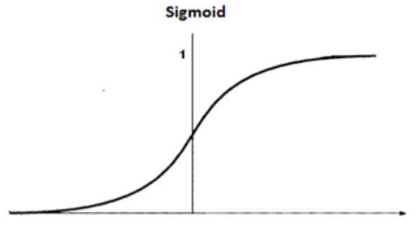
그림을 보면, x 값은 무한하고, y의 값은 0에서 1 사이로 이루어져 있다.

만약 출력값이 0.5 이상이면 활성화 된것으로 보고,  
그 미만이면 비활성화 라고 생각 했을때,  

시그모이드 함수는 입력값이 0 이하일때는 비활성화  
0 이상일 때만 활성화로 만들어 준다.

시그모이드 함수는 무조건 출력이 0 에서 1 사이니까

이진 분류에 용이하다.

0 혹은 1에 수렴하기 때문이다

#### 딥러닝에서 활성화 함수를 쓰는 큰 이유는

딥러닝 모델의 **표현력** 을 향상시켜주기 위해서이다.

다른 말로

representation capacity   
expressivity  

를 향상시킨다고 한다.

만약에 y = wx + b 라는 모델이 있다.

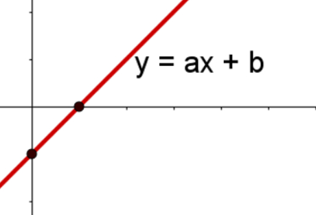
이 모델로는 x^2 나 sin(x) 의 분포를 절대 표현할 수 없다.  
다시 말해서, 선형 함수 (y = wx +b ) 에 어떤 수를 곱하거나 더한다고 해서    
비선형 함수로 만들 수는 없다.

그런데 비선형 활성화 함수와 선형함수를 연산해준다면   
이런 비선형 데이터를 표현할 수 있다.

### 활성화 함수의 종류


0. 이진 계단 함수 ( Binary step Function)

1. 선형 활성화 함수

선형 활성화 함수를 쓰면 가중치가 많을 필요가 없다.
어차피 선형 함수끼리는 곱해도 선형함수기 때문에
다 합성되어 그냥 커다란 하나의 함수로 치환 가능하기 때문이다.

그럼 이건 비선형 분포를 예측할 수가 없다.  
이러니 표현력이 떨어진다.

2. 비선형 활성화 함수


비선형 활성화 함수를 썼을 때

representation capacity 가 오른다.

---


## binary step function

얘는 출력이 0 혹은 1 밖에 없다.

그래서 얘는 이진 분류 문제에서 쓰인다.

임계점 이 있으면 걔를 기준으로 0과 1을 출력한다.


```python
import numpy as np
import matplotlib.pyplot as plt
from PIL import Image
from itertools import product
import tensorflow as tf

tf.random.set_seed(7879)

```


```python
def binary_step(x, threshold=0):  # 0보다 작으면 0, 같거나 크면 1
    return 0 if x<threshold else 1
```


```python
binary_step(5)
```


    1


```python
binary_step(-6)
```


    0


```python
import matplotlib.pyplot as plt
from PIL import Image
import numpy as np

def plot_and_visulize(image_url, function, derivative=False):
    X = [-10 + x/100 for x in range(2000)]
    y = [function(y) for y in X]
    
    plt.figure(figsize=(12,12))
    
    # 함수 그래프
    plt.subplot(3,2,1)
    plt.title('function')
    plt.plot(X,y)
    
    # 함수의 미분 그래프
    plt.subplot(3,2,2)
    plt.title('derivative')
    if derivative:
        dev_y = [derivative(y) for y in X]
        plt.plot(X,dev_y)
    
    # 무작위 샘플들 분포
    samples = np.random.rand(1000)
    samples -= np.mean(samples)
    plt.subplot(3,2,3)
    plt.title('samples')
    plt.hist(samples,100)
    
    # 활성화 함수를 통과한 샘플들 분포
    act_values = [function(y) for y in samples]
    plt.subplot(3,2,4)
    plt.title('activation values')
    plt.hist(act_values,100)
    
    # 원본 이미지
    image = np.array(Image.open(image_url), dtype=np.float64)[:,:,0]/255. # 구분을 위해 gray-scale해서 확인
    image -= np.median(image) #중앙값을 빼줬으니 125 이하는 0, 125 이상은 1로 바뀜
    plt.subplot(3,2,5)
    plt.title('origin image')
    plt.imshow(image, cmap='gray')
    
    # 활성화 함수를 통과한 이미지
    activation_image = np.zeros(image.shape)
    h, w = image.shape
    for i in range(w):
        for j in range(h):
            activation_image[j][i] += function(image[j][i])
    plt.subplot(3,2,6)
    plt.title('activation results')
    plt.imshow(activation_image, cmap='gray')
    
    return plt
```

내 사진의 pixel 데이터를 가지고  
직저 만든 활성화 함수 Binary step Function 에 넣어보았다.


```python
import os
img_path = os.getenv('HOME')+'/aiffel/Study/26/activation/me.jpg'
ax = plot_and_visulize(img_path, binary_step)
ax.show()
```


    
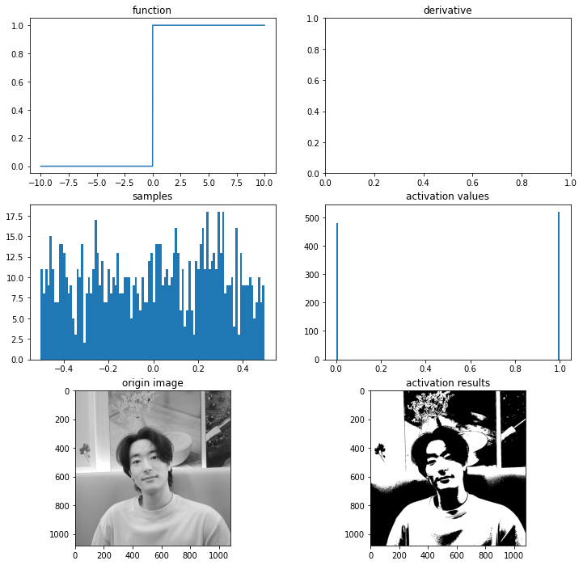
    


이렇듯 이진 함수는 값이 있고 없고로 저렇게 0 혹은 1로 딱 구분해준다!

Binary step Func 은 단층  perceptron 구조 신경망에서 많이 사용됨

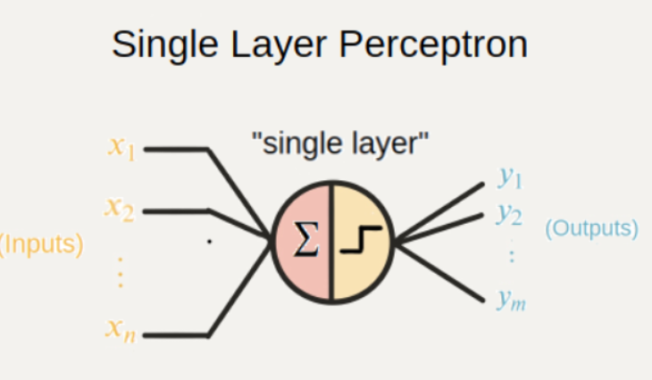


```python
# 퍼셉트론
class Perceptron(object):
    def __init__(self, input_size, activation_ftn, threshold=0, learning_rate=0.01):
        self.weights = np.random.randn(input_size)
        self.bias = np.random.randn(1)
        self.activation_ftn = np.vectorize(activation_ftn) #선형 변환 해주겠다는 뜻
        self.learning_rate = learning_rate
        self.threshold = threshold

    def train(self, training_inputs, labels, epochs=100, verbose=1):
        '''
        verbose : 1-매 에포크 결과 출력, 
                  0-마지막 결과만 출력 
        '''
        for epoch in range(epochs):
            for inputs, label in zip(training_inputs, labels):
                prediction = self.__call__(inputs)
                self.weights += self.learning_rate * (label - prediction) * inputs
                self.bias += self.learning_rate * (label - prediction)
            if verbose == 1:
                pred = self.__call__(training_inputs)
                accuracy = np.sum(pred==labels)/len(pred)
                print(f'{epoch}th epoch, accuracy : {accuracy}')
        if verbose == 0:
            pred = self.__call__(training_inputs)
            accuracy = np.sum(pred==labels)/len(pred)
            print(f'{epoch}th epoch, accuracy : {accuracy}')
    
    def get_weights(self):
        return self.weights, self.bias
                
    def __call__(self, inputs):
        summation = np.dot(inputs, self.weights) + self.bias
        return self.activation_ftn(summation, self.threshold)
```

근데 요런 신경망은 and 나 or 에 대해선 설명할 수 있다.

다시말해 하나의 선을 딱 그어서 구분하는 문제는 설명 가능하다.


```python
def scatter_plot(plt, X, y, threshold = 0, three_d=False):
    ax = plt
    if not three_d:
        area1 = np.ma.masked_where(y <= threshold, y)
        area2 = np.ma.masked_where(y > threshold, y+1)
        ax.scatter(X[:,0], X[:,1], s = area1*10, label='True')
        ax.scatter(X[:,0], X[:,1], s = area2*10, label='False')
        ax.legend()
    else:
        area1 = np.ma.masked_where(y <= threshold, y)
        area2 = np.ma.masked_where(y > threshold, y+1)
        ax.scatter(X[:,0], X[:,1], y-threshold, s = area1, label='True')
        ax.scatter(X[:,0], X[:,1], y-threshold, s = area2, label='False')
        ax.scatter(X[:,0], X[:,1], 0, s = 0.05, label='zero', c='gray')
        ax.legend()
    return ax
```


```python
# AND gate, OR gate
X = np.array([[0,0], [1,0], [0,1], [1,1]])

plt.figure(figsize=(10,5))
# OR gate
or_y = np.array([x1 | x2 for x1,x2 in X])
ax1 = plt.subplot(1,2,1)
ax1.set_title('OR gate ' + str(or_y))
ax1 = scatter_plot(ax1, X, or_y)

# AND gate
and_y = np.array([x1 & x2 for x1,x2 in X])
ax2 = plt.subplot(1,2,2)
ax2.set_title('AND gate ' + str(and_y))
ax2 = scatter_plot(ax2, X, and_y)

plt.show()
```


    
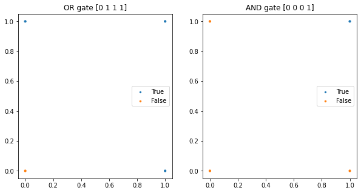
    


```python
# OR gate
or_p = Perceptron(input_size=2, activation_ftn=binary_step)
or_p.train(X, or_y, epochs=1000, verbose=0)
print(or_p.get_weights()) # 가중치와 편향값은 훈련마다 달라질 수 있습니다.

# AND gate
and_p = Perceptron(input_size=2, activation_ftn=binary_step)
and_p.train(X, and_y, epochs=1000, verbose=0)
print(and_p.get_weights()) # 가중치와 편향값은 훈련마다 달라질 수 있습니다.
```

    999th epoch, accuracy : 1.0
    (array([0.802858  , 0.99642675]), array([-0.78371765]))
    999th epoch, accuracy : 1.0
    (array([0.65508949, 0.02640151]), array([-0.67231513]))


이 정확도를 어떻게 나타냈는지를 보면 다음과 같다.

x,y 축을 100등분한 다음 True 와 False 의 경계선을 하나 골라 그었다고 생각하면 된다.


```python
from itertools import product

# 그래프로 그려보기
test_X = np.array([[x/100,y/100] for (x,y) in product(range(101),range(101))])
pred_or_y = or_p(test_X)
pred_and_y = and_p(test_X)

plt.figure(figsize=(10,10))
ax1 = plt.subplot(2,2,1)
ax1.set_title('predict OR gate')
ax1 = scatter_plot(ax1, test_X, pred_or_y)

ax2 = plt.subplot(2,2,2, projection='3d')
ax2.set_title('predict OR gate 3D')
ax2 = scatter_plot(ax2, test_X, pred_or_y, three_d=True)

ax3 = plt.subplot(2,2,3)
ax3.set_title('predict AND gate')
ax3 = scatter_plot(ax3, test_X, pred_and_y)

ax4 = plt.subplot(2,2,4, projection='3d')
ax4.set_title('predict AND gate 3D')
ax4 = scatter_plot(ax4, test_X, pred_and_y, three_d=True)

plt.show()
```


    
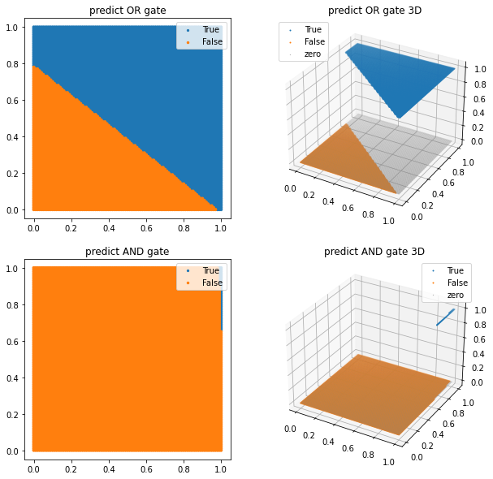
    


하지만 이대로는 XOR 문제를 풀수가 없다, 정확도가 25%밖에 안나온다


```python
# XOR gate
threshold = 0
X = np.array([[0,0], [1,0], [0,1], [1,1]])

plt.figure(figsize=(5,5))
xor_y = np.array([x1 ^ x2 for x1,x2 in X])
plt.title('XOR gate '+ str(xor_y))
plt = scatter_plot(plt, X, xor_y)
plt.show()
```


    
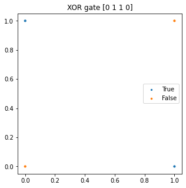
    


```python
# XOR gate가 풀릴까?
xor_p = Perceptron(input_size=2, activation_ftn=binary_step, threshold=threshold)
xor_p.train(X, xor_y, epochs=1000, verbose=0)
print(xor_p.get_weights())

# 그래프로 그려보기
test_X = np.array([[x/100,y/100] for (x,y) in product(range(101),range(101))])
pred_xor_y = xor_p(test_X)

plt.figure(figsize=(10,5))
ax1 = plt.subplot(1,2,1)
ax1.set_title('predict XOR gate?')
ax1 = scatter_plot(ax1, test_X, pred_xor_y)

ax2 = plt.subplot(1,2,2, projection='3d')
ax2.set_title('predict XOR gate 3D?')
ax2 = scatter_plot(ax2, test_X, pred_xor_y, three_d=True)

plt.show()
```

    999th epoch, accuracy : 0.25
    (array([-0.01313922, -0.01549442]), array([0.00652869]))


    
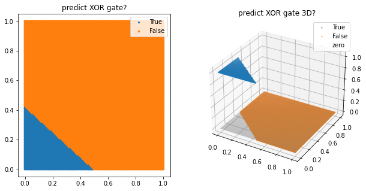
    


이를 해결한 방법이 바로 다층 perceptron 을 이용하는 방법이다.

Multi-Layer Perceptron

MLP

조심해야할거!!! 여기서 layer 는 perceptron 을 얼마나 쓰냐에 대한 layer 이지  
우리가 평소에 말하는 layer 가 아니다!!

multi layer 는 노드가 2개 이상인 layer 하나를 의미한다! layer 가 여러개인게 아니다!

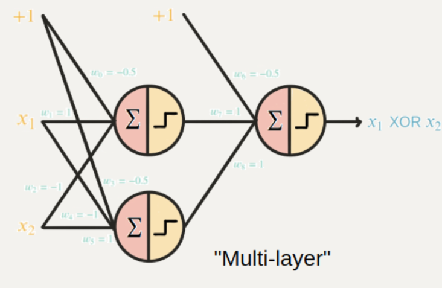

이처럼 층을 여러개 쌓아버리면 비선형 인 XOR 도 에측은 할 수 있지만

그럼에도 불구하고 문제점
1. 역전파 알고리즘으로 가중치 업데이트를 못한다

사실 이진 함수 Binary step function 은 역전파 알고리즘을 사용할 수 없다 back propagation  
역전파를 하려면 미분이 필요한데 얘네는 다 상수라 미분값이 0이기 때문이다.

2. 다중 출력을 할 수 없다.
출력이 0 1 둘중 하나밖에 안나오니까
다중 클래스 중 하나를 골라야 할 때는 쓸 수 없다.

결론 : 어차피 옛날거니까 걍 넘어가자

#### 선형활성화 함수는 아까 말햇듯이 얼마나 넣든 하나의 활성화 함수랑 똑같고 별로니까 넘어간다

# 이제 진짜 중요한 비선형 활성화 함수 Non-Linear

1. 역전파 알고리즘 사용 가능
2. 다중 출력 가능
3. 비선형 특징 예측 가능

와우;; 인공지능 만능열쇠 Non-linear

### 종류

1. 시그모이드(logistic)


```python
import os
img_path = os.getenv('HOME')+'/aiffel/Study/26/activation/me.jpg'

# 시그모이드 함수
def sigmoid(x):
    return 1/(1+np.exp(-x).astype(np.float64))

def dev_sigmoid(x):
    return sigmoid(x)*(1-sigmoid(x))

# 시각화
ax = plot_and_visulize(img_path, sigmoid, dev_sigmoid)
ax.show()
```


    
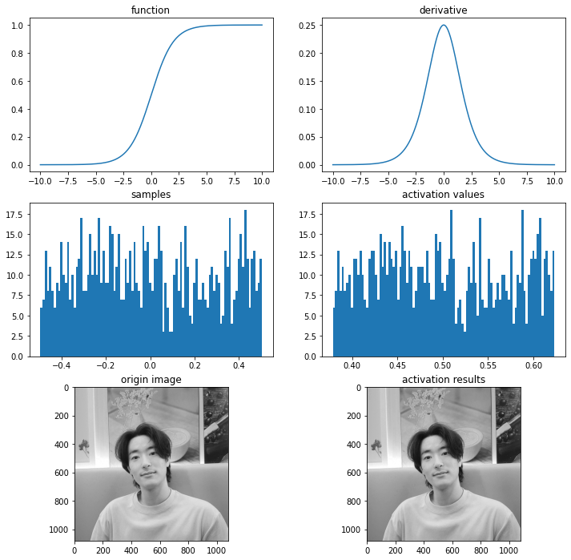
    


```python
# 수치 미분
def num_derivative(x, function):
    h = 1e-15 # 이 값을 바꾸어 가며 그래프를 확인해 보세요
    numerator = function(x+h)-function(x)
    return numerator/h

# 두 그래프의 차이
diff_X = [-5+x/100 for x in range(1001)]
dev_y = np.array([dev_sigmoid(x) for x in diff_X])
num_dev_y = np.array([num_derivative(x, sigmoid) for x in diff_X])

diff_y = dev_y - num_dev_y
plt.plot(diff_X, num_dev_y, label='numerical')
plt.plot(diff_X, dev_y, label='analytic')
plt.plot(diff_X, diff_y, label='differnce')
plt.legend()

plt.show()
```


    
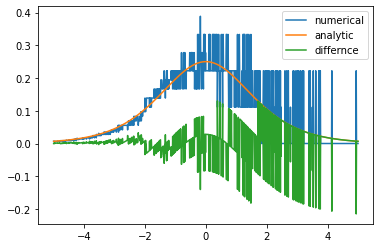
    


```python
# OR gate
or_sigmoid_model = tf.keras.Sequential([
    tf.keras.layers.Input(shape=(2,)),
    tf.keras.layers.Dense(1, activation='sigmoid')
])
or_sigmoid_model.compile(loss='mse', optimizer=tf.keras.optimizers.Adam(learning_rate=0.01), metrics=['accuracy'])
or_sigmoid_model.fit(X, or_y, epochs=1000, verbose=0)

# AND gate
and_sigmoid_model = tf.keras.Sequential([
    tf.keras.layers.Input(shape=(2,)),
    tf.keras.layers.Dense(1, activation='sigmoid')
])
and_sigmoid_model.compile(loss='mse', optimizer=tf.keras.optimizers.Adam(learning_rate=0.01), metrics=['accuracy'])
and_sigmoid_model.fit(X, and_y, epochs=1000, verbose=0)

# XOR gate
xor_sigmoid_model = tf.keras.Sequential([
    tf.keras.layers.Input(shape=(2,)),
    tf.keras.layers.Dense(1, activation='sigmoid')
])
xor_sigmoid_model.compile(loss='mse', optimizer=tf.keras.optimizers.Adam(learning_rate=0.01), metrics=['accuracy'])
xor_sigmoid_model.fit(X, xor_y, epochs=1000, verbose=0)

# 그래프로 그려보기
test_X = np.array([[x/100,y/100] for (x,y) in product(range(101),range(101))])
pred_or_y = or_sigmoid_model(test_X)
pred_and_y = and_sigmoid_model(test_X)
pred_xor_y = xor_sigmoid_model(test_X)

plt.figure(figsize=(10,15))
ax1 = plt.subplot(3,2,1)
ax1.set_title('predict OR gate')
ax1 = scatter_plot(ax1, test_X, pred_or_y, threshold=0.5)

ax2 = plt.subplot(3,2,2, projection='3d')
ax2.set_title('predict OR gate 3D')
ax2 = scatter_plot(ax2, test_X, pred_or_y, threshold=0.5, three_d=True)

ax3 = plt.subplot(3,2,3)
ax3.set_title('predict AND gate')
ax3 = scatter_plot(ax3, test_X, pred_and_y, threshold=0.5)

ax4 = plt.subplot(3,2,4, projection='3d')
ax4.set_title('predict AND gate 3D')
ax4 = scatter_plot(ax4, test_X, pred_and_y, threshold=0.5, three_d=True)

ax5 = plt.subplot(3,2,5)
ax5.set_title('predict XOR gate')
ax5 = scatter_plot(ax5, test_X, pred_xor_y, threshold=0.5)

ax6 = plt.subplot(3,2,6, projection='3d')
ax6.set_title('predict XOR gate 3D')
ax6 = scatter_plot(ax6, test_X, pred_xor_y, threshold=0.5, three_d=True)

plt.show()
```


    
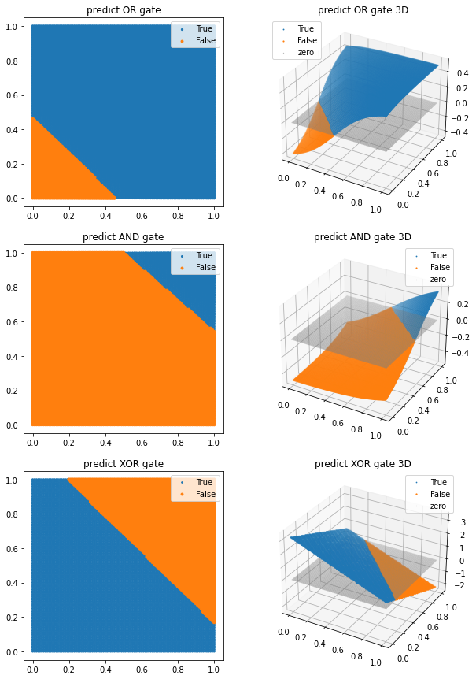
    


근데 사실 얘도 XOR 문제를 못푼다. 다른 비선형 함수를 써줘야 된다.

 2차 다항식(quadratic polynomial)을 추가한 시그모이드 함수를 사용한다면 XOR gate를 구현할 수 있다
 
 이 밖에도 layer를 추가해 준다면 XOR gate를 무리 없이 구현하는 것을 확인할 수 있다.
 
 


```python
# 레이어를 추가했을 때
# XOR gate
xor_sigmoid_model = tf.keras.Sequential([
    tf.keras.layers.Input(shape=(2,)),
    tf.keras.layers.Dense(2, activation='sigmoid'), # 2 nodes로 변경
    tf.keras.layers.Dense(1)
])
xor_sigmoid_model.compile(loss='mse', optimizer=tf.keras.optimizers.Adam(learning_rate=0.01), metrics=['accuracy'])
xor_sigmoid_model.fit(X, xor_y, epochs=1000, verbose=0)

plt.figure(figsize=(10,5))
pred_xor_y = xor_sigmoid_model(test_X)

ax1 = plt.subplot(1,2,1)
ax1.set_title('predict XOR gate')
ax1 = scatter_plot(ax1, test_X, pred_xor_y, threshold=0.5)

ax2 = plt.subplot(1,2,2, projection='3d')
ax2.set_title('predict XOR gate 3D')
ax2 = scatter_plot(ax2, test_X, pred_xor_y, threshold=0.5, three_d=True)

plt.show()
```

    /opt/conda/lib/python3.9/site-packages/matplotlib/collections.py:1003: RuntimeWarning: invalid value encountered in sqrt
      scale = np.sqrt(self._sizes) * dpi / 72.0 * self._factor


    
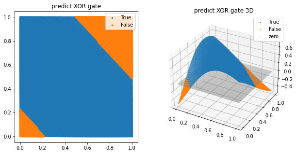
    


### 시그모이드는

0에서 1 사이 값을 나타내주기 때문에 이진 분류에서 많이 쓰인다.

근데 softmax 는 굳이 0,1 이 아니더라도 가위바위보, 사진 분별 등 다양한 클래스로 이미지의 확률을 나타낼 수 잇다. 모든 class의 확률을 더하면 1이 된다는 특징이 있다. 다만 이건 hidden layer 에 들어가는 활성화 함수가 아니다.

2. 하이퍼볼릭 탄젠트 함수 ; tanh

얘는 쌍곡선 함수이다.

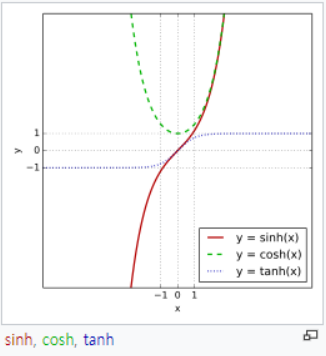

저기 파란색 점박이 선이 하이퍼볼릭 탄젠트 함수

그림처럼 얘는 x의 값이 무엇이든 -1 에서 1 사이의 값만 나온다.  
얘는 0 을 중심으로 하고 있다.  


```python
import os
img_path = os.getenv('HOME')+'/aiffel/Study/26/activation/me.jpg'

# 하이퍼볼릭 탄젠트 함수
def tanh(x):
    return (np.exp(x)-np.exp(-x))/(np.exp(x)+np.exp(-x))

def dev_tanh(x):
    return 1-tanh(x)**2

# 시각화
ax = plot_and_visulize(img_path, tanh, dev_tanh)
ax.show()
```


    
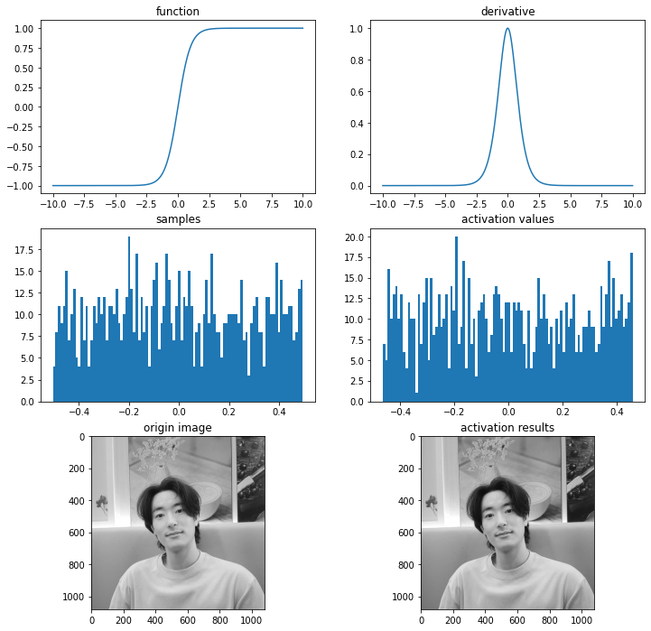
    


#### 단점
-1 과 1에서 포화된다.

3. ReLU 함수

얘가 요즘 핫하다.


```python
import os
img_path = os.getenv('HOME')+'/aiffel/Study/26/activation/me.jpg'

# relu 함수
def relu(x):
    return max(0,x)

# 시각화
ax = plot_and_visulize(img_path, relu)
ax.show()
```


    
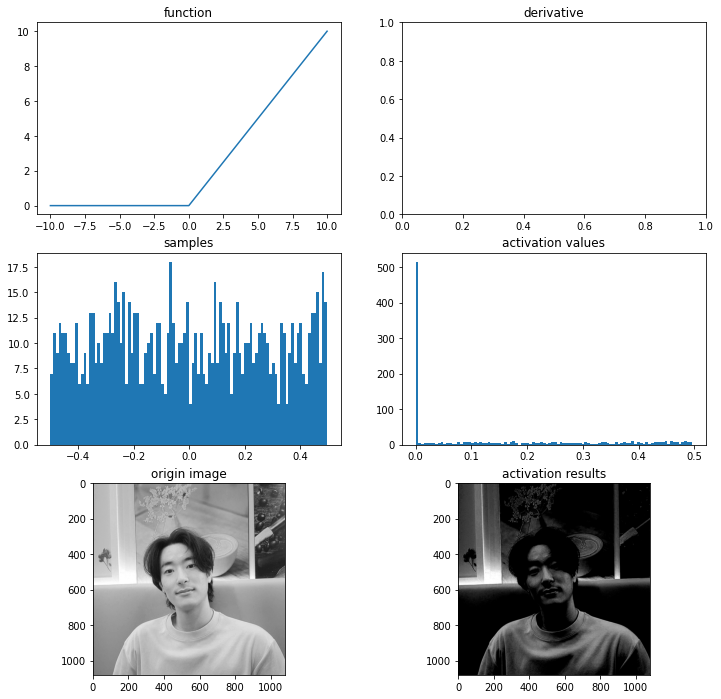
    


얘는 y값이 0 이상으로 쭉 나올 수 있다. 얘는 tanh 보다 훨씬 빠르게  
훈련이 되는데,  
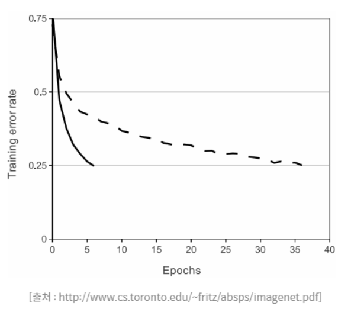

실선이 ReLU 썼을 때 에러 비율이고,  
점선이 tanh 썼을 때 에러 비율이다

ReLU의 에러 감소비율이 훨씬 빠르다.

#### 미분할때는 0의 경우에만 0,또는 1을 무작위로 배출한다.

근데 여기서 신기한거
얘는 곡선같은 비선형이 아닌데 어떻게 비선형데이터의 특징을 잡아내지?


```python
q_X = np.array([-10+x/100 for x in range(2001)])
q_y = np.array([(x)**2 + np.random.randn(1)*10 for x in q_X])
plt.scatter(q_X, q_y, s=0.5)
```


    <matplotlib.collections.PathCollection at 0x7fd529d83610>


    
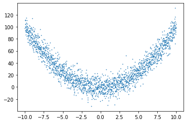
    


뭐 이렇게 잡아낼 수 있덴다; 어렵네참


```python
approx_relu_model_p = tf.keras.Sequential([
    tf.keras.layers.Input(shape=(1,)),
    tf.keras.layers.Dense(6, activation='relu'), # 6 nodes 병렬 연결
    tf.keras.layers.Dense(1)
])
approx_relu_model_p.compile(loss='mse', optimizer=tf.keras.optimizers.Adam(learning_rate=0.005), metrics=['accuracy'])
approx_relu_model_p.fit(q_X, q_y, batch_size=32, epochs=100, verbose=0)

approx_relu_model_s = tf.keras.Sequential([
    tf.keras.layers.Input(shape=(1,)),
    tf.keras.layers.Dense(2, activation='relu'),# 2 nodes 직렬로 3번 연결
    tf.keras.layers.Dense(2, activation='relu'),
    tf.keras.layers.Dense(2, activation='relu'),
    tf.keras.layers.Dense(1)
])
approx_relu_model_s.compile(loss='mse', optimizer=tf.keras.optimizers.Adam(learning_rate=0.005), metrics=['accuracy'])
approx_relu_model_s.fit(q_X, q_y, batch_size=32, epochs=100, verbose=0)

approx_relu_model_p.summary()
approx_relu_model_s.summary()
```

    Model: "sequential_4"
    _________________________________________________________________
    Layer (type)                 Output Shape              Param #   
    =================================================================
    dense_5 (Dense)              (None, 6)                 12        
    _________________________________________________________________
    dense_6 (Dense)              (None, 1)                 7         
    =================================================================
    Total params: 19
    Trainable params: 19
    Non-trainable params: 0
    _________________________________________________________________
    Model: "sequential_5"
    _________________________________________________________________
    Layer (type)                 Output Shape              Param #   
    =================================================================
    dense_7 (Dense)              (None, 2)                 4         
    _________________________________________________________________
    dense_8 (Dense)              (None, 2)                 6         
    _________________________________________________________________
    dense_9 (Dense)              (None, 2)                 6         
    _________________________________________________________________
    dense_10 (Dense)             (None, 1)                 3         
    =================================================================
    Total params: 19
    Trainable params: 19
    Non-trainable params: 0
    _________________________________________________________________


```python
q_test_X = q_X.reshape((*q_X.shape,1))
plt.figure(figsize=(10,5))

ax1 = plt.subplot(1,2,1)
ax1.set_title('parallel')
pred_y_p = approx_relu_model_p(q_test_X)
ax1.plot(q_X, pred_y_p)

ax2 = plt.subplot(1,2,2)
ax2.set_title('serial')
pred_y_s = approx_relu_model_s(q_test_X)
ax2.plot(q_X, pred_y_s)

plt.show()
```


    
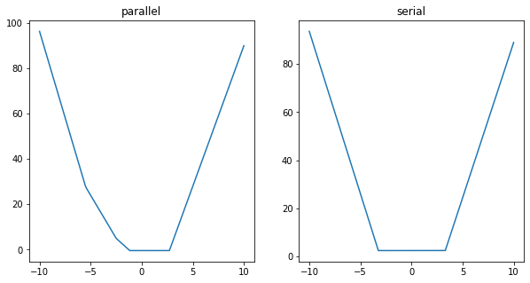
    


parallel 병렬  
serial 직렬

병렬로 쌓는게 더 부드러워 보이지?

x** 2 의 그래프를 근사해낼 수 있다는 말이다.

#### 단점 : Dying ReLU
모델에서 ReLU를 사용한 노드가 비활성화되며 출력을 00으로만 하게 되는 것

가중치 w값에 의해 입력값 x에 상관없이 0이하로 나오게 되었다면,  
이 이후의 업데이트에서는 그래디언트가 항상 0이 되어  
가중치 업데이트가 일어나지 않는다.  

즉, 이 노드의 출력값과 그래디언트가 0이 되어 노드가 죽어버리는 것이다.

이러한 현상을 줄여주기 위해서는 학습률을 낮춰주어야 한다.

학습률 뿐만 아니라 dying ReLU 를 없애기 위해 시도한 여러 경우가 있다.

1. Leaky ReLU


```python
import os
img_path = os.getenv('HOME')+'/aiffel/Study/26/activation/me.jpg'

# leaky relu 함수
def leaky_relu(x):
    return max(0.01*x,x)

# 시각화
ax = plot_and_visulize(img_path, leaky_relu)
ax.show()
```


    
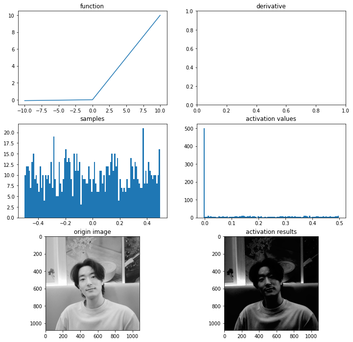
    


보면 음수가 0이 아니라 0에 가까운 음수이다. 이렇게 0이 나오는 걸 막아주었다.

2. PReLU

return 값을 보면 alpha 값으로 기울기를 직접 설정할 수 있다.


```python
# PReLU 함수
def prelu(x, alpha):
    return max(alpha*x,x)

# 시각화
ax = plot_and_visulize(img_path, lambda x: prelu(x, 0.1)) # parameter alpha=0.1일 때

ax.show()
```


    
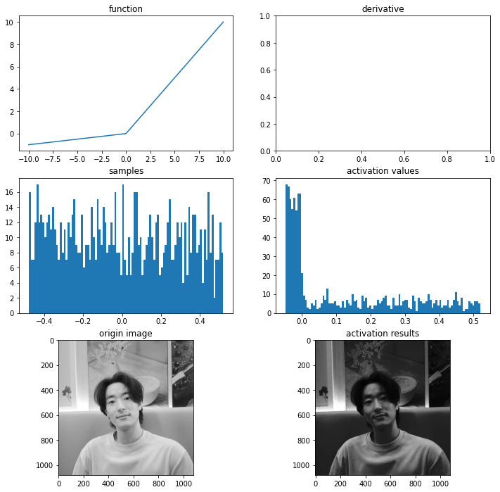
    


3. ELU

미분 불가능했던 0의 부분을 자연로그로 꺾어주어 미분 가능하도록 했다.  
(그만큼 계산이 오래걸린다)


```python
# elu 함수
def elu(x, alpha):
    return x if x > 0 else alpha*(np.exp(x)-1)

def dev_elu(x, alpha):
    return 1 if x > 0 else elu(x, alpha) + alpha

# 시각화
ax = plot_and_visulize(img_path, lambda x: elu(x, 1), lambda x: dev_elu(x, 1)) # alpha가 1일 때
ax.show()
```


    
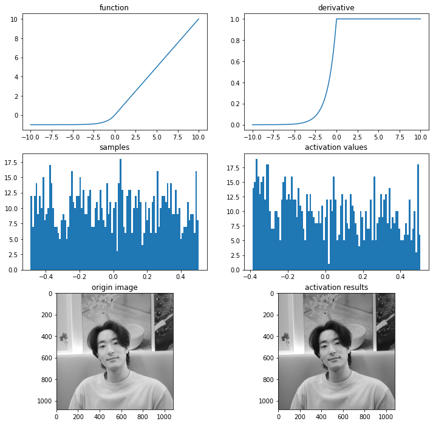
    
```toc

```