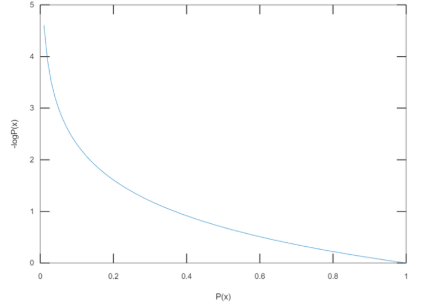
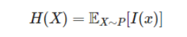
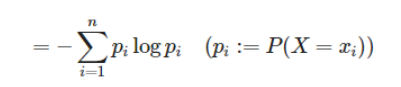
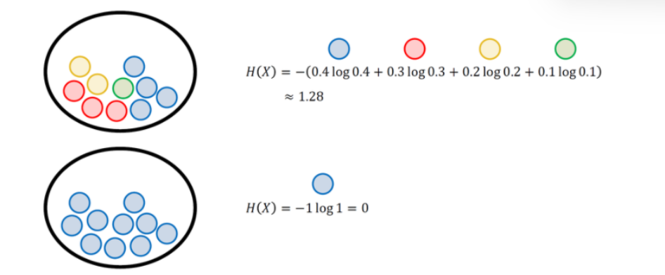
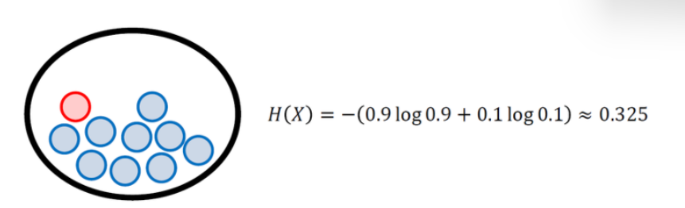
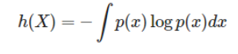
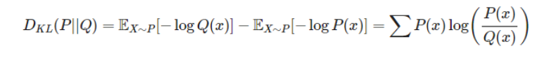
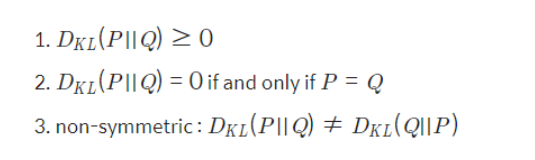
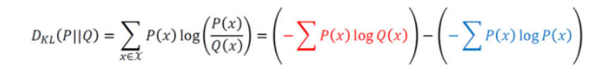
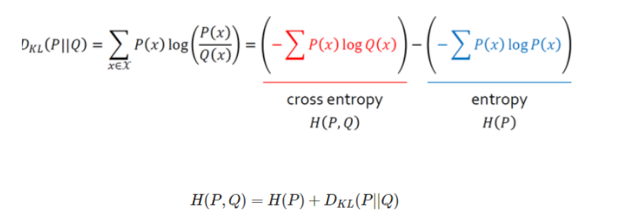

# 정보이론 Information Theory

머신러닝의 이론적 토대를 이룬다.

#### 목차
0. 정보이론의 이해

1. Entorpy

2. KL divergence

---


## 0. 정보이론의 이해

정보이론이란 

추상적인 '정보' 라는 개념을 정량화, 구체화 하는 분야이다.


자 이런 두 개의 바구니에서  

정보의 양이 더 많은 쪽은 어디일까?

왼쪽이다. 나올 수 있는 경우의 수가 더 많기 때문이다.

이건 다시말해서, 나올 수 있는 확률이 더 많다는 뜻이다.

그렇다면

왼쪽은 그대로 두고, 오른쪽 바구니에 빨간색 공 하나를 추가한다면?

그럼 파란색 공이 뽑힐 확률은 줄어들고
빨간색 공이 뽑힐 확률이 새로 생길 것이다.

이 두가지 중에서는 빨간색 공이 뽑힐 확률이 더 적다.
정보량은 확률을 가진 것 중에서도 적은 확률일 수록 높다.

Goodfellow, Bengio, Courville의 책 Deep Learning에는 정보를  
정량적으로 표현하기 위해 필요한 세 가지 조건이 설명되어 있다.

1. 일어날 가능성이 높으면 정보량이 적다,
2. 일어날 가능서이 낮으면 정보량이 높다.
3. 두 개의 독립적인 사건의 전체 정보량은 두 정보량의 합이다.

일반적으로 사건 x 가 일어날 확률을
p ( X = x) 라고 한다.

이때 사건의 정보량 I(x) 는

I(x) = -log P(x)

이때 log 의 '밑'은 2,e, 10 중 하나를 써도 무방하다



x가 일어날 확률이 1에 가까울수록 정보량은 줄어들고 있다.


```python
import numpy as np
import math
import random

# 주머니 속에 들어있는 공의 개수입
total = 1000

#---------------#

count = 1   # 실험이 끝날 때까지 꺼낸 공의 개수

# 1부터 total까지의 정수 중에서 하나를 뽑고 total과 같으면 실험 종료
# total=1000인 경우 1~999: blue / 1000: red
while True:
    sample = random.randrange(1,total+1)
    if sample == total:
        break
    count += 1

print('number of blue samples: '+str(count-1))
print('information content: '+str(-math.log(1/count)))
```

    number of blue samples: 1080
    information content: 6.985641817639208


다음의 코드는 total 개의 수 중 total 번째의 수가 나오는 확률의 정보량이다.

**사후확률**의 정보량은 계속 변화하는 것을 알 수 있다.  
허나 정보량은 **사전확률**을 기반으로 계산하기 때문에 변하지 않는 하나의 값이다.

이렇게 하나의 사건만 다루는 것도 있지만, 사실 세상은 그리 단순하지 않다

여러가지 변수가 있는 실험의 정보량은 어떻게 구할까?    
이를 위해 엔트로피라는 개념이 필요하다


## 2. 엔트로피

확률변수가 가지는 모든 경우의 수  
에 대해서  
정보량을 각각 구한 다음 평균을 내면

평균적인 정보량을 알 수가 있는데, 이를 **엔트로피** 라고 한다.

Entrophy

이산 확률 변수 X 가 x1, x2,... xn 의 값을 가지는 경우에  

엔트로피는 각각의 경우의 수가 가지는 정보량에 확률을 곱한 후,  
그 값을 모두 더한 값이다.



X들의 모든 정보량을 더해서 평균낸 값 = H(x)



는 줄여서 이렇게 말할 수 잇다.



이렇게 하면 모든 정보량을 합친 엔트로피를 구할 수가 있는 것이다~

자 그럼 빨간공 한 개 있는건 어떻게 될까



이렇게 엔트로피가 오른다!

나올수 있는 확률들의 값이 동등할수록 엔트로피의 값은 오른다.

어찌보면 당연하다

**맨날 앞면만 나오는 동전보다  
앞뒤가 동등하게 나오는 동전이  
더 불확실하기 때문이다.**

#### 근데 이건 이산확률 변수일때만 가능 (끊어진 값 변수) 하다.
---

연속 확률 변수 일 때면?

합을 구하는 게 아니라 적분을 구한다.  
개념적으로 생각해보면 당연하다. 그 사이의 **모든 구역의 넓이를 구하는 것**이기 때문이다.



그냥 딱 더하는 걸 적분으로 바꿔주기만 하면 된다.

연속확률변수의 엔트로피는 이산확률분포의 엔트로피와 구분하기 위해 

미분 엔트로피 라고 부른다.

---


머신러닝의 목표는 새로운 입력 데이터가 들어와도 예측이 잘 되도록, 모델의 확률 분포를 데이터의 실제 확률 분포에 가깝게 만드는 것

머신러닝 모델은 목적에 따라 크게 두가지로 나눌 수 있다.

1. 생성모델
: 데이터와 모델로 도출할 수 있는 분포를 이용해 데이터의 실제 분포를 모델링

2. 판별모델
: 데이터가 나뉘는 결정경계 (Decision Boundary) 를 학습.

특히 생성모델은 나올 수있는 모든 확률분포를 이용하는데, 이 때 확률 분포 간 차이를  
평가하기 위해 쿨백-라이블러 발산 지표를 이용한다.

## 3. KL divergence (쿨백라이블러 발산)

Kullback-Leibler divergence. ; KL divergence

데이터의 실제 확률분포를 P(x)  
모델이 나타낸 확률분포를 Q(x) 라 할 때, 

KL divergence 는 다음과 같이 구한다.

P(x) 가 실제 확률분포라고 생각했을 때 Q(x) 의 엔트로피 에서
Q(x) 가 실제 확률분포라고 생각했을 때 P(x) 의 엔트로피 를 뺀다.

이것이 Q(x) 를 사용했을 때 발생하는 엔트로피의 변화량 KL-divergence 이다.




파란색 부분은 실제 분포이므로 우리가 바꿀 수 없다.

우리가 KL-D 값을 줄이기 위해서는 엔트로피의 변화량을 줄여야 하며, 
결과적으로는 Q(x) 의 값을 P(x)의 값에 유사하게 만들어야 한다.

---

연속변수 에서는 식이 좀 다른데, 교차엔트로피를 구해야 한다.



결과적으로 KL-D 로부터 엔트로피와 교차엔트로피를 다 구할 수 있다.





이렇게 해서 우리는  
정답셋의 확률분포 P와  
추론 결과의 확률분포 Q 의 차이  

KL divergence를 최소화하는 것, 

즉 우리 모델의 추론 결과가 정답셋과 최대한 유사하게 하는 것과  
**교차 엔트로피(Cross Entropy)를 최소화**하는 것이 수학적으로 같다는 것을 확인했다.

```toc

```