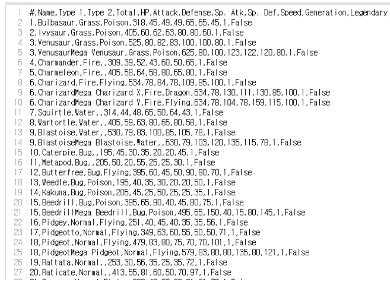

# <span style='background-color: #faa5b1'>numpy pandas matplob 조지기</span>

- 데이터 전처리

좋은 데이터 분석을 위해서는 EDA 가 필수.
Explotatory Data Analysis

### 데이터 예제

[포켓몬 도감](https://www.kaggle.com/abcsds/pokemon)

이 데이터는 721 포켓몬의 수, 이름, 타입(두개까지), 기본스텟(HP, 공격력, 방어력, 필살공격력, 필살방어력, 속도) 를 포함하고 있습니다.  

이 data 는 카드 or 포켓몬 고 가 아니라 포켓몬 게임 data입니다.  
관련 내용은 Descipt 에서 확인해 볼 수 있습니다.


## 정말 중요한거

### 당신이 데이터를 다루고 싶다면, 그게 어떤 데이터를 어떻게 담고 있는지는 무조건 확인을 해봐야 한다.

### 1. 열어나 보기



- 가장 첫 항에는 순서별 속성을 나타내 주고 있고 그 밑에는 데이터가 있는  
  csv 데이터이다

### 2. 라이브러리 준비하기


```python
import numpy as np
import pandas as pd
import seaborn as sns
import matplotlib.pyplot as plt
%matplotlib inline
%config InlineBackend.figure_format = 'retina'

import os
```

csv 데이터를 잘 다루기 위해 필요한 라이브러리이다.

1. Numpy (배열)
2. Pandas (행렬)
3. Seaborn (시각화)
4. Matplot (시각화)
5. os (경로설정)

다른건 잘 아시겠지만 **Seaborn** 얘는 matplot 의 상위 버전,  
matpolt 이 raw 그래프라면
Seaborn 은 Luxery 그래프


### 3. 데이터 복사하기


```python
import os
csv_path = os.getenv("HOME") + "/aiffel/Study/15_/pokemon_eda/data/Pokemon.csv"
original_data = pd.read_csv(csv_path)

original_data
```


<div>
<style scoped>
    .dataframe tbody tr th:only-of-type {
        vertical-align: middle;
    }

    .dataframe tbody tr th {
        vertical-align: top;
    }

    .dataframe thead th {
        text-align: right;
    }
</style>
<table border="1" class="dataframe">
  <thead>
    <tr style="text-align: right;">
      <th></th>
      <th>#</th>
      <th>Name</th>
      <th>Type 1</th>
      <th>Type 2</th>
      <th>Total</th>
      <th>HP</th>
      <th>Attack</th>
      <th>Defense</th>
      <th>Sp. Atk</th>
      <th>Sp. Def</th>
      <th>Speed</th>
      <th>Generation</th>
      <th>Legendary</th>
    </tr>
  </thead>
  <tbody>
    <tr>
      <th>0</th>
      <td>1</td>
      <td>Bulbasaur</td>
      <td>Grass</td>
      <td>Poison</td>
      <td>318</td>
      <td>45</td>
      <td>49</td>
      <td>49</td>
      <td>65</td>
      <td>65</td>
      <td>45</td>
      <td>1</td>
      <td>False</td>
    </tr>
    <tr>
      <th>1</th>
      <td>2</td>
      <td>Ivysaur</td>
      <td>Grass</td>
      <td>Poison</td>
      <td>405</td>
      <td>60</td>
      <td>62</td>
      <td>63</td>
      <td>80</td>
      <td>80</td>
      <td>60</td>
      <td>1</td>
      <td>False</td>
    </tr>
    <tr>
      <th>2</th>
      <td>3</td>
      <td>Venusaur</td>
      <td>Grass</td>
      <td>Poison</td>
      <td>525</td>
      <td>80</td>
      <td>82</td>
      <td>83</td>
      <td>100</td>
      <td>100</td>
      <td>80</td>
      <td>1</td>
      <td>False</td>
    </tr>
    <tr>
      <th>3</th>
      <td>3</td>
      <td>VenusaurMega Venusaur</td>
      <td>Grass</td>
      <td>Poison</td>
      <td>625</td>
      <td>80</td>
      <td>100</td>
      <td>123</td>
      <td>122</td>
      <td>120</td>
      <td>80</td>
      <td>1</td>
      <td>False</td>
    </tr>
    <tr>
      <th>4</th>
      <td>4</td>
      <td>Charmander</td>
      <td>Fire</td>
      <td>NaN</td>
      <td>309</td>
      <td>39</td>
      <td>52</td>
      <td>43</td>
      <td>60</td>
      <td>50</td>
      <td>65</td>
      <td>1</td>
      <td>False</td>
    </tr>
    <tr>
      <th>...</th>
      <td>...</td>
      <td>...</td>
      <td>...</td>
      <td>...</td>
      <td>...</td>
      <td>...</td>
      <td>...</td>
      <td>...</td>
      <td>...</td>
      <td>...</td>
      <td>...</td>
      <td>...</td>
      <td>...</td>
    </tr>
    <tr>
      <th>795</th>
      <td>719</td>
      <td>Diancie</td>
      <td>Rock</td>
      <td>Fairy</td>
      <td>600</td>
      <td>50</td>
      <td>100</td>
      <td>150</td>
      <td>100</td>
      <td>150</td>
      <td>50</td>
      <td>6</td>
      <td>True</td>
    </tr>
    <tr>
      <th>796</th>
      <td>719</td>
      <td>DiancieMega Diancie</td>
      <td>Rock</td>
      <td>Fairy</td>
      <td>700</td>
      <td>50</td>
      <td>160</td>
      <td>110</td>
      <td>160</td>
      <td>110</td>
      <td>110</td>
      <td>6</td>
      <td>True</td>
    </tr>
    <tr>
      <th>797</th>
      <td>720</td>
      <td>HoopaHoopa Confined</td>
      <td>Psychic</td>
      <td>Ghost</td>
      <td>600</td>
      <td>80</td>
      <td>110</td>
      <td>60</td>
      <td>150</td>
      <td>130</td>
      <td>70</td>
      <td>6</td>
      <td>True</td>
    </tr>
    <tr>
      <th>798</th>
      <td>720</td>
      <td>HoopaHoopa Unbound</td>
      <td>Psychic</td>
      <td>Dark</td>
      <td>680</td>
      <td>80</td>
      <td>160</td>
      <td>60</td>
      <td>170</td>
      <td>130</td>
      <td>80</td>
      <td>6</td>
      <td>True</td>
    </tr>
    <tr>
      <th>799</th>
      <td>721</td>
      <td>Volcanion</td>
      <td>Fire</td>
      <td>Water</td>
      <td>600</td>
      <td>80</td>
      <td>110</td>
      <td>120</td>
      <td>130</td>
      <td>90</td>
      <td>70</td>
      <td>6</td>
      <td>True</td>
    </tr>
  </tbody>
</table>
<p>800 rows × 13 columns</p>
</div>


이 데이터에 훼손이 가면 안되니까 일단 복사를 해서 사용하자


```python
pokemon = original_data.copy()
print(pokemon.shape)
pokemon.head()
```

    (800, 13)


<div>
<style scoped>
    .dataframe tbody tr th:only-of-type {
        vertical-align: middle;
    }

    .dataframe tbody tr th {
        vertical-align: top;
    }

    .dataframe thead th {
        text-align: right;
    }
</style>
<table border="1" class="dataframe">
  <thead>
    <tr style="text-align: right;">
      <th></th>
      <th>#</th>
      <th>Name</th>
      <th>Type 1</th>
      <th>Type 2</th>
      <th>Total</th>
      <th>HP</th>
      <th>Attack</th>
      <th>Defense</th>
      <th>Sp. Atk</th>
      <th>Sp. Def</th>
      <th>Speed</th>
      <th>Generation</th>
      <th>Legendary</th>
    </tr>
  </thead>
  <tbody>
    <tr>
      <th>0</th>
      <td>1</td>
      <td>Bulbasaur</td>
      <td>Grass</td>
      <td>Poison</td>
      <td>318</td>
      <td>45</td>
      <td>49</td>
      <td>49</td>
      <td>65</td>
      <td>65</td>
      <td>45</td>
      <td>1</td>
      <td>False</td>
    </tr>
    <tr>
      <th>1</th>
      <td>2</td>
      <td>Ivysaur</td>
      <td>Grass</td>
      <td>Poison</td>
      <td>405</td>
      <td>60</td>
      <td>62</td>
      <td>63</td>
      <td>80</td>
      <td>80</td>
      <td>60</td>
      <td>1</td>
      <td>False</td>
    </tr>
    <tr>
      <th>2</th>
      <td>3</td>
      <td>Venusaur</td>
      <td>Grass</td>
      <td>Poison</td>
      <td>525</td>
      <td>80</td>
      <td>82</td>
      <td>83</td>
      <td>100</td>
      <td>100</td>
      <td>80</td>
      <td>1</td>
      <td>False</td>
    </tr>
    <tr>
      <th>3</th>
      <td>3</td>
      <td>VenusaurMega Venusaur</td>
      <td>Grass</td>
      <td>Poison</td>
      <td>625</td>
      <td>80</td>
      <td>100</td>
      <td>123</td>
      <td>122</td>
      <td>120</td>
      <td>80</td>
      <td>1</td>
      <td>False</td>
    </tr>
    <tr>
      <th>4</th>
      <td>4</td>
      <td>Charmander</td>
      <td>Fire</td>
      <td>NaN</td>
      <td>309</td>
      <td>39</td>
      <td>52</td>
      <td>43</td>
      <td>60</td>
      <td>50</td>
      <td>65</td>
      <td>1</td>
      <td>False</td>
    </tr>
  </tbody>
</table>
</div>


pandas 는 shape 메서드로 행렬을 파악할 수 있다.

지금 보니 800개의 행(포켓몬 수), 13개의 열(포켓몬의 속성) 임을 알 수 있다.


우리가 확인할 것은 전설의 포켓몬이다. 자 해보자


```python
legendary = pokemon[pokemon["Legendary"] == True].reset_index(drop=True)
print(legendary.shape)
legendary.head()
```

    (65, 13)


<div>
<style scoped>
    .dataframe tbody tr th:only-of-type {
        vertical-align: middle;
    }

    .dataframe tbody tr th {
        vertical-align: top;
    }

    .dataframe thead th {
        text-align: right;
    }
</style>
<table border="1" class="dataframe">
  <thead>
    <tr style="text-align: right;">
      <th></th>
      <th>#</th>
      <th>Name</th>
      <th>Type 1</th>
      <th>Type 2</th>
      <th>Total</th>
      <th>HP</th>
      <th>Attack</th>
      <th>Defense</th>
      <th>Sp. Atk</th>
      <th>Sp. Def</th>
      <th>Speed</th>
      <th>Generation</th>
      <th>Legendary</th>
    </tr>
  </thead>
  <tbody>
    <tr>
      <th>0</th>
      <td>144</td>
      <td>Articuno</td>
      <td>Ice</td>
      <td>Flying</td>
      <td>580</td>
      <td>90</td>
      <td>85</td>
      <td>100</td>
      <td>95</td>
      <td>125</td>
      <td>85</td>
      <td>1</td>
      <td>True</td>
    </tr>
    <tr>
      <th>1</th>
      <td>145</td>
      <td>Zapdos</td>
      <td>Electric</td>
      <td>Flying</td>
      <td>580</td>
      <td>90</td>
      <td>90</td>
      <td>85</td>
      <td>125</td>
      <td>90</td>
      <td>100</td>
      <td>1</td>
      <td>True</td>
    </tr>
    <tr>
      <th>2</th>
      <td>146</td>
      <td>Moltres</td>
      <td>Fire</td>
      <td>Flying</td>
      <td>580</td>
      <td>90</td>
      <td>100</td>
      <td>90</td>
      <td>125</td>
      <td>85</td>
      <td>90</td>
      <td>1</td>
      <td>True</td>
    </tr>
    <tr>
      <th>3</th>
      <td>150</td>
      <td>Mewtwo</td>
      <td>Psychic</td>
      <td>NaN</td>
      <td>680</td>
      <td>106</td>
      <td>110</td>
      <td>90</td>
      <td>154</td>
      <td>90</td>
      <td>130</td>
      <td>1</td>
      <td>True</td>
    </tr>
    <tr>
      <th>4</th>
      <td>150</td>
      <td>MewtwoMega Mewtwo X</td>
      <td>Psychic</td>
      <td>Fighting</td>
      <td>780</td>
      <td>106</td>
      <td>190</td>
      <td>100</td>
      <td>154</td>
      <td>100</td>
      <td>130</td>
      <td>1</td>
      <td>True</td>
    </tr>
  </tbody>
</table>
</div>


reset_index 메서드(df전용메서드) 로 따로 떨궈 새 df를 만들었다

물론 일반몬만 모아논 것도 df로 만들거임


```python
ordinary = pokemon[pokemon['Legendary'] == False].reset_index(drop=True)
print(ordinary.shape)
ordinary.head()
```

    (735, 13)


<div>
<style scoped>
    .dataframe tbody tr th:only-of-type {
        vertical-align: middle;
    }

    .dataframe tbody tr th {
        vertical-align: top;
    }

    .dataframe thead th {
        text-align: right;
    }
</style>
<table border="1" class="dataframe">
  <thead>
    <tr style="text-align: right;">
      <th></th>
      <th>#</th>
      <th>Name</th>
      <th>Type 1</th>
      <th>Type 2</th>
      <th>Total</th>
      <th>HP</th>
      <th>Attack</th>
      <th>Defense</th>
      <th>Sp. Atk</th>
      <th>Sp. Def</th>
      <th>Speed</th>
      <th>Generation</th>
      <th>Legendary</th>
    </tr>
  </thead>
  <tbody>
    <tr>
      <th>0</th>
      <td>1</td>
      <td>Bulbasaur</td>
      <td>Grass</td>
      <td>Poison</td>
      <td>318</td>
      <td>45</td>
      <td>49</td>
      <td>49</td>
      <td>65</td>
      <td>65</td>
      <td>45</td>
      <td>1</td>
      <td>False</td>
    </tr>
    <tr>
      <th>1</th>
      <td>2</td>
      <td>Ivysaur</td>
      <td>Grass</td>
      <td>Poison</td>
      <td>405</td>
      <td>60</td>
      <td>62</td>
      <td>63</td>
      <td>80</td>
      <td>80</td>
      <td>60</td>
      <td>1</td>
      <td>False</td>
    </tr>
    <tr>
      <th>2</th>
      <td>3</td>
      <td>Venusaur</td>
      <td>Grass</td>
      <td>Poison</td>
      <td>525</td>
      <td>80</td>
      <td>82</td>
      <td>83</td>
      <td>100</td>
      <td>100</td>
      <td>80</td>
      <td>1</td>
      <td>False</td>
    </tr>
    <tr>
      <th>3</th>
      <td>3</td>
      <td>VenusaurMega Venusaur</td>
      <td>Grass</td>
      <td>Poison</td>
      <td>625</td>
      <td>80</td>
      <td>100</td>
      <td>123</td>
      <td>122</td>
      <td>120</td>
      <td>80</td>
      <td>1</td>
      <td>False</td>
    </tr>
    <tr>
      <th>4</th>
      <td>4</td>
      <td>Charmander</td>
      <td>Fire</td>
      <td>NaN</td>
      <td>309</td>
      <td>39</td>
      <td>52</td>
      <td>43</td>
      <td>60</td>
      <td>50</td>
      <td>65</td>
      <td>1</td>
      <td>False</td>
    </tr>
  </tbody>
</table>
</div>


### 4. 데이터 손실 감안하기

결측치 파일이 있으면 통계나 eda 에 영향이 있으므로 이런 건 빼주어야 한다


```python
pokemon.isnull().sum()
```


    #               0
    Name            0
    Type 1          0
    Type 2        386
    Total           0
    HP              0
    Attack          0
    Defense         0
    Sp. Atk         0
    Sp. Def         0
    Speed           0
    Generation      0
    Legendary       0
    dtype: int64


자 이걸 보니 다 데이터가 있긴 한데  
포켓몬중에 type2 가 없는 애들이 있다.

당연하다 꼬부기 같은 애들은 물 그자체자너 이상할게 없다.  

근데 문제는 이게 없는게 당연한건데 평균같은거 낼때  
2번째 타입까지 묶어서 조사하면 물속성이 현저히 떨어진다 이러면  
뭔가 잘못된거잖어 그지 그런걸 방지해야 한다.  


```python
print(len(pokemon.columns))
pokemon.columns
```

    13


    Index(['#', 'Name', 'Type 1', 'Type 2', 'Total', 'HP', 'Attack', 'Defense',
           'Sp. Atk', 'Sp. Def', 'Speed', 'Generation', 'Legendary'],
          dtype='object')


데이터 손실을 감안하기 위해선 각 데이터들의 속성(데이터타입) 을  
꼼꼼히 봐야 한다.

name, type1, type2 는 str 타입, Legendary 는 boolean, 나머지는 int 타입이다.

지금부터 하나씩 뜯어보자.

### 5. 본격적인 EDA (데이터 분석)
#### 5-1. 1열 ; '#'


```python
len(set(pokemon["#"]))
```


    721


#은 아까 포켓몬 넘버링 한거였는데 800개의 행이 있는데도 721개밖에 잡히지 않는 걸 알 수 있다. 그렇다는 건 #이 중복되는 경우가 있다는 뜻. 한번 찾아보자


```python
pokemon[pokemon["#"] == 6]
```


<div>
<style scoped>
    .dataframe tbody tr th:only-of-type {
        vertical-align: middle;
    }

    .dataframe tbody tr th {
        vertical-align: top;
    }

    .dataframe thead th {
        text-align: right;
    }
</style>
<table border="1" class="dataframe">
  <thead>
    <tr style="text-align: right;">
      <th></th>
      <th>#</th>
      <th>Name</th>
      <th>Type 1</th>
      <th>Type 2</th>
      <th>Total</th>
      <th>HP</th>
      <th>Attack</th>
      <th>Defense</th>
      <th>Sp. Atk</th>
      <th>Sp. Def</th>
      <th>Speed</th>
      <th>Generation</th>
      <th>Legendary</th>
    </tr>
  </thead>
  <tbody>
    <tr>
      <th>6</th>
      <td>6</td>
      <td>Charizard</td>
      <td>Fire</td>
      <td>Flying</td>
      <td>534</td>
      <td>78</td>
      <td>84</td>
      <td>78</td>
      <td>109</td>
      <td>85</td>
      <td>100</td>
      <td>1</td>
      <td>False</td>
    </tr>
    <tr>
      <th>7</th>
      <td>6</td>
      <td>CharizardMega Charizard X</td>
      <td>Fire</td>
      <td>Dragon</td>
      <td>634</td>
      <td>78</td>
      <td>130</td>
      <td>111</td>
      <td>130</td>
      <td>85</td>
      <td>100</td>
      <td>1</td>
      <td>False</td>
    </tr>
    <tr>
      <th>8</th>
      <td>6</td>
      <td>CharizardMega Charizard Y</td>
      <td>Fire</td>
      <td>Flying</td>
      <td>634</td>
      <td>78</td>
      <td>104</td>
      <td>78</td>
      <td>159</td>
      <td>115</td>
      <td>100</td>
      <td>1</td>
      <td>False</td>
    </tr>
  </tbody>
</table>
</div>


보니 6번째 #이 3마리나 있다.차리자드 ? 뭐야

친근한 리자몽이었다. 메가리자몽의 남 녀 까지 총 3마리였던 것이다. 하나의 포켓몬이 여러 종류로 분화하는 경우는 이브이 등 여러 포켓몬이 존재한다.

#### 5-2 2열 ; Name


```python
len(set(pokemon["Name"]))
```


    800


800개 깔끔히 있는 거 보니 중복데이터는 없는 모양이다.

#### 5-3 3열과 4열 ; type


```python
pokemon.loc[[6, 10]]
```


<div>
<style scoped>
    .dataframe tbody tr th:only-of-type {
        vertical-align: middle;
    }

    .dataframe tbody tr th {
        vertical-align: top;
    }

    .dataframe thead th {
        text-align: right;
    }
</style>
<table border="1" class="dataframe">
  <thead>
    <tr style="text-align: right;">
      <th></th>
      <th>#</th>
      <th>Name</th>
      <th>Type 1</th>
      <th>Type 2</th>
      <th>Total</th>
      <th>HP</th>
      <th>Attack</th>
      <th>Defense</th>
      <th>Sp. Atk</th>
      <th>Sp. Def</th>
      <th>Speed</th>
      <th>Generation</th>
      <th>Legendary</th>
    </tr>
  </thead>
  <tbody>
    <tr>
      <th>6</th>
      <td>6</td>
      <td>Charizard</td>
      <td>Fire</td>
      <td>Flying</td>
      <td>534</td>
      <td>78</td>
      <td>84</td>
      <td>78</td>
      <td>109</td>
      <td>85</td>
      <td>100</td>
      <td>1</td>
      <td>False</td>
    </tr>
    <tr>
      <th>10</th>
      <td>8</td>
      <td>Wartortle</td>
      <td>Water</td>
      <td>NaN</td>
      <td>405</td>
      <td>59</td>
      <td>63</td>
      <td>80</td>
      <td>65</td>
      <td>80</td>
      <td>58</td>
      <td>1</td>
      <td>False</td>
    </tr>
  </tbody>
</table>
</div>


포켓몬은 하나부터 두개의 속성을가지고 있다.  
Wartortle 을 보니 꼬부기인가? ㅋㅋㅋ 두번째 속성은 NaN 이라고 없다 뜬다.


```python
len(set(pokemon['Type 1'])), len(set(pokemon['Type 2'])),
```


    (18, 19)


타입 1, 2 에 다른 속성이 있는 것 같다. 둘의 차집합을 구해보자.

참고 : [Set타입의 처리](https://www.w3schools.com/python/python_ref_set.asp)


```python
pokemon.loc[[6, 10]]
```


<div>
<style scoped>
    .dataframe tbody tr th:only-of-type {
        vertical-align: middle;
    }

    .dataframe tbody tr th {
        vertical-align: top;
    }

    .dataframe thead th {
        text-align: right;
    }
</style>
<table border="1" class="dataframe">
  <thead>
    <tr style="text-align: right;">
      <th></th>
      <th>#</th>
      <th>Name</th>
      <th>Type 1</th>
      <th>Type 2</th>
      <th>Total</th>
      <th>HP</th>
      <th>Attack</th>
      <th>Defense</th>
      <th>Sp. Atk</th>
      <th>Sp. Def</th>
      <th>Speed</th>
      <th>Generation</th>
      <th>Legendary</th>
    </tr>
  </thead>
  <tbody>
    <tr>
      <th>6</th>
      <td>6</td>
      <td>Charizard</td>
      <td>Fire</td>
      <td>Flying</td>
      <td>534</td>
      <td>78</td>
      <td>84</td>
      <td>78</td>
      <td>109</td>
      <td>85</td>
      <td>100</td>
      <td>1</td>
      <td>False</td>
    </tr>
    <tr>
      <th>10</th>
      <td>8</td>
      <td>Wartortle</td>
      <td>Water</td>
      <td>NaN</td>
      <td>405</td>
      <td>59</td>
      <td>63</td>
      <td>80</td>
      <td>65</td>
      <td>80</td>
      <td>58</td>
      <td>1</td>
      <td>False</td>
    </tr>
  </tbody>
</table>
</div>


```python
set(pokemon["Type 2"]) - set(pokemon["Type 1"])
```


    {nan}


아,, 아무 속성도 없는 NaN 이 type2 에 있었던 것이다.  
그렇다면 적어도 모든 포켓몬은 하나의 속성을 가지고 있다.


```python
types = list(set(pokemon["Type 1"]))
```


```python
types
```


    ['Fighting',
     'Psychic',
     'Flying',
     'Electric',
     'Normal',
     'Poison',
     'Steel',
     'Water',
     'Fairy',
     'Ice',
     'Ghost',
     'Ground',
     'Dark',
     'Grass',
     'Fire',
     'Bug',
     'Dragon',
     'Rock']


하나의 타입만 가지고 있는 사람,,아니 포켓몬은 type2 가 nan 이기 때문에 역으로 구할 수가 있습니다.


```python
pokemon[pokemon['Type 2'] == 'NaN']
```


<div>
<style scoped>
    .dataframe tbody tr th:only-of-type {
        vertical-align: middle;
    }

    .dataframe tbody tr th {
        vertical-align: top;
    }

    .dataframe thead th {
        text-align: right;
    }
</style>
<table border="1" class="dataframe">
  <thead>
    <tr style="text-align: right;">
      <th></th>
      <th>#</th>
      <th>Name</th>
      <th>Type 1</th>
      <th>Type 2</th>
      <th>Total</th>
      <th>HP</th>
      <th>Attack</th>
      <th>Defense</th>
      <th>Sp. Atk</th>
      <th>Sp. Def</th>
      <th>Speed</th>
      <th>Generation</th>
      <th>Legendary</th>
    </tr>
  </thead>
  <tbody>
  </tbody>
</table>
</div>


근데 이렇게 하니까 안뜨네요???
포인트는, NaN 데이터는 str 데이터가 아니라 말그대로 None 데이터를 의미합니다

그래서 pandas 에서 제공하는 isna() 메서드를 따로 사용해야 합니다/


```python
pokemon["Type 2"].isna().sum()
```


    386


386마리의 포켓몬스터가 하나의 속성을 가지고 있군요


```python
pokemon["Type 2"].isna()
```


    0      False
    1      False
    2      False
    3      False
    4       True
           ...  
    795    False
    796    False
    797    False
    798    False
    799    False
    Name: Type 2, Length: 800, dtype: bool


보시는 것처럼 isnaa() 메서드는 None 타입 을 찾아 True 를 반환해줍니다.


---


### 5. 데이터 시각화 (이것도 EDA의 일종)

### Type 1 의 경우


```python
plt.figure(figsize=(10, 7))  # 화면 해상도에 따라 그래프 크기를 조정해 주세요.

plt.subplot(211)
sns.countplot(data=ordinary, x="Type 1", order=types).set_xlabel('')
plt.title("[Ordinary Pokemons]")

plt.subplot(212)
sns.countplot(data=legendary, x="Type 1", order=types).set_xlabel('')
plt.title("[Legendary Pokemons]")

plt.show()
```


    

    


counplot(data='a'.x='b',order='c')  
a : 우리가 계산할 데이터자료  
b : 데이터 자료 중 찾고싶은 형식  
c : 구분할 서브 데이터자료


```python
# Type1별로 Legendary 의 비율을 보여주는 피벗 테이블
pd.pivot_table(pokemon, 
               index="Type 1", 
               values="Legendary").sort_values(by=["Legendary"], ascending=False)
```


<div>
<style scoped>
    .dataframe tbody tr th:only-of-type {
        vertical-align: middle;
    }

    .dataframe tbody tr th {
        vertical-align: top;
    }

    .dataframe thead th {
        text-align: right;
    }
</style>
<table border="1" class="dataframe">
  <thead>
    <tr style="text-align: right;">
      <th></th>
      <th>Legendary</th>
    </tr>
    <tr>
      <th>Type 1</th>
      <th></th>
    </tr>
  </thead>
  <tbody>
    <tr>
      <th>Flying</th>
      <td>0.500000</td>
    </tr>
    <tr>
      <th>Dragon</th>
      <td>0.375000</td>
    </tr>
    <tr>
      <th>Psychic</th>
      <td>0.245614</td>
    </tr>
    <tr>
      <th>Steel</th>
      <td>0.148148</td>
    </tr>
    <tr>
      <th>Ground</th>
      <td>0.125000</td>
    </tr>
    <tr>
      <th>Fire</th>
      <td>0.096154</td>
    </tr>
    <tr>
      <th>Electric</th>
      <td>0.090909</td>
    </tr>
    <tr>
      <th>Rock</th>
      <td>0.090909</td>
    </tr>
    <tr>
      <th>Ice</th>
      <td>0.083333</td>
    </tr>
    <tr>
      <th>Dark</th>
      <td>0.064516</td>
    </tr>
    <tr>
      <th>Ghost</th>
      <td>0.062500</td>
    </tr>
    <tr>
      <th>Fairy</th>
      <td>0.058824</td>
    </tr>
    <tr>
      <th>Grass</th>
      <td>0.042857</td>
    </tr>
    <tr>
      <th>Water</th>
      <td>0.035714</td>
    </tr>
    <tr>
      <th>Normal</th>
      <td>0.020408</td>
    </tr>
    <tr>
      <th>Poison</th>
      <td>0.000000</td>
    </tr>
    <tr>
      <th>Fighting</th>
      <td>0.000000</td>
    </tr>
    <tr>
      <th>Bug</th>
      <td>0.000000</td>
    </tr>
  </tbody>
</table>
</div>


### Type 2 의 경우


```python
plt.figure(figsize=(12, 10))  # 화면 해상도에 따라 그래프 크기를 조정해 주세요.

plt.subplot(211)
sns.countplot(data=ordinary, x="Type 2", order=types).set_xlabel('')
plt.title("[Ordinary Pokemons]")

plt.subplot(212)
sns.countplot(data=legendary, x="Type 2", order=types).set_xlabel('')
plt.title("[Legendary Pokemons]")

plt.show()
```


    

    


```python
# Type2별로 Legendary 의 비율을 보여주는 피벗 테이블
pd.pivot_table(pokemon,
               index="Type 2",
               values="Legendary").sort_values(by=["Legendary"], ascending=False)
```


<div>
<style scoped>
    .dataframe tbody tr th:only-of-type {
        vertical-align: middle;
    }

    .dataframe tbody tr th {
        vertical-align: top;
    }

    .dataframe thead th {
        text-align: right;
    }
</style>
<table border="1" class="dataframe">
  <thead>
    <tr style="text-align: right;">
      <th></th>
      <th>Legendary</th>
    </tr>
    <tr>
      <th>Type 2</th>
      <th></th>
    </tr>
  </thead>
  <tbody>
    <tr>
      <th>Fire</th>
      <td>0.250000</td>
    </tr>
    <tr>
      <th>Dragon</th>
      <td>0.222222</td>
    </tr>
    <tr>
      <th>Ice</th>
      <td>0.214286</td>
    </tr>
    <tr>
      <th>Electric</th>
      <td>0.166667</td>
    </tr>
    <tr>
      <th>Fighting</th>
      <td>0.153846</td>
    </tr>
    <tr>
      <th>Psychic</th>
      <td>0.151515</td>
    </tr>
    <tr>
      <th>Flying</th>
      <td>0.134021</td>
    </tr>
    <tr>
      <th>Fairy</th>
      <td>0.086957</td>
    </tr>
    <tr>
      <th>Water</th>
      <td>0.071429</td>
    </tr>
    <tr>
      <th>Ghost</th>
      <td>0.071429</td>
    </tr>
    <tr>
      <th>Dark</th>
      <td>0.050000</td>
    </tr>
    <tr>
      <th>Steel</th>
      <td>0.045455</td>
    </tr>
    <tr>
      <th>Ground</th>
      <td>0.028571</td>
    </tr>
    <tr>
      <th>Rock</th>
      <td>0.000000</td>
    </tr>
    <tr>
      <th>Bug</th>
      <td>0.000000</td>
    </tr>
    <tr>
      <th>Poison</th>
      <td>0.000000</td>
    </tr>
    <tr>
      <th>Normal</th>
      <td>0.000000</td>
    </tr>
    <tr>
      <th>Grass</th>
      <td>0.000000</td>
    </tr>
  </tbody>
</table>
</div>


---

모든 스텝의 총합


```python
stats = ["HP", "Attack", "Defense", "Sp. Atk", "Sp. Def", "Speed"]
stats
```


    ['HP', 'Attack', 'Defense', 'Sp. Atk', 'Sp. Def', 'Speed']


```python
print("#0 pokemon: ", pokemon.loc[0, "Name"])
print("total: ", int(pokemon.loc[0, "Total"]))
print("stats: ", list(pokemon.loc[0, stats]))
print("sum of all stats: ", sum(list(pokemon.loc[0, stats])))
```

    #0 pokemon:  Bulbasaur
    total:  318
    stats:  [45, 49, 49, 65, 65, 45]
    sum of all stats:  318


* 참고로 df을 이용계산해주기 위해선 int나 list 데이터 형식으로 변환해줘야 한다..


```python
pokemon.loc[0]
```


    #                     1
    Name          Bulbasaur
    Type 1            Grass
    Type 2           Poison
    Total               318
    HP                   45
    Attack               49
    Defense              49
    Sp. Atk              65
    Sp. Def              65
    Speed                45
    Generation            1
    Legendary         False
    Name: 0, dtype: object


```python
list(pokemon.loc[0])
```


    [1, 'Bulbasaur', 'Grass', 'Poison', 318, 45, 49, 49, 65, 65, 45, 1, False]


짜잔~
dic도 가능하다


```python
dict(pokemon.loc[0])
```


    {'#': 1,
     'Name': 'Bulbasaur',
     'Type 1': 'Grass',
     'Type 2': 'Poison',
     'Total': 318,
     'HP': 45,
     'Attack': 49,
     'Defense': 49,
     'Sp. Atk': 65,
     'Sp. Def': 65,
     'Speed': 45,
     'Generation': 1,
     'Legendary': False}


이걸 바탕으로 모든 포켓몬들의 스텟 합친게 TOTAL 인지 확인해보자.


```python
sum(pokemon['Total'].values == pokemon[stats].values.sum(axis=1))
```


    800


* 이런게 진짜 중요 보면 STAT은 세로로 더해야 함으로 AXIS=1 을 둔 것이다


```python
pokemon['Total'].values
```


    array([318, 405, 525, 625, 309, 405, 534, 634, 634, 314, 405, 530, 630,
           195, 205, 395, 195, 205, 395, 495, 251, 349, 479, 579, 253, 413,
           262, 442, 288, 438, 320, 485, 300, 450, 275, 365, 505, 273, 365,
           505, 323, 483, 299, 505, 270, 435, 245, 455, 320, 395, 490, 285,
           405, 305, 450, 265, 405, 290, 440, 320, 500, 305, 455, 350, 555,
           300, 385, 510, 310, 400, 500, 590, 305, 405, 505, 300, 390, 490,
           335, 515, 300, 390, 495, 410, 500, 315, 490, 590, 325, 465, 352,
           310, 460, 325, 475, 325, 500, 305, 525, 310, 405, 500, 600, 385,
           328, 483, 325, 475, 330, 480, 325, 520, 320, 425, 455, 455, 385,
           340, 490, 345, 485, 450, 435, 490, 590, 295, 440, 320, 450, 340,
           520, 460, 500, 455, 490, 495, 500, 600, 490, 200, 540, 640, 535,
           288, 325, 525, 525, 525, 395, 355, 495, 355, 495, 515, 615, 540,
           580, 580, 580, 300, 420, 600, 680, 780, 780, 600, 318, 405, 525,
           309, 405, 534, 314, 405, 530, 215, 415, 262, 442, 265, 390, 250,
           390, 535, 330, 460, 205, 218, 210, 245, 405, 320, 470, 280, 365,
           510, 610, 490, 250, 420, 410, 500, 250, 340, 460, 360, 180, 425,
           390, 210, 430, 525, 525, 405, 490, 435, 336, 405, 455, 290, 465,
           415, 430, 510, 610, 300, 450, 430, 500, 600, 505, 500, 600, 430,
           330, 500, 250, 410, 250, 450, 380, 300, 480, 330, 465, 465, 330,
           500, 600, 540, 330, 500, 515, 465, 250, 210, 455, 305, 360, 365,
           490, 540, 580, 580, 580, 300, 410, 600, 700, 680, 680, 600, 310,
           405, 530, 630, 310, 405, 530, 630, 310, 405, 535, 635, 220, 420,
           240, 420, 195, 205, 395, 205, 385, 220, 340, 480, 220, 340, 480,
           270, 430, 270, 430, 198, 278, 518, 618, 269, 414, 295, 460, 280,
           440, 670, 266, 456, 236, 240, 360, 490, 237, 474, 190, 375, 260,
           380, 380, 480, 380, 480, 330, 430, 530, 630, 280, 410, 510, 295,
           475, 575, 405, 405, 400, 400, 400, 302, 467, 305, 460, 560, 400,
           500, 305, 460, 560, 470, 330, 470, 360, 290, 340, 520, 335, 475,
           310, 490, 590, 458, 458, 440, 440, 288, 468, 308, 468, 300, 500,
           355, 495, 355, 495, 200, 540, 420, 440, 295, 455, 555, 295, 455,
           460, 425, 465, 565, 260, 300, 480, 580, 290, 410, 530, 345, 485,
           485, 485, 330, 300, 420, 600, 700, 300, 420, 600, 700, 580, 580,
           580, 600, 700, 600, 700, 670, 770, 670, 770, 680, 780, 600, 600,
           600, 600, 600, 318, 405, 525, 309, 405, 534, 314, 405, 530, 245,
           340, 485, 250, 410, 194, 384, 263, 363, 523, 280, 515, 350, 495,
           350, 495, 224, 424, 424, 424, 424, 244, 474, 405, 330, 495, 275,
           450, 325, 475, 482, 348, 498, 350, 480, 580, 495, 505, 310, 452,
           285, 329, 479, 300, 500, 290, 310, 220, 411, 485, 300, 410, 600,
           700, 390, 285, 525, 625, 330, 525, 330, 500, 300, 490, 454, 330,
           460, 345, 334, 494, 594, 510, 535, 515, 535, 535, 540, 540, 545,
           515, 525, 525, 510, 530, 535, 518, 618, 525, 525, 480, 440, 520,
           520, 520, 520, 520, 580, 580, 580, 680, 680, 600, 670, 680, 680,
           600, 480, 600, 600, 600, 600, 720, 600, 308, 413, 528, 308, 418,
           528, 308, 413, 528, 255, 420, 275, 370, 500, 281, 446, 316, 498,
           316, 498, 316, 498, 292, 487, 264, 358, 488, 295, 497, 280, 390,
           515, 313, 425, 328, 508, 445, 545, 305, 405, 505, 294, 384, 509,
           465, 465, 310, 380, 500, 260, 360, 485, 280, 480, 280, 480, 460,
           292, 351, 519, 315, 480, 540, 461, 325, 475, 348, 488, 490, 303,
           483, 355, 495, 401, 567, 329, 474, 330, 510, 300, 470, 290, 390,
           490, 290, 370, 490, 305, 473, 305, 395, 535, 335, 475, 428, 315,
           495, 294, 464, 335, 480, 470, 319, 472, 305, 489, 300, 440, 520,
           275, 405, 515, 335, 485, 275, 370, 520, 320, 410, 540, 305, 485,
           485, 305, 495, 471, 350, 510, 485, 303, 483, 340, 490, 490, 350,
           510, 370, 510, 484, 484, 300, 420, 600, 360, 550, 580, 580, 580,
           580, 580, 580, 580, 680, 680, 600, 600, 660, 700, 700, 580, 580,
           600, 600, 600, 313, 405, 530, 307, 409, 534, 314, 405, 530, 237,
           423, 278, 382, 499, 200, 213, 411, 369, 507, 303, 371, 552, 350,
           531, 348, 495, 472, 355, 466, 466, 325, 448, 520, 520, 341, 462,
           341, 480, 288, 482, 306, 500, 320, 494, 330, 500, 289, 481, 362,
           521, 362, 521, 525, 500, 431, 500, 300, 452, 600, 470, 309, 474,
           335, 335, 335, 335, 494, 494, 494, 494, 304, 514, 245, 535, 680,
           680, 600, 600, 700, 600, 680, 600])


```python
pokemon[stats].values
```


    array([[ 45,  49,  49,  65,  65,  45],
           [ 60,  62,  63,  80,  80,  60],
           [ 80,  82,  83, 100, 100,  80],
           ...,
           [ 80, 110,  60, 150, 130,  70],
           [ 80, 160,  60, 170, 130,  80],
           [ 80, 110, 120, 130,  90,  70]])


신기하지, 나도 그래

---
자그럼 TOTAL 값과 레전드몬스터들은 연관성이 있을까?


```python
fig, ax = plt.subplots()
fig.set_size_inches(12, 6)  # 화면 해상도에 따라 그래프 크기를 조정해 주세요.

sns.scatterplot(data=pokemon, x="Type 1", y="Total", hue="Legendary")
plt.show()
```


    

    


보면 hue 는 레전드몬스터들을 노란색으로 표시해준거다  
토탈이 높을수록 레전드네? ㄴㅇㅅ 연관성 있는거 확인했다


```python
figure, ((ax1, ax2), (ax3, ax4), (ax5, ax6)) = plt.subplots(nrows=3, ncols=2)
figure.set_size_inches(12, 18)  # 화면 해상도에 따라 그래프 크기를 조정해 주세요.

sns.scatterplot(data=pokemon, y="Total", x="HP", hue="Legendary", ax=ax1)
sns.scatterplot(data=pokemon, y="Total", x="Attack", hue="Legendary", ax=ax2)
sns.scatterplot(data=pokemon, y="Total", x="Defense", hue="Legendary", ax=ax3)
sns.scatterplot(data=pokemon, y="Total", x="Sp. Atk", hue="Legendary", ax=ax4)
sns.scatterplot(data=pokemon, y="Total", x="Sp. Def", hue="Legendary", ax=ax5)
sns.scatterplot(data=pokemon, y="Total", x="Speed", hue="Legendary", ax=ax6)
plt.show()
```


    

    


---
세대 확인


```python
plt.figure(figsize=(12, 10))   # 화면 해상도에 따라 그래프 크기를 조정해 주세요.

plt.subplot(211)
sns.countplot(data=ordinary, x="Generation").set_xlabel('')
plt.title("[All Pkemons]")
plt.subplot(212)
sns.countplot(data=legendary, x="Generation").set_xlabel('')
plt.title("[Legendary Pkemons]")
plt.show()
```


    

    


---
Total 값 비교


```python
fig, ax = plt.subplots()
fig.set_size_inches(8, 4)

sns.scatterplot(data=legendary, y="Type 1", x="Total")
plt.show()
```


    

    


```python
print(sorted(list(set(legendary["Total"]))))
```

    [580, 600, 660, 670, 680, 700, 720, 770, 780]


```python
fig, ax = plt.subplots()
fig.set_size_inches(8, 4)

sns.countplot(data=legendary, x="Total")
plt.show()
```


    

    


전설의 포켓몬이 65마리나 되는데 9개의 stat을 공유하고 있다.  
이건 약 7.2마리의 포켓몬이 같은 stat이라는 뜻이다

일반 포켓몬은 그렇지 않으므로 여기서 하나의 특이사항을 도출 할 수 있습니다

* Total값 집합은 전설의 포켓몬인지에 영향을 끼친다.
* Total 값이 높을수록 전설의 포켓몬일 확률이 크다.

---
이름 확인


```python
n1, n2, n3, n4, n5 = legendary[3:6], legendary[14:24], legendary[25:29], legendary[46:50], legendary[52:57]
names = pd.concat([n1, n2, n3, n4, n5]).reset_index(drop=True)
names
```


<div>
<style scoped>
    .dataframe tbody tr th:only-of-type {
        vertical-align: middle;
    }

    .dataframe tbody tr th {
        vertical-align: top;
    }

    .dataframe thead th {
        text-align: right;
    }
</style>
<table border="1" class="dataframe">
  <thead>
    <tr style="text-align: right;">
      <th></th>
      <th>#</th>
      <th>Name</th>
      <th>Type 1</th>
      <th>Type 2</th>
      <th>Total</th>
      <th>HP</th>
      <th>Attack</th>
      <th>Defense</th>
      <th>Sp. Atk</th>
      <th>Sp. Def</th>
      <th>Speed</th>
      <th>Generation</th>
      <th>Legendary</th>
    </tr>
  </thead>
  <tbody>
    <tr>
      <th>0</th>
      <td>150</td>
      <td>Mewtwo</td>
      <td>Psychic</td>
      <td>NaN</td>
      <td>680</td>
      <td>106</td>
      <td>110</td>
      <td>90</td>
      <td>154</td>
      <td>90</td>
      <td>130</td>
      <td>1</td>
      <td>True</td>
    </tr>
    <tr>
      <th>1</th>
      <td>150</td>
      <td>MewtwoMega Mewtwo X</td>
      <td>Psychic</td>
      <td>Fighting</td>
      <td>780</td>
      <td>106</td>
      <td>190</td>
      <td>100</td>
      <td>154</td>
      <td>100</td>
      <td>130</td>
      <td>1</td>
      <td>True</td>
    </tr>
    <tr>
      <th>2</th>
      <td>150</td>
      <td>MewtwoMega Mewtwo Y</td>
      <td>Psychic</td>
      <td>NaN</td>
      <td>780</td>
      <td>106</td>
      <td>150</td>
      <td>70</td>
      <td>194</td>
      <td>120</td>
      <td>140</td>
      <td>1</td>
      <td>True</td>
    </tr>
    <tr>
      <th>3</th>
      <td>380</td>
      <td>Latias</td>
      <td>Dragon</td>
      <td>Psychic</td>
      <td>600</td>
      <td>80</td>
      <td>80</td>
      <td>90</td>
      <td>110</td>
      <td>130</td>
      <td>110</td>
      <td>3</td>
      <td>True</td>
    </tr>
    <tr>
      <th>4</th>
      <td>380</td>
      <td>LatiasMega Latias</td>
      <td>Dragon</td>
      <td>Psychic</td>
      <td>700</td>
      <td>80</td>
      <td>100</td>
      <td>120</td>
      <td>140</td>
      <td>150</td>
      <td>110</td>
      <td>3</td>
      <td>True</td>
    </tr>
    <tr>
      <th>5</th>
      <td>381</td>
      <td>Latios</td>
      <td>Dragon</td>
      <td>Psychic</td>
      <td>600</td>
      <td>80</td>
      <td>90</td>
      <td>80</td>
      <td>130</td>
      <td>110</td>
      <td>110</td>
      <td>3</td>
      <td>True</td>
    </tr>
    <tr>
      <th>6</th>
      <td>381</td>
      <td>LatiosMega Latios</td>
      <td>Dragon</td>
      <td>Psychic</td>
      <td>700</td>
      <td>80</td>
      <td>130</td>
      <td>100</td>
      <td>160</td>
      <td>120</td>
      <td>110</td>
      <td>3</td>
      <td>True</td>
    </tr>
    <tr>
      <th>7</th>
      <td>382</td>
      <td>Kyogre</td>
      <td>Water</td>
      <td>NaN</td>
      <td>670</td>
      <td>100</td>
      <td>100</td>
      <td>90</td>
      <td>150</td>
      <td>140</td>
      <td>90</td>
      <td>3</td>
      <td>True</td>
    </tr>
    <tr>
      <th>8</th>
      <td>382</td>
      <td>KyogrePrimal Kyogre</td>
      <td>Water</td>
      <td>NaN</td>
      <td>770</td>
      <td>100</td>
      <td>150</td>
      <td>90</td>
      <td>180</td>
      <td>160</td>
      <td>90</td>
      <td>3</td>
      <td>True</td>
    </tr>
    <tr>
      <th>9</th>
      <td>383</td>
      <td>Groudon</td>
      <td>Ground</td>
      <td>NaN</td>
      <td>670</td>
      <td>100</td>
      <td>150</td>
      <td>140</td>
      <td>100</td>
      <td>90</td>
      <td>90</td>
      <td>3</td>
      <td>True</td>
    </tr>
    <tr>
      <th>10</th>
      <td>383</td>
      <td>GroudonPrimal Groudon</td>
      <td>Ground</td>
      <td>Fire</td>
      <td>770</td>
      <td>100</td>
      <td>180</td>
      <td>160</td>
      <td>150</td>
      <td>90</td>
      <td>90</td>
      <td>3</td>
      <td>True</td>
    </tr>
    <tr>
      <th>11</th>
      <td>384</td>
      <td>Rayquaza</td>
      <td>Dragon</td>
      <td>Flying</td>
      <td>680</td>
      <td>105</td>
      <td>150</td>
      <td>90</td>
      <td>150</td>
      <td>90</td>
      <td>95</td>
      <td>3</td>
      <td>True</td>
    </tr>
    <tr>
      <th>12</th>
      <td>384</td>
      <td>RayquazaMega Rayquaza</td>
      <td>Dragon</td>
      <td>Flying</td>
      <td>780</td>
      <td>105</td>
      <td>180</td>
      <td>100</td>
      <td>180</td>
      <td>100</td>
      <td>115</td>
      <td>3</td>
      <td>True</td>
    </tr>
    <tr>
      <th>13</th>
      <td>386</td>
      <td>DeoxysNormal Forme</td>
      <td>Psychic</td>
      <td>NaN</td>
      <td>600</td>
      <td>50</td>
      <td>150</td>
      <td>50</td>
      <td>150</td>
      <td>50</td>
      <td>150</td>
      <td>3</td>
      <td>True</td>
    </tr>
    <tr>
      <th>14</th>
      <td>386</td>
      <td>DeoxysAttack Forme</td>
      <td>Psychic</td>
      <td>NaN</td>
      <td>600</td>
      <td>50</td>
      <td>180</td>
      <td>20</td>
      <td>180</td>
      <td>20</td>
      <td>150</td>
      <td>3</td>
      <td>True</td>
    </tr>
    <tr>
      <th>15</th>
      <td>386</td>
      <td>DeoxysDefense Forme</td>
      <td>Psychic</td>
      <td>NaN</td>
      <td>600</td>
      <td>50</td>
      <td>70</td>
      <td>160</td>
      <td>70</td>
      <td>160</td>
      <td>90</td>
      <td>3</td>
      <td>True</td>
    </tr>
    <tr>
      <th>16</th>
      <td>386</td>
      <td>DeoxysSpeed Forme</td>
      <td>Psychic</td>
      <td>NaN</td>
      <td>600</td>
      <td>50</td>
      <td>95</td>
      <td>90</td>
      <td>95</td>
      <td>90</td>
      <td>180</td>
      <td>3</td>
      <td>True</td>
    </tr>
    <tr>
      <th>17</th>
      <td>641</td>
      <td>TornadusIncarnate Forme</td>
      <td>Flying</td>
      <td>NaN</td>
      <td>580</td>
      <td>79</td>
      <td>115</td>
      <td>70</td>
      <td>125</td>
      <td>80</td>
      <td>111</td>
      <td>5</td>
      <td>True</td>
    </tr>
    <tr>
      <th>18</th>
      <td>641</td>
      <td>TornadusTherian Forme</td>
      <td>Flying</td>
      <td>NaN</td>
      <td>580</td>
      <td>79</td>
      <td>100</td>
      <td>80</td>
      <td>110</td>
      <td>90</td>
      <td>121</td>
      <td>5</td>
      <td>True</td>
    </tr>
    <tr>
      <th>19</th>
      <td>642</td>
      <td>ThundurusIncarnate Forme</td>
      <td>Electric</td>
      <td>Flying</td>
      <td>580</td>
      <td>79</td>
      <td>115</td>
      <td>70</td>
      <td>125</td>
      <td>80</td>
      <td>111</td>
      <td>5</td>
      <td>True</td>
    </tr>
    <tr>
      <th>20</th>
      <td>642</td>
      <td>ThundurusTherian Forme</td>
      <td>Electric</td>
      <td>Flying</td>
      <td>580</td>
      <td>79</td>
      <td>105</td>
      <td>70</td>
      <td>145</td>
      <td>80</td>
      <td>101</td>
      <td>5</td>
      <td>True</td>
    </tr>
    <tr>
      <th>21</th>
      <td>645</td>
      <td>LandorusIncarnate Forme</td>
      <td>Ground</td>
      <td>Flying</td>
      <td>600</td>
      <td>89</td>
      <td>125</td>
      <td>90</td>
      <td>115</td>
      <td>80</td>
      <td>101</td>
      <td>5</td>
      <td>True</td>
    </tr>
    <tr>
      <th>22</th>
      <td>645</td>
      <td>LandorusTherian Forme</td>
      <td>Ground</td>
      <td>Flying</td>
      <td>600</td>
      <td>89</td>
      <td>145</td>
      <td>90</td>
      <td>105</td>
      <td>80</td>
      <td>91</td>
      <td>5</td>
      <td>True</td>
    </tr>
    <tr>
      <th>23</th>
      <td>646</td>
      <td>Kyurem</td>
      <td>Dragon</td>
      <td>Ice</td>
      <td>660</td>
      <td>125</td>
      <td>130</td>
      <td>90</td>
      <td>130</td>
      <td>90</td>
      <td>95</td>
      <td>5</td>
      <td>True</td>
    </tr>
    <tr>
      <th>24</th>
      <td>646</td>
      <td>KyuremBlack Kyurem</td>
      <td>Dragon</td>
      <td>Ice</td>
      <td>700</td>
      <td>125</td>
      <td>170</td>
      <td>100</td>
      <td>120</td>
      <td>90</td>
      <td>95</td>
      <td>5</td>
      <td>True</td>
    </tr>
    <tr>
      <th>25</th>
      <td>646</td>
      <td>KyuremWhite Kyurem</td>
      <td>Dragon</td>
      <td>Ice</td>
      <td>700</td>
      <td>125</td>
      <td>120</td>
      <td>90</td>
      <td>170</td>
      <td>100</td>
      <td>95</td>
      <td>5</td>
      <td>True</td>
    </tr>
  </tbody>
</table>
</div>


비슷한 이름을 가진 것 끼리 꺼냈다 (그냥 보고 꺼냈다) 그다음 합쳤다.

[concat 에 대한 설명(https://rfriend.tistory.com/256)


```python
formes = names[13:23]
formes
```


<div>
<style scoped>
    .dataframe tbody tr th:only-of-type {
        vertical-align: middle;
    }

    .dataframe tbody tr th {
        vertical-align: top;
    }

    .dataframe thead th {
        text-align: right;
    }
</style>
<table border="1" class="dataframe">
  <thead>
    <tr style="text-align: right;">
      <th></th>
      <th>#</th>
      <th>Name</th>
      <th>Type 1</th>
      <th>Type 2</th>
      <th>Total</th>
      <th>HP</th>
      <th>Attack</th>
      <th>Defense</th>
      <th>Sp. Atk</th>
      <th>Sp. Def</th>
      <th>Speed</th>
      <th>Generation</th>
      <th>Legendary</th>
    </tr>
  </thead>
  <tbody>
    <tr>
      <th>13</th>
      <td>386</td>
      <td>DeoxysNormal Forme</td>
      <td>Psychic</td>
      <td>NaN</td>
      <td>600</td>
      <td>50</td>
      <td>150</td>
      <td>50</td>
      <td>150</td>
      <td>50</td>
      <td>150</td>
      <td>3</td>
      <td>True</td>
    </tr>
    <tr>
      <th>14</th>
      <td>386</td>
      <td>DeoxysAttack Forme</td>
      <td>Psychic</td>
      <td>NaN</td>
      <td>600</td>
      <td>50</td>
      <td>180</td>
      <td>20</td>
      <td>180</td>
      <td>20</td>
      <td>150</td>
      <td>3</td>
      <td>True</td>
    </tr>
    <tr>
      <th>15</th>
      <td>386</td>
      <td>DeoxysDefense Forme</td>
      <td>Psychic</td>
      <td>NaN</td>
      <td>600</td>
      <td>50</td>
      <td>70</td>
      <td>160</td>
      <td>70</td>
      <td>160</td>
      <td>90</td>
      <td>3</td>
      <td>True</td>
    </tr>
    <tr>
      <th>16</th>
      <td>386</td>
      <td>DeoxysSpeed Forme</td>
      <td>Psychic</td>
      <td>NaN</td>
      <td>600</td>
      <td>50</td>
      <td>95</td>
      <td>90</td>
      <td>95</td>
      <td>90</td>
      <td>180</td>
      <td>3</td>
      <td>True</td>
    </tr>
    <tr>
      <th>17</th>
      <td>641</td>
      <td>TornadusIncarnate Forme</td>
      <td>Flying</td>
      <td>NaN</td>
      <td>580</td>
      <td>79</td>
      <td>115</td>
      <td>70</td>
      <td>125</td>
      <td>80</td>
      <td>111</td>
      <td>5</td>
      <td>True</td>
    </tr>
    <tr>
      <th>18</th>
      <td>641</td>
      <td>TornadusTherian Forme</td>
      <td>Flying</td>
      <td>NaN</td>
      <td>580</td>
      <td>79</td>
      <td>100</td>
      <td>80</td>
      <td>110</td>
      <td>90</td>
      <td>121</td>
      <td>5</td>
      <td>True</td>
    </tr>
    <tr>
      <th>19</th>
      <td>642</td>
      <td>ThundurusIncarnate Forme</td>
      <td>Electric</td>
      <td>Flying</td>
      <td>580</td>
      <td>79</td>
      <td>115</td>
      <td>70</td>
      <td>125</td>
      <td>80</td>
      <td>111</td>
      <td>5</td>
      <td>True</td>
    </tr>
    <tr>
      <th>20</th>
      <td>642</td>
      <td>ThundurusTherian Forme</td>
      <td>Electric</td>
      <td>Flying</td>
      <td>580</td>
      <td>79</td>
      <td>105</td>
      <td>70</td>
      <td>145</td>
      <td>80</td>
      <td>101</td>
      <td>5</td>
      <td>True</td>
    </tr>
    <tr>
      <th>21</th>
      <td>645</td>
      <td>LandorusIncarnate Forme</td>
      <td>Ground</td>
      <td>Flying</td>
      <td>600</td>
      <td>89</td>
      <td>125</td>
      <td>90</td>
      <td>115</td>
      <td>80</td>
      <td>101</td>
      <td>5</td>
      <td>True</td>
    </tr>
    <tr>
      <th>22</th>
      <td>645</td>
      <td>LandorusTherian Forme</td>
      <td>Ground</td>
      <td>Flying</td>
      <td>600</td>
      <td>89</td>
      <td>145</td>
      <td>90</td>
      <td>105</td>
      <td>80</td>
      <td>91</td>
      <td>5</td>
      <td>True</td>
    </tr>
  </tbody>
</table>
</div>


저안에 속한 이름이라면 전설일 확률이 높다


```python
legendary["name_count"] = legendary["Name"].apply(lambda i: len(i))    
legendary.head()
```


<div>
<style scoped>
    .dataframe tbody tr th:only-of-type {
        vertical-align: middle;
    }

    .dataframe tbody tr th {
        vertical-align: top;
    }

    .dataframe thead th {
        text-align: right;
    }
</style>
<table border="1" class="dataframe">
  <thead>
    <tr style="text-align: right;">
      <th></th>
      <th>#</th>
      <th>Name</th>
      <th>Type 1</th>
      <th>Type 2</th>
      <th>Total</th>
      <th>HP</th>
      <th>Attack</th>
      <th>Defense</th>
      <th>Sp. Atk</th>
      <th>Sp. Def</th>
      <th>Speed</th>
      <th>Generation</th>
      <th>Legendary</th>
      <th>name_count</th>
    </tr>
  </thead>
  <tbody>
    <tr>
      <th>0</th>
      <td>144</td>
      <td>Articuno</td>
      <td>Ice</td>
      <td>Flying</td>
      <td>580</td>
      <td>90</td>
      <td>85</td>
      <td>100</td>
      <td>95</td>
      <td>125</td>
      <td>85</td>
      <td>1</td>
      <td>True</td>
      <td>8</td>
    </tr>
    <tr>
      <th>1</th>
      <td>145</td>
      <td>Zapdos</td>
      <td>Electric</td>
      <td>Flying</td>
      <td>580</td>
      <td>90</td>
      <td>90</td>
      <td>85</td>
      <td>125</td>
      <td>90</td>
      <td>100</td>
      <td>1</td>
      <td>True</td>
      <td>6</td>
    </tr>
    <tr>
      <th>2</th>
      <td>146</td>
      <td>Moltres</td>
      <td>Fire</td>
      <td>Flying</td>
      <td>580</td>
      <td>90</td>
      <td>100</td>
      <td>90</td>
      <td>125</td>
      <td>85</td>
      <td>90</td>
      <td>1</td>
      <td>True</td>
      <td>7</td>
    </tr>
    <tr>
      <th>3</th>
      <td>150</td>
      <td>Mewtwo</td>
      <td>Psychic</td>
      <td>NaN</td>
      <td>680</td>
      <td>106</td>
      <td>110</td>
      <td>90</td>
      <td>154</td>
      <td>90</td>
      <td>130</td>
      <td>1</td>
      <td>True</td>
      <td>6</td>
    </tr>
    <tr>
      <th>4</th>
      <td>150</td>
      <td>MewtwoMega Mewtwo X</td>
      <td>Psychic</td>
      <td>Fighting</td>
      <td>780</td>
      <td>106</td>
      <td>190</td>
      <td>100</td>
      <td>154</td>
      <td>100</td>
      <td>130</td>
      <td>1</td>
      <td>True</td>
      <td>19</td>
    </tr>
  </tbody>
</table>
</div>


```python
ordinary["name_count"] = ordinary["Name"].apply(lambda i: len(i))    
ordinary.head()
```


<div>
<style scoped>
    .dataframe tbody tr th:only-of-type {
        vertical-align: middle;
    }

    .dataframe tbody tr th {
        vertical-align: top;
    }

    .dataframe thead th {
        text-align: right;
    }
</style>
<table border="1" class="dataframe">
  <thead>
    <tr style="text-align: right;">
      <th></th>
      <th>#</th>
      <th>Name</th>
      <th>Type 1</th>
      <th>Type 2</th>
      <th>Total</th>
      <th>HP</th>
      <th>Attack</th>
      <th>Defense</th>
      <th>Sp. Atk</th>
      <th>Sp. Def</th>
      <th>Speed</th>
      <th>Generation</th>
      <th>Legendary</th>
      <th>name_count</th>
    </tr>
  </thead>
  <tbody>
    <tr>
      <th>0</th>
      <td>1</td>
      <td>Bulbasaur</td>
      <td>Grass</td>
      <td>Poison</td>
      <td>318</td>
      <td>45</td>
      <td>49</td>
      <td>49</td>
      <td>65</td>
      <td>65</td>
      <td>45</td>
      <td>1</td>
      <td>False</td>
      <td>9</td>
    </tr>
    <tr>
      <th>1</th>
      <td>2</td>
      <td>Ivysaur</td>
      <td>Grass</td>
      <td>Poison</td>
      <td>405</td>
      <td>60</td>
      <td>62</td>
      <td>63</td>
      <td>80</td>
      <td>80</td>
      <td>60</td>
      <td>1</td>
      <td>False</td>
      <td>7</td>
    </tr>
    <tr>
      <th>2</th>
      <td>3</td>
      <td>Venusaur</td>
      <td>Grass</td>
      <td>Poison</td>
      <td>525</td>
      <td>80</td>
      <td>82</td>
      <td>83</td>
      <td>100</td>
      <td>100</td>
      <td>80</td>
      <td>1</td>
      <td>False</td>
      <td>8</td>
    </tr>
    <tr>
      <th>3</th>
      <td>3</td>
      <td>VenusaurMega Venusaur</td>
      <td>Grass</td>
      <td>Poison</td>
      <td>625</td>
      <td>80</td>
      <td>100</td>
      <td>123</td>
      <td>122</td>
      <td>120</td>
      <td>80</td>
      <td>1</td>
      <td>False</td>
      <td>21</td>
    </tr>
    <tr>
      <th>4</th>
      <td>4</td>
      <td>Charmander</td>
      <td>Fire</td>
      <td>NaN</td>
      <td>309</td>
      <td>39</td>
      <td>52</td>
      <td>43</td>
      <td>60</td>
      <td>50</td>
      <td>65</td>
      <td>1</td>
      <td>False</td>
      <td>10</td>
    </tr>
  </tbody>
</table>
</div>


이름의 길이에 따라 새로운 열을 만들었는데, 이것은 어떤 연관성이 있을까?  
분포도로 만들어봤다


```python
plt.figure(figsize=(12, 10))   # 화면 해상도에 따라 그래프 크기를 조정해 주세요.

plt.subplot(211)
sns.countplot(data=legendary, x="name_count").set_xlabel('')
plt.title("Legendary")
plt.subplot(212)
sns.countplot(data=ordinary, x="name_count").set_xlabel('')
plt.title("Ordinary")
plt.show()
```


    

    


15자가 넘어가면 레전드일 확률이 높아진다!


```python
print(round(len(legendary[legendary["name_count"] > 9]) / len(legendary) * 100, 2), "%")
```

    41.54 %


전설의 포켓몬 안에서도 이름이 10자리가 넘을 확률은 41% 이다


```python
print(round(len(ordinary[ordinary["name_count"] > 9]) / len(ordinary) * 100, 2), "%")
```

    15.65 %


확실히 일반몬들이랑 차이가 있다

* 만약 Latios 가 전설의 포켓몬  성이면, '%%% Latios' 는 전설일 확률이 높다
* 높은 확률의 전설 가문 성이 존재한다.
* 긴 이름이면 전설 확률이 높다

---
---

# 6 데이터 전처리하기

앞서 데이터를 요리조리 씹고뜯고 맛보고 즐기며 어느정도의 시사점을 발견했다.

## 1. 이름의 길이를 나타내는 열을 만들고 이름이 긴지 아닌지 판별하자 (10개 넘음 긴거)


```python
pokemon["name_count"] = pokemon["Name"].apply(lambda i: len(i))

pokemon["long_name"] = pokemon["name_count"] >= 10
pokemon.head()
```


<div>
<style scoped>
    .dataframe tbody tr th:only-of-type {
        vertical-align: middle;
    }

    .dataframe tbody tr th {
        vertical-align: top;
    }

    .dataframe thead th {
        text-align: right;
    }
</style>
<table border="1" class="dataframe">
  <thead>
    <tr style="text-align: right;">
      <th></th>
      <th>#</th>
      <th>Name</th>
      <th>Type 1</th>
      <th>Type 2</th>
      <th>Total</th>
      <th>HP</th>
      <th>Attack</th>
      <th>Defense</th>
      <th>Sp. Atk</th>
      <th>Sp. Def</th>
      <th>Speed</th>
      <th>Generation</th>
      <th>Legendary</th>
      <th>name_count</th>
      <th>long_name</th>
    </tr>
  </thead>
  <tbody>
    <tr>
      <th>0</th>
      <td>1</td>
      <td>Bulbasaur</td>
      <td>Grass</td>
      <td>Poison</td>
      <td>318</td>
      <td>45</td>
      <td>49</td>
      <td>49</td>
      <td>65</td>
      <td>65</td>
      <td>45</td>
      <td>1</td>
      <td>False</td>
      <td>9</td>
      <td>False</td>
    </tr>
    <tr>
      <th>1</th>
      <td>2</td>
      <td>Ivysaur</td>
      <td>Grass</td>
      <td>Poison</td>
      <td>405</td>
      <td>60</td>
      <td>62</td>
      <td>63</td>
      <td>80</td>
      <td>80</td>
      <td>60</td>
      <td>1</td>
      <td>False</td>
      <td>7</td>
      <td>False</td>
    </tr>
    <tr>
      <th>2</th>
      <td>3</td>
      <td>Venusaur</td>
      <td>Grass</td>
      <td>Poison</td>
      <td>525</td>
      <td>80</td>
      <td>82</td>
      <td>83</td>
      <td>100</td>
      <td>100</td>
      <td>80</td>
      <td>1</td>
      <td>False</td>
      <td>8</td>
      <td>False</td>
    </tr>
    <tr>
      <th>3</th>
      <td>3</td>
      <td>VenusaurMega Venusaur</td>
      <td>Grass</td>
      <td>Poison</td>
      <td>625</td>
      <td>80</td>
      <td>100</td>
      <td>123</td>
      <td>122</td>
      <td>120</td>
      <td>80</td>
      <td>1</td>
      <td>False</td>
      <td>21</td>
      <td>True</td>
    </tr>
    <tr>
      <th>4</th>
      <td>4</td>
      <td>Charmander</td>
      <td>Fire</td>
      <td>NaN</td>
      <td>309</td>
      <td>39</td>
      <td>52</td>
      <td>43</td>
      <td>60</td>
      <td>50</td>
      <td>65</td>
      <td>1</td>
      <td>False</td>
      <td>10</td>
      <td>True</td>
    </tr>
  </tbody>
</table>
</div>


## 2. 이름에 따라 전설일 확률이 높으니 전설의 이름들을 추출하자

근데 이걸 하기 위해선 먼저 포켓몬의 이름을 분류해야 한다.  
이름만 있는 경우, 숫자 특수문자가 섞여있는 경우 등 획일화 되지 않았기에 전처리를 해주어야 한다.


```python
pokemon["Name_nospace"] = pokemon["Name"].apply(lambda i: i.replace(" ", ""))
pokemon["name_isalpha"] = pokemon["Name_nospace"].apply(lambda i: i.isalpha())

#공백을 먼저 없애준 건 isalpha 메서드가 공백도 false로 멍청하게 생각해서 그거 막아줄라구
```


```python
print(pokemon[pokemon["name_isalpha"] == False].shape)
pokemon[pokemon["name_isalpha"] == False]
```

    (9, 17)


<div>
<style scoped>
    .dataframe tbody tr th:only-of-type {
        vertical-align: middle;
    }

    .dataframe tbody tr th {
        vertical-align: top;
    }

    .dataframe thead th {
        text-align: right;
    }
</style>
<table border="1" class="dataframe">
  <thead>
    <tr style="text-align: right;">
      <th></th>
      <th>#</th>
      <th>Name</th>
      <th>Type 1</th>
      <th>Type 2</th>
      <th>Total</th>
      <th>HP</th>
      <th>Attack</th>
      <th>Defense</th>
      <th>Sp. Atk</th>
      <th>Sp. Def</th>
      <th>Speed</th>
      <th>Generation</th>
      <th>Legendary</th>
      <th>name_count</th>
      <th>long_name</th>
      <th>Name_nospace</th>
      <th>name_isalpha</th>
    </tr>
  </thead>
  <tbody>
    <tr>
      <th>34</th>
      <td>29</td>
      <td>Nidoran♀</td>
      <td>Poison</td>
      <td>NaN</td>
      <td>275</td>
      <td>55</td>
      <td>47</td>
      <td>52</td>
      <td>40</td>
      <td>40</td>
      <td>41</td>
      <td>1</td>
      <td>False</td>
      <td>8</td>
      <td>False</td>
      <td>Nidoran♀</td>
      <td>False</td>
    </tr>
    <tr>
      <th>37</th>
      <td>32</td>
      <td>Nidoran♂</td>
      <td>Poison</td>
      <td>NaN</td>
      <td>273</td>
      <td>46</td>
      <td>57</td>
      <td>40</td>
      <td>40</td>
      <td>40</td>
      <td>50</td>
      <td>1</td>
      <td>False</td>
      <td>8</td>
      <td>False</td>
      <td>Nidoran♂</td>
      <td>False</td>
    </tr>
    <tr>
      <th>90</th>
      <td>83</td>
      <td>Farfetch'd</td>
      <td>Normal</td>
      <td>Flying</td>
      <td>352</td>
      <td>52</td>
      <td>65</td>
      <td>55</td>
      <td>58</td>
      <td>62</td>
      <td>60</td>
      <td>1</td>
      <td>False</td>
      <td>10</td>
      <td>True</td>
      <td>Farfetch'd</td>
      <td>False</td>
    </tr>
    <tr>
      <th>131</th>
      <td>122</td>
      <td>Mr. Mime</td>
      <td>Psychic</td>
      <td>Fairy</td>
      <td>460</td>
      <td>40</td>
      <td>45</td>
      <td>65</td>
      <td>100</td>
      <td>120</td>
      <td>90</td>
      <td>1</td>
      <td>False</td>
      <td>8</td>
      <td>False</td>
      <td>Mr.Mime</td>
      <td>False</td>
    </tr>
    <tr>
      <th>252</th>
      <td>233</td>
      <td>Porygon2</td>
      <td>Normal</td>
      <td>NaN</td>
      <td>515</td>
      <td>85</td>
      <td>80</td>
      <td>90</td>
      <td>105</td>
      <td>95</td>
      <td>60</td>
      <td>2</td>
      <td>False</td>
      <td>8</td>
      <td>False</td>
      <td>Porygon2</td>
      <td>False</td>
    </tr>
    <tr>
      <th>270</th>
      <td>250</td>
      <td>Ho-oh</td>
      <td>Fire</td>
      <td>Flying</td>
      <td>680</td>
      <td>106</td>
      <td>130</td>
      <td>90</td>
      <td>110</td>
      <td>154</td>
      <td>90</td>
      <td>2</td>
      <td>True</td>
      <td>5</td>
      <td>False</td>
      <td>Ho-oh</td>
      <td>False</td>
    </tr>
    <tr>
      <th>487</th>
      <td>439</td>
      <td>Mime Jr.</td>
      <td>Psychic</td>
      <td>Fairy</td>
      <td>310</td>
      <td>20</td>
      <td>25</td>
      <td>45</td>
      <td>70</td>
      <td>90</td>
      <td>60</td>
      <td>4</td>
      <td>False</td>
      <td>8</td>
      <td>False</td>
      <td>MimeJr.</td>
      <td>False</td>
    </tr>
    <tr>
      <th>525</th>
      <td>474</td>
      <td>Porygon-Z</td>
      <td>Normal</td>
      <td>NaN</td>
      <td>535</td>
      <td>85</td>
      <td>80</td>
      <td>70</td>
      <td>135</td>
      <td>75</td>
      <td>90</td>
      <td>4</td>
      <td>False</td>
      <td>9</td>
      <td>False</td>
      <td>Porygon-Z</td>
      <td>False</td>
    </tr>
    <tr>
      <th>794</th>
      <td>718</td>
      <td>Zygarde50% Forme</td>
      <td>Dragon</td>
      <td>Ground</td>
      <td>600</td>
      <td>108</td>
      <td>100</td>
      <td>121</td>
      <td>81</td>
      <td>95</td>
      <td>95</td>
      <td>6</td>
      <td>True</td>
      <td>16</td>
      <td>True</td>
      <td>Zygarde50%Forme</td>
      <td>False</td>
    </tr>
  </tbody>
</table>
</div>


저바저바 특수문자 많은거 바바  9마리나 있다  
내가 이래서 걸러준거다

9마리밖에 없으니까 이름 수정해주자 후,,


```python
pokemon = pokemon.replace(to_replace="Nidoran♀", value="Nidoran X")
pokemon = pokemon.replace(to_replace="Nidoran♂", value="Nidoran Y")
pokemon = pokemon.replace(to_replace="Farfetch'd", value="Farfetchd")
pokemon = pokemon.replace(to_replace="Mr. Mime", value="Mr Mime")
pokemon = pokemon.replace(to_replace="Porygon2", value="Porygon")
pokemon = pokemon.replace(to_replace="Ho-oh", value="Ho Oh")
pokemon = pokemon.replace(to_replace="Mime Jr.", value="Mime Jr")
pokemon = pokemon.replace(to_replace="Porygon-Z", value="Porygon Z")
pokemon = pokemon.replace(to_replace="Zygarde50% Forme", value="Zygarde Forme")

pokemon.loc[[34, 37, 90, 131, 252, 270, 487, 525, 794]]
```


<div>
<style scoped>
    .dataframe tbody tr th:only-of-type {
        vertical-align: middle;
    }

    .dataframe tbody tr th {
        vertical-align: top;
    }

    .dataframe thead th {
        text-align: right;
    }
</style>
<table border="1" class="dataframe">
  <thead>
    <tr style="text-align: right;">
      <th></th>
      <th>#</th>
      <th>Name</th>
      <th>Type 1</th>
      <th>Type 2</th>
      <th>Total</th>
      <th>HP</th>
      <th>Attack</th>
      <th>Defense</th>
      <th>Sp. Atk</th>
      <th>Sp. Def</th>
      <th>Speed</th>
      <th>Generation</th>
      <th>Legendary</th>
      <th>name_count</th>
      <th>long_name</th>
      <th>Name_nospace</th>
      <th>name_isalpha</th>
    </tr>
  </thead>
  <tbody>
    <tr>
      <th>34</th>
      <td>29</td>
      <td>Nidoran X</td>
      <td>Poison</td>
      <td>NaN</td>
      <td>275</td>
      <td>55</td>
      <td>47</td>
      <td>52</td>
      <td>40</td>
      <td>40</td>
      <td>41</td>
      <td>1</td>
      <td>False</td>
      <td>8</td>
      <td>False</td>
      <td>Nidoran X</td>
      <td>False</td>
    </tr>
    <tr>
      <th>37</th>
      <td>32</td>
      <td>Nidoran Y</td>
      <td>Poison</td>
      <td>NaN</td>
      <td>273</td>
      <td>46</td>
      <td>57</td>
      <td>40</td>
      <td>40</td>
      <td>40</td>
      <td>50</td>
      <td>1</td>
      <td>False</td>
      <td>8</td>
      <td>False</td>
      <td>Nidoran Y</td>
      <td>False</td>
    </tr>
    <tr>
      <th>90</th>
      <td>83</td>
      <td>Farfetchd</td>
      <td>Normal</td>
      <td>Flying</td>
      <td>352</td>
      <td>52</td>
      <td>65</td>
      <td>55</td>
      <td>58</td>
      <td>62</td>
      <td>60</td>
      <td>1</td>
      <td>False</td>
      <td>10</td>
      <td>True</td>
      <td>Farfetchd</td>
      <td>False</td>
    </tr>
    <tr>
      <th>131</th>
      <td>122</td>
      <td>Mr Mime</td>
      <td>Psychic</td>
      <td>Fairy</td>
      <td>460</td>
      <td>40</td>
      <td>45</td>
      <td>65</td>
      <td>100</td>
      <td>120</td>
      <td>90</td>
      <td>1</td>
      <td>False</td>
      <td>8</td>
      <td>False</td>
      <td>Mr.Mime</td>
      <td>False</td>
    </tr>
    <tr>
      <th>252</th>
      <td>233</td>
      <td>Porygon</td>
      <td>Normal</td>
      <td>NaN</td>
      <td>515</td>
      <td>85</td>
      <td>80</td>
      <td>90</td>
      <td>105</td>
      <td>95</td>
      <td>60</td>
      <td>2</td>
      <td>False</td>
      <td>8</td>
      <td>False</td>
      <td>Porygon</td>
      <td>False</td>
    </tr>
    <tr>
      <th>270</th>
      <td>250</td>
      <td>Ho Oh</td>
      <td>Fire</td>
      <td>Flying</td>
      <td>680</td>
      <td>106</td>
      <td>130</td>
      <td>90</td>
      <td>110</td>
      <td>154</td>
      <td>90</td>
      <td>2</td>
      <td>True</td>
      <td>5</td>
      <td>False</td>
      <td>Ho Oh</td>
      <td>False</td>
    </tr>
    <tr>
      <th>487</th>
      <td>439</td>
      <td>Mime Jr</td>
      <td>Psychic</td>
      <td>Fairy</td>
      <td>310</td>
      <td>20</td>
      <td>25</td>
      <td>45</td>
      <td>70</td>
      <td>90</td>
      <td>60</td>
      <td>4</td>
      <td>False</td>
      <td>8</td>
      <td>False</td>
      <td>MimeJr.</td>
      <td>False</td>
    </tr>
    <tr>
      <th>525</th>
      <td>474</td>
      <td>Porygon Z</td>
      <td>Normal</td>
      <td>NaN</td>
      <td>535</td>
      <td>85</td>
      <td>80</td>
      <td>70</td>
      <td>135</td>
      <td>75</td>
      <td>90</td>
      <td>4</td>
      <td>False</td>
      <td>9</td>
      <td>False</td>
      <td>Porygon Z</td>
      <td>False</td>
    </tr>
    <tr>
      <th>794</th>
      <td>718</td>
      <td>Zygarde Forme</td>
      <td>Dragon</td>
      <td>Ground</td>
      <td>600</td>
      <td>108</td>
      <td>100</td>
      <td>121</td>
      <td>81</td>
      <td>95</td>
      <td>95</td>
      <td>6</td>
      <td>True</td>
      <td>16</td>
      <td>True</td>
      <td>Zygarde50%Forme</td>
      <td>False</td>
    </tr>
  </tbody>
</table>
</div>


```python
pokemon["Name_nospace"] = pokemon["Name"].apply(lambda i: i.replace(" ", ""))
pokemon["name_isalpha"] = pokemon["Name_nospace"].apply(lambda i: i.isalpha())
pokemon[pokemon["name_isalpha"] == False]
```


<div>
<style scoped>
    .dataframe tbody tr th:only-of-type {
        vertical-align: middle;
    }

    .dataframe tbody tr th {
        vertical-align: top;
    }

    .dataframe thead th {
        text-align: right;
    }
</style>
<table border="1" class="dataframe">
  <thead>
    <tr style="text-align: right;">
      <th></th>
      <th>#</th>
      <th>Name</th>
      <th>Type 1</th>
      <th>Type 2</th>
      <th>Total</th>
      <th>HP</th>
      <th>Attack</th>
      <th>Defense</th>
      <th>Sp. Atk</th>
      <th>Sp. Def</th>
      <th>Speed</th>
      <th>Generation</th>
      <th>Legendary</th>
      <th>name_count</th>
      <th>long_name</th>
      <th>Name_nospace</th>
      <th>name_isalpha</th>
    </tr>
  </thead>
  <tbody>
  </tbody>
</table>
</div>


자 일단 하나 끝

---

획일화 된 상태에서 이제 이름은
1. 한단어
2. 두단어
3. 두단어 뒤에 xy가 붙는경우

이렇게 나뉜다.  
이 문자열들을 이제 처리해줄건데, 이때 꼭 필요한게 바로 re 정규표현식....!!

이거 진짜 왕중요하다 우왕중요하다 정말 

[꼭 볼 것 !!!! ](https://wikidocs.net/4308)


```python
import re

name = "CharizardMega Charizard X" #이런걸 적절히 쪼개서 리스트에 넣을거임

name.split()
```


    ['CharizardMega', 'Charizard', 'X']


```python
temp = name.split()[0]

tokens = re.findall('[A-Z][a-z]*', temp)
tokens
```


    ['Charizard', 'Mega']


```python
def tokenize(name):
    name_split = name.split(" ")
    
    tokens = []
    for part_name in name_split:
        a = re.findall('[A-Z][a-z]*', part_name)
        tokens.extend(a)
        
    return np.array(tokens)
```

정규표현식을 사용해 이름을 split 해서 공백과 대문자를 기준으로 리스트를 만든다음
배열 형식으로 반환하는 함수를 만들었다.


```python
all_tokens = list(legendary["Name"].apply(tokenize).values)

token_set = []
for token in all_tokens:
    token_set.extend(token)

print(len(set(token_set)))
print(token_set)
```

    65
    ['Articuno', 'Zapdos', 'Moltres', 'Mewtwo', 'Mewtwo', 'Mega', 'Mewtwo', 'X', 'Mewtwo', 'Mega', 'Mewtwo', 'Y', 'Raikou', 'Entei', 'Suicune', 'Lugia', 'Ho', 'Regirock', 'Regice', 'Registeel', 'Latias', 'Latias', 'Mega', 'Latias', 'Latios', 'Latios', 'Mega', 'Latios', 'Kyogre', 'Kyogre', 'Primal', 'Kyogre', 'Groudon', 'Groudon', 'Primal', 'Groudon', 'Rayquaza', 'Rayquaza', 'Mega', 'Rayquaza', 'Jirachi', 'Deoxys', 'Normal', 'Forme', 'Deoxys', 'Attack', 'Forme', 'Deoxys', 'Defense', 'Forme', 'Deoxys', 'Speed', 'Forme', 'Uxie', 'Mesprit', 'Azelf', 'Dialga', 'Palkia', 'Heatran', 'Regigigas', 'Giratina', 'Altered', 'Forme', 'Giratina', 'Origin', 'Forme', 'Darkrai', 'Shaymin', 'Land', 'Forme', 'Shaymin', 'Sky', 'Forme', 'Arceus', 'Victini', 'Cobalion', 'Terrakion', 'Virizion', 'Tornadus', 'Incarnate', 'Forme', 'Tornadus', 'Therian', 'Forme', 'Thundurus', 'Incarnate', 'Forme', 'Thundurus', 'Therian', 'Forme', 'Reshiram', 'Zekrom', 'Landorus', 'Incarnate', 'Forme', 'Landorus', 'Therian', 'Forme', 'Kyurem', 'Kyurem', 'Black', 'Kyurem', 'Kyurem', 'White', 'Kyurem', 'Xerneas', 'Yveltal', 'Zygarde', 'Forme', 'Diancie', 'Diancie', 'Mega', 'Diancie', 'Hoopa', 'Hoopa', 'Confined', 'Hoopa', 'Hoopa', 'Unbound', 'Volcanion']


중복제외 총 65개의 이름이 검출.


```python
from collections import Counter

most_common = Counter(token_set).most_common(10)
most_common
```


    [('Forme', 15),
     ('Mega', 6),
     ('Mewtwo', 5),
     ('Kyurem', 5),
     ('Deoxys', 4),
     ('Hoopa', 4),
     ('Latias', 3),
     ('Latios', 3),
     ('Kyogre', 3),
     ('Groudon', 3)]


이렇게 counter 함수를 이용해 몇번 쓰였는지도 알 수 있었다.


```python
for token, _ in most_common:
    # pokemon[token] = ... 형식으로 사용하면 뒤에서 warning이 발생합니다
    pokemon[f"{token}"] = pokemon["Name"].str.contains(token)

pokemon.head(10)
```


<div>
<style scoped>
    .dataframe tbody tr th:only-of-type {
        vertical-align: middle;
    }

    .dataframe tbody tr th {
        vertical-align: top;
    }

    .dataframe thead th {
        text-align: right;
    }
</style>
<table border="1" class="dataframe">
  <thead>
    <tr style="text-align: right;">
      <th></th>
      <th>#</th>
      <th>Name</th>
      <th>Type 1</th>
      <th>Type 2</th>
      <th>Total</th>
      <th>HP</th>
      <th>Attack</th>
      <th>Defense</th>
      <th>Sp. Atk</th>
      <th>Sp. Def</th>
      <th>...</th>
      <th>Forme</th>
      <th>Mega</th>
      <th>Mewtwo</th>
      <th>Kyurem</th>
      <th>Deoxys</th>
      <th>Hoopa</th>
      <th>Latias</th>
      <th>Latios</th>
      <th>Kyogre</th>
      <th>Groudon</th>
    </tr>
  </thead>
  <tbody>
    <tr>
      <th>0</th>
      <td>1</td>
      <td>Bulbasaur</td>
      <td>Grass</td>
      <td>Poison</td>
      <td>318</td>
      <td>45</td>
      <td>49</td>
      <td>49</td>
      <td>65</td>
      <td>65</td>
      <td>...</td>
      <td>False</td>
      <td>False</td>
      <td>False</td>
      <td>False</td>
      <td>False</td>
      <td>False</td>
      <td>False</td>
      <td>False</td>
      <td>False</td>
      <td>False</td>
    </tr>
    <tr>
      <th>1</th>
      <td>2</td>
      <td>Ivysaur</td>
      <td>Grass</td>
      <td>Poison</td>
      <td>405</td>
      <td>60</td>
      <td>62</td>
      <td>63</td>
      <td>80</td>
      <td>80</td>
      <td>...</td>
      <td>False</td>
      <td>False</td>
      <td>False</td>
      <td>False</td>
      <td>False</td>
      <td>False</td>
      <td>False</td>
      <td>False</td>
      <td>False</td>
      <td>False</td>
    </tr>
    <tr>
      <th>2</th>
      <td>3</td>
      <td>Venusaur</td>
      <td>Grass</td>
      <td>Poison</td>
      <td>525</td>
      <td>80</td>
      <td>82</td>
      <td>83</td>
      <td>100</td>
      <td>100</td>
      <td>...</td>
      <td>False</td>
      <td>False</td>
      <td>False</td>
      <td>False</td>
      <td>False</td>
      <td>False</td>
      <td>False</td>
      <td>False</td>
      <td>False</td>
      <td>False</td>
    </tr>
    <tr>
      <th>3</th>
      <td>3</td>
      <td>VenusaurMega Venusaur</td>
      <td>Grass</td>
      <td>Poison</td>
      <td>625</td>
      <td>80</td>
      <td>100</td>
      <td>123</td>
      <td>122</td>
      <td>120</td>
      <td>...</td>
      <td>False</td>
      <td>True</td>
      <td>False</td>
      <td>False</td>
      <td>False</td>
      <td>False</td>
      <td>False</td>
      <td>False</td>
      <td>False</td>
      <td>False</td>
    </tr>
    <tr>
      <th>4</th>
      <td>4</td>
      <td>Charmander</td>
      <td>Fire</td>
      <td>NaN</td>
      <td>309</td>
      <td>39</td>
      <td>52</td>
      <td>43</td>
      <td>60</td>
      <td>50</td>
      <td>...</td>
      <td>False</td>
      <td>False</td>
      <td>False</td>
      <td>False</td>
      <td>False</td>
      <td>False</td>
      <td>False</td>
      <td>False</td>
      <td>False</td>
      <td>False</td>
    </tr>
    <tr>
      <th>5</th>
      <td>5</td>
      <td>Charmeleon</td>
      <td>Fire</td>
      <td>NaN</td>
      <td>405</td>
      <td>58</td>
      <td>64</td>
      <td>58</td>
      <td>80</td>
      <td>65</td>
      <td>...</td>
      <td>False</td>
      <td>False</td>
      <td>False</td>
      <td>False</td>
      <td>False</td>
      <td>False</td>
      <td>False</td>
      <td>False</td>
      <td>False</td>
      <td>False</td>
    </tr>
    <tr>
      <th>6</th>
      <td>6</td>
      <td>Charizard</td>
      <td>Fire</td>
      <td>Flying</td>
      <td>534</td>
      <td>78</td>
      <td>84</td>
      <td>78</td>
      <td>109</td>
      <td>85</td>
      <td>...</td>
      <td>False</td>
      <td>False</td>
      <td>False</td>
      <td>False</td>
      <td>False</td>
      <td>False</td>
      <td>False</td>
      <td>False</td>
      <td>False</td>
      <td>False</td>
    </tr>
    <tr>
      <th>7</th>
      <td>6</td>
      <td>CharizardMega Charizard X</td>
      <td>Fire</td>
      <td>Dragon</td>
      <td>634</td>
      <td>78</td>
      <td>130</td>
      <td>111</td>
      <td>130</td>
      <td>85</td>
      <td>...</td>
      <td>False</td>
      <td>True</td>
      <td>False</td>
      <td>False</td>
      <td>False</td>
      <td>False</td>
      <td>False</td>
      <td>False</td>
      <td>False</td>
      <td>False</td>
    </tr>
    <tr>
      <th>8</th>
      <td>6</td>
      <td>CharizardMega Charizard Y</td>
      <td>Fire</td>
      <td>Flying</td>
      <td>634</td>
      <td>78</td>
      <td>104</td>
      <td>78</td>
      <td>159</td>
      <td>115</td>
      <td>...</td>
      <td>False</td>
      <td>True</td>
      <td>False</td>
      <td>False</td>
      <td>False</td>
      <td>False</td>
      <td>False</td>
      <td>False</td>
      <td>False</td>
      <td>False</td>
    </tr>
    <tr>
      <th>9</th>
      <td>7</td>
      <td>Squirtle</td>
      <td>Water</td>
      <td>NaN</td>
      <td>314</td>
      <td>44</td>
      <td>48</td>
      <td>65</td>
      <td>50</td>
      <td>64</td>
      <td>...</td>
      <td>False</td>
      <td>False</td>
      <td>False</td>
      <td>False</td>
      <td>False</td>
      <td>False</td>
      <td>False</td>
      <td>False</td>
      <td>False</td>
      <td>False</td>
    </tr>
  </tbody>
</table>
<p>10 rows × 27 columns</p>
</div>


```python
for t in types:
    pokemon[t] = (pokemon["Type 1"] == t) | (pokemon["Type 2"] == t)
    
pokemon[[["Type 1", "Type 2"] + types][0]].head()
```


<div>
<style scoped>
    .dataframe tbody tr th:only-of-type {
        vertical-align: middle;
    }

    .dataframe tbody tr th {
        vertical-align: top;
    }

    .dataframe thead th {
        text-align: right;
    }
</style>
<table border="1" class="dataframe">
  <thead>
    <tr style="text-align: right;">
      <th></th>
      <th>Type 1</th>
      <th>Type 2</th>
      <th>Fighting</th>
      <th>Psychic</th>
      <th>Flying</th>
      <th>Electric</th>
      <th>Normal</th>
      <th>Poison</th>
      <th>Steel</th>
      <th>Water</th>
      <th>Fairy</th>
      <th>Ice</th>
      <th>Ghost</th>
      <th>Ground</th>
      <th>Dark</th>
      <th>Grass</th>
      <th>Fire</th>
      <th>Bug</th>
      <th>Dragon</th>
      <th>Rock</th>
    </tr>
  </thead>
  <tbody>
    <tr>
      <th>0</th>
      <td>Grass</td>
      <td>Poison</td>
      <td>False</td>
      <td>False</td>
      <td>False</td>
      <td>False</td>
      <td>False</td>
      <td>True</td>
      <td>False</td>
      <td>False</td>
      <td>False</td>
      <td>False</td>
      <td>False</td>
      <td>False</td>
      <td>False</td>
      <td>True</td>
      <td>False</td>
      <td>False</td>
      <td>False</td>
      <td>False</td>
    </tr>
    <tr>
      <th>1</th>
      <td>Grass</td>
      <td>Poison</td>
      <td>False</td>
      <td>False</td>
      <td>False</td>
      <td>False</td>
      <td>False</td>
      <td>True</td>
      <td>False</td>
      <td>False</td>
      <td>False</td>
      <td>False</td>
      <td>False</td>
      <td>False</td>
      <td>False</td>
      <td>True</td>
      <td>False</td>
      <td>False</td>
      <td>False</td>
      <td>False</td>
    </tr>
    <tr>
      <th>2</th>
      <td>Grass</td>
      <td>Poison</td>
      <td>False</td>
      <td>False</td>
      <td>False</td>
      <td>False</td>
      <td>False</td>
      <td>True</td>
      <td>False</td>
      <td>False</td>
      <td>False</td>
      <td>False</td>
      <td>False</td>
      <td>False</td>
      <td>False</td>
      <td>True</td>
      <td>False</td>
      <td>False</td>
      <td>False</td>
      <td>False</td>
    </tr>
    <tr>
      <th>3</th>
      <td>Grass</td>
      <td>Poison</td>
      <td>False</td>
      <td>False</td>
      <td>False</td>
      <td>False</td>
      <td>False</td>
      <td>True</td>
      <td>False</td>
      <td>False</td>
      <td>False</td>
      <td>False</td>
      <td>False</td>
      <td>False</td>
      <td>False</td>
      <td>True</td>
      <td>False</td>
      <td>False</td>
      <td>False</td>
      <td>False</td>
    </tr>
    <tr>
      <th>4</th>
      <td>Fire</td>
      <td>NaN</td>
      <td>False</td>
      <td>False</td>
      <td>False</td>
      <td>False</td>
      <td>False</td>
      <td>False</td>
      <td>False</td>
      <td>False</td>
      <td>False</td>
      <td>False</td>
      <td>False</td>
      <td>False</td>
      <td>False</td>
      <td>False</td>
      <td>True</td>
      <td>False</td>
      <td>False</td>
      <td>False</td>
    </tr>
  </tbody>
</table>
</div>


---

### Baseline


```python
original_data.columns
```


    Index(['#', 'Name', 'Type 1', 'Type 2', 'Total', 'HP', 'Attack', 'Defense',
           'Sp. Atk', 'Sp. Def', 'Speed', 'Generation', 'Legendary'],
          dtype='object')


여기서 안쓸 데이터인 # name type 12 legendary 를 빼주자  
(우리가 할 건 나머지 데이터로 legendary 를 유추할 수 있는지이다.)


```python
features = ['Total', 'HP', 'Attack', 'Defense', 'Sp. Atk', 'Sp. Def', 'Speed', 'Generation']
target = 'Legendary'

X = original_data[features]
print(X.shape)
X.head()
```

    (800, 8)


<div>
<style scoped>
    .dataframe tbody tr th:only-of-type {
        vertical-align: middle;
    }

    .dataframe tbody tr th {
        vertical-align: top;
    }

    .dataframe thead th {
        text-align: right;
    }
</style>
<table border="1" class="dataframe">
  <thead>
    <tr style="text-align: right;">
      <th></th>
      <th>Total</th>
      <th>HP</th>
      <th>Attack</th>
      <th>Defense</th>
      <th>Sp. Atk</th>
      <th>Sp. Def</th>
      <th>Speed</th>
      <th>Generation</th>
    </tr>
  </thead>
  <tbody>
    <tr>
      <th>0</th>
      <td>318</td>
      <td>45</td>
      <td>49</td>
      <td>49</td>
      <td>65</td>
      <td>65</td>
      <td>45</td>
      <td>1</td>
    </tr>
    <tr>
      <th>1</th>
      <td>405</td>
      <td>60</td>
      <td>62</td>
      <td>63</td>
      <td>80</td>
      <td>80</td>
      <td>60</td>
      <td>1</td>
    </tr>
    <tr>
      <th>2</th>
      <td>525</td>
      <td>80</td>
      <td>82</td>
      <td>83</td>
      <td>100</td>
      <td>100</td>
      <td>80</td>
      <td>1</td>
    </tr>
    <tr>
      <th>3</th>
      <td>625</td>
      <td>80</td>
      <td>100</td>
      <td>123</td>
      <td>122</td>
      <td>120</td>
      <td>80</td>
      <td>1</td>
    </tr>
    <tr>
      <th>4</th>
      <td>309</td>
      <td>39</td>
      <td>52</td>
      <td>43</td>
      <td>60</td>
      <td>50</td>
      <td>65</td>
      <td>1</td>
    </tr>
  </tbody>
</table>
</div>


```python
y = original_data[target]
print(y.shape)
y.head()
```

    (800,)


    0    False
    1    False
    2    False
    3    False
    4    False
    Name: Legendary, dtype: bool


x 와 y는 각각 train_x train_y 이다   
다시 말해 feature 와 target 이다

test 데이터를 꺼내주기 위헤 split 하자


```python
from sklearn.model_selection import train_test_split

X_train, X_test, y_train, y_test = train_test_split(X, y, test_size=0.2, random_state=15)

print(X_train.shape, y_train.shape)
print(X_test.shape, y_test.shape)
```

    (640, 8) (640,)
    (160, 8) (160,)


---
## 모델 생성 및 학습
- Desicion tree (전처리로 추가한 데이터 -이름, 스텟 등- 넣기 전)


```python
from sklearn.tree import DecisionTreeClassifier #모델
from sklearn.metrics import confusion_matrix    #학습 지표
from sklearn.metrics import classification_report #학습 지표


model = DecisionTreeClassifier(random_state=25)

model.fit(X_train, y_train)
y_pred = model.predict(X_test)

confusion_matrix(y_test, y_pred)
```


    array([[144,   3],
           [  5,   8]])


순서는 왼쪽위부터 TN FP FN TF  
우리의 경우 True 가 전설의 포켓몬이다.

정확도를 생각해보면 152/160 해서 95%인데 이게 곧이곧대로 들으면 안될게


```python
len(legendary)
```


    65


800마리중 65마리만 레전드니까  
애초에 다 일반 포켓몬이다 찍어도 735/800 = 91% 다 이거지


```python
print(classification_report(y_test, y_pred))
```

                  precision    recall  f1-score   support
    
           False       0.97      0.98      0.97       147
            True       0.73      0.62      0.67        13
    
        accuracy                           0.95       160
       macro avg       0.85      0.80      0.82       160
    weighted avg       0.95      0.95      0.95       160
    


바바 일반포켓몬 맞을 확률은 높은데
전설 포켓몬 고를 확률은 67%자너

우리는 전설의 포켓몬을 알고 싶은거니까 
전설의 포켓몬인데 일반이라 하는 경우가 작아야돼 이건 FN 이 작아야 하고 
이게 작으면 recall 값이 올라

그러니까 recall 값을바야 함 암튼 그럼

적은걸 잡아낼 수록 FN 을 봐야 합니다.

---
- Desicion tree (전처리로 추가한 데이터 -이름, 스텟 등- 넣은 후)

`우리가 아까 전처리했던 데이터를 다시 불러와보자


```python
print(len(pokemon.columns))
print(pokemon.columns)
```

    45
    Index(['#', 'Name', 'Type 1', 'Type 2', 'Total', 'HP', 'Attack', 'Defense',
           'Sp. Atk', 'Sp. Def', 'Speed', 'Generation', 'Legendary', 'name_count',
           'long_name', 'Name_nospace', 'name_isalpha', 'Forme', 'Mega', 'Mewtwo',
           'Kyurem', 'Deoxys', 'Hoopa', 'Latias', 'Latios', 'Kyogre', 'Groudon',
           'Fighting', 'Psychic', 'Flying', 'Electric', 'Normal', 'Poison',
           'Steel', 'Water', 'Fairy', 'Ice', 'Ghost', 'Ground', 'Dark', 'Grass',
           'Fire', 'Bug', 'Dragon', 'Rock'],
          dtype='object')


여기서 필요없는 것들을 빼주자.

#, name, type12, name_[a-Z]* , legend 이렇게 빼주면 될 듯


```python
features = ['Total', 'HP', 'Attack', 'Defense',
       'Sp. Atk', 'Sp. Def', 'Speed', 'Generation', 'name_count',
       'long_name','Forme', 'Mega', 'Mewtwo','Kyurem', 'Deoxys', 
        'Hoopa', 'Latias', 'Latios', 'Kyogre', 'Groudon','Fighting',
        'Psychic', 'Flying', 'Electric', 'Normal', 'Poison','Steel', 
        'Water', 'Fairy', 'Ice', 'Ghost', 'Ground', 'Dark', 'Grass',
        'Fire', 'Bug', 'Dragon', 'Rock']


X = pokemon[features]
print(X.shape)
X.head()
```

    (800, 38)


<div>
<style scoped>
    .dataframe tbody tr th:only-of-type {
        vertical-align: middle;
    }

    .dataframe tbody tr th {
        vertical-align: top;
    }

    .dataframe thead th {
        text-align: right;
    }
</style>
<table border="1" class="dataframe">
  <thead>
    <tr style="text-align: right;">
      <th></th>
      <th>Total</th>
      <th>HP</th>
      <th>Attack</th>
      <th>Defense</th>
      <th>Sp. Atk</th>
      <th>Sp. Def</th>
      <th>Speed</th>
      <th>Generation</th>
      <th>name_count</th>
      <th>long_name</th>
      <th>...</th>
      <th>Fairy</th>
      <th>Ice</th>
      <th>Ghost</th>
      <th>Ground</th>
      <th>Dark</th>
      <th>Grass</th>
      <th>Fire</th>
      <th>Bug</th>
      <th>Dragon</th>
      <th>Rock</th>
    </tr>
  </thead>
  <tbody>
    <tr>
      <th>0</th>
      <td>318</td>
      <td>45</td>
      <td>49</td>
      <td>49</td>
      <td>65</td>
      <td>65</td>
      <td>45</td>
      <td>1</td>
      <td>9</td>
      <td>False</td>
      <td>...</td>
      <td>False</td>
      <td>False</td>
      <td>False</td>
      <td>False</td>
      <td>False</td>
      <td>True</td>
      <td>False</td>
      <td>False</td>
      <td>False</td>
      <td>False</td>
    </tr>
    <tr>
      <th>1</th>
      <td>405</td>
      <td>60</td>
      <td>62</td>
      <td>63</td>
      <td>80</td>
      <td>80</td>
      <td>60</td>
      <td>1</td>
      <td>7</td>
      <td>False</td>
      <td>...</td>
      <td>False</td>
      <td>False</td>
      <td>False</td>
      <td>False</td>
      <td>False</td>
      <td>True</td>
      <td>False</td>
      <td>False</td>
      <td>False</td>
      <td>False</td>
    </tr>
    <tr>
      <th>2</th>
      <td>525</td>
      <td>80</td>
      <td>82</td>
      <td>83</td>
      <td>100</td>
      <td>100</td>
      <td>80</td>
      <td>1</td>
      <td>8</td>
      <td>False</td>
      <td>...</td>
      <td>False</td>
      <td>False</td>
      <td>False</td>
      <td>False</td>
      <td>False</td>
      <td>True</td>
      <td>False</td>
      <td>False</td>
      <td>False</td>
      <td>False</td>
    </tr>
    <tr>
      <th>3</th>
      <td>625</td>
      <td>80</td>
      <td>100</td>
      <td>123</td>
      <td>122</td>
      <td>120</td>
      <td>80</td>
      <td>1</td>
      <td>21</td>
      <td>True</td>
      <td>...</td>
      <td>False</td>
      <td>False</td>
      <td>False</td>
      <td>False</td>
      <td>False</td>
      <td>True</td>
      <td>False</td>
      <td>False</td>
      <td>False</td>
      <td>False</td>
    </tr>
    <tr>
      <th>4</th>
      <td>309</td>
      <td>39</td>
      <td>52</td>
      <td>43</td>
      <td>60</td>
      <td>50</td>
      <td>65</td>
      <td>1</td>
      <td>10</td>
      <td>True</td>
      <td>...</td>
      <td>False</td>
      <td>False</td>
      <td>False</td>
      <td>False</td>
      <td>False</td>
      <td>False</td>
      <td>True</td>
      <td>False</td>
      <td>False</td>
      <td>False</td>
    </tr>
  </tbody>
</table>
<p>5 rows × 38 columns</p>
</div>


```python
y = pokemon[target]
print(y.shape)
y.head()
```

    (800,)


    0    False
    1    False
    2    False
    3    False
    4    False
    Name: Legendary, dtype: bool


이제 전처리 데이터를 다시 X 로 분류하였다 다시 학습을 돌려 보자.


```python
X_train, X_test, y_train, y_test = train_test_split(X, y, test_size=0.2, random_state=15)

print(X_train.shape, y_train.shape)
print(X_test.shape, y_test.shape)
```

    (640, 38) (640,)
    (160, 38) (160,)


```python
model = DecisionTreeClassifier(random_state=25)
model.fit(X_train, y_train)
y_pred = model.predict(X_test)

confusion_matrix(y_test, y_pred)
```


    array([[141,   6],
           [  1,  12]])


```python
print(classification_report(y_test, y_pred))
```

                  precision    recall  f1-score   support
    
           False       0.99      0.96      0.98       147
            True       0.67      0.92      0.77        13
    
        accuracy                           0.96       160
       macro avg       0.83      0.94      0.87       160
    weighted avg       0.97      0.96      0.96       160
    


이렇게 새로운 데이터 전처리를 통해 전설의포켓몬 recall 값을 92% 까지 올렸다!

```toc

```


```python

```
