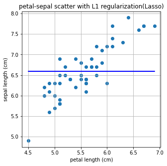
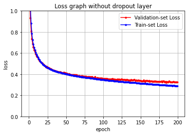

# <span style='background-color: #fff5b1'>정규화(라고 다같은 정규화가 아니다)</span>


Regularization : 정칙화라고 불리며, 오버피팅을 해결하기 위한 방법 중의 하나

Regularization 기법들은 모델이 train set의 정답을 맞히지 못하도록 오버피팅을 방해(train loss가 증가) 하는 역할을 합니다. 그래서 train loss는 약간 증가하지만 결과적으로, validation loss나 최종적인 test loss를 감소시키려는 목적

(이건 오버피팅 방지)


---

Normalization : 정규화라고 불리며, 이는 데이터의 형태를 좀 더 의미 있게, 혹은 트레이닝에 적합하게 전처리하는 과정

(이건 전처리)

예를 들어
1. 데이터를 z-socre 변환
2. 0 과 1 사이 값으로 분포 조정


```python
from sklearn.datasets import load_iris
import pandas as pd 
import matplotlib.pyplot as plt

iris = load_iris()
iris_df = pd.DataFrame(data=iris.data, columns=iris.feature_names)
target_df = pd.DataFrame(data=iris.target, columns=['species'])

# 0, 1, 2로 되어있는 target 데이터를 
# 알아보기 쉽게 'setosa', 'versicolor', 'virginica'로 바꿉니다 
def converter(species):
    if species == 0:
        return 'setosa'
    elif species == 1:
        return 'versicolor'
    else:
        return 'virginica'

target_df['species'] = target_df['species'].apply(converter)

iris_df = pd.concat([iris_df, target_df], axis=1)
iris_df.head()
```


<div>
<style scoped>
    .dataframe tbody tr th:only-of-type {
        vertical-align: middle;
    }

    .dataframe tbody tr th {
        vertical-align: top;
    }

    .dataframe thead th {
        text-align: right;
    }
</style>
<table border="1" class="dataframe">
  <thead>
    <tr style="text-align: right;">
      <th></th>
      <th>sepal length (cm)</th>
      <th>sepal width (cm)</th>
      <th>petal length (cm)</th>
      <th>petal width (cm)</th>
      <th>species</th>
    </tr>
  </thead>
  <tbody>
    <tr>
      <th>0</th>
      <td>5.1</td>
      <td>3.5</td>
      <td>1.4</td>
      <td>0.2</td>
      <td>setosa</td>
    </tr>
    <tr>
      <th>1</th>
      <td>4.9</td>
      <td>3.0</td>
      <td>1.4</td>
      <td>0.2</td>
      <td>setosa</td>
    </tr>
    <tr>
      <th>2</th>
      <td>4.7</td>
      <td>3.2</td>
      <td>1.3</td>
      <td>0.2</td>
      <td>setosa</td>
    </tr>
    <tr>
      <th>3</th>
      <td>4.6</td>
      <td>3.1</td>
      <td>1.5</td>
      <td>0.2</td>
      <td>setosa</td>
    </tr>
    <tr>
      <th>4</th>
      <td>5.0</td>
      <td>3.6</td>
      <td>1.4</td>
      <td>0.2</td>
      <td>setosa</td>
    </tr>
  </tbody>
</table>
</div>


```python
X = [iris_df['petal length (cm)'][a] for a in iris_df.index if iris_df['species'][a]=='virginica']
Y = [iris_df['sepal length (cm)'][a] for a in iris_df.index if iris_df['species'][a]=='virginica']

print(X)
print(Y)
```

    [6.0, 5.1, 5.9, 5.6, 5.8, 6.6, 4.5, 6.3, 5.8, 6.1, 5.1, 5.3, 5.5, 5.0, 5.1, 5.3, 5.5, 6.7, 6.9, 5.0, 5.7, 4.9, 6.7, 4.9, 5.7, 6.0, 4.8, 4.9, 5.6, 5.8, 6.1, 6.4, 5.6, 5.1, 5.6, 6.1, 5.6, 5.5, 4.8, 5.4, 5.6, 5.1, 5.1, 5.9, 5.7, 5.2, 5.0, 5.2, 5.4, 5.1]
    [6.3, 5.8, 7.1, 6.3, 6.5, 7.6, 4.9, 7.3, 6.7, 7.2, 6.5, 6.4, 6.8, 5.7, 5.8, 6.4, 6.5, 7.7, 7.7, 6.0, 6.9, 5.6, 7.7, 6.3, 6.7, 7.2, 6.2, 6.1, 6.4, 7.2, 7.4, 7.9, 6.4, 6.3, 6.1, 7.7, 6.3, 6.4, 6.0, 6.9, 6.7, 6.9, 5.8, 6.8, 6.7, 6.7, 6.3, 6.5, 6.2, 5.9]


```python
plt.figure(figsize=(5,5))
plt.scatter(X,Y)
plt.title('petal-sepal scatter before normalization') 
plt.xlabel('petal length (cm)')
plt.ylabel('sepal length (cm)')
plt.grid()
plt.show()
```


    

    


```python
from sklearn.preprocessing import minmax_scale

#sklearn 에서 지원하는 minmax_SCALE 로 0~ 1값으로 조정됨

X_scale = minmax_scale(X)
Y_scale = minmax_scale(Y)

plt.figure(figsize=(5,5))
plt.scatter(X_scale,Y_scale)
plt.title('petal-sepal scatter after normalization') 
plt.xlabel('petal length (cm)')
plt.ylabel('sepal length (cm)')
plt.grid()
plt.show()
```


    

    


```python
from sklearn.linear_model import LinearRegression
import numpy as np 

X = np.array(X)
Y = np.array(Y)

# Iris Dataset을 Linear Regression으로 학습합니다. 
linear= LinearRegression()
linear.fit(X.reshape(-1,1), Y)

# Linear Regression의 기울기와 절편을 확인합니다. 
a, b=linear.coef_, linear.intercept_
print("기울기 : %0.2f, 절편 : %0.2f" %(a,b))
```

    기울기 : 1.00, 절편 : 1.06


```python
plt.figure(figsize=(5,5))
plt.scatter(X,Y)
plt.plot(X,linear.predict(X.reshape(-1,1)),'-b')
plt.title('petal-sepal scatter with linear regression') 
plt.xlabel('petal length (cm)')
plt.ylabel('sepal length (cm)')
plt.grid()
plt.show()
```


    

    


```python
#L1 regularization은 Lasso로 import 합니다.
from sklearn.linear_model import Lasso

L1 = Lasso()
L1.fit(X.reshape(-1,1), Y)
a, b=L1.coef_, L1.intercept_
print("기울기 : %0.2f, 절편 : %0.2f" %(a,b))

plt.figure(figsize=(5,5))
plt.scatter(X,Y)
plt.plot(X,L1.predict(X.reshape(-1,1)),'-b')
plt.title('petal-sepal scatter with L1 regularization(Lasso)') 
plt.xlabel('petal length (cm)')
plt.ylabel('sepal length (cm)')
plt.grid()
plt.show()
```

    기울기 : 0.00, 절편 : 6.59


    

    


이게 Lasso 방식이고


```python
#L2 regularization은 Ridge로 import 합니다. 
from sklearn.linear_model import Ridge

L2 = Ridge()
L2.fit(X.reshape(-1,1), Y)
a, b = L2.coef_, L2.intercept_
print("기울기 : %0.2f, 절편 : %0.2f" %(a,b))

plt.figure(figsize=(5,5))
plt.scatter(X,Y)
plt.plot(X,L2.predict(X.reshape(-1,1)),'-b')
plt.title('petal-sepal scatter with L2 regularization(Ridge)') 
plt.xlabel('petal length (cm)')
plt.ylabel('sepal length (cm)')
plt.grid()
plt.show()
```

    기울기 : 0.93, 절편 : 1.41


    

    


이게 Ridge 방법  
기존 방법보다 축은 위로 쫌 이동했지만

기울기가 좀 줄었다


이 두 방식은 Regularization
다시말해 오버피팅을 방지한 것이다

---


, L1 Regularization을 사용할 때는 X가 2차원 이상인 여러 컬럼 값이 있는 데이터일 때 실제 효과를 볼 수 있습니다.

x가 1차원이었던 iris 꽃잎길이데이터같은 따분한거 쓰지말고

어른의 데이터인 wine dataset을 볼까?


```python
from sklearn.datasets import load_wine

wine = load_wine()
wine_df = pd.DataFrame(data=wine.data, columns=wine.feature_names)
target_df = pd.DataFrame(data=wine.target, columns=['Y'])
```


```python
wine_df.head(5)
```


<div>
<style scoped>
    .dataframe tbody tr th:only-of-type {
        vertical-align: middle;
    }

    .dataframe tbody tr th {
        vertical-align: top;
    }

    .dataframe thead th {
        text-align: right;
    }
</style>
<table border="1" class="dataframe">
  <thead>
    <tr style="text-align: right;">
      <th></th>
      <th>alcohol</th>
      <th>malic_acid</th>
      <th>ash</th>
      <th>alcalinity_of_ash</th>
      <th>magnesium</th>
      <th>total_phenols</th>
      <th>flavanoids</th>
      <th>nonflavanoid_phenols</th>
      <th>proanthocyanins</th>
      <th>color_intensity</th>
      <th>hue</th>
      <th>od280/od315_of_diluted_wines</th>
      <th>proline</th>
    </tr>
  </thead>
  <tbody>
    <tr>
      <th>0</th>
      <td>14.23</td>
      <td>1.71</td>
      <td>2.43</td>
      <td>15.6</td>
      <td>127.0</td>
      <td>2.80</td>
      <td>3.06</td>
      <td>0.28</td>
      <td>2.29</td>
      <td>5.64</td>
      <td>1.04</td>
      <td>3.92</td>
      <td>1065.0</td>
    </tr>
    <tr>
      <th>1</th>
      <td>13.20</td>
      <td>1.78</td>
      <td>2.14</td>
      <td>11.2</td>
      <td>100.0</td>
      <td>2.65</td>
      <td>2.76</td>
      <td>0.26</td>
      <td>1.28</td>
      <td>4.38</td>
      <td>1.05</td>
      <td>3.40</td>
      <td>1050.0</td>
    </tr>
    <tr>
      <th>2</th>
      <td>13.16</td>
      <td>2.36</td>
      <td>2.67</td>
      <td>18.6</td>
      <td>101.0</td>
      <td>2.80</td>
      <td>3.24</td>
      <td>0.30</td>
      <td>2.81</td>
      <td>5.68</td>
      <td>1.03</td>
      <td>3.17</td>
      <td>1185.0</td>
    </tr>
    <tr>
      <th>3</th>
      <td>14.37</td>
      <td>1.95</td>
      <td>2.50</td>
      <td>16.8</td>
      <td>113.0</td>
      <td>3.85</td>
      <td>3.49</td>
      <td>0.24</td>
      <td>2.18</td>
      <td>7.80</td>
      <td>0.86</td>
      <td>3.45</td>
      <td>1480.0</td>
    </tr>
    <tr>
      <th>4</th>
      <td>13.24</td>
      <td>2.59</td>
      <td>2.87</td>
      <td>21.0</td>
      <td>118.0</td>
      <td>2.80</td>
      <td>2.69</td>
      <td>0.39</td>
      <td>1.82</td>
      <td>4.32</td>
      <td>1.04</td>
      <td>2.93</td>
      <td>735.0</td>
    </tr>
  </tbody>
</table>
</div>


```python
target_df.head(5)
```


<div>
<style scoped>
    .dataframe tbody tr th:only-of-type {
        vertical-align: middle;
    }

    .dataframe tbody tr th {
        vertical-align: top;
    }

    .dataframe thead th {
        text-align: right;
    }
</style>
<table border="1" class="dataframe">
  <thead>
    <tr style="text-align: right;">
      <th></th>
      <th>Y</th>
    </tr>
  </thead>
  <tbody>
    <tr>
      <th>0</th>
      <td>0</td>
    </tr>
    <tr>
      <th>1</th>
      <td>0</td>
    </tr>
    <tr>
      <th>2</th>
      <td>0</td>
    </tr>
    <tr>
      <th>3</th>
      <td>0</td>
    </tr>
    <tr>
      <th>4</th>
      <td>0</td>
    </tr>
  </tbody>
</table>
</div>


```python
from sklearn.model_selection import train_test_split
from sklearn.linear_model import LinearRegression
from sklearn.metrics import mean_absolute_error, mean_squared_error

# 데이터를 준비하고
X_train, X_test, y_train, y_test = train_test_split(wine_df, target_df, test_size=0.3, random_state=101)

# 모델을 훈련시킵니다.
model = LinearRegression()
model.fit(X_train, y_train)

# 테스트를 해볼까요?
model.predict(X_test)
pred = model.predict(X_test)

# 테스트 결과는 이렇습니다!
print("result of linear regression")
print('Mean Absolute Error:', mean_absolute_error(y_test, pred))
print('Mean Squared Error:', mean_squared_error(y_test, pred))
print('Mean Root Squared Error:', np.sqrt(mean_squared_error(y_test, pred)))

print("\n\n coefficient linear regression")
print(model.coef_)
```

    result of linear regression
    Mean Absolute Error: 0.25128973939722626
    Mean Squared Error: 0.1062458740952556
    Mean Root Squared Error: 0.32595379134971814
    
    
     coefficient linear regression
    [[-8.09017190e-02  4.34817880e-02 -1.18857931e-01  3.65705449e-02
      -4.68014203e-04  1.41423581e-01 -4.54107854e-01 -5.13172664e-01
       9.69318443e-02  5.34311136e-02 -1.27626604e-01 -2.91381844e-01
      -5.72238959e-04]]


선형회귀로 문제를 풀고

계수(coefficient) 

절대 오차 ( mean absolute error)

제곱 오차 ( mean squared error)

평균 제곱값 오차 (root mean squared error)

를 출력


```python
from sklearn.model_selection import train_test_split
from sklearn.linear_model import LinearRegression
from sklearn.metrics import mean_absolute_error, mean_squared_error

# 데이터를 준비하고
X_train, X_test, y_train, y_test = train_test_split(wine_df, target_df, test_size=0.3, random_state=101)

# 모델을 훈련시킵니다.
model = LinearRegression()
model.fit(X_train, y_train)

# 테스트를 해볼까요?
model.predict(X_test)
pred = model.predict(X_test)

# 테스트 결과는 이렇습니다!
print("result of linear regression")
print('Mean Absolute Error:', mean_absolute_error(y_test, pred))
print('Mean Squared Error:', mean_squared_error(y_test, pred))
print('Mean Root Squared Error:', np.sqrt(mean_squared_error(y_test, pred)))

print("\n\n coefficient linear regression")
print(model.coef_)
```

    result of linear regression
    Mean Absolute Error: 0.25128973939722626
    Mean Squared Error: 0.1062458740952556
    Mean Root Squared Error: 0.32595379134971814
    
    
     coefficient linear regression
    [[-8.09017190e-02  4.34817880e-02 -1.18857931e-01  3.65705449e-02
      -4.68014203e-04  1.41423581e-01 -4.54107854e-01 -5.13172664e-01
       9.69318443e-02  5.34311136e-02 -1.27626604e-01 -2.91381844e-01
      -5.72238959e-04]]


```python
from sklearn.linear_model import Lasso
from sklearn.metrics import mean_absolute_error, mean_squared_error

# 모델을 준비하고 훈련시킵니다.
L1 = Lasso(alpha=0.05)
L1.fit(X_train, y_train)

# 테스트를 해봅시다.
pred = L1.predict(X_test)

# 모델 성능은 얼마나 좋을까요?
print("result of Lasso")
print('Mean Absolute Error:', mean_absolute_error(y_test, pred))
print('Mean Squared Error:', mean_squared_error(y_test, pred))
print('Mean Root Squared Error:', np.sqrt(mean_squared_error(y_test, pred)))

print("\n\n coefficient of Lasso")
print(L1.coef_)
```

    result of Lasso
    Mean Absolute Error: 0.24233731936122138
    Mean Squared Error: 0.0955956894578189
    Mean Root Squared Error: 0.3091855259513597
    
    
     coefficient of Lasso
    [-0.          0.01373795 -0.          0.03065716  0.00154719 -0.
     -0.34143614 -0.          0.          0.06755943 -0.         -0.14558153
     -0.00089635]


coefficient 부분을 보시면 Linear Regression과 L1 Regularization의 차이가 좀 더 두드러짐

inear Regression에서는 모든 컬럼의 가중치를 탐색하여 구하는 반면, L1 Regularization에서는 총 13개 중 7개를 제외한 나머지의 값들이 모두 0임

 

## L2 norm  Ridge


보면 L1 은 걍 절댓값만 씌우고

L2 는 제곱을 해,,! 그 차이야,,!!


L2 는 제곱을 하기 때문에 저렇게 원의 형태가 나와 

하지만 L1 은 사각형이지

제곱이라 수렴 속도도 빠름 더 가까운 길을 찾을 수 있잖아

정리하면, L1 Regularization은 가중치가 적은 벡터에 해당하는 계수를 0으로 보내면서 차원 축소와 비슷한 역할을 하는 것이 특징이며, L2 Regularization은 0이 아닌 0에 가깝게 보내지만 제곱 텀이 있기 때문에 L1 Regularization보다는 수렴 속도가 빠르다는 장점

예를 들어, A=[1,1,1,1,1]A=[1,1,1,1,1] , B=[5,0,0,0,0]B=[5,0,0,0,0] 의 경우  
L1-norm은 같지만, L2-norm은 같지 않습니다.  
즉, 제곱 텀에서 결과에 큰 영향을 미치는 값은 더 크게,  
결과에 영향이 적은 값들은 더 작게 보내면서 수렴 속도가 빨라지는 것입니다.  


#### 그러므로, 데이터에 따라 적절한 Regularization 방법을 활용하는 것이 좋습니다.


## 근데 그래서 Norm 이란게 뭘까....?

1. vector norm
2. matrix norm

Norm이라는 개념은 벡터뿐만 아니라 함수, 행렬에 대해서 크기를 구하는 것으로, 딥러닝을 배우는 과정에서는 주로 벡터, 좀 더 어렵게는 행렬의 Norm 정도만 알면 됩니다.


1. vector


```python
x=np.array([1,10,1,1,1])

p=5

norm_x=np.linalg.norm(x, ord=p)

making_norm = (sum(x**p))**(1/p)

print("result of numpy package norm function : %0.5f "%norm_x) 
print("result of making norm : %0.5f "%making_norm)
```

    result of numpy package norm function : 10.00008 
    result of making norm : 10.00008 


2. matrix


```python
A=np.array([[1,2,3],[1,2,3],[4,6,8]])
inf_norm_A=np.linalg.norm(A, ord=np.inf)
print("result inf norm of A :", inf_norm_A)
one_norm_A=np.linalg.norm(A, ord=1)
print("result one norm of A :", one_norm_A)
```

    result inf norm of A : 18.0
    result one norm of A : 14.0


## Dropout 은 뭔데?

[Dropout 논문](https://jmlr.org/papers/v15/srivastava14a.html)

Dropout 은 Regularization 으로 오버피팅을 막는 정칙화 이다.

 fully connected layer에서 오버피팅이 생기는 경우에 주로 Dropout layer를 추가합니다.


```python
import tensorflow as tf
from tensorflow import keras
import numpy as np
import matplotlib.pyplot as plt
from sklearn.model_selection import train_test_split

fashion_mnist = keras.datasets.fashion_mnist
print('=3')
```

    =3


```python
(train_images, train_labels), (test_images, test_labels) = fashion_mnist.load_data()
class_names = ['T-shirt/top', 'Trouser', 'Pullover', 'Dress', 'Coat',
               'Sandal', 'Shirt', 'Sneaker', 'Bag', 'Ankle boot']

train_images = train_images / 255.0
test_images = test_images / 255.0
```


```python
model = keras.Sequential([
    keras.layers.Flatten(input_shape=(28, 28)),
    keras.layers.Dense(128, activation='relu'),
    # 여기에 dropout layer를 추가해보았습니다. 나머지 layer는 아래의 실습과 같습니다.
    keras.layers.Dropout(0.9),
    keras.layers.Dense(10, activation='softmax')
])

model.compile(optimizer='adam',loss='sparse_categorical_crossentropy',
              metrics=['accuracy'])

history= model.fit(train_images, train_labels, epochs=5)
```

    Epoch 1/5
    1875/1875 [==============================] - 5s 2ms/step - loss: 1.4060 - accuracy: 0.4571
    Epoch 2/5
    1875/1875 [==============================] - 4s 2ms/step - loss: 1.1796 - accuracy: 0.5296
    Epoch 3/5
    1875/1875 [==============================] - 4s 2ms/step - loss: 1.1358 - accuracy: 0.5459
    Epoch 4/5
    1875/1875 [==============================] - 4s 2ms/step - loss: 1.1104 - accuracy: 0.5530
    Epoch 5/5
    1875/1875 [==============================] - 4s 2ms/step - loss: 1.0902 - accuracy: 0.5628


```python
model = keras.Sequential([
    keras.layers.Flatten(input_shape=(28, 28)),
    # 이번에는 dropout layer가 없습니다. 
    keras.layers.Dense(128, activation='relu'),
    keras.layers.Dense(10, activation='softmax')
])

model.compile(optimizer='adam',loss='sparse_categorical_crossentropy',
              metrics=['accuracy'])

history = model.fit(train_images, train_labels, epochs=5)
```

    Epoch 1/5
    1875/1875 [==============================] - 4s 2ms/step - loss: 0.5047 - accuracy: 0.8254
    Epoch 2/5
    1875/1875 [==============================] - 4s 2ms/step - loss: 0.3759 - accuracy: 0.8648
    Epoch 3/5
    1875/1875 [==============================] - 4s 2ms/step - loss: 0.3370 - accuracy: 0.8777
    Epoch 4/5
    1875/1875 [==============================] - 4s 2ms/step - loss: 0.3138 - accuracy: 0.8853
    Epoch 5/5
    1875/1875 [==============================] - 4s 2ms/step - loss: 0.2967 - accuracy: 0.8910


보면 드랍아웃을 0.9로 주면 정확도가 56% 이다

아무것도 안한게 89% 인데 ㅋ 어이없어 저렇겐 쓰지마

근데 오버피팅 줄일때 써봐

### overfitting 줄이는 법


```python
X_train, X_valid, y_train, y_valid = train_test_split(train_images, train_labels, test_size=0.01, random_state=101)
X_train = X_train / 255.0
X_valid = X_valid / 255.0

#Dense layer만으로 만들어 낸 classification 모델입니다.
model = keras.Sequential([
    keras.layers.Flatten(input_shape=(28, 28)),
    keras.layers.Dense(256, activation='relu'),
    keras.layers.Dense(10, activation='softmax')
])

model.compile(optimizer='adam',loss='sparse_categorical_crossentropy',
              metrics=['accuracy'])

history= model.fit(X_train, y_train, epochs=200, batch_size=512, validation_data=(X_valid, y_valid))
```

    Epoch 1/200
    117/117 [==============================] - 1s 5ms/step - loss: 2.0499 - accuracy: 0.5479 - val_loss: 1.6354 - val_accuracy: 0.5983
    Epoch 2/200
    117/117 [==============================] - 0s 4ms/step - loss: 1.3857 - accuracy: 0.6154 - val_loss: 1.1556 - val_accuracy: 0.6817
    Epoch 3/200
    117/117 [==============================] - 0s 4ms/step - loss: 1.0562 - accuracy: 0.6812 - val_loss: 0.9326 - val_accuracy: 0.7333
    Epoch 4/200
    117/117 [==============================] - 0s 4ms/step - loss: 0.8842 - accuracy: 0.7192 - val_loss: 0.8094 - val_accuracy: 0.7483
    Epoch 5/200
    117/117 [==============================] - 0s 4ms/step - loss: 0.7847 - accuracy: 0.7343 - val_loss: 0.7366 - val_accuracy: 0.7650
    Epoch 6/200
    117/117 [==============================] - 0s 4ms/step - loss: 0.7235 - accuracy: 0.7471 - val_loss: 0.6882 - val_accuracy: 0.7717
    Epoch 7/200
    117/117 [==============================] - 0s 4ms/step - loss: 0.6827 - accuracy: 0.7565 - val_loss: 0.6565 - val_accuracy: 0.7850
    Epoch 8/200
    117/117 [==============================] - 0s 3ms/step - loss: 0.6518 - accuracy: 0.7663 - val_loss: 0.6299 - val_accuracy: 0.7917
    Epoch 9/200
    117/117 [==============================] - 0s 4ms/step - loss: 0.6271 - accuracy: 0.7739 - val_loss: 0.6132 - val_accuracy: 0.7933
    Epoch 10/200
    117/117 [==============================] - 0s 3ms/step - loss: 0.6065 - accuracy: 0.7824 - val_loss: 0.5906 - val_accuracy: 0.7950
    Epoch 11/200
    117/117 [==============================] - 0s 3ms/step - loss: 0.5883 - accuracy: 0.7897 - val_loss: 0.5751 - val_accuracy: 0.7967
    Epoch 12/200
    117/117 [==============================] - 0s 4ms/step - loss: 0.5725 - accuracy: 0.7971 - val_loss: 0.5648 - val_accuracy: 0.8017
    Epoch 13/200
    117/117 [==============================] - 0s 4ms/step - loss: 0.5597 - accuracy: 0.8016 - val_loss: 0.5587 - val_accuracy: 0.8000
    Epoch 14/200
    117/117 [==============================] - 0s 4ms/step - loss: 0.5459 - accuracy: 0.8068 - val_loss: 0.5408 - val_accuracy: 0.8033
    Epoch 15/200
    117/117 [==============================] - 0s 3ms/step - loss: 0.5356 - accuracy: 0.8118 - val_loss: 0.5273 - val_accuracy: 0.8000
    Epoch 16/200
    117/117 [==============================] - 0s 4ms/step - loss: 0.5256 - accuracy: 0.8148 - val_loss: 0.5238 - val_accuracy: 0.8117
    Epoch 17/200
    117/117 [==============================] - 0s 4ms/step - loss: 0.5163 - accuracy: 0.8192 - val_loss: 0.5124 - val_accuracy: 0.8117
    Epoch 18/200
    117/117 [==============================] - 0s 3ms/step - loss: 0.5078 - accuracy: 0.8216 - val_loss: 0.5084 - val_accuracy: 0.8117
    Epoch 19/200
    117/117 [==============================] - 0s 3ms/step - loss: 0.5001 - accuracy: 0.8243 - val_loss: 0.5048 - val_accuracy: 0.8133
    Epoch 20/200
    117/117 [==============================] - 0s 4ms/step - loss: 0.4931 - accuracy: 0.8270 - val_loss: 0.4947 - val_accuracy: 0.8183
    Epoch 21/200
    117/117 [==============================] - 0s 4ms/step - loss: 0.4868 - accuracy: 0.8289 - val_loss: 0.4901 - val_accuracy: 0.8167
    Epoch 22/200
    117/117 [==============================] - 0s 4ms/step - loss: 0.4807 - accuracy: 0.8313 - val_loss: 0.4836 - val_accuracy: 0.8233
    Epoch 23/200
    117/117 [==============================] - 0s 4ms/step - loss: 0.4756 - accuracy: 0.8335 - val_loss: 0.4753 - val_accuracy: 0.8250
    Epoch 24/200
    117/117 [==============================] - 0s 3ms/step - loss: 0.4705 - accuracy: 0.8356 - val_loss: 0.4692 - val_accuracy: 0.8267
    Epoch 25/200
    117/117 [==============================] - 0s 4ms/step - loss: 0.4657 - accuracy: 0.8366 - val_loss: 0.4710 - val_accuracy: 0.8283
    Epoch 26/200
    117/117 [==============================] - 0s 3ms/step - loss: 0.4616 - accuracy: 0.8384 - val_loss: 0.4609 - val_accuracy: 0.8267
    Epoch 27/200
    117/117 [==============================] - 0s 3ms/step - loss: 0.4584 - accuracy: 0.8388 - val_loss: 0.4640 - val_accuracy: 0.8250
    Epoch 28/200
    117/117 [==============================] - 0s 4ms/step - loss: 0.4538 - accuracy: 0.8412 - val_loss: 0.4571 - val_accuracy: 0.8333
    Epoch 29/200
    117/117 [==============================] - 0s 4ms/step - loss: 0.4502 - accuracy: 0.8428 - val_loss: 0.4522 - val_accuracy: 0.8333
    Epoch 30/200
    117/117 [==============================] - 0s 4ms/step - loss: 0.4471 - accuracy: 0.8435 - val_loss: 0.4497 - val_accuracy: 0.8317
    Epoch 31/200
    117/117 [==============================] - 0s 4ms/step - loss: 0.4442 - accuracy: 0.8450 - val_loss: 0.4491 - val_accuracy: 0.8317
    Epoch 32/200
    117/117 [==============================] - 0s 4ms/step - loss: 0.4410 - accuracy: 0.8456 - val_loss: 0.4417 - val_accuracy: 0.8333
    Epoch 33/200
    117/117 [==============================] - 0s 4ms/step - loss: 0.4379 - accuracy: 0.8473 - val_loss: 0.4395 - val_accuracy: 0.8367
    Epoch 34/200
    117/117 [==============================] - 0s 3ms/step - loss: 0.4352 - accuracy: 0.8474 - val_loss: 0.4377 - val_accuracy: 0.8333
    Epoch 35/200
    117/117 [==============================] - 0s 3ms/step - loss: 0.4329 - accuracy: 0.8487 - val_loss: 0.4360 - val_accuracy: 0.8317
    Epoch 36/200
    117/117 [==============================] - 0s 3ms/step - loss: 0.4316 - accuracy: 0.8485 - val_loss: 0.4331 - val_accuracy: 0.8367
    Epoch 37/200
    117/117 [==============================] - 0s 4ms/step - loss: 0.4279 - accuracy: 0.8499 - val_loss: 0.4331 - val_accuracy: 0.8350
    Epoch 38/200
    117/117 [==============================] - 0s 4ms/step - loss: 0.4267 - accuracy: 0.8499 - val_loss: 0.4268 - val_accuracy: 0.8333
    Epoch 39/200
    117/117 [==============================] - 0s 4ms/step - loss: 0.4239 - accuracy: 0.8517 - val_loss: 0.4282 - val_accuracy: 0.8367
    Epoch 40/200
    117/117 [==============================] - 0s 3ms/step - loss: 0.4217 - accuracy: 0.8526 - val_loss: 0.4243 - val_accuracy: 0.8400
    Epoch 41/200
    117/117 [==============================] - 0s 4ms/step - loss: 0.4195 - accuracy: 0.8534 - val_loss: 0.4206 - val_accuracy: 0.8350
    Epoch 42/200
    117/117 [==============================] - 0s 3ms/step - loss: 0.4177 - accuracy: 0.8538 - val_loss: 0.4232 - val_accuracy: 0.8333
    Epoch 43/200
    117/117 [==============================] - 0s 3ms/step - loss: 0.4164 - accuracy: 0.8543 - val_loss: 0.4232 - val_accuracy: 0.8383
    Epoch 44/200
    117/117 [==============================] - 0s 4ms/step - loss: 0.4138 - accuracy: 0.8559 - val_loss: 0.4183 - val_accuracy: 0.8317
    Epoch 45/200
    117/117 [==============================] - 0s 4ms/step - loss: 0.4125 - accuracy: 0.8556 - val_loss: 0.4137 - val_accuracy: 0.8300
    Epoch 46/200
    117/117 [==============================] - 0s 4ms/step - loss: 0.4106 - accuracy: 0.8564 - val_loss: 0.4153 - val_accuracy: 0.8317
    Epoch 47/200
    117/117 [==============================] - 0s 3ms/step - loss: 0.4095 - accuracy: 0.8566 - val_loss: 0.4131 - val_accuracy: 0.8350
    Epoch 48/200
    117/117 [==============================] - 0s 3ms/step - loss: 0.4067 - accuracy: 0.8581 - val_loss: 0.4158 - val_accuracy: 0.8400
    Epoch 49/200
    117/117 [==============================] - 0s 3ms/step - loss: 0.4059 - accuracy: 0.8577 - val_loss: 0.4130 - val_accuracy: 0.8333
    Epoch 50/200
    117/117 [==============================] - 0s 3ms/step - loss: 0.4032 - accuracy: 0.8588 - val_loss: 0.4109 - val_accuracy: 0.8367
    Epoch 51/200
    117/117 [==============================] - 0s 3ms/step - loss: 0.4019 - accuracy: 0.8594 - val_loss: 0.4092 - val_accuracy: 0.8317
    Epoch 52/200
    117/117 [==============================] - 0s 3ms/step - loss: 0.4010 - accuracy: 0.8599 - val_loss: 0.4081 - val_accuracy: 0.8350
    Epoch 53/200
    117/117 [==============================] - 0s 3ms/step - loss: 0.3985 - accuracy: 0.8603 - val_loss: 0.4027 - val_accuracy: 0.8333
    Epoch 54/200
    117/117 [==============================] - 0s 3ms/step - loss: 0.3972 - accuracy: 0.8607 - val_loss: 0.4011 - val_accuracy: 0.8367
    Epoch 55/200
    117/117 [==============================] - 0s 3ms/step - loss: 0.3959 - accuracy: 0.8609 - val_loss: 0.4045 - val_accuracy: 0.8367
    Epoch 56/200
    117/117 [==============================] - 0s 4ms/step - loss: 0.3946 - accuracy: 0.8608 - val_loss: 0.3998 - val_accuracy: 0.8383
    Epoch 57/200
    117/117 [==============================] - 0s 3ms/step - loss: 0.3925 - accuracy: 0.8622 - val_loss: 0.3959 - val_accuracy: 0.8367
    Epoch 58/200
    117/117 [==============================] - 0s 4ms/step - loss: 0.3920 - accuracy: 0.8624 - val_loss: 0.3958 - val_accuracy: 0.8383
    Epoch 59/200
    117/117 [==============================] - 0s 3ms/step - loss: 0.3905 - accuracy: 0.8628 - val_loss: 0.3966 - val_accuracy: 0.8350
    Epoch 60/200
    117/117 [==============================] - 0s 3ms/step - loss: 0.3898 - accuracy: 0.8634 - val_loss: 0.3964 - val_accuracy: 0.8417
    Epoch 61/200
    117/117 [==============================] - 0s 3ms/step - loss: 0.3877 - accuracy: 0.8642 - val_loss: 0.3943 - val_accuracy: 0.8333
    Epoch 62/200
    117/117 [==============================] - 0s 4ms/step - loss: 0.3858 - accuracy: 0.8643 - val_loss: 0.3931 - val_accuracy: 0.8450
    Epoch 63/200
    117/117 [==============================] - 0s 4ms/step - loss: 0.3848 - accuracy: 0.8643 - val_loss: 0.3928 - val_accuracy: 0.8433
    Epoch 64/200
    117/117 [==============================] - 0s 3ms/step - loss: 0.3840 - accuracy: 0.8642 - val_loss: 0.3893 - val_accuracy: 0.8350
    Epoch 65/200
    117/117 [==============================] - 0s 3ms/step - loss: 0.3822 - accuracy: 0.8652 - val_loss: 0.3940 - val_accuracy: 0.8367
    Epoch 66/200
    117/117 [==============================] - 0s 3ms/step - loss: 0.3828 - accuracy: 0.8659 - val_loss: 0.3843 - val_accuracy: 0.8367
    Epoch 67/200
    117/117 [==============================] - 0s 4ms/step - loss: 0.3800 - accuracy: 0.8664 - val_loss: 0.3837 - val_accuracy: 0.8383
    Epoch 68/200
    117/117 [==============================] - 0s 4ms/step - loss: 0.3787 - accuracy: 0.8665 - val_loss: 0.3838 - val_accuracy: 0.8367
    Epoch 69/200
    117/117 [==============================] - 0s 4ms/step - loss: 0.3773 - accuracy: 0.8672 - val_loss: 0.3854 - val_accuracy: 0.8367
    Epoch 70/200
    117/117 [==============================] - 0s 3ms/step - loss: 0.3774 - accuracy: 0.8673 - val_loss: 0.3827 - val_accuracy: 0.8383
    Epoch 71/200
    117/117 [==============================] - 0s 4ms/step - loss: 0.3752 - accuracy: 0.8684 - val_loss: 0.3791 - val_accuracy: 0.8367
    Epoch 72/200
    117/117 [==============================] - 0s 3ms/step - loss: 0.3738 - accuracy: 0.8686 - val_loss: 0.3844 - val_accuracy: 0.8467
    Epoch 73/200
    117/117 [==============================] - 0s 3ms/step - loss: 0.3740 - accuracy: 0.8677 - val_loss: 0.3817 - val_accuracy: 0.8467
    Epoch 74/200
    117/117 [==============================] - 0s 4ms/step - loss: 0.3729 - accuracy: 0.8684 - val_loss: 0.3797 - val_accuracy: 0.8417
    Epoch 75/200
    117/117 [==============================] - 0s 3ms/step - loss: 0.3706 - accuracy: 0.8687 - val_loss: 0.3812 - val_accuracy: 0.8467
    Epoch 76/200
    117/117 [==============================] - 0s 3ms/step - loss: 0.3701 - accuracy: 0.8693 - val_loss: 0.3757 - val_accuracy: 0.8483
    Epoch 77/200
    117/117 [==============================] - 0s 4ms/step - loss: 0.3689 - accuracy: 0.8693 - val_loss: 0.3788 - val_accuracy: 0.8450
    Epoch 78/200
    117/117 [==============================] - 0s 3ms/step - loss: 0.3684 - accuracy: 0.8705 - val_loss: 0.3774 - val_accuracy: 0.8483
    Epoch 79/200
    117/117 [==============================] - 0s 4ms/step - loss: 0.3680 - accuracy: 0.8703 - val_loss: 0.3738 - val_accuracy: 0.8433
    Epoch 80/200
    117/117 [==============================] - 0s 3ms/step - loss: 0.3657 - accuracy: 0.8711 - val_loss: 0.3756 - val_accuracy: 0.8450
    Epoch 81/200
    117/117 [==============================] - 0s 3ms/step - loss: 0.3648 - accuracy: 0.8716 - val_loss: 0.3760 - val_accuracy: 0.8450
    Epoch 82/200
    117/117 [==============================] - 0s 3ms/step - loss: 0.3656 - accuracy: 0.8708 - val_loss: 0.3768 - val_accuracy: 0.8467
    Epoch 83/200
    117/117 [==============================] - 0s 3ms/step - loss: 0.3628 - accuracy: 0.8719 - val_loss: 0.3718 - val_accuracy: 0.8467
    Epoch 84/200
    117/117 [==============================] - 0s 3ms/step - loss: 0.3612 - accuracy: 0.8729 - val_loss: 0.3743 - val_accuracy: 0.8450
    Epoch 85/200
    117/117 [==============================] - 0s 3ms/step - loss: 0.3608 - accuracy: 0.8727 - val_loss: 0.3700 - val_accuracy: 0.8417
    Epoch 86/200
    117/117 [==============================] - 0s 4ms/step - loss: 0.3602 - accuracy: 0.8727 - val_loss: 0.3771 - val_accuracy: 0.8467
    Epoch 87/200
    117/117 [==============================] - 0s 4ms/step - loss: 0.3612 - accuracy: 0.8727 - val_loss: 0.3671 - val_accuracy: 0.8450
    Epoch 88/200
    117/117 [==============================] - 0s 3ms/step - loss: 0.3577 - accuracy: 0.8743 - val_loss: 0.3657 - val_accuracy: 0.8450
    Epoch 89/200
    117/117 [==============================] - 0s 4ms/step - loss: 0.3569 - accuracy: 0.8745 - val_loss: 0.3677 - val_accuracy: 0.8500
    Epoch 90/200
    117/117 [==============================] - 0s 3ms/step - loss: 0.3559 - accuracy: 0.8743 - val_loss: 0.3750 - val_accuracy: 0.8483
    Epoch 91/200
    117/117 [==============================] - 0s 4ms/step - loss: 0.3563 - accuracy: 0.8748 - val_loss: 0.3626 - val_accuracy: 0.8400
    Epoch 92/200
    117/117 [==============================] - 0s 4ms/step - loss: 0.3541 - accuracy: 0.8749 - val_loss: 0.3644 - val_accuracy: 0.8433
    Epoch 93/200
    117/117 [==============================] - 0s 3ms/step - loss: 0.3536 - accuracy: 0.8752 - val_loss: 0.3652 - val_accuracy: 0.8467
    Epoch 94/200
    117/117 [==============================] - 0s 3ms/step - loss: 0.3527 - accuracy: 0.8754 - val_loss: 0.3644 - val_accuracy: 0.8483
    Epoch 95/200
    117/117 [==============================] - 0s 4ms/step - loss: 0.3514 - accuracy: 0.8757 - val_loss: 0.3615 - val_accuracy: 0.8500
    Epoch 96/200
    117/117 [==============================] - 0s 3ms/step - loss: 0.3521 - accuracy: 0.8755 - val_loss: 0.3620 - val_accuracy: 0.8550
    Epoch 97/200
    117/117 [==============================] - 0s 3ms/step - loss: 0.3505 - accuracy: 0.8756 - val_loss: 0.3613 - val_accuracy: 0.8467
    Epoch 98/200
    117/117 [==============================] - 0s 3ms/step - loss: 0.3501 - accuracy: 0.8766 - val_loss: 0.3613 - val_accuracy: 0.8483
    Epoch 99/200
    117/117 [==============================] - 0s 3ms/step - loss: 0.3491 - accuracy: 0.8769 - val_loss: 0.3630 - val_accuracy: 0.8533
    Epoch 100/200
    117/117 [==============================] - 0s 4ms/step - loss: 0.3472 - accuracy: 0.8775 - val_loss: 0.3580 - val_accuracy: 0.8483
    Epoch 101/200
    117/117 [==============================] - 0s 3ms/step - loss: 0.3466 - accuracy: 0.8775 - val_loss: 0.3561 - val_accuracy: 0.8433
    Epoch 102/200
    117/117 [==============================] - 0s 4ms/step - loss: 0.3466 - accuracy: 0.8774 - val_loss: 0.3581 - val_accuracy: 0.8533
    Epoch 103/200
    117/117 [==============================] - 0s 4ms/step - loss: 0.3458 - accuracy: 0.8783 - val_loss: 0.3562 - val_accuracy: 0.8467
    Epoch 104/200
    117/117 [==============================] - 0s 3ms/step - loss: 0.3452 - accuracy: 0.8774 - val_loss: 0.3581 - val_accuracy: 0.8417
    Epoch 105/200
    117/117 [==============================] - 0s 4ms/step - loss: 0.3444 - accuracy: 0.8783 - val_loss: 0.3597 - val_accuracy: 0.8517
    Epoch 106/200
    117/117 [==============================] - 0s 3ms/step - loss: 0.3435 - accuracy: 0.8784 - val_loss: 0.3579 - val_accuracy: 0.8567
    Epoch 107/200
    117/117 [==============================] - 0s 4ms/step - loss: 0.3440 - accuracy: 0.8782 - val_loss: 0.3545 - val_accuracy: 0.8550
    Epoch 108/200
    117/117 [==============================] - 0s 4ms/step - loss: 0.3414 - accuracy: 0.8794 - val_loss: 0.3543 - val_accuracy: 0.8467
    Epoch 109/200
    117/117 [==============================] - 0s 3ms/step - loss: 0.3405 - accuracy: 0.8798 - val_loss: 0.3526 - val_accuracy: 0.8533
    Epoch 110/200
    117/117 [==============================] - 0s 3ms/step - loss: 0.3414 - accuracy: 0.8797 - val_loss: 0.3543 - val_accuracy: 0.8483
    Epoch 111/200
    117/117 [==============================] - 0s 4ms/step - loss: 0.3400 - accuracy: 0.8797 - val_loss: 0.3533 - val_accuracy: 0.8517
    Epoch 112/200
    117/117 [==============================] - 0s 3ms/step - loss: 0.3379 - accuracy: 0.8805 - val_loss: 0.3552 - val_accuracy: 0.8533
    Epoch 113/200
    117/117 [==============================] - 0s 3ms/step - loss: 0.3375 - accuracy: 0.8809 - val_loss: 0.3574 - val_accuracy: 0.8533
    Epoch 114/200
    117/117 [==============================] - 0s 4ms/step - loss: 0.3399 - accuracy: 0.8790 - val_loss: 0.3517 - val_accuracy: 0.8550
    Epoch 115/200
    117/117 [==============================] - 0s 3ms/step - loss: 0.3369 - accuracy: 0.8805 - val_loss: 0.3508 - val_accuracy: 0.8583
    Epoch 116/200
    117/117 [==============================] - 0s 4ms/step - loss: 0.3371 - accuracy: 0.8808 - val_loss: 0.3524 - val_accuracy: 0.8533
    Epoch 117/200
    117/117 [==============================] - 0s 4ms/step - loss: 0.3347 - accuracy: 0.8813 - val_loss: 0.3503 - val_accuracy: 0.8500
    Epoch 118/200
    117/117 [==============================] - 0s 3ms/step - loss: 0.3349 - accuracy: 0.8811 - val_loss: 0.3475 - val_accuracy: 0.8517
    Epoch 119/200
    117/117 [==============================] - 0s 3ms/step - loss: 0.3335 - accuracy: 0.8820 - val_loss: 0.3498 - val_accuracy: 0.8517
    Epoch 120/200
    117/117 [==============================] - 0s 4ms/step - loss: 0.3327 - accuracy: 0.8825 - val_loss: 0.3527 - val_accuracy: 0.8567
    Epoch 121/200
    117/117 [==============================] - 0s 4ms/step - loss: 0.3320 - accuracy: 0.8834 - val_loss: 0.3501 - val_accuracy: 0.8567
    Epoch 122/200
    117/117 [==============================] - 0s 3ms/step - loss: 0.3321 - accuracy: 0.8826 - val_loss: 0.3531 - val_accuracy: 0.8550
    Epoch 123/200
    117/117 [==============================] - 0s 3ms/step - loss: 0.3318 - accuracy: 0.8824 - val_loss: 0.3479 - val_accuracy: 0.8533
    Epoch 124/200
    117/117 [==============================] - 0s 3ms/step - loss: 0.3311 - accuracy: 0.8824 - val_loss: 0.3496 - val_accuracy: 0.8583
    Epoch 125/200
    117/117 [==============================] - 0s 4ms/step - loss: 0.3293 - accuracy: 0.8831 - val_loss: 0.3545 - val_accuracy: 0.8550
    Epoch 126/200
    117/117 [==============================] - 0s 3ms/step - loss: 0.3290 - accuracy: 0.8835 - val_loss: 0.3524 - val_accuracy: 0.8533
    Epoch 127/200
    117/117 [==============================] - 0s 3ms/step - loss: 0.3283 - accuracy: 0.8837 - val_loss: 0.3505 - val_accuracy: 0.8583
    Epoch 128/200
    117/117 [==============================] - 0s 4ms/step - loss: 0.3272 - accuracy: 0.8839 - val_loss: 0.3498 - val_accuracy: 0.8583
    Epoch 129/200
    117/117 [==============================] - 0s 3ms/step - loss: 0.3272 - accuracy: 0.8844 - val_loss: 0.3493 - val_accuracy: 0.8550
    Epoch 130/200
    117/117 [==============================] - 0s 3ms/step - loss: 0.3264 - accuracy: 0.8839 - val_loss: 0.3470 - val_accuracy: 0.8583
    Epoch 131/200
    117/117 [==============================] - 0s 3ms/step - loss: 0.3256 - accuracy: 0.8845 - val_loss: 0.3463 - val_accuracy: 0.8583
    Epoch 132/200
    117/117 [==============================] - 0s 3ms/step - loss: 0.3251 - accuracy: 0.8844 - val_loss: 0.3508 - val_accuracy: 0.8567
    Epoch 133/200
    117/117 [==============================] - 0s 4ms/step - loss: 0.3260 - accuracy: 0.8839 - val_loss: 0.3498 - val_accuracy: 0.8617
    Epoch 134/200
    117/117 [==============================] - 0s 4ms/step - loss: 0.3241 - accuracy: 0.8850 - val_loss: 0.3430 - val_accuracy: 0.8600
    Epoch 135/200
    117/117 [==============================] - 0s 4ms/step - loss: 0.3235 - accuracy: 0.8855 - val_loss: 0.3427 - val_accuracy: 0.8600
    Epoch 136/200
    117/117 [==============================] - 0s 3ms/step - loss: 0.3233 - accuracy: 0.8852 - val_loss: 0.3445 - val_accuracy: 0.8650
    Epoch 137/200
    117/117 [==============================] - 0s 3ms/step - loss: 0.3215 - accuracy: 0.8857 - val_loss: 0.3410 - val_accuracy: 0.8600
    Epoch 138/200
    117/117 [==============================] - 0s 4ms/step - loss: 0.3216 - accuracy: 0.8857 - val_loss: 0.3469 - val_accuracy: 0.8633
    Epoch 139/200
    117/117 [==============================] - 0s 3ms/step - loss: 0.3208 - accuracy: 0.8859 - val_loss: 0.3421 - val_accuracy: 0.8583
    Epoch 140/200
    117/117 [==============================] - 0s 3ms/step - loss: 0.3204 - accuracy: 0.8858 - val_loss: 0.3437 - val_accuracy: 0.8583
    Epoch 141/200
    117/117 [==============================] - 0s 4ms/step - loss: 0.3201 - accuracy: 0.8862 - val_loss: 0.3454 - val_accuracy: 0.8633
    Epoch 142/200
    117/117 [==============================] - 0s 3ms/step - loss: 0.3190 - accuracy: 0.8865 - val_loss: 0.3467 - val_accuracy: 0.8617
    Epoch 143/200
    117/117 [==============================] - 0s 3ms/step - loss: 0.3192 - accuracy: 0.8865 - val_loss: 0.3463 - val_accuracy: 0.8667
    Epoch 144/200
    117/117 [==============================] - 0s 3ms/step - loss: 0.3196 - accuracy: 0.8865 - val_loss: 0.3384 - val_accuracy: 0.8667
    Epoch 145/200
    117/117 [==============================] - 0s 4ms/step - loss: 0.3172 - accuracy: 0.8873 - val_loss: 0.3429 - val_accuracy: 0.8683
    Epoch 146/200
    117/117 [==============================] - 0s 4ms/step - loss: 0.3168 - accuracy: 0.8885 - val_loss: 0.3391 - val_accuracy: 0.8583
    Epoch 147/200
    117/117 [==============================] - 0s 4ms/step - loss: 0.3158 - accuracy: 0.8880 - val_loss: 0.3397 - val_accuracy: 0.8617
    Epoch 148/200
    117/117 [==============================] - 0s 3ms/step - loss: 0.3147 - accuracy: 0.8887 - val_loss: 0.3447 - val_accuracy: 0.8617
    Epoch 149/200
    117/117 [==============================] - 0s 3ms/step - loss: 0.3145 - accuracy: 0.8885 - val_loss: 0.3387 - val_accuracy: 0.8633
    Epoch 150/200
    117/117 [==============================] - 0s 3ms/step - loss: 0.3140 - accuracy: 0.8889 - val_loss: 0.3411 - val_accuracy: 0.8633
    Epoch 151/200
    117/117 [==============================] - 0s 4ms/step - loss: 0.3132 - accuracy: 0.8884 - val_loss: 0.3403 - val_accuracy: 0.8667
    Epoch 152/200
    117/117 [==============================] - 0s 4ms/step - loss: 0.3125 - accuracy: 0.8894 - val_loss: 0.3358 - val_accuracy: 0.8617
    Epoch 153/200
    117/117 [==============================] - 0s 3ms/step - loss: 0.3122 - accuracy: 0.8892 - val_loss: 0.3364 - val_accuracy: 0.8667
    Epoch 154/200
    117/117 [==============================] - 0s 3ms/step - loss: 0.3114 - accuracy: 0.8899 - val_loss: 0.3369 - val_accuracy: 0.8683
    Epoch 155/200
    117/117 [==============================] - 0s 3ms/step - loss: 0.3114 - accuracy: 0.8893 - val_loss: 0.3444 - val_accuracy: 0.8683
    Epoch 156/200
    117/117 [==============================] - 0s 3ms/step - loss: 0.3112 - accuracy: 0.8894 - val_loss: 0.3356 - val_accuracy: 0.8667
    Epoch 157/200
    117/117 [==============================] - 0s 3ms/step - loss: 0.3100 - accuracy: 0.8895 - val_loss: 0.3314 - val_accuracy: 0.8650
    Epoch 158/200
    117/117 [==============================] - 0s 4ms/step - loss: 0.3097 - accuracy: 0.8901 - val_loss: 0.3373 - val_accuracy: 0.8650
    Epoch 159/200
    117/117 [==============================] - 0s 4ms/step - loss: 0.3094 - accuracy: 0.8899 - val_loss: 0.3380 - val_accuracy: 0.8633
    Epoch 160/200
    117/117 [==============================] - 0s 4ms/step - loss: 0.3099 - accuracy: 0.8893 - val_loss: 0.3372 - val_accuracy: 0.8633
    Epoch 161/200
    117/117 [==============================] - 0s 3ms/step - loss: 0.3090 - accuracy: 0.8902 - val_loss: 0.3355 - val_accuracy: 0.8633
    Epoch 162/200
    117/117 [==============================] - 0s 3ms/step - loss: 0.3077 - accuracy: 0.8906 - val_loss: 0.3374 - val_accuracy: 0.8567
    Epoch 163/200
    117/117 [==============================] - 0s 3ms/step - loss: 0.3084 - accuracy: 0.8902 - val_loss: 0.3312 - val_accuracy: 0.8667
    Epoch 164/200
    117/117 [==============================] - 0s 3ms/step - loss: 0.3075 - accuracy: 0.8908 - val_loss: 0.3356 - val_accuracy: 0.8717
    Epoch 165/200
    117/117 [==============================] - 0s 3ms/step - loss: 0.3059 - accuracy: 0.8901 - val_loss: 0.3358 - val_accuracy: 0.8683
    Epoch 166/200
    117/117 [==============================] - 0s 4ms/step - loss: 0.3060 - accuracy: 0.8913 - val_loss: 0.3341 - val_accuracy: 0.8667
    Epoch 167/200
    117/117 [==============================] - 0s 4ms/step - loss: 0.3043 - accuracy: 0.8917 - val_loss: 0.3319 - val_accuracy: 0.8617
    Epoch 168/200
    117/117 [==============================] - 0s 3ms/step - loss: 0.3042 - accuracy: 0.8916 - val_loss: 0.3283 - val_accuracy: 0.8617
    Epoch 169/200
    117/117 [==============================] - 0s 4ms/step - loss: 0.3039 - accuracy: 0.8924 - val_loss: 0.3327 - val_accuracy: 0.8667
    Epoch 170/200
    117/117 [==============================] - 0s 3ms/step - loss: 0.3034 - accuracy: 0.8919 - val_loss: 0.3290 - val_accuracy: 0.8733
    Epoch 171/200
    117/117 [==============================] - 0s 3ms/step - loss: 0.3031 - accuracy: 0.8923 - val_loss: 0.3332 - val_accuracy: 0.8717
    Epoch 172/200
    117/117 [==============================] - 0s 3ms/step - loss: 0.3019 - accuracy: 0.8930 - val_loss: 0.3301 - val_accuracy: 0.8683
    Epoch 173/200
    117/117 [==============================] - 0s 4ms/step - loss: 0.3019 - accuracy: 0.8924 - val_loss: 0.3324 - val_accuracy: 0.8650
    Epoch 174/200
    117/117 [==============================] - 0s 3ms/step - loss: 0.3011 - accuracy: 0.8934 - val_loss: 0.3306 - val_accuracy: 0.8667
    Epoch 175/200
    117/117 [==============================] - 0s 3ms/step - loss: 0.3009 - accuracy: 0.8930 - val_loss: 0.3310 - val_accuracy: 0.8617
    Epoch 176/200
    117/117 [==============================] - 0s 4ms/step - loss: 0.2996 - accuracy: 0.8929 - val_loss: 0.3307 - val_accuracy: 0.8650
    Epoch 177/200
    117/117 [==============================] - 0s 3ms/step - loss: 0.2995 - accuracy: 0.8933 - val_loss: 0.3284 - val_accuracy: 0.8650
    Epoch 178/200
    117/117 [==============================] - 0s 3ms/step - loss: 0.2993 - accuracy: 0.8935 - val_loss: 0.3299 - val_accuracy: 0.8633
    Epoch 179/200
    117/117 [==============================] - 0s 4ms/step - loss: 0.2994 - accuracy: 0.8937 - val_loss: 0.3336 - val_accuracy: 0.8700
    Epoch 180/200
    117/117 [==============================] - 0s 4ms/step - loss: 0.2975 - accuracy: 0.8942 - val_loss: 0.3276 - val_accuracy: 0.8650
    Epoch 181/200
    117/117 [==============================] - 0s 4ms/step - loss: 0.2981 - accuracy: 0.8940 - val_loss: 0.3343 - val_accuracy: 0.8683
    Epoch 182/200
    117/117 [==============================] - 0s 4ms/step - loss: 0.2969 - accuracy: 0.8949 - val_loss: 0.3326 - val_accuracy: 0.8683
    Epoch 183/200
    117/117 [==============================] - 0s 4ms/step - loss: 0.2970 - accuracy: 0.8946 - val_loss: 0.3276 - val_accuracy: 0.8600
    Epoch 184/200
    117/117 [==============================] - 0s 4ms/step - loss: 0.2963 - accuracy: 0.8944 - val_loss: 0.3316 - val_accuracy: 0.8750
    Epoch 185/200
    117/117 [==============================] - 0s 4ms/step - loss: 0.2952 - accuracy: 0.8941 - val_loss: 0.3219 - val_accuracy: 0.8700
    Epoch 186/200
    117/117 [==============================] - 0s 4ms/step - loss: 0.2958 - accuracy: 0.8951 - val_loss: 0.3301 - val_accuracy: 0.8650
    Epoch 187/200
    117/117 [==============================] - 0s 4ms/step - loss: 0.2956 - accuracy: 0.8948 - val_loss: 0.3262 - val_accuracy: 0.8700
    Epoch 188/200
    117/117 [==============================] - 0s 4ms/step - loss: 0.2939 - accuracy: 0.8950 - val_loss: 0.3255 - val_accuracy: 0.8667
    Epoch 189/200
    117/117 [==============================] - 0s 3ms/step - loss: 0.2932 - accuracy: 0.8961 - val_loss: 0.3340 - val_accuracy: 0.8667
    Epoch 190/200
    117/117 [==============================] - 0s 3ms/step - loss: 0.2948 - accuracy: 0.8954 - val_loss: 0.3298 - val_accuracy: 0.8667
    Epoch 191/200
    117/117 [==============================] - 0s 3ms/step - loss: 0.2950 - accuracy: 0.8945 - val_loss: 0.3254 - val_accuracy: 0.8600
    Epoch 192/200
    117/117 [==============================] - 0s 3ms/step - loss: 0.2919 - accuracy: 0.8964 - val_loss: 0.3252 - val_accuracy: 0.8650
    Epoch 193/200
    117/117 [==============================] - 0s 4ms/step - loss: 0.2915 - accuracy: 0.8963 - val_loss: 0.3253 - val_accuracy: 0.8700
    Epoch 194/200
    117/117 [==============================] - 0s 3ms/step - loss: 0.2908 - accuracy: 0.8963 - val_loss: 0.3237 - val_accuracy: 0.8700
    Epoch 195/200
    117/117 [==============================] - 0s 2ms/step - loss: 0.2913 - accuracy: 0.8959 - val_loss: 0.3282 - val_accuracy: 0.8667
    Epoch 196/200
    117/117 [==============================] - 0s 2ms/step - loss: 0.2914 - accuracy: 0.8960 - val_loss: 0.3261 - val_accuracy: 0.8683
    Epoch 197/200
    117/117 [==============================] - 0s 2ms/step - loss: 0.2895 - accuracy: 0.8966 - val_loss: 0.3250 - val_accuracy: 0.8750
    Epoch 198/200
    117/117 [==============================] - 0s 2ms/step - loss: 0.2899 - accuracy: 0.8969 - val_loss: 0.3268 - val_accuracy: 0.8717
    Epoch 199/200
    117/117 [==============================] - 0s 2ms/step - loss: 0.2881 - accuracy: 0.8974 - val_loss: 0.3265 - val_accuracy: 0.8700
    Epoch 200/200
    117/117 [==============================] - 0s 3ms/step - loss: 0.2900 - accuracy: 0.8965 - val_loss: 0.3265 - val_accuracy: 0.8633


```python
# loss 값을 plot 해보겠습니다.
y_vloss = history.history['val_loss']
y_loss = history.history['loss']
x_len = np.arange(len(y_loss))

plt.plot(x_len, y_vloss, marker='.', c='red', label="Validation-set Loss")
plt.plot(x_len, y_loss, marker='.', c='blue', label="Train-set Loss")
plt.legend(loc='upper right')
plt.grid()
plt.title('Loss graph without dropout layer') 
plt.ylim(0,1)
plt.xlabel('epoch')
plt.ylabel('loss')
plt.show()
```


    

    


```python
# accuracy 값을 plot 해보겠습니다.
y_vacc = history.history['val_accuracy']
y_acc = history.history['accuracy']
x_len = np.arange(len(y_acc))

plt.plot(x_len, y_vacc, marker='.', c='red', label="Validation-set accuracy")
plt.plot(x_len, y_acc, marker='.', c='blue', label="Train-set accuracy")
plt.legend(loc='lower right')
plt.grid()
plt.ylim(0.5,1) 
plt.title('Accuracy graph without dropout layer') 
plt.xlabel('epoch')
plt.ylabel('accuracy')
plt.show()
```


    

    


이렇게 200번 epochs 하면 어느순간(loss 한 100부터 accuracy 한 25부터,,)부터 train loss 는 계속 떨어지지만 val loss 는 더이상 움직이지 않는다...

ㅜㅜ 넘해

이럴때 드랍아웃으로 오버피팅 방지


```python
model = keras.Sequential([
    keras.layers.Flatten(input_shape=(28, 28)),
    keras.layers.Dense(256, activation='relu'),
    # 여기에 dropout layer를 추가해보았습니다. 나머지 layer는 위의 실습과 같습니다. 
    keras.layers.Dropout(0.5),
    keras.layers.Dense(10, activation='softmax')
])

model.compile(optimizer='adam',loss='sparse_categorical_crossentropy',
              metrics=['accuracy'])

history= model.fit(X_train, y_train, epochs=200, batch_size=512, validation_data=(X_valid, y_valid))
```

    Epoch 1/200
    117/117 [==============================] - 1s 7ms/step - loss: 2.0802 - accuracy: 0.4763 - val_loss: 1.7029 - val_accuracy: 0.5300
    Epoch 2/200
    117/117 [==============================] - 0s 3ms/step - loss: 1.4692 - accuracy: 0.5660 - val_loss: 1.2217 - val_accuracy: 0.6350
    Epoch 3/200
    117/117 [==============================] - 0s 4ms/step - loss: 1.1566 - accuracy: 0.6223 - val_loss: 1.0075 - val_accuracy: 0.7083
    Epoch 4/200
    117/117 [==============================] - 0s 3ms/step - loss: 0.9942 - accuracy: 0.6671 - val_loss: 0.8747 - val_accuracy: 0.7533
    Epoch 5/200
    117/117 [==============================] - 0s 3ms/step - loss: 0.8909 - accuracy: 0.6978 - val_loss: 0.7917 - val_accuracy: 0.7600
    Epoch 6/200
    117/117 [==============================] - 0s 4ms/step - loss: 0.8228 - accuracy: 0.7125 - val_loss: 0.7359 - val_accuracy: 0.7567
    Epoch 7/200
    117/117 [==============================] - 0s 4ms/step - loss: 0.7727 - accuracy: 0.7269 - val_loss: 0.6952 - val_accuracy: 0.7767
    Epoch 8/200
    117/117 [==============================] - 0s 4ms/step - loss: 0.7379 - accuracy: 0.7364 - val_loss: 0.6664 - val_accuracy: 0.7833
    Epoch 9/200
    117/117 [==============================] - 0s 4ms/step - loss: 0.7098 - accuracy: 0.7456 - val_loss: 0.6425 - val_accuracy: 0.7917
    Epoch 10/200
    117/117 [==============================] - 0s 4ms/step - loss: 0.6862 - accuracy: 0.7520 - val_loss: 0.6225 - val_accuracy: 0.7917
    Epoch 11/200
    117/117 [==============================] - 0s 4ms/step - loss: 0.6682 - accuracy: 0.7576 - val_loss: 0.6038 - val_accuracy: 0.7967
    Epoch 12/200
    117/117 [==============================] - 0s 4ms/step - loss: 0.6491 - accuracy: 0.7655 - val_loss: 0.5924 - val_accuracy: 0.7967
    Epoch 13/200
    117/117 [==============================] - 0s 4ms/step - loss: 0.6348 - accuracy: 0.7712 - val_loss: 0.5801 - val_accuracy: 0.7933
    Epoch 14/200
    117/117 [==============================] - 0s 4ms/step - loss: 0.6212 - accuracy: 0.7761 - val_loss: 0.5685 - val_accuracy: 0.7950
    Epoch 15/200
    117/117 [==============================] - 0s 3ms/step - loss: 0.6077 - accuracy: 0.7821 - val_loss: 0.5560 - val_accuracy: 0.7967
    Epoch 16/200
    117/117 [==============================] - 0s 4ms/step - loss: 0.5986 - accuracy: 0.7863 - val_loss: 0.5497 - val_accuracy: 0.8050
    Epoch 17/200
    117/117 [==============================] - 0s 4ms/step - loss: 0.5861 - accuracy: 0.7915 - val_loss: 0.5371 - val_accuracy: 0.8017
    Epoch 18/200
    117/117 [==============================] - 0s 4ms/step - loss: 0.5760 - accuracy: 0.7923 - val_loss: 0.5313 - val_accuracy: 0.8033
    Epoch 19/200
    117/117 [==============================] - 0s 4ms/step - loss: 0.5669 - accuracy: 0.7980 - val_loss: 0.5252 - val_accuracy: 0.7983
    Epoch 20/200
    117/117 [==============================] - 0s 4ms/step - loss: 0.5606 - accuracy: 0.7998 - val_loss: 0.5152 - val_accuracy: 0.8067
    Epoch 21/200
    117/117 [==============================] - 0s 4ms/step - loss: 0.5500 - accuracy: 0.8034 - val_loss: 0.5098 - val_accuracy: 0.8117
    Epoch 22/200
    117/117 [==============================] - 0s 3ms/step - loss: 0.5430 - accuracy: 0.8059 - val_loss: 0.5044 - val_accuracy: 0.8133
    Epoch 23/200
    117/117 [==============================] - 0s 4ms/step - loss: 0.5370 - accuracy: 0.8086 - val_loss: 0.4973 - val_accuracy: 0.8117
    Epoch 24/200
    117/117 [==============================] - 0s 4ms/step - loss: 0.5300 - accuracy: 0.8109 - val_loss: 0.4926 - val_accuracy: 0.8133
    Epoch 25/200
    117/117 [==============================] - 0s 4ms/step - loss: 0.5257 - accuracy: 0.8133 - val_loss: 0.4880 - val_accuracy: 0.8167
    Epoch 26/200
    117/117 [==============================] - 0s 4ms/step - loss: 0.5208 - accuracy: 0.8151 - val_loss: 0.4803 - val_accuracy: 0.8217
    Epoch 27/200
    117/117 [==============================] - 0s 4ms/step - loss: 0.5144 - accuracy: 0.8182 - val_loss: 0.4767 - val_accuracy: 0.8183
    Epoch 28/200
    117/117 [==============================] - 0s 4ms/step - loss: 0.5101 - accuracy: 0.8194 - val_loss: 0.4730 - val_accuracy: 0.8200
    Epoch 29/200
    117/117 [==============================] - 0s 3ms/step - loss: 0.5047 - accuracy: 0.8202 - val_loss: 0.4692 - val_accuracy: 0.8267
    Epoch 30/200
    117/117 [==============================] - 0s 4ms/step - loss: 0.5016 - accuracy: 0.8223 - val_loss: 0.4649 - val_accuracy: 0.8250
    Epoch 31/200
    117/117 [==============================] - 0s 4ms/step - loss: 0.4949 - accuracy: 0.8246 - val_loss: 0.4627 - val_accuracy: 0.8217
    Epoch 32/200
    117/117 [==============================] - 0s 4ms/step - loss: 0.4908 - accuracy: 0.8260 - val_loss: 0.4581 - val_accuracy: 0.8200
    Epoch 33/200
    117/117 [==============================] - 0s 4ms/step - loss: 0.4880 - accuracy: 0.8282 - val_loss: 0.4540 - val_accuracy: 0.8267
    Epoch 34/200
    117/117 [==============================] - 0s 4ms/step - loss: 0.4853 - accuracy: 0.8270 - val_loss: 0.4477 - val_accuracy: 0.8250
    Epoch 35/200
    117/117 [==============================] - 0s 4ms/step - loss: 0.4800 - accuracy: 0.8301 - val_loss: 0.4479 - val_accuracy: 0.8267
    Epoch 36/200
    117/117 [==============================] - 0s 4ms/step - loss: 0.4784 - accuracy: 0.8317 - val_loss: 0.4423 - val_accuracy: 0.8317
    Epoch 37/200
    117/117 [==============================] - 0s 4ms/step - loss: 0.4746 - accuracy: 0.8326 - val_loss: 0.4429 - val_accuracy: 0.8283
    Epoch 38/200
    117/117 [==============================] - 0s 4ms/step - loss: 0.4712 - accuracy: 0.8336 - val_loss: 0.4392 - val_accuracy: 0.8350
    Epoch 39/200
    117/117 [==============================] - 0s 4ms/step - loss: 0.4680 - accuracy: 0.8346 - val_loss: 0.4364 - val_accuracy: 0.8333
    Epoch 40/200
    117/117 [==============================] - 0s 4ms/step - loss: 0.4642 - accuracy: 0.8361 - val_loss: 0.4352 - val_accuracy: 0.8333
    Epoch 41/200
    117/117 [==============================] - 0s 4ms/step - loss: 0.4625 - accuracy: 0.8360 - val_loss: 0.4318 - val_accuracy: 0.8367
    Epoch 42/200
    117/117 [==============================] - 0s 4ms/step - loss: 0.4589 - accuracy: 0.8378 - val_loss: 0.4305 - val_accuracy: 0.8317
    Epoch 43/200
    117/117 [==============================] - 0s 4ms/step - loss: 0.4571 - accuracy: 0.8379 - val_loss: 0.4267 - val_accuracy: 0.8317
    Epoch 44/200
    117/117 [==============================] - 0s 3ms/step - loss: 0.4558 - accuracy: 0.8400 - val_loss: 0.4250 - val_accuracy: 0.8317
    Epoch 45/200
    117/117 [==============================] - 0s 3ms/step - loss: 0.4527 - accuracy: 0.8407 - val_loss: 0.4234 - val_accuracy: 0.8350
    Epoch 46/200
    117/117 [==============================] - 0s 4ms/step - loss: 0.4514 - accuracy: 0.8398 - val_loss: 0.4185 - val_accuracy: 0.8350
    Epoch 47/200
    117/117 [==============================] - 0s 4ms/step - loss: 0.4457 - accuracy: 0.8415 - val_loss: 0.4165 - val_accuracy: 0.8333
    Epoch 48/200
    117/117 [==============================] - 0s 3ms/step - loss: 0.4460 - accuracy: 0.8418 - val_loss: 0.4174 - val_accuracy: 0.8367
    Epoch 49/200
    117/117 [==============================] - 0s 4ms/step - loss: 0.4429 - accuracy: 0.8442 - val_loss: 0.4194 - val_accuracy: 0.8317
    Epoch 50/200
    117/117 [==============================] - 0s 3ms/step - loss: 0.4414 - accuracy: 0.8431 - val_loss: 0.4114 - val_accuracy: 0.8383
    Epoch 51/200
    117/117 [==============================] - 0s 4ms/step - loss: 0.4384 - accuracy: 0.8454 - val_loss: 0.4127 - val_accuracy: 0.8350
    Epoch 52/200
    117/117 [==============================] - 0s 4ms/step - loss: 0.4373 - accuracy: 0.8446 - val_loss: 0.4082 - val_accuracy: 0.8400
    Epoch 53/200
    117/117 [==============================] - 0s 3ms/step - loss: 0.4359 - accuracy: 0.8454 - val_loss: 0.4059 - val_accuracy: 0.8383
    Epoch 54/200
    117/117 [==============================] - 0s 4ms/step - loss: 0.4325 - accuracy: 0.8479 - val_loss: 0.4040 - val_accuracy: 0.8367
    Epoch 55/200
    117/117 [==============================] - 0s 4ms/step - loss: 0.4301 - accuracy: 0.8481 - val_loss: 0.4016 - val_accuracy: 0.8367
    Epoch 56/200
    117/117 [==============================] - 0s 4ms/step - loss: 0.4268 - accuracy: 0.8489 - val_loss: 0.4070 - val_accuracy: 0.8400
    Epoch 57/200
    117/117 [==============================] - 0s 3ms/step - loss: 0.4268 - accuracy: 0.8487 - val_loss: 0.4012 - val_accuracy: 0.8367
    Epoch 58/200
    117/117 [==============================] - 0s 4ms/step - loss: 0.4239 - accuracy: 0.8498 - val_loss: 0.3998 - val_accuracy: 0.8383
    Epoch 59/200
    117/117 [==============================] - 0s 3ms/step - loss: 0.4242 - accuracy: 0.8508 - val_loss: 0.3976 - val_accuracy: 0.8333
    Epoch 60/200
    117/117 [==============================] - 0s 4ms/step - loss: 0.4232 - accuracy: 0.8501 - val_loss: 0.3967 - val_accuracy: 0.8383
    Epoch 61/200
    117/117 [==============================] - 0s 4ms/step - loss: 0.4207 - accuracy: 0.8499 - val_loss: 0.3960 - val_accuracy: 0.8350
    Epoch 62/200
    117/117 [==============================] - 0s 3ms/step - loss: 0.4190 - accuracy: 0.8510 - val_loss: 0.3976 - val_accuracy: 0.8367
    Epoch 63/200
    117/117 [==============================] - 0s 4ms/step - loss: 0.4183 - accuracy: 0.8520 - val_loss: 0.3940 - val_accuracy: 0.8400
    Epoch 64/200
    117/117 [==============================] - 0s 3ms/step - loss: 0.4154 - accuracy: 0.8527 - val_loss: 0.3922 - val_accuracy: 0.8350
    Epoch 65/200
    117/117 [==============================] - 0s 4ms/step - loss: 0.4156 - accuracy: 0.8531 - val_loss: 0.3937 - val_accuracy: 0.8383
    Epoch 66/200
    117/117 [==============================] - 0s 4ms/step - loss: 0.4129 - accuracy: 0.8537 - val_loss: 0.3896 - val_accuracy: 0.8400
    Epoch 67/200
    117/117 [==============================] - 0s 4ms/step - loss: 0.4136 - accuracy: 0.8532 - val_loss: 0.3890 - val_accuracy: 0.8417
    Epoch 68/200
    117/117 [==============================] - 0s 3ms/step - loss: 0.4104 - accuracy: 0.8547 - val_loss: 0.3869 - val_accuracy: 0.8383
    Epoch 69/200
    117/117 [==============================] - 0s 4ms/step - loss: 0.4077 - accuracy: 0.8564 - val_loss: 0.3861 - val_accuracy: 0.8467
    Epoch 70/200
    117/117 [==============================] - 0s 4ms/step - loss: 0.4075 - accuracy: 0.8553 - val_loss: 0.3848 - val_accuracy: 0.8417
    Epoch 71/200
    117/117 [==============================] - 0s 4ms/step - loss: 0.4047 - accuracy: 0.8579 - val_loss: 0.3820 - val_accuracy: 0.8433
    Epoch 72/200
    117/117 [==============================] - 0s 4ms/step - loss: 0.4054 - accuracy: 0.8558 - val_loss: 0.3827 - val_accuracy: 0.8400
    Epoch 73/200
    117/117 [==============================] - 0s 3ms/step - loss: 0.4042 - accuracy: 0.8575 - val_loss: 0.3828 - val_accuracy: 0.8400
    Epoch 74/200
    117/117 [==============================] - 0s 3ms/step - loss: 0.4020 - accuracy: 0.8579 - val_loss: 0.3800 - val_accuracy: 0.8433
    Epoch 75/200
    117/117 [==============================] - 0s 4ms/step - loss: 0.4001 - accuracy: 0.8583 - val_loss: 0.3794 - val_accuracy: 0.8450
    Epoch 76/200
    117/117 [==============================] - 0s 4ms/step - loss: 0.4005 - accuracy: 0.8568 - val_loss: 0.3768 - val_accuracy: 0.8450
    Epoch 77/200
    117/117 [==============================] - 0s 4ms/step - loss: 0.4001 - accuracy: 0.8576 - val_loss: 0.3765 - val_accuracy: 0.8467
    Epoch 78/200
    117/117 [==============================] - 0s 4ms/step - loss: 0.3980 - accuracy: 0.8592 - val_loss: 0.3773 - val_accuracy: 0.8467
    Epoch 79/200
    117/117 [==============================] - 0s 4ms/step - loss: 0.3976 - accuracy: 0.8593 - val_loss: 0.3762 - val_accuracy: 0.8517
    Epoch 80/200
    117/117 [==============================] - 0s 3ms/step - loss: 0.3961 - accuracy: 0.8594 - val_loss: 0.3729 - val_accuracy: 0.8450
    Epoch 81/200
    117/117 [==============================] - 0s 3ms/step - loss: 0.3945 - accuracy: 0.8586 - val_loss: 0.3714 - val_accuracy: 0.8433
    Epoch 82/200
    117/117 [==============================] - 0s 3ms/step - loss: 0.3916 - accuracy: 0.8619 - val_loss: 0.3736 - val_accuracy: 0.8467
    Epoch 83/200
    117/117 [==============================] - 0s 3ms/step - loss: 0.3925 - accuracy: 0.8623 - val_loss: 0.3728 - val_accuracy: 0.8433
    Epoch 84/200
    117/117 [==============================] - 0s 4ms/step - loss: 0.3913 - accuracy: 0.8614 - val_loss: 0.3716 - val_accuracy: 0.8483
    Epoch 85/200
    117/117 [==============================] - 0s 3ms/step - loss: 0.3890 - accuracy: 0.8621 - val_loss: 0.3704 - val_accuracy: 0.8433
    Epoch 86/200
    117/117 [==============================] - 0s 4ms/step - loss: 0.3872 - accuracy: 0.8621 - val_loss: 0.3699 - val_accuracy: 0.8450
    Epoch 87/200
    117/117 [==============================] - 0s 3ms/step - loss: 0.3875 - accuracy: 0.8614 - val_loss: 0.3710 - val_accuracy: 0.8483
    Epoch 88/200
    117/117 [==============================] - 0s 4ms/step - loss: 0.3863 - accuracy: 0.8630 - val_loss: 0.3666 - val_accuracy: 0.8417
    Epoch 89/200
    117/117 [==============================] - 0s 4ms/step - loss: 0.3847 - accuracy: 0.8626 - val_loss: 0.3684 - val_accuracy: 0.8467
    Epoch 90/200
    117/117 [==============================] - 0s 3ms/step - loss: 0.3837 - accuracy: 0.8634 - val_loss: 0.3681 - val_accuracy: 0.8450
    Epoch 91/200
    117/117 [==============================] - 0s 4ms/step - loss: 0.3835 - accuracy: 0.8646 - val_loss: 0.3655 - val_accuracy: 0.8517
    Epoch 92/200
    117/117 [==============================] - 0s 4ms/step - loss: 0.3840 - accuracy: 0.8640 - val_loss: 0.3673 - val_accuracy: 0.8467
    Epoch 93/200
    117/117 [==============================] - 0s 4ms/step - loss: 0.3825 - accuracy: 0.8646 - val_loss: 0.3628 - val_accuracy: 0.8500
    Epoch 94/200
    117/117 [==============================] - 0s 4ms/step - loss: 0.3796 - accuracy: 0.8639 - val_loss: 0.3630 - val_accuracy: 0.8450
    Epoch 95/200
    117/117 [==============================] - 0s 4ms/step - loss: 0.3789 - accuracy: 0.8657 - val_loss: 0.3628 - val_accuracy: 0.8517
    Epoch 96/200
    117/117 [==============================] - 0s 4ms/step - loss: 0.3788 - accuracy: 0.8660 - val_loss: 0.3638 - val_accuracy: 0.8517
    Epoch 97/200
    117/117 [==============================] - 0s 4ms/step - loss: 0.3784 - accuracy: 0.8671 - val_loss: 0.3629 - val_accuracy: 0.8533
    Epoch 98/200
    117/117 [==============================] - 0s 4ms/step - loss: 0.3768 - accuracy: 0.8661 - val_loss: 0.3609 - val_accuracy: 0.8567
    Epoch 99/200
    117/117 [==============================] - 0s 3ms/step - loss: 0.3752 - accuracy: 0.8662 - val_loss: 0.3623 - val_accuracy: 0.8550
    Epoch 100/200
    117/117 [==============================] - 0s 4ms/step - loss: 0.3743 - accuracy: 0.8666 - val_loss: 0.3586 - val_accuracy: 0.8550
    Epoch 101/200
    117/117 [==============================] - 0s 4ms/step - loss: 0.3751 - accuracy: 0.8674 - val_loss: 0.3573 - val_accuracy: 0.8417
    Epoch 102/200
    117/117 [==============================] - 0s 4ms/step - loss: 0.3748 - accuracy: 0.8675 - val_loss: 0.3605 - val_accuracy: 0.8550
    Epoch 103/200
    117/117 [==============================] - 0s 4ms/step - loss: 0.3722 - accuracy: 0.8695 - val_loss: 0.3577 - val_accuracy: 0.8533
    Epoch 104/200
    117/117 [==============================] - 0s 4ms/step - loss: 0.3718 - accuracy: 0.8669 - val_loss: 0.3558 - val_accuracy: 0.8517
    Epoch 105/200
    117/117 [==============================] - 0s 3ms/step - loss: 0.3714 - accuracy: 0.8672 - val_loss: 0.3577 - val_accuracy: 0.8550
    Epoch 106/200
    117/117 [==============================] - 0s 4ms/step - loss: 0.3703 - accuracy: 0.8689 - val_loss: 0.3540 - val_accuracy: 0.8533
    Epoch 107/200
    117/117 [==============================] - 0s 4ms/step - loss: 0.3681 - accuracy: 0.8686 - val_loss: 0.3565 - val_accuracy: 0.8533
    Epoch 108/200
    117/117 [==============================] - 0s 4ms/step - loss: 0.3705 - accuracy: 0.8687 - val_loss: 0.3529 - val_accuracy: 0.8500
    Epoch 109/200
    117/117 [==============================] - 0s 4ms/step - loss: 0.3668 - accuracy: 0.8696 - val_loss: 0.3523 - val_accuracy: 0.8533
    Epoch 110/200
    117/117 [==============================] - 0s 4ms/step - loss: 0.3671 - accuracy: 0.8700 - val_loss: 0.3537 - val_accuracy: 0.8550
    Epoch 111/200
    117/117 [==============================] - 0s 4ms/step - loss: 0.3668 - accuracy: 0.8699 - val_loss: 0.3520 - val_accuracy: 0.8550
    Epoch 112/200
    117/117 [==============================] - 0s 4ms/step - loss: 0.3648 - accuracy: 0.8715 - val_loss: 0.3499 - val_accuracy: 0.8583
    Epoch 113/200
    117/117 [==============================] - 0s 4ms/step - loss: 0.3622 - accuracy: 0.8721 - val_loss: 0.3496 - val_accuracy: 0.8600
    Epoch 114/200
    117/117 [==============================] - 0s 4ms/step - loss: 0.3636 - accuracy: 0.8721 - val_loss: 0.3508 - val_accuracy: 0.8467
    Epoch 115/200
    117/117 [==============================] - 0s 4ms/step - loss: 0.3637 - accuracy: 0.8709 - val_loss: 0.3480 - val_accuracy: 0.8550
    Epoch 116/200
    117/117 [==============================] - 0s 4ms/step - loss: 0.3616 - accuracy: 0.8717 - val_loss: 0.3514 - val_accuracy: 0.8583
    Epoch 117/200
    117/117 [==============================] - 0s 4ms/step - loss: 0.3602 - accuracy: 0.8720 - val_loss: 0.3462 - val_accuracy: 0.8533
    Epoch 118/200
    117/117 [==============================] - 0s 4ms/step - loss: 0.3616 - accuracy: 0.8716 - val_loss: 0.3518 - val_accuracy: 0.8567
    Epoch 119/200
    117/117 [==============================] - 0s 4ms/step - loss: 0.3597 - accuracy: 0.8719 - val_loss: 0.3479 - val_accuracy: 0.8583
    Epoch 120/200
    117/117 [==============================] - 0s 4ms/step - loss: 0.3584 - accuracy: 0.8726 - val_loss: 0.3491 - val_accuracy: 0.8583
    Epoch 121/200
    117/117 [==============================] - 0s 4ms/step - loss: 0.3588 - accuracy: 0.8727 - val_loss: 0.3466 - val_accuracy: 0.8583
    Epoch 122/200
    117/117 [==============================] - 0s 4ms/step - loss: 0.3576 - accuracy: 0.8732 - val_loss: 0.3459 - val_accuracy: 0.8517
    Epoch 123/200
    117/117 [==============================] - 0s 4ms/step - loss: 0.3544 - accuracy: 0.8743 - val_loss: 0.3451 - val_accuracy: 0.8583
    Epoch 124/200
    117/117 [==============================] - 0s 4ms/step - loss: 0.3557 - accuracy: 0.8739 - val_loss: 0.3430 - val_accuracy: 0.8550
    Epoch 125/200
    117/117 [==============================] - 0s 4ms/step - loss: 0.3555 - accuracy: 0.8745 - val_loss: 0.3430 - val_accuracy: 0.8600
    Epoch 126/200
    117/117 [==============================] - 0s 4ms/step - loss: 0.3546 - accuracy: 0.8729 - val_loss: 0.3442 - val_accuracy: 0.8583
    Epoch 127/200
    117/117 [==============================] - 0s 4ms/step - loss: 0.3545 - accuracy: 0.8746 - val_loss: 0.3435 - val_accuracy: 0.8600
    Epoch 128/200
    117/117 [==============================] - 0s 4ms/step - loss: 0.3551 - accuracy: 0.8736 - val_loss: 0.3405 - val_accuracy: 0.8550
    Epoch 129/200
    117/117 [==============================] - 0s 4ms/step - loss: 0.3532 - accuracy: 0.8750 - val_loss: 0.3415 - val_accuracy: 0.8567
    Epoch 130/200
    117/117 [==============================] - 0s 4ms/step - loss: 0.3521 - accuracy: 0.8753 - val_loss: 0.3397 - val_accuracy: 0.8583
    Epoch 131/200
    117/117 [==============================] - 0s 4ms/step - loss: 0.3499 - accuracy: 0.8756 - val_loss: 0.3405 - val_accuracy: 0.8550
    Epoch 132/200
    117/117 [==============================] - 0s 4ms/step - loss: 0.3513 - accuracy: 0.8753 - val_loss: 0.3395 - val_accuracy: 0.8617
    Epoch 133/200
    117/117 [==============================] - 0s 4ms/step - loss: 0.3489 - accuracy: 0.8758 - val_loss: 0.3397 - val_accuracy: 0.8600
    Epoch 134/200
    117/117 [==============================] - 0s 4ms/step - loss: 0.3509 - accuracy: 0.8758 - val_loss: 0.3412 - val_accuracy: 0.8567
    Epoch 135/200
    117/117 [==============================] - 0s 4ms/step - loss: 0.3483 - accuracy: 0.8770 - val_loss: 0.3386 - val_accuracy: 0.8583
    Epoch 136/200
    117/117 [==============================] - 0s 4ms/step - loss: 0.3483 - accuracy: 0.8758 - val_loss: 0.3384 - val_accuracy: 0.8583
    Epoch 137/200
    117/117 [==============================] - 0s 3ms/step - loss: 0.3462 - accuracy: 0.8777 - val_loss: 0.3378 - val_accuracy: 0.8583
    Epoch 138/200
    117/117 [==============================] - 0s 4ms/step - loss: 0.3465 - accuracy: 0.8774 - val_loss: 0.3392 - val_accuracy: 0.8617
    Epoch 139/200
    117/117 [==============================] - 0s 4ms/step - loss: 0.3469 - accuracy: 0.8769 - val_loss: 0.3361 - val_accuracy: 0.8583
    Epoch 140/200
    117/117 [==============================] - 0s 4ms/step - loss: 0.3464 - accuracy: 0.8778 - val_loss: 0.3370 - val_accuracy: 0.8567
    Epoch 141/200
    117/117 [==============================] - 0s 4ms/step - loss: 0.3433 - accuracy: 0.8785 - val_loss: 0.3343 - val_accuracy: 0.8600
    Epoch 142/200
    117/117 [==============================] - 0s 4ms/step - loss: 0.3455 - accuracy: 0.8782 - val_loss: 0.3373 - val_accuracy: 0.8600
    Epoch 143/200
    117/117 [==============================] - 0s 4ms/step - loss: 0.3445 - accuracy: 0.8778 - val_loss: 0.3357 - val_accuracy: 0.8583
    Epoch 144/200
    117/117 [==============================] - 0s 4ms/step - loss: 0.3435 - accuracy: 0.8786 - val_loss: 0.3356 - val_accuracy: 0.8617
    Epoch 145/200
    117/117 [==============================] - 0s 4ms/step - loss: 0.3420 - accuracy: 0.8781 - val_loss: 0.3364 - val_accuracy: 0.8650
    Epoch 146/200
    117/117 [==============================] - 0s 4ms/step - loss: 0.3446 - accuracy: 0.8782 - val_loss: 0.3342 - val_accuracy: 0.8600
    Epoch 147/200
    117/117 [==============================] - 0s 4ms/step - loss: 0.3422 - accuracy: 0.8781 - val_loss: 0.3342 - val_accuracy: 0.8650
    Epoch 148/200
    117/117 [==============================] - 0s 4ms/step - loss: 0.3424 - accuracy: 0.8787 - val_loss: 0.3343 - val_accuracy: 0.8550
    Epoch 149/200
    117/117 [==============================] - 0s 4ms/step - loss: 0.3397 - accuracy: 0.8788 - val_loss: 0.3328 - val_accuracy: 0.8600
    Epoch 150/200
    117/117 [==============================] - 0s 3ms/step - loss: 0.3378 - accuracy: 0.8798 - val_loss: 0.3332 - val_accuracy: 0.8633
    Epoch 151/200
    117/117 [==============================] - 0s 3ms/step - loss: 0.3398 - accuracy: 0.8788 - val_loss: 0.3333 - val_accuracy: 0.8567
    Epoch 152/200
    117/117 [==============================] - 0s 4ms/step - loss: 0.3389 - accuracy: 0.8793 - val_loss: 0.3336 - val_accuracy: 0.8650
    Epoch 153/200
    117/117 [==============================] - 0s 4ms/step - loss: 0.3384 - accuracy: 0.8806 - val_loss: 0.3335 - val_accuracy: 0.8600
    Epoch 154/200
    117/117 [==============================] - 0s 3ms/step - loss: 0.3365 - accuracy: 0.8803 - val_loss: 0.3319 - val_accuracy: 0.8567
    Epoch 155/200
    117/117 [==============================] - 0s 4ms/step - loss: 0.3381 - accuracy: 0.8811 - val_loss: 0.3323 - val_accuracy: 0.8617
    Epoch 156/200
    117/117 [==============================] - 0s 4ms/step - loss: 0.3382 - accuracy: 0.8801 - val_loss: 0.3308 - val_accuracy: 0.8617
    Epoch 157/200
    117/117 [==============================] - 0s 3ms/step - loss: 0.3364 - accuracy: 0.8808 - val_loss: 0.3269 - val_accuracy: 0.8617
    Epoch 158/200
    117/117 [==============================] - 0s 4ms/step - loss: 0.3374 - accuracy: 0.8804 - val_loss: 0.3304 - val_accuracy: 0.8683
    Epoch 159/200
    117/117 [==============================] - 0s 4ms/step - loss: 0.3361 - accuracy: 0.8809 - val_loss: 0.3298 - val_accuracy: 0.8583
    Epoch 160/200
    117/117 [==============================] - 0s 3ms/step - loss: 0.3343 - accuracy: 0.8813 - val_loss: 0.3296 - val_accuracy: 0.8650
    Epoch 161/200
    117/117 [==============================] - 0s 4ms/step - loss: 0.3336 - accuracy: 0.8816 - val_loss: 0.3282 - val_accuracy: 0.8700
    Epoch 162/200
    117/117 [==============================] - 0s 4ms/step - loss: 0.3335 - accuracy: 0.8817 - val_loss: 0.3293 - val_accuracy: 0.8600
    Epoch 163/200
    117/117 [==============================] - 0s 4ms/step - loss: 0.3334 - accuracy: 0.8810 - val_loss: 0.3317 - val_accuracy: 0.8650
    Epoch 164/200
    117/117 [==============================] - 0s 4ms/step - loss: 0.3312 - accuracy: 0.8828 - val_loss: 0.3252 - val_accuracy: 0.8633
    Epoch 165/200
    117/117 [==============================] - 0s 3ms/step - loss: 0.3315 - accuracy: 0.8819 - val_loss: 0.3271 - val_accuracy: 0.8700
    Epoch 166/200
    117/117 [==============================] - 0s 4ms/step - loss: 0.3320 - accuracy: 0.8823 - val_loss: 0.3270 - val_accuracy: 0.8633
    Epoch 167/200
    117/117 [==============================] - 0s 4ms/step - loss: 0.3322 - accuracy: 0.8825 - val_loss: 0.3263 - val_accuracy: 0.8650
    Epoch 168/200
    117/117 [==============================] - 0s 3ms/step - loss: 0.3315 - accuracy: 0.8830 - val_loss: 0.3270 - val_accuracy: 0.8600
    Epoch 169/200
    117/117 [==============================] - 0s 3ms/step - loss: 0.3307 - accuracy: 0.8824 - val_loss: 0.3241 - val_accuracy: 0.8617
    Epoch 170/200
    117/117 [==============================] - 0s 3ms/step - loss: 0.3296 - accuracy: 0.8829 - val_loss: 0.3249 - val_accuracy: 0.8650
    Epoch 171/200
    117/117 [==============================] - 0s 3ms/step - loss: 0.3314 - accuracy: 0.8823 - val_loss: 0.3261 - val_accuracy: 0.8650
    Epoch 172/200
    117/117 [==============================] - 0s 4ms/step - loss: 0.3277 - accuracy: 0.8836 - val_loss: 0.3255 - val_accuracy: 0.8650
    Epoch 173/200
    117/117 [==============================] - 0s 3ms/step - loss: 0.3312 - accuracy: 0.8824 - val_loss: 0.3264 - val_accuracy: 0.8633
    Epoch 174/200
    117/117 [==============================] - 0s 3ms/step - loss: 0.3284 - accuracy: 0.8830 - val_loss: 0.3247 - val_accuracy: 0.8650
    Epoch 175/200
    117/117 [==============================] - 0s 4ms/step - loss: 0.3266 - accuracy: 0.8836 - val_loss: 0.3226 - val_accuracy: 0.8683
    Epoch 176/200
    117/117 [==============================] - 0s 3ms/step - loss: 0.3266 - accuracy: 0.8835 - val_loss: 0.3229 - val_accuracy: 0.8633
    Epoch 177/200
    117/117 [==============================] - 0s 3ms/step - loss: 0.3261 - accuracy: 0.8841 - val_loss: 0.3252 - val_accuracy: 0.8633
    Epoch 178/200
    117/117 [==============================] - 0s 4ms/step - loss: 0.3229 - accuracy: 0.8872 - val_loss: 0.3233 - val_accuracy: 0.8650
    Epoch 179/200
    117/117 [==============================] - 0s 3ms/step - loss: 0.3282 - accuracy: 0.8845 - val_loss: 0.3215 - val_accuracy: 0.8667
    Epoch 180/200
    117/117 [==============================] - 0s 4ms/step - loss: 0.3264 - accuracy: 0.8844 - val_loss: 0.3245 - val_accuracy: 0.8617
    Epoch 181/200
    117/117 [==============================] - 0s 3ms/step - loss: 0.3247 - accuracy: 0.8846 - val_loss: 0.3210 - val_accuracy: 0.8633
    Epoch 182/200
    117/117 [==============================] - 0s 4ms/step - loss: 0.3253 - accuracy: 0.8843 - val_loss: 0.3230 - val_accuracy: 0.8667
    Epoch 183/200
    117/117 [==============================] - 0s 4ms/step - loss: 0.3243 - accuracy: 0.8842 - val_loss: 0.3240 - val_accuracy: 0.8650
    Epoch 184/200
    117/117 [==============================] - 0s 3ms/step - loss: 0.3248 - accuracy: 0.8845 - val_loss: 0.3199 - val_accuracy: 0.8700
    Epoch 185/200
    117/117 [==============================] - 0s 3ms/step - loss: 0.3242 - accuracy: 0.8856 - val_loss: 0.3225 - val_accuracy: 0.8733
    Epoch 186/200
    117/117 [==============================] - 0s 3ms/step - loss: 0.3236 - accuracy: 0.8844 - val_loss: 0.3208 - val_accuracy: 0.8650
    Epoch 187/200
    117/117 [==============================] - 0s 4ms/step - loss: 0.3223 - accuracy: 0.8859 - val_loss: 0.3167 - val_accuracy: 0.8667
    Epoch 188/200
    117/117 [==============================] - 0s 4ms/step - loss: 0.3214 - accuracy: 0.8849 - val_loss: 0.3201 - val_accuracy: 0.8633
    Epoch 189/200
    117/117 [==============================] - 0s 3ms/step - loss: 0.3260 - accuracy: 0.8848 - val_loss: 0.3202 - val_accuracy: 0.8717
    Epoch 190/200
    117/117 [==============================] - 0s 3ms/step - loss: 0.3214 - accuracy: 0.8855 - val_loss: 0.3192 - val_accuracy: 0.8633
    Epoch 191/200
    117/117 [==============================] - 0s 3ms/step - loss: 0.3205 - accuracy: 0.8861 - val_loss: 0.3214 - val_accuracy: 0.8650
    Epoch 192/200
    117/117 [==============================] - 0s 3ms/step - loss: 0.3213 - accuracy: 0.8857 - val_loss: 0.3180 - val_accuracy: 0.8700
    Epoch 193/200
    117/117 [==============================] - 0s 2ms/step - loss: 0.3203 - accuracy: 0.8859 - val_loss: 0.3191 - val_accuracy: 0.8617
    Epoch 194/200
    117/117 [==============================] - 0s 3ms/step - loss: 0.3223 - accuracy: 0.8858 - val_loss: 0.3170 - val_accuracy: 0.8683
    Epoch 195/200
    117/117 [==============================] - 0s 3ms/step - loss: 0.3216 - accuracy: 0.8862 - val_loss: 0.3222 - val_accuracy: 0.8667
    Epoch 196/200
    117/117 [==============================] - 0s 2ms/step - loss: 0.3196 - accuracy: 0.8860 - val_loss: 0.3167 - val_accuracy: 0.8700
    Epoch 197/200
    117/117 [==============================] - 0s 3ms/step - loss: 0.3179 - accuracy: 0.8880 - val_loss: 0.3194 - val_accuracy: 0.8700
    Epoch 198/200
    117/117 [==============================] - 0s 3ms/step - loss: 0.3185 - accuracy: 0.8865 - val_loss: 0.3178 - val_accuracy: 0.8633
    Epoch 199/200
    117/117 [==============================] - 0s 2ms/step - loss: 0.3152 - accuracy: 0.8877 - val_loss: 0.3137 - val_accuracy: 0.8667
    Epoch 200/200
    117/117 [==============================] - 0s 2ms/step - loss: 0.3166 - accuracy: 0.8876 - val_loss: 0.3202 - val_accuracy: 0.8650


```python
# loss 값을 plot 해보겠습니다. 
y_vloss = history.history['val_loss']
y_loss = history.history['loss']
x_len = np.arange(len(y_loss))

plt.plot(x_len, y_vloss, marker='.', c='red', label="Validation-set Loss")
plt.plot(x_len, y_loss, marker='.', c='blue', label="Train-set Loss")
plt.legend(loc='upper right')
plt.grid()
plt.ylim(0,1)
plt.title('Loss graph with dropout layer') 
plt.xlabel('epoch')
plt.ylabel('loss')
plt.show()
```


    

    


```python
# accuracy 값을 plot 해보겠습니다. 
y_vacc = history.history['val_accuracy']
y_acc = history.history['accuracy']
x_len = np.arange(len(y_acc))

plt.plot(x_len, y_vacc, marker='.', c='red', label="Validation-set accuracy")
plt.plot(x_len, y_acc, marker='.', c='blue', label="Train-set accuracy")
plt.legend(loc='lower right')
plt.grid()
plt.ylim(0.5,1) 
plt.title('Accuracy graph with dropout layer') 
plt.xlabel('epoch')
plt.ylabel('accuracy')
plt.show()
```


    

    


진짜 조금 바뀌긴 했지만 차이가 있긴 있다

사실 더 복잡한 네트워크나, 더 어려운 데이터의 경우에는 이러한 오버피팅이 더 자주 있는 일이므로, Dropout layer를 추가하는 경우가 많습니다. 하지만 이 또한 확률 값이 파라미터로 들어가므로, 어떠한 값을 선택하느냐는 데이터와 네트워크에 따라 달린 일입니다.

## Batch Normalization

### 요건 기울기소실 이랑 기울기포화 문제를 해결한다.

[논문](https://arxiv.org/pdf/1502.03167.pdf)


쉽게 말하면 미니배치에서

평균이랑 분산을 구해가지고

x에서 평균뺀거를 분산으로 나눈 값으로 정규화 하는거

특히 중요한 부분은 분모에 엡실론(0.001)) 가 추가된 것이다 이 부분으로

가중치 소실, 포화를 막을 수 있다. 그래서 이걸로
오버피팅으로 학습이 잘되지 않는 것을 막을 수 있닫.

fashion_mnist 데이터로 가져가보자


```python
import tensorflow as tf
from tensorflow import keras
import numpy as np
import matplotlib.pyplot as plt

fashion_mnist = keras.datasets.fashion_mnist
print('=3')
```

    =3


```python
(train_images, train_labels), (test_images, test_labels) = fashion_mnist.load_data()
class_names = ['T-shirt/top', 'Trouser', 'Pullover', 'Dress', 'Coat',
               'Sandal', 'Shirt', 'Sneaker', 'Bag', 'Ankle boot']

train_images = train_images / 255.0
test_images = test_images / 255.0
```


```python
from sklearn.model_selection import train_test_split

X_train, X_valid, y_train, y_valid = train_test_split(train_images, train_labels, test_size=0.3, random_state=101)

model = keras.Sequential([
    keras.layers.Flatten(input_shape=(28, 28)),
    keras.layers.Dense(128, activation='relu'),
    keras.layers.Dense(10, activation='softmax')
])

model.compile(optimizer='adam',loss='sparse_categorical_crossentropy',
              metrics=['accuracy'])

history= model.fit(X_train, y_train, epochs=20, batch_size=2048, validation_data=(X_valid, y_valid))
```

    Epoch 1/20
    21/21 [==============================] - 1s 23ms/step - loss: 1.2103 - accuracy: 0.6096 - val_loss: 0.7485 - val_accuracy: 0.7401
    Epoch 2/20
    21/21 [==============================] - 0s 10ms/step - loss: 0.6556 - accuracy: 0.7789 - val_loss: 0.5983 - val_accuracy: 0.8006
    Epoch 3/20
    21/21 [==============================] - 0s 10ms/step - loss: 0.5541 - accuracy: 0.8160 - val_loss: 0.5364 - val_accuracy: 0.8184
    Epoch 4/20
    21/21 [==============================] - 0s 9ms/step - loss: 0.5061 - accuracy: 0.8299 - val_loss: 0.5008 - val_accuracy: 0.8274
    Epoch 5/20
    21/21 [==============================] - 0s 9ms/step - loss: 0.4775 - accuracy: 0.8394 - val_loss: 0.4801 - val_accuracy: 0.8369
    Epoch 6/20
    21/21 [==============================] - 0s 9ms/step - loss: 0.4555 - accuracy: 0.8452 - val_loss: 0.4612 - val_accuracy: 0.8456
    Epoch 7/20
    21/21 [==============================] - 0s 9ms/step - loss: 0.4391 - accuracy: 0.8502 - val_loss: 0.4470 - val_accuracy: 0.8479
    Epoch 8/20
    21/21 [==============================] - 0s 8ms/step - loss: 0.4251 - accuracy: 0.8559 - val_loss: 0.4369 - val_accuracy: 0.8503
    Epoch 9/20
    21/21 [==============================] - 0s 6ms/step - loss: 0.4144 - accuracy: 0.8578 - val_loss: 0.4295 - val_accuracy: 0.8530
    Epoch 10/20
    21/21 [==============================] - 0s 6ms/step - loss: 0.4059 - accuracy: 0.8595 - val_loss: 0.4182 - val_accuracy: 0.8566
    Epoch 11/20
    21/21 [==============================] - 0s 7ms/step - loss: 0.3950 - accuracy: 0.8646 - val_loss: 0.4125 - val_accuracy: 0.8588
    Epoch 12/20
    21/21 [==============================] - 0s 6ms/step - loss: 0.3900 - accuracy: 0.8662 - val_loss: 0.4139 - val_accuracy: 0.8543
    Epoch 13/20
    21/21 [==============================] - 0s 6ms/step - loss: 0.3826 - accuracy: 0.8678 - val_loss: 0.4036 - val_accuracy: 0.8598
    Epoch 14/20
    21/21 [==============================] - 0s 6ms/step - loss: 0.3731 - accuracy: 0.8719 - val_loss: 0.3979 - val_accuracy: 0.8619
    Epoch 15/20
    21/21 [==============================] - 0s 6ms/step - loss: 0.3696 - accuracy: 0.8723 - val_loss: 0.3929 - val_accuracy: 0.8624
    Epoch 16/20
    21/21 [==============================] - 0s 6ms/step - loss: 0.3614 - accuracy: 0.8761 - val_loss: 0.3878 - val_accuracy: 0.8650
    Epoch 17/20
    21/21 [==============================] - 0s 6ms/step - loss: 0.3560 - accuracy: 0.8774 - val_loss: 0.3865 - val_accuracy: 0.8647
    Epoch 18/20
    21/21 [==============================] - 0s 6ms/step - loss: 0.3514 - accuracy: 0.8776 - val_loss: 0.3858 - val_accuracy: 0.8644
    Epoch 19/20
    21/21 [==============================] - 0s 6ms/step - loss: 0.3476 - accuracy: 0.8803 - val_loss: 0.3774 - val_accuracy: 0.8686
    Epoch 20/20
    21/21 [==============================] - 0s 6ms/step - loss: 0.3385 - accuracy: 0.8828 - val_loss: 0.3780 - val_accuracy: 0.8672


```python
# loss 값을 plot 해보겠습니다. 
y_vloss = history.history['val_loss']
y_loss = history.history['loss']
x_len = np.arange(len(y_loss))

plt.plot(x_len, y_vloss, marker='.', c='red', label="Validation-set Loss")
plt.plot(x_len, y_loss, marker='.', c='blue', label="Train-set Loss")
plt.legend(loc='upper right')
plt.grid()
plt.ylim(0,1)
plt.title('Loss graph without batch normalization') 
plt.xlabel('epoch')
plt.ylabel('loss')
plt.show()
```


    

    


일반적인 Dense FC layer 를 쓰면 저렇게 val loss가 7.5 쯤에서 멈춘다


```python
# accuracy 값을 plot 해보겠습니다. 
y_vacc = history.history['val_accuracy']
y_acc = history.history['accuracy']
x_len = np.arange(len(y_acc))

plt.plot(x_len, y_vacc, marker='.', c='red', label="Validation-set accuracy")
plt.plot(x_len, y_acc, marker='.', c='blue', label="Train-set accuracy")
plt.legend(loc='lower right')
plt.grid()
plt.ylim(0.5,1)
plt.title('Accuracy graph without batch normalization') 
plt.xlabel('epoch')
plt.ylabel('accuracy')
plt.show()
```


    

    


### 배치 노말라이제이션 쓰면


```python
model = keras.Sequential([
    keras.layers.Flatten(input_shape=(28, 28)),
    keras.layers.Dense(128, activation='relu'),
    #여기에 batchnormalization layer를 추가해보았습니다. 나머지 layer는 위의 실습과 같습니다.
    keras.layers.BatchNormalization(),
    keras.layers.Dense(10, activation='softmax')
])

model.compile(optimizer='adam',loss='sparse_categorical_crossentropy',
              metrics=['accuracy'])

history= model.fit(X_train, y_train, epochs=20, batch_size=2048, validation_data=(X_valid, y_valid))
```

    Epoch 1/20
    21/21 [==============================] - 1s 25ms/step - loss: 0.8808 - accuracy: 0.7005 - val_loss: 1.0613 - val_accuracy: 0.6525
    Epoch 2/20
    21/21 [==============================] - 0s 9ms/step - loss: 0.5167 - accuracy: 0.8267 - val_loss: 0.8411 - val_accuracy: 0.7488
    Epoch 3/20
    21/21 [==============================] - 0s 10ms/step - loss: 0.4500 - accuracy: 0.8469 - val_loss: 0.7390 - val_accuracy: 0.7935
    Epoch 4/20
    21/21 [==============================] - 0s 9ms/step - loss: 0.4127 - accuracy: 0.8584 - val_loss: 0.6659 - val_accuracy: 0.8183
    Epoch 5/20
    21/21 [==============================] - 0s 10ms/step - loss: 0.3869 - accuracy: 0.8680 - val_loss: 0.6321 - val_accuracy: 0.8328
    Epoch 6/20
    21/21 [==============================] - 0s 9ms/step - loss: 0.3640 - accuracy: 0.8746 - val_loss: 0.5769 - val_accuracy: 0.8439
    Epoch 7/20
    21/21 [==============================] - 0s 10ms/step - loss: 0.3465 - accuracy: 0.8790 - val_loss: 0.5427 - val_accuracy: 0.8486
    Epoch 8/20
    21/21 [==============================] - 0s 6ms/step - loss: 0.3321 - accuracy: 0.8842 - val_loss: 0.5140 - val_accuracy: 0.8510
    Epoch 9/20
    21/21 [==============================] - 0s 7ms/step - loss: 0.3164 - accuracy: 0.8903 - val_loss: 0.4943 - val_accuracy: 0.8492
    Epoch 10/20
    21/21 [==============================] - 0s 7ms/step - loss: 0.3045 - accuracy: 0.8935 - val_loss: 0.4571 - val_accuracy: 0.8611
    Epoch 11/20
    21/21 [==============================] - 0s 7ms/step - loss: 0.2944 - accuracy: 0.8968 - val_loss: 0.4447 - val_accuracy: 0.8588
    Epoch 12/20
    21/21 [==============================] - 0s 6ms/step - loss: 0.2839 - accuracy: 0.9001 - val_loss: 0.4193 - val_accuracy: 0.8649
    Epoch 13/20
    21/21 [==============================] - 0s 7ms/step - loss: 0.2733 - accuracy: 0.9047 - val_loss: 0.4101 - val_accuracy: 0.8683
    Epoch 14/20
    21/21 [==============================] - 0s 6ms/step - loss: 0.2639 - accuracy: 0.9089 - val_loss: 0.4099 - val_accuracy: 0.8638
    Epoch 15/20
    21/21 [==============================] - 0s 6ms/step - loss: 0.2580 - accuracy: 0.9097 - val_loss: 0.3807 - val_accuracy: 0.8750
    Epoch 16/20
    21/21 [==============================] - 0s 6ms/step - loss: 0.2502 - accuracy: 0.9125 - val_loss: 0.3694 - val_accuracy: 0.8753
    Epoch 17/20
    21/21 [==============================] - 0s 6ms/step - loss: 0.2434 - accuracy: 0.9149 - val_loss: 0.3822 - val_accuracy: 0.8688
    Epoch 18/20
    21/21 [==============================] - 0s 7ms/step - loss: 0.2365 - accuracy: 0.9167 - val_loss: 0.3545 - val_accuracy: 0.8790
    Epoch 19/20
    21/21 [==============================] - 0s 6ms/step - loss: 0.2273 - accuracy: 0.9210 - val_loss: 0.3586 - val_accuracy: 0.8746
    Epoch 20/20
    21/21 [==============================] - 0s 7ms/step - loss: 0.2213 - accuracy: 0.9223 - val_loss: 0.3413 - val_accuracy: 0.8785


```python
# loss 값을 plot 해보겠습니다. 
y_vloss = history.history['val_loss']
y_loss = history.history['loss']
x_len = np.arange(len(y_loss))

plt.plot(x_len, y_vloss, marker='.', c='red', label="Validation-set Loss")
plt.plot(x_len, y_loss, marker='.', c='blue', label="Train-set Loss")
plt.legend(loc='upper right')
plt.grid()
plt.ylim(0,1)
plt.title('Loss graph with batch normalization') 
plt.xlabel('epoch')
plt.ylabel('loss')
plt.show()
```


    

    


```python
# accuracy 값을 plot 해보겠습니다. 
y_vacc = history.history['val_accuracy']
y_acc = history.history['accuracy']
x_len = np.arange(len(y_acc))

plt.plot(x_len, y_vacc, marker='.', c='red', label="Validation-set accuracy")
plt.plot(x_len, y_acc, marker='.', c='blue', label="Train-set accuracy")
plt.legend(loc='lower right')
plt.grid()
plt.ylim(0.5,1) 
plt.title('Accurcy graph with batch normalization') 
plt.xlabel('epoch')
plt.ylabel('accuracy')
plt.show()
```


    

    


```toc

```

