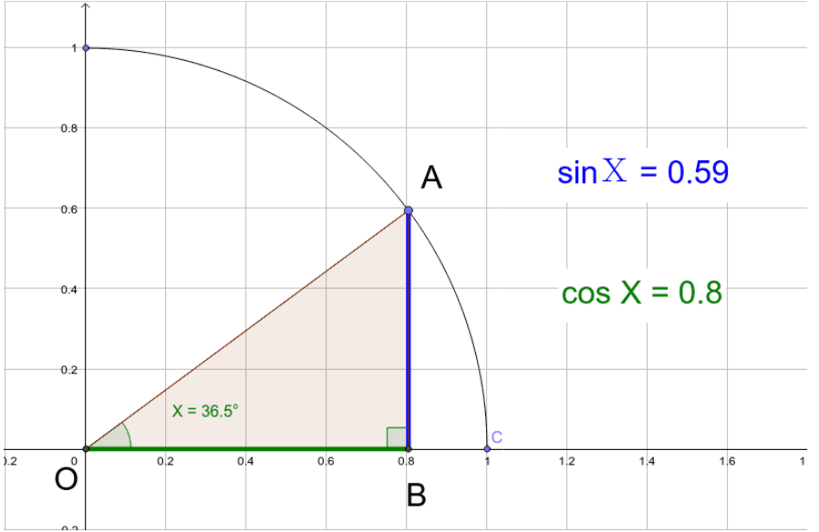
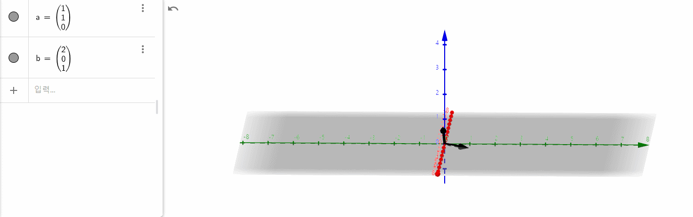

#  🤴 Deep Learning 이용 분야  - 추천 시스템

내 구글 아이디로 로그인 한 다음 유튜브에 들어가면  
내가 보고싶은 영상들을 너무 누르고 싶게 보여준다


단순하게 생각해볼 수 있다.

**아, 내가 지금까지 봤던 영상들을 기반으로 내가 보고싶어할 영상을 띄워주는구나.**

여기서

> 봤던 영상들을 기반으로

에서 딥러닝 기법이 사용될 수 있다. 

---

# 1. 추천시스템이란?

업계 내 용어를 빌리자면  

`user` 에게 `item` 을 제공하는 시스템.


우리는 `user` 의 정보와  `item` 의 정보를 가지고 있다

예를 들어 user 성민 이 있다고 한다면

> 성민 : 25살 / 남성 / 인천 / 학생 / 인디음악선호  

아무리 간단해도 나이, 성별, 지역 등 여러 개의 정보를 가질 수 있다.

item 'Star is Born' 이라는 영화가 있다고 한다면

> 'Star is Born' : 인기도 5 / 액션도 5 / 로맨스 8 / 음악 10 / 리뷰평점  4.5 /

등의 정보를 가질 수 있다.

이 user 와 item 의 정보를 수치화(vectorize) 시켜 유사도(similarity) 를 판단한 후  
유사도가 높은 것을 제공하는 것.

이것이 바로 추천시스템이다.

에? 너무 쉽지 않냐고? 이게 굳이 딥러닝이 필요하냐고?  
이건 정말정말 단순하게 말한거다.

우리는 2차원 평면 상에서 두 점 간의 거리를 구하는 방법을 알고 있다.  
쉽잖아. 

$x = (a_1,a_2)$ ,  $y = (b_1,b_2)$
일 때,

$\sqrt{(b_1-a_1)^2 +(b_2-b_1)^2}$

자 그렇다면 3차원은? 4차원은?
자 이래서 딥러닝이 필요한 것이다.


## 1-1. 유사도 Similarity 측정 방법

다양한 유사도 측정 방법이 존재한다.

1. 유클리드 거리 계산법
2. 자카드 유사도
3. 피어슨 상관계수 
4. 코사인 유사도 측정법

그 중 하나인 코사인 유사도 측정법을 간단히 설명해 본다.

코사인 유사도 측정법은 수학시간에 배운 코사인을 통해 
벡터 간 내적으로 두 점 간의 거리를 측정하는 방법이다.



두 점 간의 벡터값을 구한 뒤 

방향이 완전히 동일한 경우는 1,  
90도인 경우는 0.  
정반대 방향인 경우는 -1 인 점에서 착안해 

-1 에서 1 사이의 값을 구해 유사도를 나타낸다.

예를 들어

$ a=(1,1,1)$ $b=(2,0,1)$  
이라 할 때,

벡터간 내적을 통해 유사도를 구할 수 있다.

</img>




```python
import numpy as np
from numpy import dot
from numpy.linalg import norm

a = np.array([1, 1, 1])
b = np.array([2, 0, 1])

def cos_sim(A, B): #cos simmilarlity
    return dot(A, B)/(norm(A)*norm(B))

cos_sim(t1, t2)
```


    0.7745966692414834


이처럼 이 두 거리의 유사도는 0.77임을 보여준다

# 2. 추천시스템의 종류

추천시스템의 종류는 추천하는 방식으로 나눈다.

1. 콘텐츠 기반 필터링 ; Content Based Filtering
2. 협업 필터링 ; Collaborative Filtering
    1. 사용자기반
    2. 아이템기반
    3. 잠재요인 기반
 
3. Deep Learing 적용 방식

Content based Filtering 은 말 그대로  
그 내용 만의 유사성을 토대로 추천해준다.

아바타 를 봤다면 그와 비슷한 특징(감독, 배우, 스토리, 장르) 등을 고려해
아이언맨, 가디언즈 오브 갤럭시 등을 추천해주는 것이다.

Collaborative Filtering 은 사용자 과거 행동을 기반으로 추천하는 방식이다.  

사용자 기반 : " 당신과 비슷한 사람들은 이런 영상을 봅니다  "  
아이템 기반 : " 이 영상을 본 다른 사람들은 이 영상도 봤습니다 "
잠재요인 기반 : " 당신이 이 영상들을 이렇게 평가한걸 보니 이 영상은 높게 평가할 것 같습니다 "

잠재요인 기반은 행렬 인수분해 (Matrix Factorization) 를 통해 사용자가 평점을 매기는 요인(잠재요인)을 우리는 모르는 변수라고 가정하고 수치화(벡터화) 하여 새로운 영상들에 어떤 평점을 매길지 예측하는 방식이다.

이 다양한 수학연산 혹은 계산을 위해 다양한 파라미터를 설정해 계산을 도출할 수 있고,  
이 때 신경망게층 연산망, 즉, Deep Learning model 을 접목할 수 있다.

# 3. 실제 추천 시스템

Youtube 나 Netflix 는 추천에 아주 많은 것들을 고려한다.

사용자의 구매 여부뿐만 아니라
시청 시간, 웹사이트 체류 시간, 사이트 유입 경로, 시청과 구매까지 걸리는 시간 등 ..

좋은 추천 시스템을 만들기 위해서는  

어떤 데이터를 써야 할 지, 
데이터 간 우선도와 가중치는 어떻게 두어야 하는지 

평가와 수정을 반복해야 한다.
추천시스템에 머신러닝 딥러닝이 적용될 수도 있는 것이지 필수는 아니기 때문에  
굳이 추천시스템을 위해 머신러닝부터 배워나갈 필요는 없다.


```toc

```