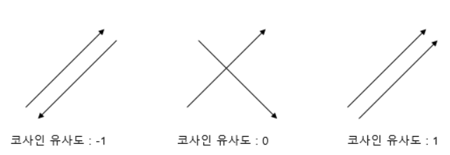
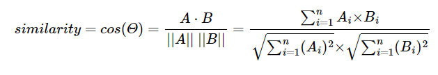
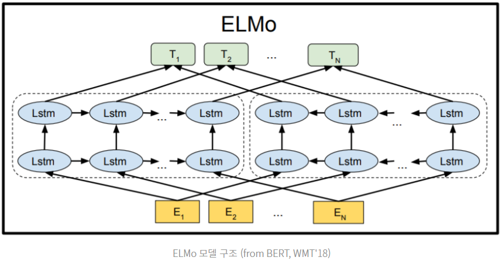

# 

우리는 많은 문장들 속에서 살아간다.  
한국어, 영어, 일본어, 중국어,, 영어 배워라 배워라 스트레스 받는것도 다  
언어가 존재하기 때문이다.

이렇게 일상에서 사용하는 언어를 **자연어(Natural Language)** 라고 부른다.  

반면에 우리가 쓰는 프로그래밍 언어는 **기계어 또는 인공어(Artificial Language)** 라고 부른다.

(엄연히 따지면 자연어 안에 인공어가 속한다)

프로그래밍 언어는 자연어보다 훨씬 명료하고 처리하기에 용이하여야 하므로  
자연어와 다르게 문맥과 상관없이 항상 동일한 의미를 가진다.

---

우리는 자연어를 처리해야 하기 때문에  
사람이 하는 방식대로는 즉, 문맥을 이해하는 방식으로는  
기계를 학습시키기가 어렵다.

때문에, 단어들을 숫자로 매핑해 표현하는 머신러닝 기법 을 사용한다.  
그렇다면 각 단어들의 의미를 기계들도 이해하고 연산할 수 있을 것이다.

[해당 블로그](http://w.elnn.kr/search/)에서는 그렇게 수치화된 단어들간의  
계산을 시도해 볼 수 있다.


이와 함께 단어를 어떻게 구분할 것인지(형태소? 단어?) 결정하는   
`Toknization` 기법을 사용한다.

## 1. 잡음이 많은 자연어

</img>

우리의 일상언어는 문맥이 있어야만 이해가 가능하다  
위는 내가 친구들과 게임 약속을 잡을 때 나눈 대화이다.

우선 어느정도의 오타가 존재하고, 주어 동사는 밥먹듯이 빼먹고 있다.  
디코는 음성채팅 어플리케이션인 Discord의 줄임말이다.  

이러한 변형들이 자연어처리 모델 입장에서는 Noise(잡음) 이 된다.  
따라서 우리가 모델을 학습시키기 위해선 이러한 잡음이 최대한 없는 데이터를 사용한다.

(예를 들어 소설책, 뉴스기사 등) 

### 잡음의 종류

1. 혼자서 두 세 번 전송하는 경우
2. 문장길이가 너무 짧거나 긴 경우
3. 문장 간격이 너무 긴 경우
4. 욕설 / 오타 가 많은 경우

너무나도 많지만, 우선 우리가 그나마 정제할 수 있는 노이즈만 뽑자면 다음과 같다.

1. 문장부호
2. 대소문자 (영어)
3. 특수문자

때문에 NLP 에서는 이렇게 정제할 수 있는 Noise 를 
preprocessing 하는 작업을 거친다.

## 2. Preprocessing


```python
# 1. 문장부호 구분

def pad_punctuation(sentence, punc):
    for p in punc:
        sentence = sentence.replace(p, " " + p + " ")

    return sentence

sentence = "안녕, 내 글 읽어줘서 땡큐."

print(pad_punctuation(sentence, [".", "?", "!", ","])) # , ? ! . 가 들어간 부분 양쪽에 띄어쓰기 처리
```

    안녕 ,  내 글 읽어줘서 땡큐 . 


문장부호를 제거하지 않는 이유는 쉼표나 마침표 또한 일정한 의미를 가지고 있다고 판단하기 때문이다.  


```python
# 2. 대소문자 처리

sentence = "First, open the first chapter."

print(sentence.lower())
```

    first, open the first chapter.


```python
# 3. 특수문자 제거

import re #단어 정규화 라이브러리

sentence = "He is a ten-year-old boy."
sentence = re.sub("([^a-zA-Z.,?!])", " ", sentence) #알파벳과 ! ? ,. 이 아닌 모든 문자는 공백으로 변환

print(sentence)
```

    He is a ten year old boy.


---

## 3. Embeddng

text를 정제했다면,  임베딩레이어 (`Embedding layer`)를 통해 단어의 분산 표현 (`Distributed represntation`) 을 구현한다.  
분산표현은 단어의 속성 차원(`dim`) 을 우리가 임의로 지정하고, 그 `dim` 에 맞게 추상적인 속성을 구분해 표현하는 것을 의미한다.

때문에 적절한 차원 수와 합당한 속성 값들이 들어간다면, 각 단어마다 적절한 의미의 유사도가 나타날 것이다.

의미의 유사도는 `코사인 유사도` 를 통해 나타낸다.

> 코사인 유사도 ( Cosine similarity )  
두 벡터 간의 코사인 각도를 이용해 구할 수 있는 두 벡터의 유사도, 다시 말 해 두 벡터(방향과 속도) 가 어느정도 유사한 지 찾는 계산

</img>

위의 그림처럼 동일한 속력 하에 방향이 반대면 -1, 90도면 0, 같은 방향이면 1 의 값을 가진다.  
코사인 유사도는 -1에서 1 사이의 값을 지닌다. 

A와 B 의 코사인 유사도 계산식은 다음과 같다.

</img>

---

이 때, `dim`설정 후 나온 속성 값들의 모음을 `단어 사전` 이라 칭하는데,  
이 단어사전을 제대로 작성하기 위해선 단어를 어떻게 쪼갤 것인지도 판단해야 한다.  

예를 들어보자

나는 드디어 그녀와 사귀기로 했다  

라는 말이 있을 때, 어떻게 분리해야 할까?

1. 나, 는, 드디어, 그녀, 와, 사귀기로, 했다. # 조사 나눔
2. 나는, 드디어, 그녀와, 사귀기로, 했다. #띄어쓰기 나눔
3. 나,는, 드디어, 그녀, 와, 사귀기,로, 했,다. #형태소별 나눔


문장을 나누었을 때 쪼개진 조각조각을 `Token` 이라 부른다.
이것을 결정하는 방식이 `Tokenization` 이다.

토큰화를 위한 여러가지 분석기들이 이미 개발되어 있다.

그 종류별 차이점을 [해당 블로그](https://iostream.tistory.com/144) 에서 잘 설명해주고 있다.

우리도 한 번 써보도록 하겠다.


```python
from konlpy.tag import Hannanum,Kkma,Komoran,Mecab,Okt

tokenizer_list = [Hannanum(),Kkma(),Komoran(),Mecab(),Okt()]

kor_text = '제 이름은 하성민입니다. 헬스 트레이닝과 NLP에 흥미가 있습니다. 세상의 우울을 해결하고 싶습니다.'

for tokenizer in tokenizer_list:
    print('[{}] \n{}'.format(tokenizer.__class__.__name__, tokenizer.pos(kor_text)))
```

    [Hannanum] 
    [('저', 'N'), ('의', 'J'), ('이름', 'N'), ('은', 'J'), ('하성민입니', 'N'), ('이', 'J'), ('다', 'E'), ('.', 'S'), ('헬스', 'N'), ('트레이닝', 'N'), ('과', 'J'), ('NLP', 'F'), ('에', 'J'), ('흥미', 'N'), ('가', 'J'), ('있', 'P'), ('습니다', 'E'), ('.', 'S'), ('세상', 'N'), ('의', 'J'), ('우울', 'N'), ('을', 'J'), ('해결', 'N'), ('하고', 'J'), ('싶', 'P'), ('습니다', 'E'), ('.', 'S')]
    [Kkma] 
    [('저', 'NP'), ('의', 'JKG'), ('이름', 'NNG'), ('은', 'JX'), ('하성', 'NNG'), ('민', 'NNG'), ('이', 'VCP'), ('ㅂ니다', 'EFN'), ('.', 'SF'), ('헬스', 'NNG'), ('트레이닝', 'NNG'), ('과', 'JC'), ('NLP', 'OL'), ('에', 'JKM'), ('흥미', 'NNG'), ('가', 'JKS'), ('있', 'VV'), ('습니다', 'EFN'), ('.', 'SF'), ('세상', 'NNG'), ('의', 'JKG'), ('우울', 'NNG'), ('을', 'JKO'), ('해결', 'NNG'), ('하', 'XSV'), ('고', 'ECE'), ('싶', 'VXA'), ('습니다', 'EFN'), ('.', 'SF')]
    [Komoran] 
    [('제', 'XPN'), ('이름', 'NNG'), ('은', 'JX'), ('하성민', 'NNP'), ('이', 'VCP'), ('ㅂ니다', 'EF'), ('.', 'SF'), ('헬스', 'NNG'), ('트레이닝', 'NNG'), ('과', 'JC'), ('NLP', 'SL'), ('에', 'JKB'), ('흥미', 'NNG'), ('가', 'JKS'), ('있', 'VX'), ('습니다', 'EF'), ('.', 'SF'), ('세상', 'NNG'), ('의', 'JKG'), ('우울', 'NNG'), ('을', 'JKO'), ('해결', 'NNG'), ('하', 'XSV'), ('고', 'EC'), ('싶', 'VX'), ('습니다', 'EF'), ('.', 'SF')]
    [Mecab] 
    [('제', 'NP+JKG'), ('이름', 'NNG'), ('은', 'JX'), ('하성민', 'NNP'), ('입니다', 'VCP+EF'), ('.', 'SF'), ('헬스', 'NNG'), ('트레이닝', 'NNG'), ('과', 'JC'), ('NLP', 'SL'), ('에', 'JKB'), ('흥미', 'NNG'), ('가', 'JKS'), ('있', 'VA'), ('습니다', 'EF'), ('.', 'SF'), ('세상', 'NNG'), ('의', 'JKG'), ('우울', 'NNG'), ('을', 'JKO'), ('해결', 'NNG'), ('하', 'XSV'), ('고', 'EC'), ('싶', 'VX'), ('습니다', 'EF'), ('.', 'SF')]
    [Okt] 
    [('제', 'Noun'), ('이름', 'Noun'), ('은', 'Josa'), ('하성민', 'Noun'), ('입니다', 'Adjective'), ('.', 'Punctuation'), ('헬스', 'Noun'), ('트레이닝', 'Noun'), ('과', 'Josa'), ('NLP', 'Alpha'), ('에', 'Josa'), ('흥미', 'Noun'), ('가', 'Josa'), ('있습니다', 'Adjective'), ('.', 'Punctuation'), ('세상', 'Noun'), ('의', 'Josa'), ('우울', 'Noun'), ('을', 'Josa'), ('해결', 'Noun'), ('하고', 'Josa'), ('싶습니다', 'Verb'), ('.', 'Punctuation')]


뒤에 따라오는 알파벳은 해당 글자가 명사인지, 고유명사인지, 형용사인지 구분해주는 기호이다. 

[해당 블로그](http://kkma.snu.ac.kr/documents/?doc=postag)에서 어떤 알파벳이 어떤 형태소를 나타내는지 표시해준다.  
이 기호 또한 분석기마다 조금의 차이는 있지만 거의 비슷하다.

내가 봤을 때는 Komoran 이 좀 정확한 것 같다.


### 이 외 Embedding 방법

1. BPE 
이처럼 Embedding layer 는 단어갯수 x 차원 수(n_dim) 의 가중치를 생성한다.

단어갯수가 많을수록 사용되는 메모리가 많다고 볼 수 있다.  
때문에 단어갯수를 줄여 저장하는 BPE (Byte Pair Encoding) 이나 그 응용 심화 단계인 WPM(Word Piece Model) 등이 사용되기도 한다.

WPM 은 현재 공개되어 있지는 않고, 구글의 SentencePiece 라이브러리를 통해 전처리까지 해주는 고성능의 BPE 를 이용할 수 있다.  
[SentencePiece](https://github.com/google/sentencepiece)

2. soynlp

한국어 전용 라이브러리 이다. 토크나이저 외 추출, 형태소분석, 전처리도 가능하다.  
특히 미등록단어(사전에 없는 신조어 등) 을 구분해낼 수 있는 능력을 갖추고 있다.  

예를 들어 `에스파` 라는 단어가 들어왔다면, 
에, 에스, 에스파 중 가장 쓰였을 확률이 높은 단어로 결정한다. 

---
## 4. 분산표현 임베딩의 학습종류

### 1. Word2Vec

한 문장 안에 있는 단어들끼리에는 유사성이 더 있다 라는 가정에서 시작한 방식이다.
`word2Vec` 은 CBOW(주변단어로 중간단어 예측) 학습방식과 Skip-gram(중간단어로 주변단어 예측) 학습방식이 존재한다.

### 2. Fasttext

하나의 어휘를 n-gram 으로 더 쪼개어 더 정확한 예측을 한다.

### 3. ELMo 

동음이의어를 구분하지 못하는 word2Vec 의 단점을 보완했다.
동음이의어를 구분하려면 그 주변의 문맥을 파악해야 하고, 이러한 특성이 반영된 임베딩을  

Contextualized Word Embedding 이라고 표현한다.

</img>

이러한 방식은 임베딩값이 주변 단어에 따라 가변적인 속성을 띠게 되어
배(boat, stomach) 가 쓰이는 맥락에 따라 다른 값을 표현한다.


---

## 5. 정리

NLP 에서 데이터 전처리와 토큰화는 큰 비중을 차지한다.

문장에 Noise 를 제거 `preprocessing` 하고,   
제거한 문장을 적절히 `Tokenize` 하고,   
분리한 Token 을 `word Embedding` 한다.  

Tokenize 과정에는 일반적으로 형태소 분석기를 사용한다.  
대표적으로는 koNLP, SentencePiece 라이브러리 등을 사용한다.

word Embdding 은 대표적으로 Word2Vec, FastText, ELMo 모델을 사용한다.

```toc

```


```python

```
