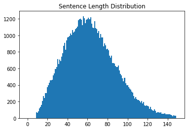
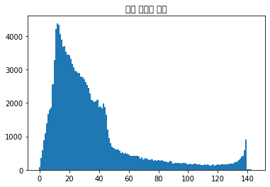
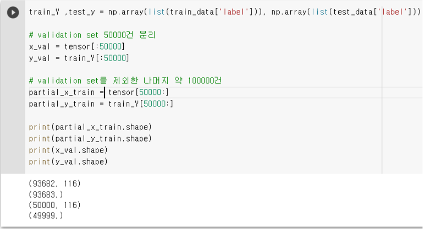
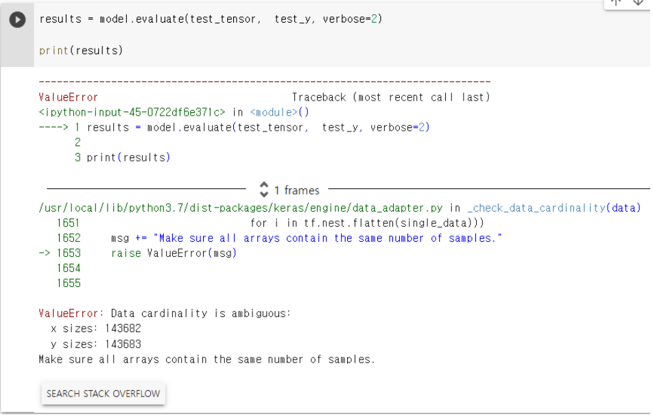

# 🙄 네이버 영화리뷰 감성분석에 SentencePiece 적용해보기</span>
<NLP기초>

## Contexts

### 1. READY
    1-1 오늘의 Exp와 Rubric  
    1-2 사용하는 라이브러리  

### 2. GAME
    2-1. 데이터 읽어오기  
    2-2. 데이터 전처리  
      -1. Tokenize (SentencePiece)
      -2. 학습데이터 전처리
      -3. Split Validation 

    2-3. 모델 학습  
    2-4. 데이터 평가   

### 3. POTG (best Play Of The Game
    3-1. 소감(POTG)  
    3-2. 어려웠던 점과 극복방안  
    3-3. 추후  

---


# 1. Ready
## 1-1. 오늘의 Exp와 Rubric


[SentencePiece](https://github.com/google/sentencepiece) 는 Google 에서 제공하고 있는 Tokenizer / Detokenizer 이다.  

Tokenize 란 NLP 에서 중요한 부분인 '단어사전 제작' 을 의미한다.

직관적으로 생각했을 때, 단어사전은 단어별, 형태소별, 혹은 그 사이 어떤 경계를 나누어 만들 수 있다.

Sentencepiece 는
BPE 와 unigram 이라는 두 가지의 분리 방법을 통해 subword tokenizing model 을 제공하고 있다.  

최근 pretrained model 은 대부분 SentencePiece 를 Tokenizer 로 설정하는 추세이기에 NLP 분야 tokenizer 의 표준이라고 표현해도 과언이 아니다.

오늘은 이러한 SentencePiece 를 끌어와 사용하는 것까지를 실습해보기로 한다.  

실습에 쓰이는 데이터는  
SentencePiece 토크나이저를 학습시킬 [한국어 corpus](https://github.com/jungyeul/korean-parallel-corpora) 와  
모델을 학습시킬  [Naver_Moive txt data](https://github.com/e9t/nsmc/blob/master/ratings_test.txt) 로 한다.

오늘의 rubric

|평가문항|상세기준|
|--|--|
|1. SentencePiece를 이용하여 모델을 만들기까지의 과정이 정상적으로 진행되었는가?|코퍼스 분석, 전처리, SentencePiece 적용, 토크나이저 구현 및 동작이 빠짐없이 진행되었는가?|
|2. SentencePiece를 통해 만든 Tokenizer가 자연어처리 모델과 결합하여 동작하는가?|SentencePiece 토크나이저가 적용된 Text Classifier 모델이 정상적으로 수렴하여 80% 이상의 test accuracy가 확인되었다.|
|3. SentencePiece의 성능을 다각도로 비교분석하였는가?|SentencePiece 토크나이저를 활용했을 때의 성능을 다른 토크나이저 혹은 SentencePiece의 다른 옵션의 경우와 비교하여 분석을 체계적으로 진행하였다.|

## 1-2. 사용하는 라이브러리


```python
! python3 --version
```

    Python 3.7.12


```python
#import konlpy 단순 import 는 에러 발생
```

시작 하기전 Konlpy 라이브러리에 특이사항이 있다.  
colab에서는 Konlpy 를 install 할때 별도의 과정을 거쳐야 한다.


```python
!apt-get update
!apt-get install g++ openjdk-8-jdk 
!pip3 install konlpy JPype1-py3
!bash <(curl -s https://raw.githubusercontent.com/konlpy/konlpy/master/scripts/mecab.sh)

import konlpy
```

    Get:1 https://cloud.r-project.org/bin/linux/ubuntu bionic-cran40/ InRelease [3,626 B]
    Ign:2 https://developer.download.nvidia.com/compute/cuda/repos/ubuntu1804/x86_64  InRelease
    Get:3 https://cloud.r-project.org/bin/linux/ubuntu bionic-cran40/ Packages [80.4 kB]
    Hit:4 http://archive.ubuntu.com/ubuntu bionic InRelease
    Ign:5 https://developer.download.nvidia.com/compute/machine-learning/repos/ubuntu1804/x86_64  InRelease
    Get:6 https://developer.download.nvidia.com/compute/cuda/repos/ubuntu1804/x86_64  Release [696 B]
    Get:7 http://ppa.launchpad.net/c2d4u.team/c2d4u4.0+/ubuntu bionic InRelease [15.9 kB]
    Get:8 http://security.ubuntu.com/ubuntu bionic-security InRelease [88.7 kB]
    Hit:9 https://developer.download.nvidia.com/compute/machine-learning/repos/ubuntu1804/x86_64  Release
    Get:10 https://developer.download.nvidia.com/compute/cuda/repos/ubuntu1804/x86_64  Release.gpg [836 B]
    Get:11 http://archive.ubuntu.com/ubuntu bionic-updates InRelease [88.7 kB]
    Get:13 https://developer.download.nvidia.com/compute/cuda/repos/ubuntu1804/x86_64  Packages [934 kB]
    Hit:14 http://ppa.launchpad.net/cran/libgit2/ubuntu bionic InRelease
    Get:15 http://archive.ubuntu.com/ubuntu bionic-backports InRelease [74.6 kB]
    Get:16 http://archive.ubuntu.com/ubuntu bionic-updates/main amd64 Packages [3,098 kB]
    Get:17 http://ppa.launchpad.net/deadsnakes/ppa/ubuntu bionic InRelease [15.9 kB]
    Get:18 http://security.ubuntu.com/ubuntu bionic-security/restricted amd64 Packages [860 kB]
    Hit:19 http://ppa.launchpad.net/graphics-drivers/ppa/ubuntu bionic InRelease
    Get:20 http://archive.ubuntu.com/ubuntu bionic-updates/multiverse amd64 Packages [29.9 kB]
    Get:21 http://archive.ubuntu.com/ubuntu bionic-updates/universe amd64 Packages [2,262 kB]
    Get:22 http://archive.ubuntu.com/ubuntu bionic-updates/restricted amd64 Packages [893 kB]
    Get:23 http://ppa.launchpad.net/c2d4u.team/c2d4u4.0+/ubuntu bionic/main Sources [1,829 kB]
    Get:24 http://security.ubuntu.com/ubuntu bionic-security/universe amd64 Packages [1,484 kB]
    Get:25 http://security.ubuntu.com/ubuntu bionic-security/main amd64 Packages [2,660 kB]
    Get:26 http://ppa.launchpad.net/c2d4u.team/c2d4u4.0+/ubuntu bionic/main amd64 Packages [937 kB]
    Get:27 http://ppa.launchpad.net/deadsnakes/ppa/ubuntu bionic/main amd64 Packages [45.2 kB]
    Fetched 15.4 MB in 7s (2,158 kB/s)
    Reading package lists... Done
    Reading package lists... Done
    Building dependency tree       
    Reading state information... Done
    g++ is already the newest version (4:7.4.0-1ubuntu2.3).
    g++ set to manually installed.
    The following additional packages will be installed:
      fonts-dejavu-core fonts-dejavu-extra libatk-wrapper-java
      libatk-wrapper-java-jni libgail-common libgail18 libgtk2.0-0 libgtk2.0-bin
      libgtk2.0-common libxxf86dga1 openjdk-8-jdk-headless openjdk-8-jre
      openjdk-8-jre-headless x11-utils
    Suggested packages:
      gvfs openjdk-8-demo openjdk-8-source visualvm icedtea-8-plugin libnss-mdns
      fonts-ipafont-gothic fonts-ipafont-mincho fonts-wqy-microhei
      fonts-wqy-zenhei fonts-indic mesa-utils
    The following NEW packages will be installed:
      fonts-dejavu-core fonts-dejavu-extra libatk-wrapper-java
      libatk-wrapper-java-jni libgail-common libgail18 libgtk2.0-0 libgtk2.0-bin
      libgtk2.0-common libxxf86dga1 openjdk-8-jdk openjdk-8-jdk-headless
      openjdk-8-jre openjdk-8-jre-headless x11-utils
    0 upgraded, 15 newly installed, 0 to remove and 69 not upgraded.
    Need to get 43.5 MB of archives.
    After this operation, 163 MB of additional disk space will be used.
    Get:1 http://archive.ubuntu.com/ubuntu bionic/main amd64 libxxf86dga1 amd64 2:1.1.4-1 [13.7 kB]
    Get:2 http://archive.ubuntu.com/ubuntu bionic/main amd64 fonts-dejavu-core all 2.37-1 [1,041 kB]
    Get:3 http://archive.ubuntu.com/ubuntu bionic/main amd64 fonts-dejavu-extra all 2.37-1 [1,953 kB]
    Get:4 http://archive.ubuntu.com/ubuntu bionic/main amd64 x11-utils amd64 7.7+3build1 [196 kB]
    Get:5 http://archive.ubuntu.com/ubuntu bionic/main amd64 libatk-wrapper-java all 0.33.3-20ubuntu0.1 [34.7 kB]
    Get:6 http://archive.ubuntu.com/ubuntu bionic/main amd64 libatk-wrapper-java-jni amd64 0.33.3-20ubuntu0.1 [28.3 kB]
    Get:7 http://archive.ubuntu.com/ubuntu bionic/main amd64 libgtk2.0-common all 2.24.32-1ubuntu1 [125 kB]
    Get:8 http://archive.ubuntu.com/ubuntu bionic/main amd64 libgtk2.0-0 amd64 2.24.32-1ubuntu1 [1,769 kB]
    Get:9 http://archive.ubuntu.com/ubuntu bionic/main amd64 libgail18 amd64 2.24.32-1ubuntu1 [14.2 kB]
    Get:10 http://archive.ubuntu.com/ubuntu bionic/main amd64 libgail-common amd64 2.24.32-1ubuntu1 [112 kB]
    Get:11 http://archive.ubuntu.com/ubuntu bionic/main amd64 libgtk2.0-bin amd64 2.24.32-1ubuntu1 [7,536 B]
    Get:12 http://archive.ubuntu.com/ubuntu bionic-updates/universe amd64 openjdk-8-jre-headless amd64 8u312-b07-0ubuntu1~18.04 [28.2 MB]
    Get:13 http://archive.ubuntu.com/ubuntu bionic-updates/universe amd64 openjdk-8-jre amd64 8u312-b07-0ubuntu1~18.04 [69.6 kB]
    Get:14 http://archive.ubuntu.com/ubuntu bionic-updates/universe amd64 openjdk-8-jdk-headless amd64 8u312-b07-0ubuntu1~18.04 [8,298 kB]
    Get:15 http://archive.ubuntu.com/ubuntu bionic-updates/universe amd64 openjdk-8-jdk amd64 8u312-b07-0ubuntu1~18.04 [1,625 kB]
    Fetched 43.5 MB in 4s (10.1 MB/s)
    Selecting previously unselected package libxxf86dga1:amd64.
    (Reading database ... 155335 files and directories currently installed.)
    Preparing to unpack .../00-libxxf86dga1_2%3a1.1.4-1_amd64.deb ...
    Unpacking libxxf86dga1:amd64 (2:1.1.4-1) ...
    Selecting previously unselected package fonts-dejavu-core.
    Preparing to unpack .../01-fonts-dejavu-core_2.37-1_all.deb ...
    Unpacking fonts-dejavu-core (2.37-1) ...
    Selecting previously unselected package fonts-dejavu-extra.
    Preparing to unpack .../02-fonts-dejavu-extra_2.37-1_all.deb ...
    Unpacking fonts-dejavu-extra (2.37-1) ...
    Selecting previously unselected package x11-utils.
    Preparing to unpack .../03-x11-utils_7.7+3build1_amd64.deb ...
    Unpacking x11-utils (7.7+3build1) ...
    Selecting previously unselected package libatk-wrapper-java.
    Preparing to unpack .../04-libatk-wrapper-java_0.33.3-20ubuntu0.1_all.deb ...
    Unpacking libatk-wrapper-java (0.33.3-20ubuntu0.1) ...
    Selecting previously unselected package libatk-wrapper-java-jni:amd64.
    Preparing to unpack .../05-libatk-wrapper-java-jni_0.33.3-20ubuntu0.1_amd64.deb ...
    Unpacking libatk-wrapper-java-jni:amd64 (0.33.3-20ubuntu0.1) ...
    Selecting previously unselected package libgtk2.0-common.
    Preparing to unpack .../06-libgtk2.0-common_2.24.32-1ubuntu1_all.deb ...
    Unpacking libgtk2.0-common (2.24.32-1ubuntu1) ...
    Selecting previously unselected package libgtk2.0-0:amd64.
    Preparing to unpack .../07-libgtk2.0-0_2.24.32-1ubuntu1_amd64.deb ...
    Unpacking libgtk2.0-0:amd64 (2.24.32-1ubuntu1) ...
    Selecting previously unselected package libgail18:amd64.
    Preparing to unpack .../08-libgail18_2.24.32-1ubuntu1_amd64.deb ...
    Unpacking libgail18:amd64 (2.24.32-1ubuntu1) ...
    Selecting previously unselected package libgail-common:amd64.
    Preparing to unpack .../09-libgail-common_2.24.32-1ubuntu1_amd64.deb ...
    Unpacking libgail-common:amd64 (2.24.32-1ubuntu1) ...
    Selecting previously unselected package libgtk2.0-bin.
    Preparing to unpack .../10-libgtk2.0-bin_2.24.32-1ubuntu1_amd64.deb ...
    Unpacking libgtk2.0-bin (2.24.32-1ubuntu1) ...
    Selecting previously unselected package openjdk-8-jre-headless:amd64.
    Preparing to unpack .../11-openjdk-8-jre-headless_8u312-b07-0ubuntu1~18.04_amd64.deb ...
    Unpacking openjdk-8-jre-headless:amd64 (8u312-b07-0ubuntu1~18.04) ...
    Selecting previously unselected package openjdk-8-jre:amd64.
    Preparing to unpack .../12-openjdk-8-jre_8u312-b07-0ubuntu1~18.04_amd64.deb ...
    Unpacking openjdk-8-jre:amd64 (8u312-b07-0ubuntu1~18.04) ...
    Selecting previously unselected package openjdk-8-jdk-headless:amd64.
    Preparing to unpack .../13-openjdk-8-jdk-headless_8u312-b07-0ubuntu1~18.04_amd64.deb ...
    Unpacking openjdk-8-jdk-headless:amd64 (8u312-b07-0ubuntu1~18.04) ...
    Selecting previously unselected package openjdk-8-jdk:amd64.
    Preparing to unpack .../14-openjdk-8-jdk_8u312-b07-0ubuntu1~18.04_amd64.deb ...
    Unpacking openjdk-8-jdk:amd64 (8u312-b07-0ubuntu1~18.04) ...
    Setting up libgtk2.0-common (2.24.32-1ubuntu1) ...
    Setting up fonts-dejavu-core (2.37-1) ...
    Setting up libxxf86dga1:amd64 (2:1.1.4-1) ...
    Setting up fonts-dejavu-extra (2.37-1) ...
    Setting up openjdk-8-jre-headless:amd64 (8u312-b07-0ubuntu1~18.04) ...
    update-alternatives: using /usr/lib/jvm/java-8-openjdk-amd64/jre/bin/orbd to provide /usr/bin/orbd (orbd) in auto mode
    update-alternatives: using /usr/lib/jvm/java-8-openjdk-amd64/jre/bin/servertool to provide /usr/bin/servertool (servertool) in auto mode
    update-alternatives: using /usr/lib/jvm/java-8-openjdk-amd64/jre/bin/tnameserv to provide /usr/bin/tnameserv (tnameserv) in auto mode
    Setting up libgtk2.0-0:amd64 (2.24.32-1ubuntu1) ...
    Setting up libgail18:amd64 (2.24.32-1ubuntu1) ...
    Setting up openjdk-8-jdk-headless:amd64 (8u312-b07-0ubuntu1~18.04) ...
    update-alternatives: using /usr/lib/jvm/java-8-openjdk-amd64/bin/idlj to provide /usr/bin/idlj (idlj) in auto mode
    update-alternatives: using /usr/lib/jvm/java-8-openjdk-amd64/bin/wsimport to provide /usr/bin/wsimport (wsimport) in auto mode
    update-alternatives: using /usr/lib/jvm/java-8-openjdk-amd64/bin/jsadebugd to provide /usr/bin/jsadebugd (jsadebugd) in auto mode
    update-alternatives: using /usr/lib/jvm/java-8-openjdk-amd64/bin/native2ascii to provide /usr/bin/native2ascii (native2ascii) in auto mode
    update-alternatives: using /usr/lib/jvm/java-8-openjdk-amd64/bin/javah to provide /usr/bin/javah (javah) in auto mode
    update-alternatives: using /usr/lib/jvm/java-8-openjdk-amd64/bin/hsdb to provide /usr/bin/hsdb (hsdb) in auto mode
    update-alternatives: using /usr/lib/jvm/java-8-openjdk-amd64/bin/clhsdb to provide /usr/bin/clhsdb (clhsdb) in auto mode
    update-alternatives: using /usr/lib/jvm/java-8-openjdk-amd64/bin/xjc to provide /usr/bin/xjc (xjc) in auto mode
    update-alternatives: using /usr/lib/jvm/java-8-openjdk-amd64/bin/schemagen to provide /usr/bin/schemagen (schemagen) in auto mode
    update-alternatives: using /usr/lib/jvm/java-8-openjdk-amd64/bin/extcheck to provide /usr/bin/extcheck (extcheck) in auto mode
    update-alternatives: using /usr/lib/jvm/java-8-openjdk-amd64/bin/jhat to provide /usr/bin/jhat (jhat) in auto mode
    update-alternatives: using /usr/lib/jvm/java-8-openjdk-amd64/bin/wsgen to provide /usr/bin/wsgen (wsgen) in auto mode
    Setting up x11-utils (7.7+3build1) ...
    Setting up libgail-common:amd64 (2.24.32-1ubuntu1) ...
    Setting up libatk-wrapper-java (0.33.3-20ubuntu0.1) ...
    Setting up libgtk2.0-bin (2.24.32-1ubuntu1) ...
    Setting up libatk-wrapper-java-jni:amd64 (0.33.3-20ubuntu0.1) ...
    Setting up openjdk-8-jre:amd64 (8u312-b07-0ubuntu1~18.04) ...
    update-alternatives: using /usr/lib/jvm/java-8-openjdk-amd64/jre/bin/policytool to provide /usr/bin/policytool (policytool) in auto mode
    Setting up openjdk-8-jdk:amd64 (8u312-b07-0ubuntu1~18.04) ...
    update-alternatives: using /usr/lib/jvm/java-8-openjdk-amd64/bin/appletviewer to provide /usr/bin/appletviewer (appletviewer) in auto mode
    update-alternatives: using /usr/lib/jvm/java-8-openjdk-amd64/bin/jconsole to provide /usr/bin/jconsole (jconsole) in auto mode
    Processing triggers for man-db (2.8.3-2ubuntu0.1) ...
    Processing triggers for hicolor-icon-theme (0.17-2) ...
    Processing triggers for fontconfig (2.12.6-0ubuntu2) ...
    Processing triggers for mime-support (3.60ubuntu1) ...
    Processing triggers for libc-bin (2.27-3ubuntu1.3) ...
    /sbin/ldconfig.real: /usr/local/lib/python3.7/dist-packages/ideep4py/lib/libmkldnn.so.0 is not a symbolic link
    
    Collecting konlpy
      Downloading konlpy-0.6.0-py2.py3-none-any.whl (19.4 MB)
         |████████████████████████████████| 19.4 MB 516 kB/s 
    [?25hCollecting JPype1-py3
      Downloading JPype1-py3-0.5.5.4.tar.gz (88 kB)
         |████████████████████████████████| 88 kB 7.6 MB/s 
    [?25hRequirement already satisfied: lxml>=4.1.0 in /usr/local/lib/python3.7/dist-packages (from konlpy) (4.2.6)
    Collecting JPype1>=0.7.0
      Downloading JPype1-1.3.0-cp37-cp37m-manylinux_2_5_x86_64.manylinux1_x86_64.whl (448 kB)
         |████████████████████████████████| 448 kB 53.3 MB/s 
    [?25hRequirement already satisfied: numpy>=1.6 in /usr/local/lib/python3.7/dist-packages (from konlpy) (1.21.5)
    Requirement already satisfied: typing-extensions in /usr/local/lib/python3.7/dist-packages (from JPype1>=0.7.0->konlpy) (3.10.0.2)
    Building wheels for collected packages: JPype1-py3
      Building wheel for JPype1-py3 (setup.py) ... [?25l[?25hdone
      Created wheel for JPype1-py3: filename=JPype1_py3-0.5.5.4-cp37-cp37m-linux_x86_64.whl size=2679864 sha256=06f1d436f3b329b086bc2b1f59e365e9853f59f6d0a60a7c75c2fd742e3ad1b8
      Stored in directory: /root/.cache/pip/wheels/e7/d1/09/f55dca0203b0691945bdf0f63d486a0b4d4e5ec4bd78a2502e
    Successfully built JPype1-py3
    Installing collected packages: JPype1, konlpy, JPype1-py3
    Successfully installed JPype1-1.3.0 JPype1-py3-0.5.5.4 konlpy-0.6.0
    Installing automake (A dependency for mecab-ko)
    Hit:1 https://cloud.r-project.org/bin/linux/ubuntu bionic-cran40/ InRelease
    Ign:2 https://developer.download.nvidia.com/compute/cuda/repos/ubuntu1804/x86_64  InRelease
    Ign:3 https://developer.download.nvidia.com/compute/machine-learning/repos/ubuntu1804/x86_64  InRelease
    Hit:4 https://developer.download.nvidia.com/compute/cuda/repos/ubuntu1804/x86_64  Release
    Hit:5 https://developer.download.nvidia.com/compute/machine-learning/repos/ubuntu1804/x86_64  Release
    Hit:6 http://security.ubuntu.com/ubuntu bionic-security InRelease
    Hit:7 http://ppa.launchpad.net/c2d4u.team/c2d4u4.0+/ubuntu bionic InRelease
    Hit:10 http://archive.ubuntu.com/ubuntu bionic InRelease
    Hit:11 http://archive.ubuntu.com/ubuntu bionic-updates InRelease
    Hit:12 http://ppa.launchpad.net/cran/libgit2/ubuntu bionic InRelease
    Hit:13 http://archive.ubuntu.com/ubuntu bionic-backports InRelease
    Hit:14 http://ppa.launchpad.net/deadsnakes/ppa/ubuntu bionic InRelease
    Hit:15 http://ppa.launchpad.net/graphics-drivers/ppa/ubuntu bionic InRelease
    Reading package lists... Done
    Reading package lists... Done
    Building dependency tree       
    Reading state information... Done
    The following additional packages will be installed:
      autoconf autotools-dev libsigsegv2 m4
    Suggested packages:
      autoconf-archive gnu-standards autoconf-doc libtool gettext m4-doc
    The following NEW packages will be installed:
      autoconf automake autotools-dev libsigsegv2 m4
    0 upgraded, 5 newly installed, 0 to remove and 69 not upgraded.
    Need to get 1,082 kB of archives.
    After this operation, 3,994 kB of additional disk space will be used.
    Get:1 http://archive.ubuntu.com/ubuntu bionic/main amd64 libsigsegv2 amd64 2.12-1 [14.7 kB]
    Get:2 http://archive.ubuntu.com/ubuntu bionic/main amd64 m4 amd64 1.4.18-1 [197 kB]
    Get:3 http://archive.ubuntu.com/ubuntu bionic/main amd64 autoconf all 2.69-11 [322 kB]
    Get:4 http://archive.ubuntu.com/ubuntu bionic/main amd64 autotools-dev all 20180224.1 [39.6 kB]
    Get:5 http://archive.ubuntu.com/ubuntu bionic/main amd64 automake all 1:1.15.1-3ubuntu2 [509 kB]
    Fetched 1,082 kB in 2s (500 kB/s)
    debconf: unable to initialize frontend: Dialog
    debconf: (No usable dialog-like program is installed, so the dialog based frontend cannot be used. at /usr/share/perl5/Debconf/FrontEnd/Dialog.pm line 76, <> line 5.)
    debconf: falling back to frontend: Readline
    debconf: unable to initialize frontend: Readline
    debconf: (This frontend requires a controlling tty.)
    debconf: falling back to frontend: Teletype
    dpkg-preconfigure: unable to re-open stdin: 
    Selecting previously unselected package libsigsegv2:amd64.
    (Reading database ... 155911 files and directories currently installed.)
    Preparing to unpack .../libsigsegv2_2.12-1_amd64.deb ...
    Unpacking libsigsegv2:amd64 (2.12-1) ...
    Selecting previously unselected package m4.
    Preparing to unpack .../archives/m4_1.4.18-1_amd64.deb ...
    Unpacking m4 (1.4.18-1) ...
    Selecting previously unselected package autoconf.
    Preparing to unpack .../autoconf_2.69-11_all.deb ...
    Unpacking autoconf (2.69-11) ...
    Selecting previously unselected package autotools-dev.
    Preparing to unpack .../autotools-dev_20180224.1_all.deb ...
    Unpacking autotools-dev (20180224.1) ...
    Selecting previously unselected package automake.
    Preparing to unpack .../automake_1%3a1.15.1-3ubuntu2_all.deb ...
    Unpacking automake (1:1.15.1-3ubuntu2) ...
    Setting up libsigsegv2:amd64 (2.12-1) ...
    Setting up m4 (1.4.18-1) ...
    Setting up autotools-dev (20180224.1) ...
    Setting up autoconf (2.69-11) ...
    Setting up automake (1:1.15.1-3ubuntu2) ...
    update-alternatives: using /usr/bin/automake-1.15 to provide /usr/bin/automake (automake) in auto mode
    Processing triggers for libc-bin (2.27-3ubuntu1.3) ...
    /sbin/ldconfig.real: /usr/local/lib/python3.7/dist-packages/ideep4py/lib/libmkldnn.so.0 is not a symbolic link
    
    Processing triggers for man-db (2.8.3-2ubuntu0.1) ...
    Install mecab-ko
      % Total    % Received % Xferd  Average Speed   Time    Time     Time  Current
                                     Dload  Upload   Total   Spent    Left  Speed
      0     0    0     0    0     0      0      0 --:--:-- --:--:-- --:--:--     0
    100 1381k  100 1381k    0     0   496k      0  0:00:02  0:00:02 --:--:-- 1243k
    mecab-0.996-ko-0.9.2/
    mecab-0.996-ko-0.9.2/example/
    mecab-0.996-ko-0.9.2/example/example.cpp
    mecab-0.996-ko-0.9.2/example/example_lattice.cpp
    mecab-0.996-ko-0.9.2/example/example_lattice.c
    mecab-0.996-ko-0.9.2/example/example.c
    mecab-0.996-ko-0.9.2/example/thread_test.cpp
    mecab-0.996-ko-0.9.2/mecab-config.in
    mecab-0.996-ko-0.9.2/man/
    mecab-0.996-ko-0.9.2/man/Makefile.am
    mecab-0.996-ko-0.9.2/man/mecab.1
    mecab-0.996-ko-0.9.2/man/Makefile.in
    mecab-0.996-ko-0.9.2/mecab.iss.in
    mecab-0.996-ko-0.9.2/config.guess
    mecab-0.996-ko-0.9.2/README
    mecab-0.996-ko-0.9.2/COPYING
    mecab-0.996-ko-0.9.2/CHANGES.md
    mecab-0.996-ko-0.9.2/README.md
    mecab-0.996-ko-0.9.2/INSTALL
    mecab-0.996-ko-0.9.2/config.sub
    mecab-0.996-ko-0.9.2/configure.in
    mecab-0.996-ko-0.9.2/swig/
    mecab-0.996-ko-0.9.2/swig/Makefile
    mecab-0.996-ko-0.9.2/swig/version.h.in
    mecab-0.996-ko-0.9.2/swig/version.h
    mecab-0.996-ko-0.9.2/swig/MeCab.i
    mecab-0.996-ko-0.9.2/aclocal.m4
    mecab-0.996-ko-0.9.2/LGPL
    mecab-0.996-ko-0.9.2/Makefile.am
    mecab-0.996-ko-0.9.2/configure
    mecab-0.996-ko-0.9.2/tests/
    mecab-0.996-ko-0.9.2/tests/autolink/
    mecab-0.996-ko-0.9.2/tests/autolink/unk.def
    mecab-0.996-ko-0.9.2/tests/autolink/dicrc
    mecab-0.996-ko-0.9.2/tests/autolink/dic.csv
    mecab-0.996-ko-0.9.2/tests/autolink/test
    mecab-0.996-ko-0.9.2/tests/autolink/char.def
    mecab-0.996-ko-0.9.2/tests/autolink/matrix.def
    mecab-0.996-ko-0.9.2/tests/autolink/test.gld
    mecab-0.996-ko-0.9.2/tests/t9/
    mecab-0.996-ko-0.9.2/tests/t9/unk.def
    mecab-0.996-ko-0.9.2/tests/t9/ipadic.pl
    mecab-0.996-ko-0.9.2/tests/t9/dicrc
    mecab-0.996-ko-0.9.2/tests/t9/dic.csv
    mecab-0.996-ko-0.9.2/tests/t9/test
    mecab-0.996-ko-0.9.2/tests/t9/char.def
    mecab-0.996-ko-0.9.2/tests/t9/matrix.def
    mecab-0.996-ko-0.9.2/tests/t9/mkdic.pl
    mecab-0.996-ko-0.9.2/tests/t9/test.gld
    mecab-0.996-ko-0.9.2/tests/cost-train/
    mecab-0.996-ko-0.9.2/tests/cost-train/ipa.train
    mecab-0.996-ko-0.9.2/tests/cost-train/ipa.test
    mecab-0.996-ko-0.9.2/tests/cost-train/seed/
    mecab-0.996-ko-0.9.2/tests/cost-train/seed/rewrite.def
    mecab-0.996-ko-0.9.2/tests/cost-train/seed/feature.def
    mecab-0.996-ko-0.9.2/tests/cost-train/seed/unk.def
    mecab-0.996-ko-0.9.2/tests/cost-train/seed/dicrc
    mecab-0.996-ko-0.9.2/tests/cost-train/seed/dic.csv
    mecab-0.996-ko-0.9.2/tests/cost-train/seed/char.def
    mecab-0.996-ko-0.9.2/tests/cost-train/seed/matrix.def
    mecab-0.996-ko-0.9.2/tests/run-eval.sh
    mecab-0.996-ko-0.9.2/tests/run-cost-train.sh
    mecab-0.996-ko-0.9.2/tests/Makefile.am
    mecab-0.996-ko-0.9.2/tests/katakana/
    mecab-0.996-ko-0.9.2/tests/katakana/unk.def
    mecab-0.996-ko-0.9.2/tests/katakana/dicrc
    mecab-0.996-ko-0.9.2/tests/katakana/dic.csv
    mecab-0.996-ko-0.9.2/tests/katakana/test
    mecab-0.996-ko-0.9.2/tests/katakana/char.def
    mecab-0.996-ko-0.9.2/tests/katakana/matrix.def
    mecab-0.996-ko-0.9.2/tests/katakana/test.gld
    mecab-0.996-ko-0.9.2/tests/eval/
    mecab-0.996-ko-0.9.2/tests/eval/answer
    mecab-0.996-ko-0.9.2/tests/eval/system
    mecab-0.996-ko-0.9.2/tests/eval/test.gld
    mecab-0.996-ko-0.9.2/tests/shiin/
    mecab-0.996-ko-0.9.2/tests/shiin/unk.def
    mecab-0.996-ko-0.9.2/tests/shiin/dicrc
    mecab-0.996-ko-0.9.2/tests/shiin/dic.csv
    mecab-0.996-ko-0.9.2/tests/shiin/test
    mecab-0.996-ko-0.9.2/tests/shiin/char.def
    mecab-0.996-ko-0.9.2/tests/shiin/matrix.def
    mecab-0.996-ko-0.9.2/tests/shiin/mkdic.pl
    mecab-0.996-ko-0.9.2/tests/shiin/test.gld
    mecab-0.996-ko-0.9.2/tests/latin/
    mecab-0.996-ko-0.9.2/tests/latin/unk.def
    mecab-0.996-ko-0.9.2/tests/latin/dicrc
    mecab-0.996-ko-0.9.2/tests/latin/dic.csv
    mecab-0.996-ko-0.9.2/tests/latin/test
    mecab-0.996-ko-0.9.2/tests/latin/char.def
    mecab-0.996-ko-0.9.2/tests/latin/matrix.def
    mecab-0.996-ko-0.9.2/tests/latin/test.gld
    mecab-0.996-ko-0.9.2/tests/chartype/
    mecab-0.996-ko-0.9.2/tests/chartype/unk.def
    mecab-0.996-ko-0.9.2/tests/chartype/dicrc
    mecab-0.996-ko-0.9.2/tests/chartype/dic.csv
    mecab-0.996-ko-0.9.2/tests/chartype/test
    mecab-0.996-ko-0.9.2/tests/chartype/char.def
    mecab-0.996-ko-0.9.2/tests/chartype/matrix.def
    mecab-0.996-ko-0.9.2/tests/chartype/test.gld
    mecab-0.996-ko-0.9.2/tests/run-dics.sh
    mecab-0.996-ko-0.9.2/tests/ngram/
    mecab-0.996-ko-0.9.2/tests/ngram/unk.def
    mecab-0.996-ko-0.9.2/tests/ngram/dicrc
    mecab-0.996-ko-0.9.2/tests/ngram/dic.csv
    mecab-0.996-ko-0.9.2/tests/ngram/test
    mecab-0.996-ko-0.9.2/tests/ngram/char.def
    mecab-0.996-ko-0.9.2/tests/ngram/matrix.def
    mecab-0.996-ko-0.9.2/tests/ngram/test.gld
    mecab-0.996-ko-0.9.2/tests/Makefile.in
    mecab-0.996-ko-0.9.2/ltmain.sh
    mecab-0.996-ko-0.9.2/config.rpath
    mecab-0.996-ko-0.9.2/config.h.in
    mecab-0.996-ko-0.9.2/mecabrc.in
    mecab-0.996-ko-0.9.2/GPL
    mecab-0.996-ko-0.9.2/Makefile.train
    mecab-0.996-ko-0.9.2/ChangeLog
    mecab-0.996-ko-0.9.2/install-sh
    mecab-0.996-ko-0.9.2/AUTHORS
    mecab-0.996-ko-0.9.2/doc/
    mecab-0.996-ko-0.9.2/doc/bindings.html
    mecab-0.996-ko-0.9.2/doc/posid.html
    mecab-0.996-ko-0.9.2/doc/unk.html
    mecab-0.996-ko-0.9.2/doc/learn.html
    mecab-0.996-ko-0.9.2/doc/format.html
    mecab-0.996-ko-0.9.2/doc/libmecab.html
    mecab-0.996-ko-0.9.2/doc/mecab.css
    mecab-0.996-ko-0.9.2/doc/feature.html
    mecab-0.996-ko-0.9.2/doc/Makefile.am
    mecab-0.996-ko-0.9.2/doc/soft.html
    mecab-0.996-ko-0.9.2/doc/en/
    mecab-0.996-ko-0.9.2/doc/en/bindings.html
    mecab-0.996-ko-0.9.2/doc/dic-detail.html
    mecab-0.996-ko-0.9.2/doc/flow.png
    mecab-0.996-ko-0.9.2/doc/mecab.html
    mecab-0.996-ko-0.9.2/doc/index.html
    mecab-0.996-ko-0.9.2/doc/result.png
    mecab-0.996-ko-0.9.2/doc/doxygen/
    mecab-0.996-ko-0.9.2/doc/doxygen/tab_a.png
    mecab-0.996-ko-0.9.2/doc/doxygen/globals_eval.html
    mecab-0.996-ko-0.9.2/doc/doxygen/classMeCab_1_1Tagger-members.html
    mecab-0.996-ko-0.9.2/doc/doxygen/functions_vars.html
    mecab-0.996-ko-0.9.2/doc/doxygen/doxygen.css
    mecab-0.996-ko-0.9.2/doc/doxygen/tab_r.gif
    mecab-0.996-ko-0.9.2/doc/doxygen/classMeCab_1_1Lattice.html
    mecab-0.996-ko-0.9.2/doc/doxygen/functions.html
    mecab-0.996-ko-0.9.2/doc/doxygen/classMeCab_1_1Tagger.html
    mecab-0.996-ko-0.9.2/doc/doxygen/mecab_8h_source.html
    mecab-0.996-ko-0.9.2/doc/doxygen/tabs.css
    mecab-0.996-ko-0.9.2/doc/doxygen/nav_f.png
    mecab-0.996-ko-0.9.2/doc/doxygen/tab_b.png
    mecab-0.996-ko-0.9.2/doc/doxygen/globals.html
    mecab-0.996-ko-0.9.2/doc/doxygen/nav_h.png
    mecab-0.996-ko-0.9.2/doc/doxygen/tab_h.png
    mecab-0.996-ko-0.9.2/doc/doxygen/classMeCab_1_1Model.html
    mecab-0.996-ko-0.9.2/doc/doxygen/globals_func.html
    mecab-0.996-ko-0.9.2/doc/doxygen/closed.png
    mecab-0.996-ko-0.9.2/doc/doxygen/tab_l.gif
    mecab-0.996-ko-0.9.2/doc/doxygen/structmecab__path__t-members.html
    mecab-0.996-ko-0.9.2/doc/doxygen/functions_func.html
    mecab-0.996-ko-0.9.2/doc/doxygen/globals_type.html
    mecab-0.996-ko-0.9.2/doc/doxygen/classMeCab_1_1Lattice-members.html
    mecab-0.996-ko-0.9.2/doc/doxygen/structmecab__node__t.html
    mecab-0.996-ko-0.9.2/doc/doxygen/namespacemembers_func.html
    mecab-0.996-ko-0.9.2/doc/doxygen/tab_s.png
    mecab-0.996-ko-0.9.2/doc/doxygen/structmecab__dictionary__info__t-members.html
    mecab-0.996-ko-0.9.2/doc/doxygen/namespacemembers_type.html
    mecab-0.996-ko-0.9.2/doc/doxygen/classMeCab_1_1Model-members.html
    mecab-0.996-ko-0.9.2/doc/doxygen/structmecab__dictionary__info__t.html
    mecab-0.996-ko-0.9.2/doc/doxygen/namespaces.html
    mecab-0.996-ko-0.9.2/doc/doxygen/namespacemembers.html
    mecab-0.996-ko-0.9.2/doc/doxygen/namespaceMeCab.html
    mecab-0.996-ko-0.9.2/doc/doxygen/structmecab__path__t.html
    mecab-0.996-ko-0.9.2/doc/doxygen/files.html
    mecab-0.996-ko-0.9.2/doc/doxygen/structmecab__node__t-members.html
    mecab-0.996-ko-0.9.2/doc/doxygen/index.html
    mecab-0.996-ko-0.9.2/doc/doxygen/annotated.html
    mecab-0.996-ko-0.9.2/doc/doxygen/globals_defs.html
    mecab-0.996-ko-0.9.2/doc/doxygen/classes.html
    mecab-0.996-ko-0.9.2/doc/doxygen/mecab_8h-source.html
    mecab-0.996-ko-0.9.2/doc/doxygen/doxygen.png
    mecab-0.996-ko-0.9.2/doc/doxygen/tab_b.gif
    mecab-0.996-ko-0.9.2/doc/doxygen/bc_s.png
    mecab-0.996-ko-0.9.2/doc/doxygen/open.png
    mecab-0.996-ko-0.9.2/doc/doxygen/mecab_8h.html
    mecab-0.996-ko-0.9.2/doc/dic.html
    mecab-0.996-ko-0.9.2/doc/partial.html
    mecab-0.996-ko-0.9.2/doc/feature.png
    mecab-0.996-ko-0.9.2/doc/Makefile.in
    mecab-0.996-ko-0.9.2/missing
    mecab-0.996-ko-0.9.2/BSD
    mecab-0.996-ko-0.9.2/NEWS
    mecab-0.996-ko-0.9.2/mkinstalldirs
    mecab-0.996-ko-0.9.2/src/
    mecab-0.996-ko-0.9.2/src/dictionary.h
    mecab-0.996-ko-0.9.2/src/writer.h
    mecab-0.996-ko-0.9.2/src/utils.h
    mecab-0.996-ko-0.9.2/src/string_buffer.cpp
    mecab-0.996-ko-0.9.2/src/tokenizer.cpp
    mecab-0.996-ko-0.9.2/src/make.bat
    mecab-0.996-ko-0.9.2/src/mecab.h
    mecab-0.996-ko-0.9.2/src/freelist.h
    mecab-0.996-ko-0.9.2/src/string_buffer.h
    mecab-0.996-ko-0.9.2/src/learner_tagger.h
    mecab-0.996-ko-0.9.2/src/dictionary_compiler.cpp
    mecab-0.996-ko-0.9.2/src/eval.cpp
    mecab-0.996-ko-0.9.2/src/mecab-system-eval.cpp
    mecab-0.996-ko-0.9.2/src/darts.h
    mecab-0.996-ko-0.9.2/src/param.h
    mecab-0.996-ko-0.9.2/src/char_property.h
    mecab-0.996-ko-0.9.2/src/learner_node.h
    mecab-0.996-ko-0.9.2/src/mecab-dict-gen.cpp
    mecab-0.996-ko-0.9.2/src/mecab-dict-index.cpp
    mecab-0.996-ko-0.9.2/src/winmain.h
    mecab-0.996-ko-0.9.2/src/thread.h
    mecab-0.996-ko-0.9.2/src/context_id.cpp
    mecab-0.996-ko-0.9.2/src/Makefile.am
    mecab-0.996-ko-0.9.2/src/connector.h
    mecab-0.996-ko-0.9.2/src/common.h
    mecab-0.996-ko-0.9.2/src/dictionary_rewriter.cpp
    mecab-0.996-ko-0.9.2/src/Makefile.msvc.in
    mecab-0.996-ko-0.9.2/src/dictionary_rewriter.h
    mecab-0.996-ko-0.9.2/src/feature_index.h
    mecab-0.996-ko-0.9.2/src/iconv_utils.cpp
    mecab-0.996-ko-0.9.2/src/char_property.cpp
    mecab-0.996-ko-0.9.2/src/mecab-test-gen.cpp
    mecab-0.996-ko-0.9.2/src/tagger.cpp
    mecab-0.996-ko-0.9.2/src/mecab-cost-train.cpp
    mecab-0.996-ko-0.9.2/src/learner.cpp
    mecab-0.996-ko-0.9.2/src/dictionary.cpp
    mecab-0.996-ko-0.9.2/src/lbfgs.cpp
    mecab-0.996-ko-0.9.2/src/ucs.h
    mecab-0.996-ko-0.9.2/src/writer.cpp
    mecab-0.996-ko-0.9.2/src/learner_tagger.cpp
    mecab-0.996-ko-0.9.2/src/lbfgs.h
    mecab-0.996-ko-0.9.2/src/libmecab.cpp
    mecab-0.996-ko-0.9.2/src/tokenizer.h
    mecab-0.996-ko-0.9.2/src/mecab.cpp
    mecab-0.996-ko-0.9.2/src/utils.cpp
    mecab-0.996-ko-0.9.2/src/dictionary_generator.cpp
    mecab-0.996-ko-0.9.2/src/param.cpp
    mecab-0.996-ko-0.9.2/src/context_id.h
    mecab-0.996-ko-0.9.2/src/mmap.h
    mecab-0.996-ko-0.9.2/src/viterbi.h
    mecab-0.996-ko-0.9.2/src/viterbi.cpp
    mecab-0.996-ko-0.9.2/src/stream_wrapper.h
    mecab-0.996-ko-0.9.2/src/feature_index.cpp
    mecab-0.996-ko-0.9.2/src/nbest_generator.h
    mecab-0.996-ko-0.9.2/src/ucstable.h
    mecab-0.996-ko-0.9.2/src/nbest_generator.cpp
    mecab-0.996-ko-0.9.2/src/iconv_utils.h
    mecab-0.996-ko-0.9.2/src/connector.cpp
    mecab-0.996-ko-0.9.2/src/Makefile.in
    mecab-0.996-ko-0.9.2/src/scoped_ptr.h
    mecab-0.996-ko-0.9.2/Makefile.in
    checking for a BSD-compatible install... /usr/bin/install -c
    checking whether build environment is sane... yes
    checking for a thread-safe mkdir -p... /bin/mkdir -p
    checking for gawk... no
    checking for mawk... mawk
    checking whether make sets $(MAKE)... yes
    checking for gcc... gcc
    checking whether the C compiler works... yes
    checking for C compiler default output file name... a.out
    checking for suffix of executables... 
    checking whether we are cross compiling... no
    checking for suffix of object files... o
    checking whether we are using the GNU C compiler... yes
    checking whether gcc accepts -g... yes
    checking for gcc option to accept ISO C89... none needed
    checking for style of include used by make... GNU
    checking dependency style of gcc... none
    checking for g++... g++
    checking whether we are using the GNU C++ compiler... yes
    checking whether g++ accepts -g... yes
    checking dependency style of g++... none
    checking how to run the C preprocessor... gcc -E
    checking for grep that handles long lines and -e... /bin/grep
    checking for egrep... /bin/grep -E
    checking whether gcc needs -traditional... no
    checking whether make sets $(MAKE)... (cached) yes
    checking build system type... x86_64-unknown-linux-gnu
    checking host system type... x86_64-unknown-linux-gnu
    checking how to print strings... printf
    checking for a sed that does not truncate output... /bin/sed
    checking for fgrep... /bin/grep -F
    checking for ld used by gcc... /usr/bin/ld
    checking if the linker (/usr/bin/ld) is GNU ld... yes
    checking for BSD- or MS-compatible name lister (nm)... /usr/bin/nm -B
    checking the name lister (/usr/bin/nm -B) interface... BSD nm
    checking whether ln -s works... yes
    checking the maximum length of command line arguments... 1572864
    checking whether the shell understands some XSI constructs... yes
    checking whether the shell understands "+="... yes
    checking how to convert x86_64-unknown-linux-gnu file names to x86_64-unknown-linux-gnu format... func_convert_file_noop
    checking how to convert x86_64-unknown-linux-gnu file names to toolchain format... func_convert_file_noop
    checking for /usr/bin/ld option to reload object files... -r
    checking for objdump... objdump
    checking how to recognize dependent libraries... pass_all
    checking for dlltool... dlltool
    checking how to associate runtime and link libraries... printf %s\n
    checking for ar... ar
    checking for archiver @FILE support... @
    checking for strip... strip
    checking for ranlib... ranlib
    checking command to parse /usr/bin/nm -B output from gcc object... ok
    checking for sysroot... no
    ./configure: line 7378: /usr/bin/file: No such file or directory
    checking for mt... no
    checking if : is a manifest tool... no
    checking for ANSI C header files... yes
    checking for sys/types.h... yes
    checking for sys/stat.h... yes
    checking for stdlib.h... yes
    checking for string.h... yes
    checking for memory.h... yes
    checking for strings.h... yes
    checking for inttypes.h... yes
    checking for stdint.h... yes
    checking for unistd.h... yes
    checking for dlfcn.h... yes
    checking for objdir... .libs
    checking if gcc supports -fno-rtti -fno-exceptions... no
    checking for gcc option to produce PIC... -fPIC -DPIC
    checking if gcc PIC flag -fPIC -DPIC works... yes
    checking if gcc static flag -static works... yes
    checking if gcc supports -c -o file.o... yes
    checking if gcc supports -c -o file.o... (cached) yes
    checking whether the gcc linker (/usr/bin/ld) supports shared libraries... yes
    checking whether -lc should be explicitly linked in... no
    checking dynamic linker characteristics... GNU/Linux ld.so
    checking how to hardcode library paths into programs... immediate
    checking whether stripping libraries is possible... yes
    checking if libtool supports shared libraries... yes
    checking whether to build shared libraries... yes
    checking whether to build static libraries... yes
    checking how to run the C++ preprocessor... g++ -E
    checking for ld used by g++... /usr/bin/ld
    checking if the linker (/usr/bin/ld) is GNU ld... yes
    checking whether the g++ linker (/usr/bin/ld) supports shared libraries... yes
    checking for g++ option to produce PIC... -fPIC -DPIC
    checking if g++ PIC flag -fPIC -DPIC works... yes
    checking if g++ static flag -static works... yes
    checking if g++ supports -c -o file.o... yes
    checking if g++ supports -c -o file.o... (cached) yes
    checking whether the g++ linker (/usr/bin/ld) supports shared libraries... yes
    checking dynamic linker characteristics... (cached) GNU/Linux ld.so
    checking how to hardcode library paths into programs... immediate
    checking for library containing strerror... none required
    checking whether byte ordering is bigendian... no
    checking for ld used by GCC... /usr/bin/ld
    checking if the linker (/usr/bin/ld) is GNU ld... yes
    checking for shared library run path origin... done
    checking for iconv... yes
    checking for working iconv... yes
    checking for iconv declaration... 
             extern size_t iconv (iconv_t cd, char * *inbuf, size_t *inbytesleft, char * *outbuf, size_t *outbytesleft);
    checking for ANSI C header files... (cached) yes
    checking for an ANSI C-conforming const... yes
    checking whether byte ordering is bigendian... (cached) no
    checking for string.h... (cached) yes
    checking for stdlib.h... (cached) yes
    checking for unistd.h... (cached) yes
    checking fcntl.h usability... yes
    checking fcntl.h presence... yes
    checking for fcntl.h... yes
    checking for stdint.h... (cached) yes
    checking for sys/stat.h... (cached) yes
    checking sys/mman.h usability... yes
    checking sys/mman.h presence... yes
    checking for sys/mman.h... yes
    checking sys/times.h usability... yes
    checking sys/times.h presence... yes
    checking for sys/times.h... yes
    checking for sys/types.h... (cached) yes
    checking dirent.h usability... yes
    checking dirent.h presence... yes
    checking for dirent.h... yes
    checking ctype.h usability... yes
    checking ctype.h presence... yes
    checking for ctype.h... yes
    checking for sys/types.h... (cached) yes
    checking io.h usability... no
    checking io.h presence... no
    checking for io.h... no
    checking windows.h usability... no
    checking windows.h presence... no
    checking for windows.h... no
    checking pthread.h usability... yes
    checking pthread.h presence... yes
    checking for pthread.h... yes
    checking for off_t... yes
    checking for size_t... yes
    checking size of char... 1
    checking size of short... 2
    checking size of int... 4
    checking size of long... 8
    checking size of long long... 8
    checking size of size_t... 8
    checking for size_t... (cached) yes
    checking for unsigned long long int... yes
    checking for stdlib.h... (cached) yes
    checking for unistd.h... (cached) yes
    checking for sys/param.h... yes
    checking for getpagesize... yes
    checking for working mmap... yes
    checking for main in -lstdc++... yes
    checking for pthread_create in -lpthread... yes
    checking for pthread_join in -lpthread... yes
    checking for getenv... yes
    checking for opendir... yes
    checking whether make is GNU Make... yes
    checking if g++ supports stl <vector> (required)... yes
    checking if g++ supports stl <list> (required)... yes
    checking if g++ supports stl <map> (required)... yes
    checking if g++ supports stl <set> (required)... yes
    checking if g++ supports stl <queue> (required)... yes
    checking if g++ supports stl <functional> (required)... yes
    checking if g++ supports stl <algorithm> (required)... yes
    checking if g++ supports stl <string> (required)... yes
    checking if g++ supports stl <iostream> (required)... yes
    checking if g++ supports stl <sstream> (required)... yes
    checking if g++ supports stl <fstream> (required)... yes
    checking if g++ supports template <class T> (required)... yes
    checking if g++ supports const_cast<> (required)... yes
    checking if g++ supports static_cast<> (required)... yes
    checking if g++ supports reinterpret_cast<> (required)... yes
    checking if g++ supports namespaces (required) ... yes
    checking if g++ supports __thread (optional)... yes
    checking if g++ supports template <class T> (required)... yes
    checking if g++ supports GCC native atomic operations (optional)... yes
    checking if g++ supports OSX native atomic operations (optional)... no
    checking if g++ environment provides all required features... yes
    configure: creating ./config.status
    config.status: creating Makefile
    config.status: creating src/Makefile
    config.status: creating src/Makefile.msvc
    config.status: creating man/Makefile
    config.status: creating doc/Makefile
    config.status: creating tests/Makefile
    config.status: creating swig/version.h
    config.status: creating mecab.iss
    config.status: creating mecab-config
    config.status: creating mecabrc
    config.status: creating config.h
    config.status: executing depfiles commands
    config.status: executing libtool commands
    config.status: executing default commands
    make  all-recursive
    make[1]: Entering directory '/tmp/mecab-0.996-ko-0.9.2'
    Making all in src
    make[2]: Entering directory '/tmp/mecab-0.996-ko-0.9.2/src'
    /bin/bash ../libtool --tag=CXX   --mode=compile g++ -DHAVE_CONFIG_H -I. -I.. -DDIC_VERSION=102   -DMECAB_DEFAULT_RC="\"/usr/local/etc/mecabrc\""    -O3 -Wall  -c -o viterbi.lo viterbi.cpp
    libtool: compile:  g++ -DHAVE_CONFIG_H -I. -I.. -DDIC_VERSION=102 -DMECAB_DEFAULT_RC=\"/usr/local/etc/mecabrc\" -O3 -Wall -c viterbi.cpp  -fPIC -DPIC -o .libs/viterbi.o
    In file included from viterbi.cpp:14:0:
    param.h:30:13: warning: 'Target {anonymous}::lexical_cast(Source) [with Target = std::__cxx11::basic_string<char>; Source = std::__cxx11::basic_string<char>]' defined but not used [-Wunused-function]
     std::string lexical_cast<std::string, std::string>(std::string arg) {
                 ^~~~~~~~~~~~~~~~~~~~~~~~~~~~~~~~~~~~~~
    libtool: compile:  g++ -DHAVE_CONFIG_H -I. -I.. -DDIC_VERSION=102 -DMECAB_DEFAULT_RC=\"/usr/local/etc/mecabrc\" -O3 -Wall -c viterbi.cpp -o viterbi.o >/dev/null 2>&1
    /bin/bash ../libtool --tag=CXX   --mode=compile g++ -DHAVE_CONFIG_H -I. -I.. -DDIC_VERSION=102   -DMECAB_DEFAULT_RC="\"/usr/local/etc/mecabrc\""    -O3 -Wall  -c -o tagger.lo tagger.cpp
    libtool: compile:  g++ -DHAVE_CONFIG_H -I. -I.. -DDIC_VERSION=102 -DMECAB_DEFAULT_RC=\"/usr/local/etc/mecabrc\" -O3 -Wall -c tagger.cpp  -fPIC -DPIC -o .libs/tagger.o
    libtool: compile:  g++ -DHAVE_CONFIG_H -I. -I.. -DDIC_VERSION=102 -DMECAB_DEFAULT_RC=\"/usr/local/etc/mecabrc\" -O3 -Wall -c tagger.cpp -o tagger.o >/dev/null 2>&1
    /bin/bash ../libtool --tag=CXX   --mode=compile g++ -DHAVE_CONFIG_H -I. -I.. -DDIC_VERSION=102   -DMECAB_DEFAULT_RC="\"/usr/local/etc/mecabrc\""    -O3 -Wall  -c -o utils.lo utils.cpp
    libtool: compile:  g++ -DHAVE_CONFIG_H -I. -I.. -DDIC_VERSION=102 -DMECAB_DEFAULT_RC=\"/usr/local/etc/mecabrc\" -O3 -Wall -c utils.cpp  -fPIC -DPIC -o .libs/utils.o
    libtool: compile:  g++ -DHAVE_CONFIG_H -I. -I.. -DDIC_VERSION=102 -DMECAB_DEFAULT_RC=\"/usr/local/etc/mecabrc\" -O3 -Wall -c utils.cpp -o utils.o >/dev/null 2>&1
    /bin/bash ../libtool --tag=CXX   --mode=compile g++ -DHAVE_CONFIG_H -I. -I.. -DDIC_VERSION=102   -DMECAB_DEFAULT_RC="\"/usr/local/etc/mecabrc\""    -O3 -Wall  -c -o eval.lo eval.cpp
    libtool: compile:  g++ -DHAVE_CONFIG_H -I. -I.. -DDIC_VERSION=102 -DMECAB_DEFAULT_RC=\"/usr/local/etc/mecabrc\" -O3 -Wall -c eval.cpp  -fPIC -DPIC -o .libs/eval.o
    libtool: compile:  g++ -DHAVE_CONFIG_H -I. -I.. -DDIC_VERSION=102 -DMECAB_DEFAULT_RC=\"/usr/local/etc/mecabrc\" -O3 -Wall -c eval.cpp -o eval.o >/dev/null 2>&1
    /bin/bash ../libtool --tag=CXX   --mode=compile g++ -DHAVE_CONFIG_H -I. -I.. -DDIC_VERSION=102   -DMECAB_DEFAULT_RC="\"/usr/local/etc/mecabrc\""    -O3 -Wall  -c -o iconv_utils.lo iconv_utils.cpp
    libtool: compile:  g++ -DHAVE_CONFIG_H -I. -I.. -DDIC_VERSION=102 -DMECAB_DEFAULT_RC=\"/usr/local/etc/mecabrc\" -O3 -Wall -c iconv_utils.cpp  -fPIC -DPIC -o .libs/iconv_utils.o
    libtool: compile:  g++ -DHAVE_CONFIG_H -I. -I.. -DDIC_VERSION=102 -DMECAB_DEFAULT_RC=\"/usr/local/etc/mecabrc\" -O3 -Wall -c iconv_utils.cpp -o iconv_utils.o >/dev/null 2>&1
    /bin/bash ../libtool --tag=CXX   --mode=compile g++ -DHAVE_CONFIG_H -I. -I.. -DDIC_VERSION=102   -DMECAB_DEFAULT_RC="\"/usr/local/etc/mecabrc\""    -O3 -Wall  -c -o dictionary_rewriter.lo dictionary_rewriter.cpp
    libtool: compile:  g++ -DHAVE_CONFIG_H -I. -I.. -DDIC_VERSION=102 -DMECAB_DEFAULT_RC=\"/usr/local/etc/mecabrc\" -O3 -Wall -c dictionary_rewriter.cpp  -fPIC -DPIC -o .libs/dictionary_rewriter.o
    libtool: compile:  g++ -DHAVE_CONFIG_H -I. -I.. -DDIC_VERSION=102 -DMECAB_DEFAULT_RC=\"/usr/local/etc/mecabrc\" -O3 -Wall -c dictionary_rewriter.cpp -o dictionary_rewriter.o >/dev/null 2>&1
    /bin/bash ../libtool --tag=CXX   --mode=compile g++ -DHAVE_CONFIG_H -I. -I.. -DDIC_VERSION=102   -DMECAB_DEFAULT_RC="\"/usr/local/etc/mecabrc\""    -O3 -Wall  -c -o dictionary_generator.lo dictionary_generator.cpp
    libtool: compile:  g++ -DHAVE_CONFIG_H -I. -I.. -DDIC_VERSION=102 -DMECAB_DEFAULT_RC=\"/usr/local/etc/mecabrc\" -O3 -Wall -c dictionary_generator.cpp  -fPIC -DPIC -o .libs/dictionary_generator.o
    libtool: compile:  g++ -DHAVE_CONFIG_H -I. -I.. -DDIC_VERSION=102 -DMECAB_DEFAULT_RC=\"/usr/local/etc/mecabrc\" -O3 -Wall -c dictionary_generator.cpp -o dictionary_generator.o >/dev/null 2>&1
    /bin/bash ../libtool --tag=CXX   --mode=compile g++ -DHAVE_CONFIG_H -I. -I.. -DDIC_VERSION=102   -DMECAB_DEFAULT_RC="\"/usr/local/etc/mecabrc\""    -O3 -Wall  -c -o dictionary_compiler.lo dictionary_compiler.cpp
    libtool: compile:  g++ -DHAVE_CONFIG_H -I. -I.. -DDIC_VERSION=102 -DMECAB_DEFAULT_RC=\"/usr/local/etc/mecabrc\" -O3 -Wall -c dictionary_compiler.cpp  -fPIC -DPIC -o .libs/dictionary_compiler.o
    libtool: compile:  g++ -DHAVE_CONFIG_H -I. -I.. -DDIC_VERSION=102 -DMECAB_DEFAULT_RC=\"/usr/local/etc/mecabrc\" -O3 -Wall -c dictionary_compiler.cpp -o dictionary_compiler.o >/dev/null 2>&1
    /bin/bash ../libtool --tag=CXX   --mode=compile g++ -DHAVE_CONFIG_H -I. -I.. -DDIC_VERSION=102   -DMECAB_DEFAULT_RC="\"/usr/local/etc/mecabrc\""    -O3 -Wall  -c -o context_id.lo context_id.cpp
    libtool: compile:  g++ -DHAVE_CONFIG_H -I. -I.. -DDIC_VERSION=102 -DMECAB_DEFAULT_RC=\"/usr/local/etc/mecabrc\" -O3 -Wall -c context_id.cpp  -fPIC -DPIC -o .libs/context_id.o
    libtool: compile:  g++ -DHAVE_CONFIG_H -I. -I.. -DDIC_VERSION=102 -DMECAB_DEFAULT_RC=\"/usr/local/etc/mecabrc\" -O3 -Wall -c context_id.cpp -o context_id.o >/dev/null 2>&1
    /bin/bash ../libtool --tag=CXX   --mode=compile g++ -DHAVE_CONFIG_H -I. -I.. -DDIC_VERSION=102   -DMECAB_DEFAULT_RC="\"/usr/local/etc/mecabrc\""    -O3 -Wall  -c -o connector.lo connector.cpp
    libtool: compile:  g++ -DHAVE_CONFIG_H -I. -I.. -DDIC_VERSION=102 -DMECAB_DEFAULT_RC=\"/usr/local/etc/mecabrc\" -O3 -Wall -c connector.cpp  -fPIC -DPIC -o .libs/connector.o
    libtool: compile:  g++ -DHAVE_CONFIG_H -I. -I.. -DDIC_VERSION=102 -DMECAB_DEFAULT_RC=\"/usr/local/etc/mecabrc\" -O3 -Wall -c connector.cpp -o connector.o >/dev/null 2>&1
    /bin/bash ../libtool --tag=CXX   --mode=compile g++ -DHAVE_CONFIG_H -I. -I.. -DDIC_VERSION=102   -DMECAB_DEFAULT_RC="\"/usr/local/etc/mecabrc\""    -O3 -Wall  -c -o nbest_generator.lo nbest_generator.cpp
    libtool: compile:  g++ -DHAVE_CONFIG_H -I. -I.. -DDIC_VERSION=102 -DMECAB_DEFAULT_RC=\"/usr/local/etc/mecabrc\" -O3 -Wall -c nbest_generator.cpp  -fPIC -DPIC -o .libs/nbest_generator.o
    libtool: compile:  g++ -DHAVE_CONFIG_H -I. -I.. -DDIC_VERSION=102 -DMECAB_DEFAULT_RC=\"/usr/local/etc/mecabrc\" -O3 -Wall -c nbest_generator.cpp -o nbest_generator.o >/dev/null 2>&1
    /bin/bash ../libtool --tag=CXX   --mode=compile g++ -DHAVE_CONFIG_H -I. -I.. -DDIC_VERSION=102   -DMECAB_DEFAULT_RC="\"/usr/local/etc/mecabrc\""    -O3 -Wall  -c -o writer.lo writer.cpp
    libtool: compile:  g++ -DHAVE_CONFIG_H -I. -I.. -DDIC_VERSION=102 -DMECAB_DEFAULT_RC=\"/usr/local/etc/mecabrc\" -O3 -Wall -c writer.cpp  -fPIC -DPIC -o .libs/writer.o
    libtool: compile:  g++ -DHAVE_CONFIG_H -I. -I.. -DDIC_VERSION=102 -DMECAB_DEFAULT_RC=\"/usr/local/etc/mecabrc\" -O3 -Wall -c writer.cpp -o writer.o >/dev/null 2>&1
    /bin/bash ../libtool --tag=CXX   --mode=compile g++ -DHAVE_CONFIG_H -I. -I.. -DDIC_VERSION=102   -DMECAB_DEFAULT_RC="\"/usr/local/etc/mecabrc\""    -O3 -Wall  -c -o string_buffer.lo string_buffer.cpp
    libtool: compile:  g++ -DHAVE_CONFIG_H -I. -I.. -DDIC_VERSION=102 -DMECAB_DEFAULT_RC=\"/usr/local/etc/mecabrc\" -O3 -Wall -c string_buffer.cpp  -fPIC -DPIC -o .libs/string_buffer.o
    libtool: compile:  g++ -DHAVE_CONFIG_H -I. -I.. -DDIC_VERSION=102 -DMECAB_DEFAULT_RC=\"/usr/local/etc/mecabrc\" -O3 -Wall -c string_buffer.cpp -o string_buffer.o >/dev/null 2>&1
    /bin/bash ../libtool --tag=CXX   --mode=compile g++ -DHAVE_CONFIG_H -I. -I.. -DDIC_VERSION=102   -DMECAB_DEFAULT_RC="\"/usr/local/etc/mecabrc\""    -O3 -Wall  -c -o param.lo param.cpp
    libtool: compile:  g++ -DHAVE_CONFIG_H -I. -I.. -DDIC_VERSION=102 -DMECAB_DEFAULT_RC=\"/usr/local/etc/mecabrc\" -O3 -Wall -c param.cpp  -fPIC -DPIC -o .libs/param.o
    libtool: compile:  g++ -DHAVE_CONFIG_H -I. -I.. -DDIC_VERSION=102 -DMECAB_DEFAULT_RC=\"/usr/local/etc/mecabrc\" -O3 -Wall -c param.cpp -o param.o >/dev/null 2>&1
    /bin/bash ../libtool --tag=CXX   --mode=compile g++ -DHAVE_CONFIG_H -I. -I.. -DDIC_VERSION=102   -DMECAB_DEFAULT_RC="\"/usr/local/etc/mecabrc\""    -O3 -Wall  -c -o tokenizer.lo tokenizer.cpp
    libtool: compile:  g++ -DHAVE_CONFIG_H -I. -I.. -DDIC_VERSION=102 -DMECAB_DEFAULT_RC=\"/usr/local/etc/mecabrc\" -O3 -Wall -c tokenizer.cpp  -fPIC -DPIC -o .libs/tokenizer.o
    libtool: compile:  g++ -DHAVE_CONFIG_H -I. -I.. -DDIC_VERSION=102 -DMECAB_DEFAULT_RC=\"/usr/local/etc/mecabrc\" -O3 -Wall -c tokenizer.cpp -o tokenizer.o >/dev/null 2>&1
    /bin/bash ../libtool --tag=CXX   --mode=compile g++ -DHAVE_CONFIG_H -I. -I.. -DDIC_VERSION=102   -DMECAB_DEFAULT_RC="\"/usr/local/etc/mecabrc\""    -O3 -Wall  -c -o char_property.lo char_property.cpp
    libtool: compile:  g++ -DHAVE_CONFIG_H -I. -I.. -DDIC_VERSION=102 -DMECAB_DEFAULT_RC=\"/usr/local/etc/mecabrc\" -O3 -Wall -c char_property.cpp  -fPIC -DPIC -o .libs/char_property.o
    libtool: compile:  g++ -DHAVE_CONFIG_H -I. -I.. -DDIC_VERSION=102 -DMECAB_DEFAULT_RC=\"/usr/local/etc/mecabrc\" -O3 -Wall -c char_property.cpp -o char_property.o >/dev/null 2>&1
    /bin/bash ../libtool --tag=CXX   --mode=compile g++ -DHAVE_CONFIG_H -I. -I.. -DDIC_VERSION=102   -DMECAB_DEFAULT_RC="\"/usr/local/etc/mecabrc\""    -O3 -Wall  -c -o dictionary.lo dictionary.cpp
    libtool: compile:  g++ -DHAVE_CONFIG_H -I. -I.. -DDIC_VERSION=102 -DMECAB_DEFAULT_RC=\"/usr/local/etc/mecabrc\" -O3 -Wall -c dictionary.cpp  -fPIC -DPIC -o .libs/dictionary.o
    libtool: compile:  g++ -DHAVE_CONFIG_H -I. -I.. -DDIC_VERSION=102 -DMECAB_DEFAULT_RC=\"/usr/local/etc/mecabrc\" -O3 -Wall -c dictionary.cpp -o dictionary.o >/dev/null 2>&1
    /bin/bash ../libtool --tag=CXX   --mode=compile g++ -DHAVE_CONFIG_H -I. -I.. -DDIC_VERSION=102   -DMECAB_DEFAULT_RC="\"/usr/local/etc/mecabrc\""    -O3 -Wall  -c -o feature_index.lo feature_index.cpp
    libtool: compile:  g++ -DHAVE_CONFIG_H -I. -I.. -DDIC_VERSION=102 -DMECAB_DEFAULT_RC=\"/usr/local/etc/mecabrc\" -O3 -Wall -c feature_index.cpp  -fPIC -DPIC -o .libs/feature_index.o
    libtool: compile:  g++ -DHAVE_CONFIG_H -I. -I.. -DDIC_VERSION=102 -DMECAB_DEFAULT_RC=\"/usr/local/etc/mecabrc\" -O3 -Wall -c feature_index.cpp -o feature_index.o >/dev/null 2>&1
    /bin/bash ../libtool --tag=CXX   --mode=compile g++ -DHAVE_CONFIG_H -I. -I.. -DDIC_VERSION=102   -DMECAB_DEFAULT_RC="\"/usr/local/etc/mecabrc\""    -O3 -Wall  -c -o lbfgs.lo lbfgs.cpp
    libtool: compile:  g++ -DHAVE_CONFIG_H -I. -I.. -DDIC_VERSION=102 -DMECAB_DEFAULT_RC=\"/usr/local/etc/mecabrc\" -O3 -Wall -c lbfgs.cpp  -fPIC -DPIC -o .libs/lbfgs.o
    libtool: compile:  g++ -DHAVE_CONFIG_H -I. -I.. -DDIC_VERSION=102 -DMECAB_DEFAULT_RC=\"/usr/local/etc/mecabrc\" -O3 -Wall -c lbfgs.cpp -o lbfgs.o >/dev/null 2>&1
    /bin/bash ../libtool --tag=CXX   --mode=compile g++ -DHAVE_CONFIG_H -I. -I.. -DDIC_VERSION=102   -DMECAB_DEFAULT_RC="\"/usr/local/etc/mecabrc\""    -O3 -Wall  -c -o learner_tagger.lo learner_tagger.cpp
    libtool: compile:  g++ -DHAVE_CONFIG_H -I. -I.. -DDIC_VERSION=102 -DMECAB_DEFAULT_RC=\"/usr/local/etc/mecabrc\" -O3 -Wall -c learner_tagger.cpp  -fPIC -DPIC -o .libs/learner_tagger.o
    learner_tagger.cpp:25:7: warning: 'char* MeCab::{anonymous}::mystrdup(const string&)' defined but not used [-Wunused-function]
     char *mystrdup(const std::string &str) {
           ^~~~~~~~
    libtool: compile:  g++ -DHAVE_CONFIG_H -I. -I.. -DDIC_VERSION=102 -DMECAB_DEFAULT_RC=\"/usr/local/etc/mecabrc\" -O3 -Wall -c learner_tagger.cpp -o learner_tagger.o >/dev/null 2>&1
    /bin/bash ../libtool --tag=CXX   --mode=compile g++ -DHAVE_CONFIG_H -I. -I.. -DDIC_VERSION=102   -DMECAB_DEFAULT_RC="\"/usr/local/etc/mecabrc\""    -O3 -Wall  -c -o learner.lo learner.cpp
    libtool: compile:  g++ -DHAVE_CONFIG_H -I. -I.. -DDIC_VERSION=102 -DMECAB_DEFAULT_RC=\"/usr/local/etc/mecabrc\" -O3 -Wall -c learner.cpp  -fPIC -DPIC -o .libs/learner.o
    libtool: compile:  g++ -DHAVE_CONFIG_H -I. -I.. -DDIC_VERSION=102 -DMECAB_DEFAULT_RC=\"/usr/local/etc/mecabrc\" -O3 -Wall -c learner.cpp -o learner.o >/dev/null 2>&1
    /bin/bash ../libtool --tag=CXX   --mode=compile g++ -DHAVE_CONFIG_H -I. -I.. -DDIC_VERSION=102   -DMECAB_DEFAULT_RC="\"/usr/local/etc/mecabrc\""    -O3 -Wall  -c -o libmecab.lo libmecab.cpp
    libtool: compile:  g++ -DHAVE_CONFIG_H -I. -I.. -DDIC_VERSION=102 -DMECAB_DEFAULT_RC=\"/usr/local/etc/mecabrc\" -O3 -Wall -c libmecab.cpp  -fPIC -DPIC -o .libs/libmecab.o
    libtool: compile:  g++ -DHAVE_CONFIG_H -I. -I.. -DDIC_VERSION=102 -DMECAB_DEFAULT_RC=\"/usr/local/etc/mecabrc\" -O3 -Wall -c libmecab.cpp -o libmecab.o >/dev/null 2>&1
    /bin/bash ../libtool --tag=CXX   --mode=link g++  -O3 -Wall  -no-undefined -version-info 2:0:0  -o libmecab.la -rpath /usr/local/lib viterbi.lo tagger.lo utils.lo eval.lo iconv_utils.lo dictionary_rewriter.lo dictionary_generator.lo dictionary_compiler.lo context_id.lo connector.lo nbest_generator.lo writer.lo string_buffer.lo param.lo tokenizer.lo char_property.lo dictionary.lo feature_index.lo lbfgs.lo learner_tagger.lo learner.lo libmecab.lo  -lpthread -lpthread  -lstdc++ 
    libtool: link: g++  -fPIC -DPIC -shared -nostdlib /usr/lib/gcc/x86_64-linux-gnu/7/../../../x86_64-linux-gnu/crti.o /usr/lib/gcc/x86_64-linux-gnu/7/crtbeginS.o  .libs/viterbi.o .libs/tagger.o .libs/utils.o .libs/eval.o .libs/iconv_utils.o .libs/dictionary_rewriter.o .libs/dictionary_generator.o .libs/dictionary_compiler.o .libs/context_id.o .libs/connector.o .libs/nbest_generator.o .libs/writer.o .libs/string_buffer.o .libs/param.o .libs/tokenizer.o .libs/char_property.o .libs/dictionary.o .libs/feature_index.o .libs/lbfgs.o .libs/learner_tagger.o .libs/learner.o .libs/libmecab.o   -lpthread -L/usr/lib/gcc/x86_64-linux-gnu/7 -L/usr/lib/gcc/x86_64-linux-gnu/7/../../../x86_64-linux-gnu -L/usr/lib/gcc/x86_64-linux-gnu/7/../../../../lib -L/lib/x86_64-linux-gnu -L/lib/../lib -L/usr/lib/x86_64-linux-gnu -L/usr/lib/../lib -L/usr/local/cuda/lib64/stubs -L/usr/lib/gcc/x86_64-linux-gnu/7/../../.. -lstdc++ -lm -lc -lgcc_s /usr/lib/gcc/x86_64-linux-gnu/7/crtendS.o /usr/lib/gcc/x86_64-linux-gnu/7/../../../x86_64-linux-gnu/crtn.o  -O3   -Wl,-soname -Wl,libmecab.so.2 -o .libs/libmecab.so.2.0.0
    libtool: link: (cd ".libs" && rm -f "libmecab.so.2" && ln -s "libmecab.so.2.0.0" "libmecab.so.2")
    libtool: link: (cd ".libs" && rm -f "libmecab.so" && ln -s "libmecab.so.2.0.0" "libmecab.so")
    libtool: link: ar cru .libs/libmecab.a  viterbi.o tagger.o utils.o eval.o iconv_utils.o dictionary_rewriter.o dictionary_generator.o dictionary_compiler.o context_id.o connector.o nbest_generator.o writer.o string_buffer.o param.o tokenizer.o char_property.o dictionary.o feature_index.o lbfgs.o learner_tagger.o learner.o libmecab.o
    ar: `u' modifier ignored since `D' is the default (see `U')
    libtool: link: ranlib .libs/libmecab.a
    libtool: link: ( cd ".libs" && rm -f "libmecab.la" && ln -s "../libmecab.la" "libmecab.la" )
    g++ -DHAVE_CONFIG_H -I. -I.. -DDIC_VERSION=102   -DMECAB_DEFAULT_RC="\"/usr/local/etc/mecabrc\""    -O3 -Wall  -c -o mecab.o mecab.cpp
    /bin/bash ../libtool --tag=CXX   --mode=link g++  -O3 -Wall    -o mecab mecab.o libmecab.la -lpthread -lpthread  -lstdc++ 
    libtool: link: g++ -O3 -Wall -o .libs/mecab mecab.o  ./.libs/libmecab.so -lpthread -lstdc++
    g++ -DHAVE_CONFIG_H -I. -I.. -DDIC_VERSION=102   -DMECAB_DEFAULT_RC="\"/usr/local/etc/mecabrc\""    -O3 -Wall  -c -o mecab-dict-index.o mecab-dict-index.cpp
    /bin/bash ../libtool --tag=CXX   --mode=link g++  -O3 -Wall    -o mecab-dict-index mecab-dict-index.o libmecab.la -lpthread -lpthread  -lstdc++ 
    libtool: link: g++ -O3 -Wall -o .libs/mecab-dict-index mecab-dict-index.o  ./.libs/libmecab.so -lpthread -lstdc++
    g++ -DHAVE_CONFIG_H -I. -I.. -DDIC_VERSION=102   -DMECAB_DEFAULT_RC="\"/usr/local/etc/mecabrc\""    -O3 -Wall  -c -o mecab-dict-gen.o mecab-dict-gen.cpp
    /bin/bash ../libtool --tag=CXX   --mode=link g++  -O3 -Wall    -o mecab-dict-gen mecab-dict-gen.o libmecab.la -lpthread -lpthread  -lstdc++ 
    libtool: link: g++ -O3 -Wall -o .libs/mecab-dict-gen mecab-dict-gen.o  ./.libs/libmecab.so -lpthread -lstdc++
    g++ -DHAVE_CONFIG_H -I. -I.. -DDIC_VERSION=102   -DMECAB_DEFAULT_RC="\"/usr/local/etc/mecabrc\""    -O3 -Wall  -c -o mecab-cost-train.o mecab-cost-train.cpp
    /bin/bash ../libtool --tag=CXX   --mode=link g++  -O3 -Wall    -o mecab-cost-train mecab-cost-train.o libmecab.la -lpthread -lpthread  -lstdc++ 
    libtool: link: g++ -O3 -Wall -o .libs/mecab-cost-train mecab-cost-train.o  ./.libs/libmecab.so -lpthread -lstdc++
    g++ -DHAVE_CONFIG_H -I. -I.. -DDIC_VERSION=102   -DMECAB_DEFAULT_RC="\"/usr/local/etc/mecabrc\""    -O3 -Wall  -c -o mecab-system-eval.o mecab-system-eval.cpp
    /bin/bash ../libtool --tag=CXX   --mode=link g++  -O3 -Wall    -o mecab-system-eval mecab-system-eval.o libmecab.la -lpthread -lpthread  -lstdc++ 
    libtool: link: g++ -O3 -Wall -o .libs/mecab-system-eval mecab-system-eval.o  ./.libs/libmecab.so -lpthread -lstdc++
    g++ -DHAVE_CONFIG_H -I. -I.. -DDIC_VERSION=102   -DMECAB_DEFAULT_RC="\"/usr/local/etc/mecabrc\""    -O3 -Wall  -c -o mecab-test-gen.o mecab-test-gen.cpp
    /bin/bash ../libtool --tag=CXX   --mode=link g++  -O3 -Wall    -o mecab-test-gen mecab-test-gen.o libmecab.la -lpthread -lpthread  -lstdc++ 
    libtool: link: g++ -O3 -Wall -o .libs/mecab-test-gen mecab-test-gen.o  ./.libs/libmecab.so -lpthread -lstdc++
    make[2]: Leaving directory '/tmp/mecab-0.996-ko-0.9.2/src'
    Making all in man
    make[2]: Entering directory '/tmp/mecab-0.996-ko-0.9.2/man'
    make[2]: Nothing to be done for 'all'.
    make[2]: Leaving directory '/tmp/mecab-0.996-ko-0.9.2/man'
    Making all in doc
    make[2]: Entering directory '/tmp/mecab-0.996-ko-0.9.2/doc'
    make[2]: Nothing to be done for 'all'.
    make[2]: Leaving directory '/tmp/mecab-0.996-ko-0.9.2/doc'
    Making all in tests
    make[2]: Entering directory '/tmp/mecab-0.996-ko-0.9.2/tests'
    make[2]: Nothing to be done for 'all'.
    make[2]: Leaving directory '/tmp/mecab-0.996-ko-0.9.2/tests'
    make[2]: Entering directory '/tmp/mecab-0.996-ko-0.9.2'
    make[2]: Leaving directory '/tmp/mecab-0.996-ko-0.9.2'
    make[1]: Leaving directory '/tmp/mecab-0.996-ko-0.9.2'
    Making check in src
    make[1]: Entering directory '/tmp/mecab-0.996-ko-0.9.2/src'
    make[1]: Nothing to be done for 'check'.
    make[1]: Leaving directory '/tmp/mecab-0.996-ko-0.9.2/src'
    Making check in man
    make[1]: Entering directory '/tmp/mecab-0.996-ko-0.9.2/man'
    make[1]: Nothing to be done for 'check'.
    make[1]: Leaving directory '/tmp/mecab-0.996-ko-0.9.2/man'
    Making check in doc
    make[1]: Entering directory '/tmp/mecab-0.996-ko-0.9.2/doc'
    make[1]: Nothing to be done for 'check'.
    make[1]: Leaving directory '/tmp/mecab-0.996-ko-0.9.2/doc'
    Making check in tests
    make[1]: Entering directory '/tmp/mecab-0.996-ko-0.9.2/tests'
    make  check-TESTS
    make[2]: Entering directory '/tmp/mecab-0.996-ko-0.9.2/tests'
    ./pos-id.def is not found. minimum setting is used
    reading ./unk.def ... 2
    emitting double-array: 100% |###########################################| 
    ./model.def is not found. skipped.
    ./pos-id.def is not found. minimum setting is used
    reading ./dic.csv ... 177
    emitting double-array: 100% |###########################################| 
    reading ./matrix.def ... 178x178
    emitting matrix      : 100% |###########################################| 
    
    done!
    ./pos-id.def is not found. minimum setting is used
    reading ./unk.def ... 2
    emitting double-array: 100% |###########################################| 
    ./model.def is not found. skipped.
    ./pos-id.def is not found. minimum setting is used
    reading ./dic.csv ... 83
    emitting double-array: 100% |###########################################| 
    reading ./matrix.def ... 84x84
    emitting matrix      : 100% |###########################################| 
    
    done!
    ./pos-id.def is not found. minimum setting is used
    reading ./unk.def ... 2
    emitting double-array: 100% |###########################################| 
    ./model.def is not found. skipped.
    ./pos-id.def is not found. minimum setting is used
    reading ./dic.csv ... 450
    emitting double-array: 100% |###########################################| 
    reading ./matrix.def ... 1x1
    
    done!
    ./pos-id.def is not found. minimum setting is used
    reading ./unk.def ... 2
    emitting double-array: 100% |###########################################| 
    ./model.def is not found. skipped.
    ./pos-id.def is not found. minimum setting is used
    reading ./dic.csv ... 162
    emitting double-array: 100% |###########################################| 
    reading ./matrix.def ... 3x3
    emitting matrix      : 100% |###########################################| 
    
    done!
    ./pos-id.def is not found. minimum setting is used
    reading ./unk.def ... 2
    emitting double-array: 100% |###########################################| 
    ./model.def is not found. skipped.
    ./pos-id.def is not found. minimum setting is used
    reading ./dic.csv ... 4
    emitting double-array: 100% |###########################################| 
    reading ./matrix.def ... 1x1
    
    done!
    ./pos-id.def is not found. minimum setting is used
    reading ./unk.def ... 11
    emitting double-array: 100% |###########################################| 
    ./model.def is not found. skipped.
    ./pos-id.def is not found. minimum setting is used
    reading ./dic.csv ... 1
    reading ./matrix.def ... 1x1
    
    done!
    ./pos-id.def is not found. minimum setting is used
    reading ./unk.def ... 2
    emitting double-array: 100% |###########################################| 
    ./model.def is not found. skipped.
    ./pos-id.def is not found. minimum setting is used
    reading ./dic.csv ... 1
    reading ./matrix.def ... 1x1
    
    done!
    PASS: run-dics.sh
    PASS: run-eval.sh
    seed/pos-id.def is not found. minimum setting is used
    reading seed/unk.def ... 40
    emitting double-array: 100% |###########################################| 
    seed/model.def is not found. skipped.
    seed/pos-id.def is not found. minimum setting is used
    reading seed/dic.csv ... 4335
    emitting double-array: 100% |###########################################| 
    reading seed/matrix.def ... 1x1
    
    done!
    reading corpus ...
    Number of sentences: 34
    Number of features:  64108
    eta:                 0.00005
    freq:                1
    eval-size:           6
    unk-eval-size:       4
    threads:             1
    charset:             EUC-JP
    C(sigma^2):          1.00000
    
    iter=0 err=1.00000 F=0.35771 target=2406.28355 diff=1.00000
    iter=1 err=0.97059 F=0.65652 target=1484.25231 diff=0.38318
    iter=2 err=0.91176 F=0.79331 target=863.32765 diff=0.41834
    iter=3 err=0.85294 F=0.89213 target=596.72480 diff=0.30881
    iter=4 err=0.61765 F=0.95467 target=336.30744 diff=0.43641
    iter=5 err=0.50000 F=0.96702 target=246.53039 diff=0.26695
    iter=6 err=0.35294 F=0.95472 target=188.93963 diff=0.23361
    iter=7 err=0.20588 F=0.99106 target=168.62665 diff=0.10751
    iter=8 err=0.05882 F=0.99777 target=158.64865 diff=0.05917
    iter=9 err=0.08824 F=0.99665 target=154.14530 diff=0.02839
    iter=10 err=0.08824 F=0.99665 target=151.94257 diff=0.01429
    iter=11 err=0.02941 F=0.99888 target=147.20825 diff=0.03116
    iter=12 err=0.00000 F=1.00000 target=147.34956 diff=0.00096
    iter=13 err=0.02941 F=0.99888 target=146.32592 diff=0.00695
    iter=14 err=0.00000 F=1.00000 target=145.77299 diff=0.00378
    iter=15 err=0.02941 F=0.99888 target=145.24641 diff=0.00361
    iter=16 err=0.00000 F=1.00000 target=144.96490 diff=0.00194
    iter=17 err=0.02941 F=0.99888 target=144.90246 diff=0.00043
    iter=18 err=0.00000 F=1.00000 target=144.75959 diff=0.00099
    iter=19 err=0.00000 F=1.00000 target=144.71727 diff=0.00029
    iter=20 err=0.00000 F=1.00000 target=144.66337 diff=0.00037
    iter=21 err=0.00000 F=1.00000 target=144.61349 diff=0.00034
    iter=22 err=0.00000 F=1.00000 target=144.62987 diff=0.00011
    iter=23 err=0.00000 F=1.00000 target=144.60060 diff=0.00020
    iter=24 err=0.00000 F=1.00000 target=144.59125 diff=0.00006
    iter=25 err=0.00000 F=1.00000 target=144.58619 diff=0.00004
    iter=26 err=0.00000 F=1.00000 target=144.58219 diff=0.00003
    iter=27 err=0.00000 F=1.00000 target=144.58059 diff=0.00001
    
    Done! writing model file ... 
    model-ipadic.c1.0.f1.model is not a binary model. reopen it as text mode...
    reading seed/unk.def ... 40
    reading seed/dic.csv ... 4335
    emitting model-ipadic.c1.0.f1.dic/left-id.def/ model-ipadic.c1.0.f1.dic/right-id.def
    emitting model-ipadic.c1.0.f1.dic/unk.def ... 40
    emitting model-ipadic.c1.0.f1.dic/dic.csv ... 4335
    emitting matrix      : 100% |###########################################| 
    copying seed/char.def to model-ipadic.c1.0.f1.dic/char.def
    copying seed/rewrite.def to model-ipadic.c1.0.f1.dic/rewrite.def
    copying seed/dicrc to model-ipadic.c1.0.f1.dic/dicrc
    copying seed/feature.def to model-ipadic.c1.0.f1.dic/feature.def
    copying model-ipadic.c1.0.f1.model to model-ipadic.c1.0.f1.dic/model.def
    
    done!
    model-ipadic.c1.0.f1.dic/pos-id.def is not found. minimum setting is used
    reading model-ipadic.c1.0.f1.dic/unk.def ... 40
    emitting double-array: 100% |###########################################| 
    model-ipadic.c1.0.f1.dic/pos-id.def is not found. minimum setting is used
    reading model-ipadic.c1.0.f1.dic/dic.csv ... 4335
    emitting double-array: 100% |###########################################| 
    reading model-ipadic.c1.0.f1.dic/matrix.def ... 346x346
    emitting matrix      : 100% |###########################################| 
    
    done!
                  precision          recall         F
    LEVEL 0:    12.8959(57/442) 11.8998(57/479) 12.3779
    LEVEL 1:    12.2172(54/442) 11.2735(54/479) 11.7264
    LEVEL 2:    11.7647(52/442) 10.8559(52/479) 11.2921
    LEVEL 4:    11.7647(52/442) 10.8559(52/479) 11.2921
    PASS: run-cost-train.sh
    ==================
    All 3 tests passed
    ==================
    make[2]: Leaving directory '/tmp/mecab-0.996-ko-0.9.2/tests'
    make[1]: Leaving directory '/tmp/mecab-0.996-ko-0.9.2/tests'
    make[1]: Entering directory '/tmp/mecab-0.996-ko-0.9.2'
    make[1]: Leaving directory '/tmp/mecab-0.996-ko-0.9.2'
    Making install in src
    make[1]: Entering directory '/tmp/mecab-0.996-ko-0.9.2/src'
    make[2]: Entering directory '/tmp/mecab-0.996-ko-0.9.2/src'
    test -z "/usr/local/lib" || /bin/mkdir -p "/usr/local/lib"
     /bin/bash ../libtool   --mode=install /usr/bin/install -c   libmecab.la '/usr/local/lib'
    libtool: install: /usr/bin/install -c .libs/libmecab.so.2.0.0 /usr/local/lib/libmecab.so.2.0.0
    libtool: install: (cd /usr/local/lib && { ln -s -f libmecab.so.2.0.0 libmecab.so.2 || { rm -f libmecab.so.2 && ln -s libmecab.so.2.0.0 libmecab.so.2; }; })
    libtool: install: (cd /usr/local/lib && { ln -s -f libmecab.so.2.0.0 libmecab.so || { rm -f libmecab.so && ln -s libmecab.so.2.0.0 libmecab.so; }; })
    libtool: install: /usr/bin/install -c .libs/libmecab.lai /usr/local/lib/libmecab.la
    libtool: install: /usr/bin/install -c .libs/libmecab.a /usr/local/lib/libmecab.a
    libtool: install: chmod 644 /usr/local/lib/libmecab.a
    libtool: install: ranlib /usr/local/lib/libmecab.a
    libtool: finish: PATH="/usr/local/sbin:/usr/local/bin:/usr/sbin:/usr/bin:/sbin:/bin:/snap/bin:/sbin" ldconfig -n /usr/local/lib
    ----------------------------------------------------------------------
    Libraries have been installed in:
       /usr/local/lib
    
    If you ever happen to want to link against installed libraries
    in a given directory, LIBDIR, you must either use libtool, and
    specify the full pathname of the library, or use the `-LLIBDIR'
    flag during linking and do at least one of the following:
       - add LIBDIR to the `LD_LIBRARY_PATH' environment variable
         during execution
       - add LIBDIR to the `LD_RUN_PATH' environment variable
         during linking
       - use the `-Wl,-rpath -Wl,LIBDIR' linker flag
       - have your system administrator add LIBDIR to `/etc/ld.so.conf'
    
    See any operating system documentation about shared libraries for
    more information, such as the ld(1) and ld.so(8) manual pages.
    ----------------------------------------------------------------------
    test -z "/usr/local/bin" || /bin/mkdir -p "/usr/local/bin"
      /bin/bash ../libtool   --mode=install /usr/bin/install -c mecab '/usr/local/bin'
    libtool: install: /usr/bin/install -c .libs/mecab /usr/local/bin/mecab
    test -z "/usr/local/libexec/mecab" || /bin/mkdir -p "/usr/local/libexec/mecab"
      /bin/bash ../libtool   --mode=install /usr/bin/install -c mecab-dict-index mecab-dict-gen mecab-cost-train mecab-system-eval mecab-test-gen '/usr/local/libexec/mecab'
    libtool: install: /usr/bin/install -c .libs/mecab-dict-index /usr/local/libexec/mecab/mecab-dict-index
    libtool: install: /usr/bin/install -c .libs/mecab-dict-gen /usr/local/libexec/mecab/mecab-dict-gen
    libtool: install: /usr/bin/install -c .libs/mecab-cost-train /usr/local/libexec/mecab/mecab-cost-train
    libtool: install: /usr/bin/install -c .libs/mecab-system-eval /usr/local/libexec/mecab/mecab-system-eval
    libtool: install: /usr/bin/install -c .libs/mecab-test-gen /usr/local/libexec/mecab/mecab-test-gen
    test -z "/usr/local/include" || /bin/mkdir -p "/usr/local/include"
     /usr/bin/install -c -m 644 mecab.h '/usr/local/include'
    make[2]: Leaving directory '/tmp/mecab-0.996-ko-0.9.2/src'
    make[1]: Leaving directory '/tmp/mecab-0.996-ko-0.9.2/src'
    Making install in man
    make[1]: Entering directory '/tmp/mecab-0.996-ko-0.9.2/man'
    make[2]: Entering directory '/tmp/mecab-0.996-ko-0.9.2/man'
    make[2]: Nothing to be done for 'install-exec-am'.
    test -z "/usr/local/share/man/man1" || /bin/mkdir -p "/usr/local/share/man/man1"
     /usr/bin/install -c -m 644 mecab.1 '/usr/local/share/man/man1'
    make[2]: Leaving directory '/tmp/mecab-0.996-ko-0.9.2/man'
    make[1]: Leaving directory '/tmp/mecab-0.996-ko-0.9.2/man'
    Making install in doc
    make[1]: Entering directory '/tmp/mecab-0.996-ko-0.9.2/doc'
    make[2]: Entering directory '/tmp/mecab-0.996-ko-0.9.2/doc'
    make[2]: Nothing to be done for 'install-exec-am'.
    make[2]: Nothing to be done for 'install-data-am'.
    make[2]: Leaving directory '/tmp/mecab-0.996-ko-0.9.2/doc'
    make[1]: Leaving directory '/tmp/mecab-0.996-ko-0.9.2/doc'
    Making install in tests
    make[1]: Entering directory '/tmp/mecab-0.996-ko-0.9.2/tests'
    make[2]: Entering directory '/tmp/mecab-0.996-ko-0.9.2/tests'
    make[2]: Nothing to be done for 'install-exec-am'.
    make[2]: Nothing to be done for 'install-data-am'.
    make[2]: Leaving directory '/tmp/mecab-0.996-ko-0.9.2/tests'
    make[1]: Leaving directory '/tmp/mecab-0.996-ko-0.9.2/tests'
    make[1]: Entering directory '/tmp/mecab-0.996-ko-0.9.2'
    make[2]: Entering directory '/tmp/mecab-0.996-ko-0.9.2'
    test -z "/usr/local/bin" || /bin/mkdir -p "/usr/local/bin"
     /usr/bin/install -c mecab-config '/usr/local/bin'
    test -z "/usr/local/etc" || /bin/mkdir -p "/usr/local/etc"
     /usr/bin/install -c -m 644 mecabrc '/usr/local/etc'
    make[2]: Leaving directory '/tmp/mecab-0.996-ko-0.9.2'
    make[1]: Leaving directory '/tmp/mecab-0.996-ko-0.9.2'
    Install mecab-ko-dic
    Install mecab-ko-dic
      % Total    % Received % Xferd  Average Speed   Time    Time     Time  Current
                                     Dload  Upload   Total   Spent    Left  Speed
      0     0    0     0    0     0      0      0 --:--:-- --:--:-- --:--:--     0
    100 47.4M  100 47.4M    0     0  7757k      0  0:00:06  0:00:06 --:--:-- 10.1M
    mecab-ko-dic-2.1.1-20180720/
    mecab-ko-dic-2.1.1-20180720/configure
    mecab-ko-dic-2.1.1-20180720/COPYING
    mecab-ko-dic-2.1.1-20180720/autogen.sh
    mecab-ko-dic-2.1.1-20180720/Place-station.csv
    mecab-ko-dic-2.1.1-20180720/NNG.csv
    mecab-ko-dic-2.1.1-20180720/README
    mecab-ko-dic-2.1.1-20180720/EF.csv
    mecab-ko-dic-2.1.1-20180720/MAG.csv
    mecab-ko-dic-2.1.1-20180720/Preanalysis.csv
    mecab-ko-dic-2.1.1-20180720/NNB.csv
    mecab-ko-dic-2.1.1-20180720/Person-actor.csv
    mecab-ko-dic-2.1.1-20180720/VV.csv
    mecab-ko-dic-2.1.1-20180720/Makefile.in
    mecab-ko-dic-2.1.1-20180720/matrix.def
    mecab-ko-dic-2.1.1-20180720/EC.csv
    mecab-ko-dic-2.1.1-20180720/NNBC.csv
    mecab-ko-dic-2.1.1-20180720/clean
    mecab-ko-dic-2.1.1-20180720/ChangeLog
    mecab-ko-dic-2.1.1-20180720/J.csv
    mecab-ko-dic-2.1.1-20180720/.keep
    mecab-ko-dic-2.1.1-20180720/feature.def
    mecab-ko-dic-2.1.1-20180720/Foreign.csv
    mecab-ko-dic-2.1.1-20180720/XPN.csv
    mecab-ko-dic-2.1.1-20180720/EP.csv
    mecab-ko-dic-2.1.1-20180720/NR.csv
    mecab-ko-dic-2.1.1-20180720/left-id.def
    mecab-ko-dic-2.1.1-20180720/Place.csv
    mecab-ko-dic-2.1.1-20180720/Symbol.csv
    mecab-ko-dic-2.1.1-20180720/dicrc
    mecab-ko-dic-2.1.1-20180720/NP.csv
    mecab-ko-dic-2.1.1-20180720/ETM.csv
    mecab-ko-dic-2.1.1-20180720/IC.csv
    mecab-ko-dic-2.1.1-20180720/Place-address.csv
    mecab-ko-dic-2.1.1-20180720/Group.csv
    mecab-ko-dic-2.1.1-20180720/model.def
    mecab-ko-dic-2.1.1-20180720/XSN.csv
    mecab-ko-dic-2.1.1-20180720/INSTALL
    mecab-ko-dic-2.1.1-20180720/rewrite.def
    mecab-ko-dic-2.1.1-20180720/Inflect.csv
    mecab-ko-dic-2.1.1-20180720/configure.ac
    mecab-ko-dic-2.1.1-20180720/NNP.csv
    mecab-ko-dic-2.1.1-20180720/CoinedWord.csv
    mecab-ko-dic-2.1.1-20180720/XSV.csv
    mecab-ko-dic-2.1.1-20180720/pos-id.def
    mecab-ko-dic-2.1.1-20180720/Makefile.am
    mecab-ko-dic-2.1.1-20180720/unk.def
    mecab-ko-dic-2.1.1-20180720/missing
    mecab-ko-dic-2.1.1-20180720/VCP.csv
    mecab-ko-dic-2.1.1-20180720/install-sh
    mecab-ko-dic-2.1.1-20180720/Hanja.csv
    mecab-ko-dic-2.1.1-20180720/MAJ.csv
    mecab-ko-dic-2.1.1-20180720/XSA.csv
    mecab-ko-dic-2.1.1-20180720/Wikipedia.csv
    mecab-ko-dic-2.1.1-20180720/tools/
    mecab-ko-dic-2.1.1-20180720/tools/add-userdic.sh
    mecab-ko-dic-2.1.1-20180720/tools/mecab-bestn.sh
    mecab-ko-dic-2.1.1-20180720/tools/convert_for_using_store.sh
    mecab-ko-dic-2.1.1-20180720/user-dic/
    mecab-ko-dic-2.1.1-20180720/user-dic/nnp.csv
    mecab-ko-dic-2.1.1-20180720/user-dic/place.csv
    mecab-ko-dic-2.1.1-20180720/user-dic/person.csv
    mecab-ko-dic-2.1.1-20180720/user-dic/README.md
    mecab-ko-dic-2.1.1-20180720/NorthKorea.csv
    mecab-ko-dic-2.1.1-20180720/VX.csv
    mecab-ko-dic-2.1.1-20180720/right-id.def
    mecab-ko-dic-2.1.1-20180720/VA.csv
    mecab-ko-dic-2.1.1-20180720/char.def
    mecab-ko-dic-2.1.1-20180720/NEWS
    mecab-ko-dic-2.1.1-20180720/MM.csv
    mecab-ko-dic-2.1.1-20180720/ETN.csv
    mecab-ko-dic-2.1.1-20180720/AUTHORS
    mecab-ko-dic-2.1.1-20180720/Person.csv
    mecab-ko-dic-2.1.1-20180720/XR.csv
    mecab-ko-dic-2.1.1-20180720/VCN.csv
    Looking in current directory for macros.
    configure.ac:2: warning: AM_INIT_AUTOMAKE: two- and three-arguments forms are deprecated.  For more info, see:
    configure.ac:2: http://www.gnu.org/software/automake/manual/automake.html#Modernize-AM_005fINIT_005fAUTOMAKE-invocation
    checking for a BSD-compatible install... /usr/bin/install -c
    checking whether build environment is sane... yes
    /tmp/mecab-ko-dic-2.1.1-20180720/missing: Unknown `--is-lightweight' option
    Try `/tmp/mecab-ko-dic-2.1.1-20180720/missing --help' for more information
    configure: WARNING: 'missing' script is too old or missing
    checking for a thread-safe mkdir -p... /bin/mkdir -p
    checking for gawk... no
    checking for mawk... mawk
    checking whether make sets $(MAKE)... yes
    checking whether make supports nested variables... yes
    checking for mecab-config... /usr/local/bin/mecab-config
    checking that generated files are newer than configure... done
    configure: creating ./config.status
    config.status: creating Makefile
    /usr/local/lib
    /sbin/ldconfig.real: /usr/local/lib/python3.7/dist-packages/ideep4py/lib/libmkldnn.so.0 is not a symbolic link
    
    /usr/local/libexec/mecab/mecab-dict-index -d . -o . -f UTF-8 -t UTF-8
    reading ./unk.def ... 13
    emitting double-array: 100% |###########################################| 
    reading ./Inflect.csv ... 44820
    reading ./XSN.csv ... 124
    reading ./ETM.csv ... 133
    reading ./Hanja.csv ... 125750
    reading ./Place-address.csv ... 19301
    reading ./VX.csv ... 125
    reading ./Place.csv ... 30303
    reading ./Preanalysis.csv ... 5
    reading ./EC.csv ... 2547
    reading ./NR.csv ... 482
    reading ./MAJ.csv ... 240
    reading ./EF.csv ... 1820
    reading ./NNP.csv ... 2371
    reading ./Symbol.csv ... 16
    reading ./J.csv ... 416
    reading ./XPN.csv ... 83
    reading ./NNB.csv ... 140
    reading ./Place-station.csv ... 1145
    reading ./IC.csv ... 1305
    reading ./MAG.csv ... 14242
    reading ./Person-actor.csv ... 99230
    reading ./XSA.csv ... 19
    reading ./Wikipedia.csv ... 36762
    reading ./VV.csv ... 7331
    reading ./CoinedWord.csv ... 148
    reading ./Person.csv ... 196459
    reading ./Foreign.csv ... 11690
    reading ./NorthKorea.csv ... 3
    reading ./NNG.csv ... 208524
    reading ./XR.csv ... 3637
    reading ./MM.csv ... 453
    reading ./XSV.csv ... 23
    reading ./VCN.csv ... 7
    reading ./VA.csv ... 2360
    reading ./VCP.csv ... 9
    reading ./ETN.csv ... 14
    reading ./EP.csv ... 51
    reading ./NP.csv ... 342
    reading ./NNBC.csv ... 677
    reading ./Group.csv ... 3176
    emitting double-array: 100% |###########################################| 
    reading ./matrix.def ... 3822x2693
    emitting matrix      : 100% |###########################################| 
    
    done!
    echo To enable dictionary, rewrite /usr/local/etc/mecabrc as \"dicdir = /usr/local/lib/mecab/dic/mecab-ko-dic\"
    To enable dictionary, rewrite /usr/local/etc/mecabrc as "dicdir = /usr/local/lib/mecab/dic/mecab-ko-dic"
    make[1]: Entering directory '/tmp/mecab-ko-dic-2.1.1-20180720'
    make[1]: Nothing to be done for 'install-exec-am'.
     /bin/mkdir -p '/usr/local/lib/mecab/dic/mecab-ko-dic'
     /usr/bin/install -c -m 644 model.bin matrix.bin char.bin sys.dic unk.dic left-id.def right-id.def rewrite.def pos-id.def dicrc '/usr/local/lib/mecab/dic/mecab-ko-dic'
    make[1]: Leaving directory '/tmp/mecab-ko-dic-2.1.1-20180720'
    Install mecab-python
    /tmp /tmp/mecab-ko-dic-2.1.1-20180720
    Cloning into 'mecab-python-0.996'...
    Unpacking objects: 100% (17/17), done.
    /tmp/mecab-ko-dic-2.1.1-20180720
    Processing /tmp/mecab-python-0.996
      DEPRECATION: A future pip version will change local packages to be built in-place without first copying to a temporary directory. We recommend you use --use-feature=in-tree-build to test your packages with this new behavior before it becomes the default.
       pip 21.3 will remove support for this functionality. You can find discussion regarding this at https://github.com/pypa/pip/issues/7555.
    Building wheels for collected packages: mecab-python
      Building wheel for mecab-python (setup.py) ... [?25l[?25hdone
      Created wheel for mecab-python: filename=mecab_python-0.996_ko_0.9.2-cp37-cp37m-linux_x86_64.whl size=141818 sha256=f8224281c456f08d8c3637aca638579c5ffafda3456d907e82f6ed0598c31843
      Stored in directory: /root/.cache/pip/wheels/40/7b/9f/2922869bef86c3354ae7034f7a3647c573ee1997c2dad0290a
      WARNING: Built wheel for mecab-python is invalid: Metadata 1.2 mandates PEP 440 version, but '0.996-ko-0.9.2' is not
    Failed to build mecab-python
    Installing collected packages: mecab-python
        Running setup.py install for mecab-python ... [?25l[?25hdone
      DEPRECATION: mecab-python was installed using the legacy 'setup.py install' method, because a wheel could not be built for it. A possible replacement is to fix the wheel build issue reported above. You can find discussion regarding this at https://github.com/pypa/pip/issues/8368.
    Successfully installed mecab-python-0.996-ko-0.9.2
    Done.


```python
#주요 라이브러리 버전 확인

import tensorflow as tf #NLP 모델 생성
import numpy as np #데이터 배열 처리
import matplotlib as plt #시각화
import konlpy

print(tf.__version__)
print(np.__version__)
print(plt.__version__)
print(konlpy.__version__)
```

    2.8.0
    1.21.5
    3.2.2
    0.6.0


```python
!pip install sentencepiece
```

    Collecting sentencepiece
      Downloading sentencepiece-0.1.96-cp37-cp37m-manylinux_2_17_x86_64.manylinux2014_x86_64.whl (1.2 MB)
         |████████████████████████████████| 1.2 MB 4.3 MB/s 
    [?25hInstalling collected packages: sentencepiece
    Successfully installed sentencepiece-0.1.96


```python
#이 외 라이브러리

import matplotlib.pyplot as plt #시각화 라이브러리 pyplot
import pandas as pd #데이터 배열
import sentencepiece as spm #우리가 사용할 Tokenizer

from google.colab import files 
import io # kolab 데이터 경로 라이브러리

```


```python
# LSTM 라이브러리

from tensorflow.keras.models import Sequential
from tensorflow.keras.layers import Embedding, Dense, LSTM
```

# 2. GAME
## 2-1. 데이터 읽어오기

깃허브에서는 NLP 학습을 위해 일반 이용자들이 다양한 말뭉치를 제공해주고 있다.

그 중 [여기](https://github.com/e9t/nsmc/) 에서는 네이버의 영화 리뷰에 대한 말뭉치를 제시한다.


```python
from google.colab import drive
drive.mount('/content/drive')
```

    Mounted at /content/drive


```python
from google.colab import files

uploaded = files.upload()
```


<input type="file" id="files-c238279a-3be2-4583-a158-523e8391c9ce" name="files[]" multiple disabled
   style="border:none" />
<output id="result-c238279a-3be2-4583-a158-523e8391c9ce">
 Upload widget is only available when the cell has been executed in the
 current browser session. Please rerun this cell to enable.
 </output>
 <script src="/nbextensions/google.colab/files.js"></script> 


    Saving ratings_train.txt to ratings_train.txt
    Saving ratings_test.txt to ratings_test.txt


```python
train_data= pd.read_table(io.StringIO(uploaded['ratings_train.txt'].decode('utf-8')))

train_data.head()
```


  <div id="df-f70194ae-0c56-4494-bfd2-e4f316891ca1">
    <div class="colab-df-container">
      <div>
<style scoped>
    .dataframe tbody tr th:only-of-type {
        vertical-align: middle;
    }

    .dataframe tbody tr th {
        vertical-align: top;
    }

    .dataframe thead th {
        text-align: right;
    }
</style>
<table border="1" class="dataframe">
  <thead>
    <tr style="text-align: right;">
      <th></th>
      <th>id</th>
      <th>document</th>
      <th>label</th>
    </tr>
  </thead>
  <tbody>
    <tr>
      <th>0</th>
      <td>9976970</td>
      <td>아 더빙.. 진짜 짜증나네요 목소리</td>
      <td>0</td>
    </tr>
    <tr>
      <th>1</th>
      <td>3819312</td>
      <td>흠...포스터보고 초딩영화줄....오버연기조차 가볍지 않구나</td>
      <td>1</td>
    </tr>
    <tr>
      <th>2</th>
      <td>10265843</td>
      <td>너무재밓었다그래서보는것을추천한다</td>
      <td>0</td>
    </tr>
    <tr>
      <th>3</th>
      <td>9045019</td>
      <td>교도소 이야기구먼 ..솔직히 재미는 없다..평점 조정</td>
      <td>0</td>
    </tr>
    <tr>
      <th>4</th>
      <td>6483659</td>
      <td>사이몬페그의 익살스런 연기가 돋보였던 영화!스파이더맨에서 늙어보이기만 했던 커스틴 ...</td>
      <td>1</td>
    </tr>
  </tbody>
</table>
</div>
      <button class="colab-df-convert" onclick="convertToInteractive('df-f70194ae-0c56-4494-bfd2-e4f316891ca1')"
              title="Convert this dataframe to an interactive table."
              style="display:none;">

  <svg xmlns="http://www.w3.org/2000/svg" height="24px"viewBox="0 0 24 24"
       width="24px">
    <path d="M0 0h24v24H0V0z" fill="none"/>
    <path d="M18.56 5.44l.94 2.06.94-2.06 2.06-.94-2.06-.94-.94-2.06-.94 2.06-2.06.94zm-11 1L8.5 8.5l.94-2.06 2.06-.94-2.06-.94L8.5 2.5l-.94 2.06-2.06.94zm10 10l.94 2.06.94-2.06 2.06-.94-2.06-.94-.94-2.06-.94 2.06-2.06.94z"/><path d="M17.41 7.96l-1.37-1.37c-.4-.4-.92-.59-1.43-.59-.52 0-1.04.2-1.43.59L10.3 9.45l-7.72 7.72c-.78.78-.78 2.05 0 2.83L4 21.41c.39.39.9.59 1.41.59.51 0 1.02-.2 1.41-.59l7.78-7.78 2.81-2.81c.8-.78.8-2.07 0-2.86zM5.41 20L4 18.59l7.72-7.72 1.47 1.35L5.41 20z"/>
  </svg>
      </button>

  <style>
    .colab-df-container {
      display:flex;
      flex-wrap:wrap;
      gap: 12px;
    }

    .colab-df-convert {
      background-color: #E8F0FE;
      border: none;
      border-radius: 50%;
      cursor: pointer;
      display: none;
      fill: #1967D2;
      height: 32px;
      padding: 0 0 0 0;
      width: 32px;
    }

    .colab-df-convert:hover {
      background-color: #E2EBFA;
      box-shadow: 0px 1px 2px rgba(60, 64, 67, 0.3), 0px 1px 3px 1px rgba(60, 64, 67, 0.15);
      fill: #174EA6;
    }

    [theme=dark] .colab-df-convert {
      background-color: #3B4455;
      fill: #D2E3FC;
    }

    [theme=dark] .colab-df-convert:hover {
      background-color: #434B5C;
      box-shadow: 0px 1px 3px 1px rgba(0, 0, 0, 0.15);
      filter: drop-shadow(0px 1px 2px rgba(0, 0, 0, 0.3));
      fill: #FFFFFF;
    }
  </style>

      <script>
        const buttonEl =
          document.querySelector('#df-f70194ae-0c56-4494-bfd2-e4f316891ca1 button.colab-df-convert');
        buttonEl.style.display =
          google.colab.kernel.accessAllowed ? 'block' : 'none';

        async function convertToInteractive(key) {
          const element = document.querySelector('#df-f70194ae-0c56-4494-bfd2-e4f316891ca1');
          const dataTable =
            await google.colab.kernel.invokeFunction('convertToInteractive',
                                                     [key], {});
          if (!dataTable) return;

          const docLinkHtml = 'Like what you see? Visit the ' +
            '<a target="_blank" href=https://colab.research.google.com/notebooks/data_table.ipynb>data table notebook</a>'
            + ' to learn more about interactive tables.';
          element.innerHTML = '';
          dataTable['output_type'] = 'display_data';
          await google.colab.output.renderOutput(dataTable, element);
          const docLink = document.createElement('div');
          docLink.innerHTML = docLinkHtml;
          element.appendChild(docLink);
        }
      </script>
    </div>
  </div>


```python
test_data = pd.read_table(io.StringIO(uploaded['ratings_test.txt'].decode('utf-8')))

test_data.head()
```


  <div id="df-a9a4f778-8733-4490-b8d0-1d8b358002c8">
    <div class="colab-df-container">
      <div>
<style scoped>
    .dataframe tbody tr th:only-of-type {
        vertical-align: middle;
    }

    .dataframe tbody tr th {
        vertical-align: top;
    }

    .dataframe thead th {
        text-align: right;
    }
</style>
<table border="1" class="dataframe">
  <thead>
    <tr style="text-align: right;">
      <th></th>
      <th>id</th>
      <th>document</th>
      <th>label</th>
    </tr>
  </thead>
  <tbody>
    <tr>
      <th>0</th>
      <td>6270596</td>
      <td>굳 ㅋ</td>
      <td>1</td>
    </tr>
    <tr>
      <th>1</th>
      <td>9274899</td>
      <td>GDNTOPCLASSINTHECLUB</td>
      <td>0</td>
    </tr>
    <tr>
      <th>2</th>
      <td>8544678</td>
      <td>뭐야 이 평점들은.... 나쁘진 않지만 10점 짜리는 더더욱 아니잖아</td>
      <td>0</td>
    </tr>
    <tr>
      <th>3</th>
      <td>6825595</td>
      <td>지루하지는 않은데 완전 막장임... 돈주고 보기에는....</td>
      <td>0</td>
    </tr>
    <tr>
      <th>4</th>
      <td>6723715</td>
      <td>3D만 아니었어도 별 다섯 개 줬을텐데.. 왜 3D로 나와서 제 심기를 불편하게 하죠??</td>
      <td>0</td>
    </tr>
  </tbody>
</table>
</div>
      <button class="colab-df-convert" onclick="convertToInteractive('df-a9a4f778-8733-4490-b8d0-1d8b358002c8')"
              title="Convert this dataframe to an interactive table."
              style="display:none;">

  <svg xmlns="http://www.w3.org/2000/svg" height="24px"viewBox="0 0 24 24"
       width="24px">
    <path d="M0 0h24v24H0V0z" fill="none"/>
    <path d="M18.56 5.44l.94 2.06.94-2.06 2.06-.94-2.06-.94-.94-2.06-.94 2.06-2.06.94zm-11 1L8.5 8.5l.94-2.06 2.06-.94-2.06-.94L8.5 2.5l-.94 2.06-2.06.94zm10 10l.94 2.06.94-2.06 2.06-.94-2.06-.94-.94-2.06-.94 2.06-2.06.94z"/><path d="M17.41 7.96l-1.37-1.37c-.4-.4-.92-.59-1.43-.59-.52 0-1.04.2-1.43.59L10.3 9.45l-7.72 7.72c-.78.78-.78 2.05 0 2.83L4 21.41c.39.39.9.59 1.41.59.51 0 1.02-.2 1.41-.59l7.78-7.78 2.81-2.81c.8-.78.8-2.07 0-2.86zM5.41 20L4 18.59l7.72-7.72 1.47 1.35L5.41 20z"/>
  </svg>
      </button>

  <style>
    .colab-df-container {
      display:flex;
      flex-wrap:wrap;
      gap: 12px;
    }

    .colab-df-convert {
      background-color: #E8F0FE;
      border: none;
      border-radius: 50%;
      cursor: pointer;
      display: none;
      fill: #1967D2;
      height: 32px;
      padding: 0 0 0 0;
      width: 32px;
    }

    .colab-df-convert:hover {
      background-color: #E2EBFA;
      box-shadow: 0px 1px 2px rgba(60, 64, 67, 0.3), 0px 1px 3px 1px rgba(60, 64, 67, 0.15);
      fill: #174EA6;
    }

    [theme=dark] .colab-df-convert {
      background-color: #3B4455;
      fill: #D2E3FC;
    }

    [theme=dark] .colab-df-convert:hover {
      background-color: #434B5C;
      box-shadow: 0px 1px 3px 1px rgba(0, 0, 0, 0.15);
      filter: drop-shadow(0px 1px 2px rgba(0, 0, 0, 0.3));
      fill: #FFFFFF;
    }
  </style>

      <script>
        const buttonEl =
          document.querySelector('#df-a9a4f778-8733-4490-b8d0-1d8b358002c8 button.colab-df-convert');
        buttonEl.style.display =
          google.colab.kernel.accessAllowed ? 'block' : 'none';

        async function convertToInteractive(key) {
          const element = document.querySelector('#df-a9a4f778-8733-4490-b8d0-1d8b358002c8');
          const dataTable =
            await google.colab.kernel.invokeFunction('convertToInteractive',
                                                     [key], {});
          if (!dataTable) return;

          const docLinkHtml = 'Like what you see? Visit the ' +
            '<a target="_blank" href=https://colab.research.google.com/notebooks/data_table.ipynb>data table notebook</a>'
            + ' to learn more about interactive tables.';
          element.innerHTML = '';
          dataTable['output_type'] = 'display_data';
          await google.colab.output.renderOutput(dataTable, element);
          const docLink = document.createElement('div');
          docLink.innerHTML = docLinkHtml;
          element.appendChild(docLink);
        }
      </script>
    </div>
  </div>


## 2-2.데이터 전처리

### 2-2-1. Tokenizer 생성

우리가 단어사전을 만들기 위해 사용할  
데이터는 따로 있다. 더 크고 방대한  
한국어 자료를 사용해 더 명료하고 명확한  
한국어 단어 사전을 만들 것이다.


```python
corpus_path = '/content/drive/MyDrive/Colab_Notebooks/Aiffel/data/korean-english-park.train.ko'

with open(corpus_path, "r") as f:
    raw = f.read().splitlines()

print("Data Size:", len(raw))

print("Example:")
for sen in raw[0:100][::20]: print(">>", sen)
```

    Data Size: 94123
    Example:
    >> 개인용 컴퓨터 사용의 상당 부분은 "이것보다 뛰어날 수 있느냐?"
    >> 북한의 핵무기 계획을 포기하도록 하려는 압력이 거세지고 있는 가운데, 일본과 북한의 외교관들이 외교 관계를 정상화하려는 회담을 재개했다.
    >> "경호 로보트가 침입자나 화재를 탐지하기 위해서 개인적으로, 그리고 전문적으로 사용되고 있습니다."
    >> 수자원부 당국은 논란이 되고 있고, 막대한 비용이 드는 이 사업에 대해 내년에 건설을 시작할 계획이다.
    >> 또한 근력 운동은 활발하게 걷는 것이나 최소한 20분 동안 뛰는 것과 같은 유산소 활동에서 얻는 운동 효과를 심장과 폐에 주지 않기 때문에, 연구학자들은 근력 운동이 심장에 큰 영향을 미치는지 여부에 대해 논쟁을 해왔다.


이전에 이 자료를 탐색 및 분석했기 때문에 EDA 과정은 생략하고 바로 전처리에 들어가도록 하겠다.  

전처리 과정은
> 1. 중복데이터 삭제
2. `max_len` = 150
3. `min_len` = 10
4. `padding` 처리


```python
cleaned_corpus = list(set(raw)) # 1.중복제거

max_len = 150 # 2번
min_len = 10 #3번

# 길이 조건에 맞는 문장 선택
filtered_corpus = [s for s in cleaned_corpus if (len(s) < max_len) & (len(s) >= min_len)]

# 분포도로 시각화.
sentence_length = np.zeros((max_len), dtype=np.int)

for sen in filtered_corpus:
    sentence_length[len(sen)-1] += 1

plt.bar(range(max_len), sentence_length, width=1.0)
plt.title("Sentence Length Distribution")
plt.show()
```

    /usr/local/lib/python3.7/dist-packages/ipykernel_launcher.py:10: DeprecationWarning: `np.int` is a deprecated alias for the builtin `int`. To silence this warning, use `int` by itself. Doing this will not modify any behavior and is safe. When replacing `np.int`, you may wish to use e.g. `np.int64` or `np.int32` to specify the precision. If you wish to review your current use, check the release note link for additional information.
    Deprecated in NumPy 1.20; for more details and guidance: https://numpy.org/devdocs/release/1.20.0-notes.html#deprecations
      # Remove the CWD from sys.path while we load stuff.


    

    


해당 데이터를 SentencePiece 라이브러리를 통해 

Tokenize 시킨다.


```python
temp_file = '/content/drive/MyDrive/Colab_Notebooks/Aiffel/data/korean-english-park.train.ko.temp'

vocab_size = 8000

model_type = 'bpe'
with open(temp_file, 'w') as f:
    for row in filtered_corpus:   # 이전 스텝에서 정제했던 corpus를 활용합니다.
        f.write(str(row) + '\n')

spm.SentencePieceTrainer.Train(
    f'--input={temp_file} --model_prefix=korean_spm --vocab_size={vocab_size} --model_type={model_type}'    #korean_spm 에 저장
)
#위 Train에서  --model_type = 'unigram'이 디폴트 적용되어 있습니다. --model_type = 'bpe' 로 옵션을 주어 변경할 수 있습니다.


!ls -l korean_spm*
```

    -rw-r--r-- 1 root root 371954 Mar 23 03:11 korean_spm.model
    -rw-r--r-- 1 root root 117142 Mar 23 03:11 korean_spm.vocab


위 코드를 실행하면 정상적으로 SentencePiece 모델 학습이 완료된다. 이후에는  

korean_spm.model 파일과  
korean_spm.vocab vocabulary 파일이 root에 생성된다.

다음은 이렇게 학습한 model 데이터의 활용이다.


```python
s = spm.SentencePieceProcessor()
s.Load('korean_spm.model')

# SentencePiece를 활용한 sentence -> encoding
tokensIDs = s.EncodeAsIds('아버지가방에들어가신다.')
print(tokensIDs)

# SentencePiece를 활용한 sentence -> encoded pieces
print(s.SampleEncodeAsPieces('아버지가방에들어가신다.',1, 0.0))

# SentencePiece를 활용한 encoding -> sentence 복원
print(s.DecodeIds(tokensIDs))
```

    [1243, 11, 302, 7, 3608, 11, 287, 38, 3]
    ['▁아버지', '가', '방', '에', '들어', '가', '신', '다', '.']
    아버지가방에들어가신다.


`EncodeAsIds` = 글자를 벡터화 리스트로 반환

`SampleEncodeAsPieces` = 글자를 나눈 방법을 리스트로 반환

`DecodeIds` = 벡터화 리스트를 글자로 변환

해당 SentencePiece 를 영화 리뷰 데이터로 Tokenize 하기 위한 코드는 다음과 같다.


```python
# s = spm.SentencePieceProcessor()
def sp_tokenize(s, corpus):

    tensor = []

    for sen in corpus:
        tensor.append(s.EncodeAsIds(sen)) # 문장이 벡터화된 리스트로 변환되어 tensor 에 입력

    with open("./korean_spm.vocab", 'r') as f:
        vocab = f.readlines()

    word_index = {}
    index_word = {}

    for idx, line in enumerate(vocab):
        word = line.split("\t")[0]

        word_index.update({idx:word}) #word_to_index 저장
        index_word.update({word:idx}) #index_to)word 저장

    tensor = tf.keras.preprocessing.sequence.pad_sequences(tensor, padding='post') # tensor 문장 중 가장 긴 문장을 기준으로 패딩

    return tensor, word_index, index_word
```


```python

```

### 2-2-2. 학습 데이터 전처리

이제는 학습시키기 위해 영화리뷰 데이터를 전처리하도록 한다.

1. 오타 등 필요없는 문자 제거
2. 중복값 제거
3. 결측값 제거


```python

def preprocessing(train_data, test_data):
    train_data['document'] = train_data['document'].str.replace("[^ㄱ-ㅎㅏ-ㅣ가-힣 ]","")
    test_data['document'] = test_data['document'].str.replace("[^ㄱ-ㅎㅏ-ㅣ가-힣 ]","") #한글이 아닌 문자를 공백으로 변환

    train_data['document'] = train_data['document'].str.replace('^ +', "")
    train_data['document'].replace('', np.nan, inplace=True)

    test_data['document'] = test_data['document'].str.replace('^ +', "") #긴 공백을 공백으로 변경
    test_data['document'].replace('', np.nan, inplace=True)  # 공백을 NaN 으로 변경

    train_data.drop_duplicates(subset=['document'], inplace=True) 
    test_data.drop_duplicates(subset=['document'], inplace=True) #중복값 제거

    train_data = train_data.dropna(how = 'any') 
    test_data = test_data.dropna(how = 'any') #결측치 제거

    return train_data, test_data
  
train, test = preprocessing(train_data, test_data)

train.head()
```

    /usr/local/lib/python3.7/dist-packages/ipykernel_launcher.py:3: FutureWarning: The default value of regex will change from True to False in a future version.
      This is separate from the ipykernel package so we can avoid doing imports until
    /usr/local/lib/python3.7/dist-packages/ipykernel_launcher.py:4: FutureWarning: The default value of regex will change from True to False in a future version.
      after removing the cwd from sys.path.
    /usr/local/lib/python3.7/dist-packages/ipykernel_launcher.py:6: FutureWarning: The default value of regex will change from True to False in a future version.
      
    /usr/local/lib/python3.7/dist-packages/ipykernel_launcher.py:9: FutureWarning: The default value of regex will change from True to False in a future version.
      if __name__ == '__main__':


  <div id="df-c3f4c367-1db1-48cb-8ade-ac1bb06e3012">
    <div class="colab-df-container">
      <div>
<style scoped>
    .dataframe tbody tr th:only-of-type {
        vertical-align: middle;
    }

    .dataframe tbody tr th {
        vertical-align: top;
    }

    .dataframe thead th {
        text-align: right;
    }
</style>
<table border="1" class="dataframe">
  <thead>
    <tr style="text-align: right;">
      <th></th>
      <th>id</th>
      <th>document</th>
      <th>label</th>
    </tr>
  </thead>
  <tbody>
    <tr>
      <th>0</th>
      <td>9976970</td>
      <td>아 더빙   진짜 짜증나네요 목소리</td>
      <td>0</td>
    </tr>
    <tr>
      <th>1</th>
      <td>3819312</td>
      <td>흠   포스터보고 초딩영화줄    오버연기조차 가볍지 않구나</td>
      <td>1</td>
    </tr>
    <tr>
      <th>2</th>
      <td>10265843</td>
      <td>너무재밓었다그래서보는것을추천한다</td>
      <td>0</td>
    </tr>
    <tr>
      <th>3</th>
      <td>9045019</td>
      <td>교도소 이야기구먼   솔직히 재미는 없다  평점 조정</td>
      <td>0</td>
    </tr>
    <tr>
      <th>4</th>
      <td>6483659</td>
      <td>사이몬페그의 익살스런 연기가 돋보였던 영화 스파이더맨에서 늙어보이기만 했던 커스틴 ...</td>
      <td>1</td>
    </tr>
  </tbody>
</table>
</div>
      <button class="colab-df-convert" onclick="convertToInteractive('df-c3f4c367-1db1-48cb-8ade-ac1bb06e3012')"
              title="Convert this dataframe to an interactive table."
              style="display:none;">

  <svg xmlns="http://www.w3.org/2000/svg" height="24px"viewBox="0 0 24 24"
       width="24px">
    <path d="M0 0h24v24H0V0z" fill="none"/>
    <path d="M18.56 5.44l.94 2.06.94-2.06 2.06-.94-2.06-.94-.94-2.06-.94 2.06-2.06.94zm-11 1L8.5 8.5l.94-2.06 2.06-.94-2.06-.94L8.5 2.5l-.94 2.06-2.06.94zm10 10l.94 2.06.94-2.06 2.06-.94-2.06-.94-.94-2.06-.94 2.06-2.06.94z"/><path d="M17.41 7.96l-1.37-1.37c-.4-.4-.92-.59-1.43-.59-.52 0-1.04.2-1.43.59L10.3 9.45l-7.72 7.72c-.78.78-.78 2.05 0 2.83L4 21.41c.39.39.9.59 1.41.59.51 0 1.02-.2 1.41-.59l7.78-7.78 2.81-2.81c.8-.78.8-2.07 0-2.86zM5.41 20L4 18.59l7.72-7.72 1.47 1.35L5.41 20z"/>
  </svg>
      </button>

  <style>
    .colab-df-container {
      display:flex;
      flex-wrap:wrap;
      gap: 12px;
    }

    .colab-df-convert {
      background-color: #E8F0FE;
      border: none;
      border-radius: 50%;
      cursor: pointer;
      display: none;
      fill: #1967D2;
      height: 32px;
      padding: 0 0 0 0;
      width: 32px;
    }

    .colab-df-convert:hover {
      background-color: #E2EBFA;
      box-shadow: 0px 1px 2px rgba(60, 64, 67, 0.3), 0px 1px 3px 1px rgba(60, 64, 67, 0.15);
      fill: #174EA6;
    }

    [theme=dark] .colab-df-convert {
      background-color: #3B4455;
      fill: #D2E3FC;
    }

    [theme=dark] .colab-df-convert:hover {
      background-color: #434B5C;
      box-shadow: 0px 1px 3px 1px rgba(0, 0, 0, 0.15);
      filter: drop-shadow(0px 1px 2px rgba(0, 0, 0, 0.3));
      fill: #FFFFFF;
    }
  </style>

      <script>
        const buttonEl =
          document.querySelector('#df-c3f4c367-1db1-48cb-8ade-ac1bb06e3012 button.colab-df-convert');
        buttonEl.style.display =
          google.colab.kernel.accessAllowed ? 'block' : 'none';

        async function convertToInteractive(key) {
          const element = document.querySelector('#df-c3f4c367-1db1-48cb-8ade-ac1bb06e3012');
          const dataTable =
            await google.colab.kernel.invokeFunction('convertToInteractive',
                                                     [key], {});
          if (!dataTable) return;

          const docLinkHtml = 'Like what you see? Visit the ' +
            '<a target="_blank" href=https://colab.research.google.com/notebooks/data_table.ipynb>data table notebook</a>'
            + ' to learn more about interactive tables.';
          element.innerHTML = '';
          dataTable['output_type'] = 'display_data';
          await google.colab.output.renderOutput(dataTable, element);
          const docLink = document.createElement('div');
          docLink.innerHTML = docLinkHtml;
          element.appendChild(docLink);
        }
      </script>
    </div>
  </div>


```python
print(train.isnull().values.any())
print(test.isnull().values.any())

```

    False
    False


```python
print(len(train), len(test))
```

    144975 48751


길이 분포를 확인하고 적절한 크기로 padding 한다.


```python
# 데이터 길이 분포 확인하기

min_len = 999
max_len = 0
sum_len = 0

for sen in train['document']:
    length = len(sen)
    
    # 문장 최소 길이 찾기
    if min_len > length: 
        min_len = length
    
    # 문장 최대 길이 찾기
    if max_len < length: 
        max_len = length
        
    # 전체 문장총 길이
    sum_len += length

print("문장의 최단 길이:", min_len)
print("문장의 최장 길이:", max_len)
print("문장의 평균 길이:", sum_len // len(train_data))

# 전체 길이만큼 0벡터 ==> 길이에 따른 문장의 수를 저장하기 위해 먼저 0으로 이루어진 리스트를 만든다!!
sentence_length = np.zeros((max_len), dtype=np.int)
print('')


for sen in train['document']:
    sentence_length[len(sen)-1] += 1 # 0으로 이루어진 벡터에 문장 count를 더한 뒤 넣는다.

plt.bar(range(max_len), sentence_length, width=1.0) # 너비는 1.0씩 늘어나도록 설정
plt.title("문장 길이별 분포")
plt.show()
```

    문장의 최단 길이: 1
    문장의 최장 길이: 145
    문장의 평균 길이: 36
    


    /usr/local/lib/python3.7/dist-packages/ipykernel_launcher.py:26: DeprecationWarning: `np.int` is a deprecated alias for the builtin `int`. To silence this warning, use `int` by itself. Doing this will not modify any behavior and is safe. When replacing `np.int`, you may wish to use e.g. `np.int64` or `np.int32` to specify the precision. If you wish to review your current use, check the release note link for additional information.
    Deprecated in NumPy 1.20; for more details and guidance: https://numpy.org/devdocs/release/1.20.0-notes.html#deprecations
    /usr/local/lib/python3.7/dist-packages/matplotlib/backends/backend_agg.py:214: RuntimeWarning: Glyph 47928 missing from current font.
      font.set_text(s, 0.0, flags=flags)
    /usr/local/lib/python3.7/dist-packages/matplotlib/backends/backend_agg.py:214: RuntimeWarning: Glyph 51109 missing from current font.
      font.set_text(s, 0.0, flags=flags)
    /usr/local/lib/python3.7/dist-packages/matplotlib/backends/backend_agg.py:214: RuntimeWarning: Glyph 44600 missing from current font.
      font.set_text(s, 0.0, flags=flags)
    /usr/local/lib/python3.7/dist-packages/matplotlib/backends/backend_agg.py:214: RuntimeWarning: Glyph 51060 missing from current font.
      font.set_text(s, 0.0, flags=flags)
    /usr/local/lib/python3.7/dist-packages/matplotlib/backends/backend_agg.py:214: RuntimeWarning: Glyph 48324 missing from current font.
      font.set_text(s, 0.0, flags=flags)
    /usr/local/lib/python3.7/dist-packages/matplotlib/backends/backend_agg.py:214: RuntimeWarning: Glyph 48516 missing from current font.
      font.set_text(s, 0.0, flags=flags)
    /usr/local/lib/python3.7/dist-packages/matplotlib/backends/backend_agg.py:214: RuntimeWarning: Glyph 54252 missing from current font.
      font.set_text(s, 0.0, flags=flags)
    /usr/local/lib/python3.7/dist-packages/matplotlib/backends/backend_agg.py:183: RuntimeWarning: Glyph 47928 missing from current font.
      font.set_text(s, 0, flags=flags)
    /usr/local/lib/python3.7/dist-packages/matplotlib/backends/backend_agg.py:183: RuntimeWarning: Glyph 51109 missing from current font.
      font.set_text(s, 0, flags=flags)
    /usr/local/lib/python3.7/dist-packages/matplotlib/backends/backend_agg.py:183: RuntimeWarning: Glyph 44600 missing from current font.
      font.set_text(s, 0, flags=flags)
    /usr/local/lib/python3.7/dist-packages/matplotlib/backends/backend_agg.py:183: RuntimeWarning: Glyph 51060 missing from current font.
      font.set_text(s, 0, flags=flags)
    /usr/local/lib/python3.7/dist-packages/matplotlib/backends/backend_agg.py:183: RuntimeWarning: Glyph 48324 missing from current font.
      font.set_text(s, 0, flags=flags)
    /usr/local/lib/python3.7/dist-packages/matplotlib/backends/backend_agg.py:183: RuntimeWarning: Glyph 48516 missing from current font.
      font.set_text(s, 0, flags=flags)
    /usr/local/lib/python3.7/dist-packages/matplotlib/backends/backend_agg.py:183: RuntimeWarning: Glyph 54252 missing from current font.
      font.set_text(s, 0, flags=flags)


    

    


```python
min_list = [s for s in train['document'] if (len(s) <= 2)]

min_list[:10]

```


    ['최고', '졸작', '대박', '아', '점', '버려', '망함', '굳굳', '안습', '잼']


데이터 분포를 고려하여 45이하 데이터를 사용하도록 하겠다.

원래는 2글자 이하 데이터도 제거하려 하였으나,  
위 데이터를 보고 충분히 유의미하다고 느꼈다.


```python
train_list = [s for s in train['document'] if (len(s) <= 35)]
test_list = [s for s in test['document'] if (len(s) <= 35)]

train_df = pd.DataFrame(train_list)
test_df = pd.DataFrame(test_list)
```


```python
# 길이 40이하인 데이터를 기존 데이터와 병합.

new_train_df = pd.merge(train_data, train_df, how='inner', left_on='document', right_on=0)
new_test_df = pd.merge(test_data, test_df, how='inner', left_on='document', right_on=0)

train_data = new_train_df[['id', 'document', 'label']]
test_data = new_test_df[['id', 'document', 'label']]
```


```python
train_data
```


  <div id="df-6b82ed66-34b6-44e2-bfa5-f1150a3e85f3">
    <div class="colab-df-container">
      <div>
<style scoped>
    .dataframe tbody tr th:only-of-type {
        vertical-align: middle;
    }

    .dataframe tbody tr th {
        vertical-align: top;
    }

    .dataframe thead th {
        text-align: right;
    }
</style>
<table border="1" class="dataframe">
  <thead>
    <tr style="text-align: right;">
      <th></th>
      <th>id</th>
      <th>document</th>
      <th>label</th>
    </tr>
  </thead>
  <tbody>
    <tr>
      <th>0</th>
      <td>9976970</td>
      <td>아 더빙   진짜 짜증나네요 목소리</td>
      <td>0</td>
    </tr>
    <tr>
      <th>1</th>
      <td>3819312</td>
      <td>흠   포스터보고 초딩영화줄    오버연기조차 가볍지 않구나</td>
      <td>1</td>
    </tr>
    <tr>
      <th>2</th>
      <td>10265843</td>
      <td>너무재밓었다그래서보는것을추천한다</td>
      <td>0</td>
    </tr>
    <tr>
      <th>3</th>
      <td>9045019</td>
      <td>교도소 이야기구먼   솔직히 재미는 없다  평점 조정</td>
      <td>0</td>
    </tr>
    <tr>
      <th>4</th>
      <td>7797314</td>
      <td>원작의 긴장감을 제대로 살려내지못했다</td>
      <td>0</td>
    </tr>
    <tr>
      <th>...</th>
      <td>...</td>
      <td>...</td>
      <td>...</td>
    </tr>
    <tr>
      <th>93794</th>
      <td>6222902</td>
      <td>인간이 문제지   소는 뭔죄인가</td>
      <td>0</td>
    </tr>
    <tr>
      <th>93795</th>
      <td>8549745</td>
      <td>평점이 너무 낮아서</td>
      <td>1</td>
    </tr>
    <tr>
      <th>93796</th>
      <td>9311800</td>
      <td>이게 뭐요  한국인은 거들먹거리고 필리핀 혼혈은 착하다</td>
      <td>0</td>
    </tr>
    <tr>
      <th>93797</th>
      <td>2376369</td>
      <td>청춘 영화의 최고봉 방황과 우울했던 날들의 자화상</td>
      <td>1</td>
    </tr>
    <tr>
      <th>93798</th>
      <td>9619869</td>
      <td>한국 영화 최초로 수간하는 내용이 담긴 영화</td>
      <td>0</td>
    </tr>
  </tbody>
</table>
<p>93799 rows × 3 columns</p>
</div>
      <button class="colab-df-convert" onclick="convertToInteractive('df-6b82ed66-34b6-44e2-bfa5-f1150a3e85f3')"
              title="Convert this dataframe to an interactive table."
              style="display:none;">

  <svg xmlns="http://www.w3.org/2000/svg" height="24px"viewBox="0 0 24 24"
       width="24px">
    <path d="M0 0h24v24H0V0z" fill="none"/>
    <path d="M18.56 5.44l.94 2.06.94-2.06 2.06-.94-2.06-.94-.94-2.06-.94 2.06-2.06.94zm-11 1L8.5 8.5l.94-2.06 2.06-.94-2.06-.94L8.5 2.5l-.94 2.06-2.06.94zm10 10l.94 2.06.94-2.06 2.06-.94-2.06-.94-.94-2.06-.94 2.06-2.06.94z"/><path d="M17.41 7.96l-1.37-1.37c-.4-.4-.92-.59-1.43-.59-.52 0-1.04.2-1.43.59L10.3 9.45l-7.72 7.72c-.78.78-.78 2.05 0 2.83L4 21.41c.39.39.9.59 1.41.59.51 0 1.02-.2 1.41-.59l7.78-7.78 2.81-2.81c.8-.78.8-2.07 0-2.86zM5.41 20L4 18.59l7.72-7.72 1.47 1.35L5.41 20z"/>
  </svg>
      </button>

  <style>
    .colab-df-container {
      display:flex;
      flex-wrap:wrap;
      gap: 12px;
    }

    .colab-df-convert {
      background-color: #E8F0FE;
      border: none;
      border-radius: 50%;
      cursor: pointer;
      display: none;
      fill: #1967D2;
      height: 32px;
      padding: 0 0 0 0;
      width: 32px;
    }

    .colab-df-convert:hover {
      background-color: #E2EBFA;
      box-shadow: 0px 1px 2px rgba(60, 64, 67, 0.3), 0px 1px 3px 1px rgba(60, 64, 67, 0.15);
      fill: #174EA6;
    }

    [theme=dark] .colab-df-convert {
      background-color: #3B4455;
      fill: #D2E3FC;
    }

    [theme=dark] .colab-df-convert:hover {
      background-color: #434B5C;
      box-shadow: 0px 1px 3px 1px rgba(0, 0, 0, 0.15);
      filter: drop-shadow(0px 1px 2px rgba(0, 0, 0, 0.3));
      fill: #FFFFFF;
    }
  </style>

      <script>
        const buttonEl =
          document.querySelector('#df-6b82ed66-34b6-44e2-bfa5-f1150a3e85f3 button.colab-df-convert');
        buttonEl.style.display =
          google.colab.kernel.accessAllowed ? 'block' : 'none';

        async function convertToInteractive(key) {
          const element = document.querySelector('#df-6b82ed66-34b6-44e2-bfa5-f1150a3e85f3');
          const dataTable =
            await google.colab.kernel.invokeFunction('convertToInteractive',
                                                     [key], {});
          if (!dataTable) return;

          const docLinkHtml = 'Like what you see? Visit the ' +
            '<a target="_blank" href=https://colab.research.google.com/notebooks/data_table.ipynb>data table notebook</a>'
            + ' to learn more about interactive tables.';
          element.innerHTML = '';
          dataTable['output_type'] = 'display_data';
          await google.colab.output.renderOutput(dataTable, element);
          const docLink = document.createElement('div');
          docLink.innerHTML = docLinkHtml;
          element.appendChild(docLink);
        }
      </script>
    </div>
  </div>


```python
print("훈련데이터 : ",len(train_data))
print("테스트데이터 : ",len(test_data))
```

    훈련데이터 :  93799
    테스트데이터 :  31631


텍스트 정제 후엔 훈련된 tokenizer 를 이용해  
문장을 vector 화 시킨다.


```python
# tensor 화 시킨다
X_train,X_train_word_index, X_train_index_word = sp_tokenize(s, train_data['document'])
X_test,X_test_word_index, X_test_index_word = sp_tokenize(s, test_data['document'])
```


```python
# label 데이터 분리

y_train = np.array(list(train_data['label']))
y_test = np.array(list(test_data['label']))
```


```python
for i in range(3):
  print(list(train['document'])[i])
  print(X_train[i])
  print()
```

    아 더빙   진짜 짜증나네요 목소리
    [ 141  106 2611  912 4856    4 4856  752   69  554  514 2648    0    0
        0    0    0    0    0    0    0    0    0    0    0    0    0    0
        0    0    0    0    0    0    0]
    
    흠   포스터보고 초딩영화줄    오버연기조차 가볍지 않구나
    [   4 7663  490 1756  146   14  439 3174 2766 1791  222  408  381   41
     4189    4   11 7570   29 1311  230   69    0    0    0    0    0    0
        0    0    0    0    0    0    0]
    
    너무재밓었다그래서보는것을추천한다
    [1328  437    0  266  254  591   95  146   10 1960    5 1011  703  249
        0    0    0    0    0    0    0    0    0    0    0    0    0    0
        0    0    0    0    0    0    0]
    


```python
print("학습데이터 :",len(X_train))
print("타겟데이터 :",len(y_train))
```

    학습데이터 : 93799
    타겟데이터 : 93799


93799 개의 텍스트가 35개의 숫자 데이터로 정의되었다.  
padding 까지 씌어졌음을 알 수 있다.  


### 2-2-3. val 분리


```python
from sklearn.model_selection import train_test_split
train_input, val_input, train_target, val_target = train_test_split(X_train, y_train, test_size=0.2, random_state=64)
```


```python
print(len(train_input))
print(len(val_input))
```

    75039
    18760


---

결과적으로, 총 데이터는 다음과 같다.

train_input : 학습시킬 문장의 tensor  
train_target :학습시킬 문장의 label

val_input : 검증할 문장의 tensor  
val_target : 검증할 문장의 label

X_test : 측정할 문장의 tensor  
y_test : 측정할 문장의 label

## 2-3.모델 학습

훈련된 데이터를 통해 다양한 학습을 시킬 것이다.

1. RNN 모델 사용


```python
vocab_size = 8000  # 어휘 사전의 크기입니다
word_vector_dim = 100  # 단어 하나를 표현하는 임베딩 벡터의 차원수입니다. 

# RNN 방식

model = tf.keras.Sequential()
model.add(tf.keras.layers.Embedding(vocab_size, word_vector_dim, input_shape=(None,)))
model.add(tf.keras.layers.LSTM(8))   
model.add(tf.keras.layers.Dense(8, activation='relu'))
model.add(tf.keras.layers.Dense(1, activation='sigmoid'))  # 최종 출력은 긍정/부정을 나타내는 1dim 입니다.

model.summary()
```

    Model: "sequential"
    _________________________________________________________________
     Layer (type)                Output Shape              Param #   
    =================================================================
     embedding (Embedding)       (None, None, 100)         800000    
                                                                     
     lstm (LSTM)                 (None, 8)                 3488      
                                                                     
     dense (Dense)               (None, 8)                 72        
                                                                     
     dense_1 (Dense)             (None, 1)                 9         
                                                                     
    =================================================================
    Total params: 803,569
    Trainable params: 803,569
    Non-trainable params: 0
    _________________________________________________________________


```python
model.compile(optimizer='adam',
              loss='binary_crossentropy',
              metrics=['accuracy'])
              
epochs=20  # 몇 epoch를 훈련하면 좋을지 결과를 보면서 바꾸어 봅시다. 

history = model.fit(train_input,
                    train_target,
                    epochs=epochs,
                    batch_size=64,
                    validation_data=(val_input, val_target),
                    verbose=1)
```

    Epoch 1/20
    1173/1173 [==============================] - 10s 7ms/step - loss: 0.3819 - accuracy: 0.8278 - val_loss: 0.4099 - val_accuracy: 0.8082
    Epoch 2/20
    1173/1173 [==============================] - 7s 6ms/step - loss: 0.3558 - accuracy: 0.8400 - val_loss: 0.4398 - val_accuracy: 0.8047
    Epoch 3/20
    1173/1173 [==============================] - 7s 6ms/step - loss: 0.3288 - accuracy: 0.8556 - val_loss: 0.4236 - val_accuracy: 0.8152
    Epoch 4/20
    1173/1173 [==============================] - 7s 6ms/step - loss: 0.3030 - accuracy: 0.8692 - val_loss: 0.4304 - val_accuracy: 0.8148
    Epoch 5/20
    1173/1173 [==============================] - 7s 6ms/step - loss: 0.2802 - accuracy: 0.8822 - val_loss: 0.4366 - val_accuracy: 0.8165
    Epoch 6/20
    1173/1173 [==============================] - 7s 6ms/step - loss: 0.2577 - accuracy: 0.8941 - val_loss: 0.4608 - val_accuracy: 0.8129
    Epoch 7/20
    1173/1173 [==============================] - 7s 6ms/step - loss: 0.2365 - accuracy: 0.9049 - val_loss: 0.4742 - val_accuracy: 0.8113
    Epoch 8/20
    1173/1173 [==============================] - 7s 6ms/step - loss: 0.2172 - accuracy: 0.9141 - val_loss: 0.4833 - val_accuracy: 0.8073
    Epoch 9/20
    1173/1173 [==============================] - 7s 6ms/step - loss: 0.2026 - accuracy: 0.9217 - val_loss: 0.5415 - val_accuracy: 0.8120
    Epoch 10/20
    1173/1173 [==============================] - 7s 6ms/step - loss: 0.1873 - accuracy: 0.9290 - val_loss: 0.5531 - val_accuracy: 0.8073
    Epoch 11/20
    1173/1173 [==============================] - 7s 6ms/step - loss: 0.1758 - accuracy: 0.9345 - val_loss: 0.5657 - val_accuracy: 0.8078
    Epoch 12/20
    1173/1173 [==============================] - 7s 6ms/step - loss: 0.1642 - accuracy: 0.9397 - val_loss: 0.5720 - val_accuracy: 0.8062
    Epoch 13/20
    1173/1173 [==============================] - 7s 6ms/step - loss: 0.1560 - accuracy: 0.9425 - val_loss: 0.5678 - val_accuracy: 0.8077
    Epoch 14/20
    1173/1173 [==============================] - 7s 6ms/step - loss: 0.1477 - accuracy: 0.9469 - val_loss: 0.6246 - val_accuracy: 0.8075
    Epoch 15/20
    1173/1173 [==============================] - 8s 6ms/step - loss: 0.1410 - accuracy: 0.9496 - val_loss: 0.6327 - val_accuracy: 0.8041
    Epoch 16/20
    1173/1173 [==============================] - 8s 7ms/step - loss: 0.1337 - accuracy: 0.9528 - val_loss: 0.6378 - val_accuracy: 0.8033
    Epoch 17/20
    1173/1173 [==============================] - 7s 6ms/step - loss: 0.1293 - accuracy: 0.9552 - val_loss: 0.6658 - val_accuracy: 0.8033
    Epoch 18/20
    1173/1173 [==============================] - 7s 6ms/step - loss: 0.1234 - accuracy: 0.9578 - val_loss: 0.6399 - val_accuracy: 0.8010
    Epoch 19/20
    1173/1173 [==============================] - 7s 6ms/step - loss: 0.1176 - accuracy: 0.9605 - val_loss: 0.7190 - val_accuracy: 0.8000
    Epoch 20/20
    1173/1173 [==============================] - 7s 6ms/step - loss: 0.1143 - accuracy: 0.9617 - val_loss: 0.6888 - val_accuracy: 0.8025


2. LSTM

다음으로는 LSTM 모델을 이용해 학습을 진행했다.  
손실함수와 최적화함수는 tensor flow 권장 사항을 따랐다.


```python
# LSTM

model = Sequential()
model.add(Embedding(vocab_size, 100)) # 임베딩 레이어
model.add(LSTM(128)) # LSTM 레이어
model.add(Dense(1, activation='sigmoid')) # 출력 레이어

model.compile(optimizer='rmsprop', loss='binary_crossentropy', metrics=['acc'])

```


```python
epochs=20  # 몇 epoch를 훈련하면 좋을지 결과를 보면서 바꾸어 봅시다. 

history = model.fit(train_input,
                    train_target,
                    epochs=epochs,
                    batch_size=64,
                    validation_data=(val_input, val_target),
                    verbose=1)
```

    Epoch 1/20
    1173/1173 [==============================] - 11s 8ms/step - loss: 0.4747 - acc: 0.7743 - val_loss: 0.4453 - val_acc: 0.8026
    Epoch 2/20
    1173/1173 [==============================] - 8s 7ms/step - loss: 0.4123 - acc: 0.8123 - val_loss: 0.4038 - val_acc: 0.8118
    Epoch 3/20
    1173/1173 [==============================] - 8s 7ms/step - loss: 0.3873 - acc: 0.8236 - val_loss: 0.4068 - val_acc: 0.8171
    Epoch 4/20
    1173/1173 [==============================] - 8s 7ms/step - loss: 0.3695 - acc: 0.8326 - val_loss: 0.3877 - val_acc: 0.8201
    Epoch 5/20
    1173/1173 [==============================] - 8s 7ms/step - loss: 0.3545 - acc: 0.8420 - val_loss: 0.3878 - val_acc: 0.8239
    Epoch 6/20
    1173/1173 [==============================] - 8s 7ms/step - loss: 0.3404 - acc: 0.8503 - val_loss: 0.3892 - val_acc: 0.8233
    Epoch 7/20
    1173/1173 [==============================] - 8s 7ms/step - loss: 0.3272 - acc: 0.8582 - val_loss: 0.4038 - val_acc: 0.8201
    Epoch 8/20
    1173/1173 [==============================] - 8s 7ms/step - loss: 0.3160 - acc: 0.8649 - val_loss: 0.3799 - val_acc: 0.8292
    Epoch 9/20
    1173/1173 [==============================] - 8s 7ms/step - loss: 0.3042 - acc: 0.8701 - val_loss: 0.3780 - val_acc: 0.8266
    Epoch 10/20
    1173/1173 [==============================] - 8s 7ms/step - loss: 0.2929 - acc: 0.8774 - val_loss: 0.3885 - val_acc: 0.8285
    Epoch 11/20
    1173/1173 [==============================] - 8s 7ms/step - loss: 0.2812 - acc: 0.8827 - val_loss: 0.4003 - val_acc: 0.8289
    Epoch 12/20
    1173/1173 [==============================] - 8s 7ms/step - loss: 0.2688 - acc: 0.8889 - val_loss: 0.4134 - val_acc: 0.8292
    Epoch 13/20
    1173/1173 [==============================] - 8s 7ms/step - loss: 0.2533 - acc: 0.8970 - val_loss: 0.4477 - val_acc: 0.8150
    Epoch 14/20
    1173/1173 [==============================] - 8s 7ms/step - loss: 0.2401 - acc: 0.9041 - val_loss: 0.4366 - val_acc: 0.8217
    Epoch 15/20
    1173/1173 [==============================] - 8s 7ms/step - loss: 0.2265 - acc: 0.9101 - val_loss: 0.4455 - val_acc: 0.8181
    Epoch 16/20
    1173/1173 [==============================] - 8s 7ms/step - loss: 0.2133 - acc: 0.9178 - val_loss: 0.4690 - val_acc: 0.8197
    Epoch 17/20
    1173/1173 [==============================] - 9s 7ms/step - loss: 0.2002 - acc: 0.9237 - val_loss: 0.4750 - val_acc: 0.8135
    Epoch 18/20
    1173/1173 [==============================] - 8s 7ms/step - loss: 0.1866 - acc: 0.9295 - val_loss: 0.5083 - val_acc: 0.8131
    Epoch 19/20
    1173/1173 [==============================] - 8s 7ms/step - loss: 0.1741 - acc: 0.9356 - val_loss: 0.5606 - val_acc: 0.8115
    Epoch 20/20
    1173/1173 [==============================] - 8s 7ms/step - loss: 0.1614 - acc: 0.9406 - val_loss: 0.5704 - val_acc: 0.8082


## 2-4.데이터 평가

종합적으로 5번의 시도를 했으며,  
batch size = 64  
epochs = 20 으로 통일하고  

tokenizer 와 학습 모델에 변화를 주었다.
> 1. 영화리뷰 데이터로 Sentencepiece Tokenize : RNN
2. 한국어 corpus 데이터로 Sentencepiece Tokenize : RNN (임베딩 차원 20)
3. 임베딩 차원 100 
4. LSTM 모델 설정 (임베딩 차원 100)
5. SentencePiece 모델 타입 BPE 로 변경


```python
# tokenizer 를 영화 리뷰 데이터로 제작

result = model.evaluate(X_test,  y_test, verbose=2)
print(result)
```

    1524/1524 - 6s - loss: 0.6932 - accuracy: 0.4982 - 6s/epoch - 4ms/step
    [0.6932055950164795, 0.4981846511363983]


```python
# 한국어 corpus 사용

result = model.evaluate(X_test,  y_test, verbose=2)
print(result)
```

    1524/1524 - 6s - loss: 0.6933 - acc: 0.4982 - 6s/epoch - 4ms/step
    [0.6933001279830933, 0.4981846511363983]


```python
# 임베딩 차원 100

results = model.evaluate(X_test,  y_test, verbose=2)

print(results)
```

    989/989 - 3s - loss: 0.6922 - accuracy: 0.8013 - 3s/epoch - 3ms/step
    [0.6921951770782471, 0.8012709021568298]


```python
# LSTM 모델 사용
results = model.evaluate(X_test,  y_test, verbose=2)

print(results)
```

    989/989 - 4s - loss: 0.5414 - acc: 0.8038 - 4s/epoch - 4ms/step
    [0.5413879156112671, 0.8038316965103149]


```python
# SentencePiece 모델 타입 변경 BPE

results = model.evaluate(X_test,  y_test, verbose=2)

print(results)
```

    989/989 - 5s - loss: 0.5565 - acc: 0.8088 - 5s/epoch - 5ms/step
    [0.5565109848976135, 0.8087635636329651]


결과적으로 

한국어 corpus 를 이용해 임베딩 차원 100 으로 두고
LSTM 모델을 사용한 BPE 방식 Tokenizer 가 가장 큰 결과를 얻었다  

Accuracy = 0.808%

다양한 시도를 통해 알 수 있었던 점
1. 임베딩차원의 크기가 정확도에 큰 영향을 미친다.
2. RNN 보다 LSTM 이 Loss 를 대폭 줄인다.

그 외의 차이는 미미한 것으로 보인다.  
하지만 모델의 특성상 `batch_size` 나 임베딩차원, 전처리 방식에  
변화를 주었을 때 또 다른 영향을 끼칠 수도 있음이 나의 결론이다.

# 3. POTG
## 3-1. 소감

#### "👍 NLP 뿌시기 1단계 통과!"

드디어 Tokenizer 가 무엇인지 감을 잡은 것 같습니다.  
Tokenize 를 하기 위해선 tokenizer 에 들어갈 데이터도 전처리를 해주어야 합니다.  그리고 tokenizer 에 저장되어 있는 word_to_index 데이터로  

저희가 학습할 데이터를 tensor 화 해줍니다.

tensor 라 함은 우리의 문장 데이터가 숫자로 변환된 리스트 데이터를 의미합니다.

tensor 는 tokenizer 텍스트 데이터를 토대로 어떤 기준을 통해 글을 나눠야 할지 판별해주는 역할을 합니다.


## 3-2. 어려웠던 점과 극복방안

-1. 불용어 제거

morphs 에서는 불용어를 제거하는데 (왜냐하면 그냥 단어를 분리만 해서 리턴해주니까)
Sentencepiece 는 모든 단어를 이미 tensor 화 해서 주기 때문에  
불용어를 제거할 수가 없다.

그렇다면 불용어를 제거하지 않아도 되는가?

> 어차피 SentencePiece Train 을 하기 위해서 문장을 전처리 후에 넣게 되는데, 그러므로 불용어를 처리하고 넣을 수 잇다.

-2 전처리 '' 데이터  
결측치를 제거해도 min_len 이 0 이 나오는 상황이 생겼는데,
'' 데이터가 남아있기 때문이다. 때문에 판다스 메서드를 통해 이러한 부분을 제거해 주었다.

-3. 오류  
` Another metric with the same name already exists.`
라는 오류문이 `tp_tokenize` 과정에서 자꾸 났는데, stack over flow 검색 결과 keras 가 두 개 설치되어 있어 나타나는 현상이라고 한다. tensorflow 버전 문제라고 판단해 keras 버전을 2.6에서 2.8로 변경하고서는 오류가 나타나지 않았다.

-4. 차이가 나는 indexing

</img>

어떤 부분에선가 train 데이터와 test 데이터가 동일하게 전처리되지 않았다. 다시 한번 꼼꼼히 진행하면서(한 코드씩 비교해가면서) 문제를 해결할 수 있었다.


-5. 결과가 나오지 않는 모델

</img>


다양한 모델 변경을 해가면서 이전 test 타입과 이후 test 타입에 차이가 있어 나타난 현상이었다. 새로운 변수명을 주어 해결할 수 있었다.

## 3-3. 추후

NLP 학습의 전체적인 큰 그림을 그려보고 싶다.

tokenize 를 사용함과 사용하지 않을 때 padding 이나 임베딩에 차이가 있다.  
tokenizer 를 통해 그런 부분이 해소되기 때문이다. 그래서 처음에    
왜 padding 을 두번 해주는지 등 이해가 안되는 부분이 많았다.  

전체적인 그림을 그릴 수 있다면 이런 문제가 해소될 것이다.

```toc

```


```python

```
