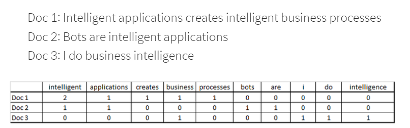
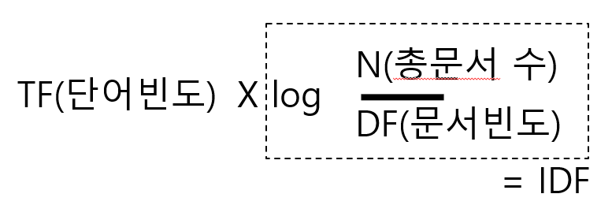
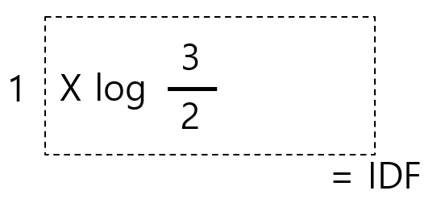
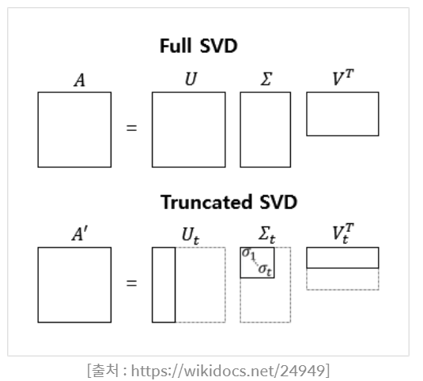
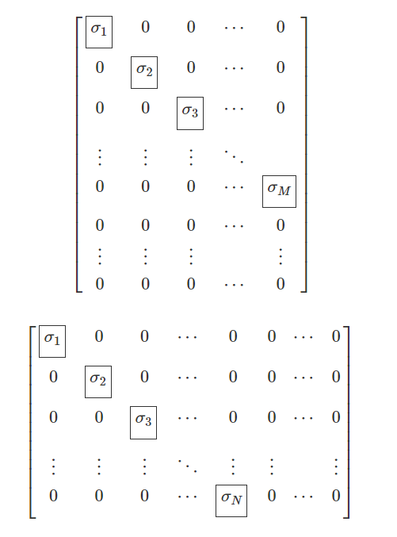
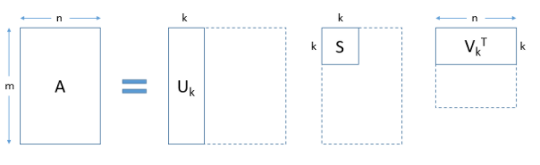
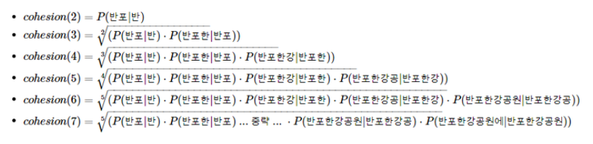

# Vectorize


# contexts

1. BoW
2. DTM
  - 코사인 유사도 


3. TF-IDF 가중치
4. LSA
  - 특잇값 분해


5. LDA
6. soynlp
  - 응집확률
  - 브랜칭 엔트로피


자연어 처리에서 꼭 필요한  
텍스트 데이터의 Veoctorization 중에서도  
통계와 머신러닝 사용하는 방법의 변천사에 대한 설명이다.  


토큰화하는 방식은
Word2vec 임베딩 모델이 생기기 전   
정통적인 Vectorize 방식이었다.

---

현재는 Word2vec 기술을 사용하지만  
단어를 학습시키기 위한 Vectorize 기술의 초기 개념을 이해하여  
NLP 의 이해를 심화하도록 한다.

---

컴퓨터는 단어를 이해하지 못한다.  
때문에 단어를 숫자 데이터로 표현하여야 한다.  
하지만 단순히 단어를 1, 2, 3, 4.. 로 표현한다면  
단어간의 차이를 정확하게 나타내지 못할 것이다

그러기 위해 vectorize 라는 기술이 생겨났다.  
단어를 적절한 숫자 데이터로 변경하는 기술을 의미한다.


다음은 이 vectorize 의 문제점과 그 해결책을 
발전 순서대로 나열한 내용이다.


## 1. Bag of Words 단어표현 방법
> 단어들의 분포로 문서의 특성을 파악하는 기법 ; BoW

한 말뭉치를 정리할때 순서는 무시하고 중복횟수를 중시한다.

BoW 는 `Dic` 형태로 저장된다.
각 Key 는 단어, value 는 빈도이다.

BoW 는 다음의 라이브러리로 만들 수 있다.


```python
#1번방법 tensorflow 사용
from tensorflow.keras.preprocessing.text import Tokenizer
#fit_on_texts()


#2번방법 scikit learn 사용
from sklearn.feature_extraction.text import CountVectorizer
#fit_transform() :빈도가 저장
#vocabulary_ :단어들의 빈도 index 표현
#해당 라이브러리에서는 빈도가 아닌 index 를 표현
```


```python
from tensorflow.keras.preprocessing.text import Tokenizer

sentence = ["John likes to watch movies. Mary likes movies too! Mary also likes to watch football games."]

tokenizer = Tokenizer()
tokenizer.fit_on_texts(sentence) # 단어장 생성
bow = dict(tokenizer.word_counts) # 각 단어와 각 단어의 빈도를 bow에 저장

print("Bag of Words :", bow) # bow 출력
print('단어장(Vocabulary)의 크기 :', len(tokenizer.word_counts)) # 중복을 제거한 단어들의 개수
```


```python
from sklearn.feature_extraction.text import CountVectorizer

sentence = ["John likes to watch movies. Mary likes movies too! Mary also likes to watch football games."]

vector = CountVectorizer()
bow = vector.fit_transform(sentence).toarray()

print('Bag of Words : ', bow) # 코퍼스로부터 각 단어의 빈도수를 기록한다.
print('각 단어의 인덱스 :', vector.vocabulary_) # 각 단어의 인덱스가 어떻게 부여되었는지를 보여준다.
```

BoW의 집합으로 DTM 을 만들 수 있다.

---

## 2. DTM ; document-Term Matrix

문서 단어 행렬

여러 문서의 BoW 를 하나의 행렬로 구현한 것을 의미한다.
DTM 은 문서를 row 로 단어를 col 로 가진다.

단어를 row 로 문서를 col 로 지정한다면
TDM 이라고 한다.

가령,  세 개의 문서가 있다면
DTM 은 다음과 같다.

</img>

문서는 row 에, 단어들은 col 에 있다.

이렇게 하면 각 문서의 BoW 는 없는 단어들도 0 값이 입력되어 구성된다.

만약 문서가 많아진다면, 0값도 점점 많아질 것이다.

DTM 을 이용해 kosine 유사도를 구할 수 있다.

---

### Kosine 유사도

코사인 유사도는 문장들간의 유사성을 측정하기 위해 만들어진 방법이다.

[코사인 유사도](https://wikidocs.net/24603)


```python
import numpy as np
from numpy import dot
from numpy.linalg import norm

doc1 = np.array([0,1,1,1]) # 문서1 벡터
doc2 = np.array([1,0,1,1]) # 문서2 벡터
doc3 = np.array([2,0,2,2]) # 문서3 벡터

def cos_sim(A, B):
    return dot(A, B)/(norm(A)*norm(B))

print('문서 1과 문서2의 유사도 :',cos_sim(doc1, doc2))
print('문서 1과 문서3의 유사도 :',cos_sim(doc1, doc3))
print('문서 2와 문서3의 유사도 :',cos_sim(doc2, doc3))
```

    문서 1과 문서2의 유사도 : 0.6666666666666667
    문서 1과 문서3의 유사도 : 0.6666666666666667
    문서 2와 문서3의 유사도 : 1.0000000000000002


만약 문장의 길이만을 비교할 수 있는 유클리드 거리로 유사도를 계산한다면  
이게 무슨말일까 싶을 것이다.

왜냐면 문장은 길이가 비슷하다고 같은 의미를 가지고 있는게 아니지 않는가?

하지만 사용하는 단어가 유사하다면, 유사성을 가지고 있다고 표현할 수 있다.

코사인 유사도란, 행렬의 수치 하나당 방향성을 가지고 있다고 가정하고,   
그 방향의 코사인 값을 취해 각 문서가 얼마나 동일한 방향성을 가지고 있는지를 나타내는 방법이다.

방향이 정반대일때는 -1
같은 방향일때는 1의 값을 가진다.

위의 코드를 보면 문서 2와 3의 유사도가 1이 나왔다.
왜냐하면 [1,0,1,1] 과 [2,0,2,2] 가 크기는 다르지만 방향이 같다고 인식했기  
때문이다.

---

DTM 은 두가지 큰 문제점이 있다.
1. 저장공간을 0이 많이 차지한다.
2. 단순 빈도 수 만을 고려한다.

이를 해결하기 위해 TF-IDF 가중치가 나타났다.

---

## 3. TF-IDF

; Term Frequency- Inverse Document Frequency

단어 빈도 - 역 문서 빈도 를 뜻한다.

DTM 은 TF 의 행렬이다. 그러므로 

기존 DTM 의 각 TF 에 IDF 를 곱하는 것이 TF-IDF가중치 의 사용법이다

DF(문서빈도) 는 해당 단어가 나온 문서의 빈도를 의미한다.
상단 예시에서 `business` 의 DF 는 2이다. 3문서 중 2문서에 출현했기 때문이다.

그래서 공식을 이용하면 다음과 같다.

</img>
문서 1과 2에 나왔으므로 

각 문서 별로 DF-IDF 값이 나온다, 각 문서당 TF 가 다르기 때문이다.

허나 여기선 똑같은 1이므로 

</img>
이 된다.

직접 TF-IDF 를 사용해보도록 하겠다.


```python
from math import log
import pandas as pd

docs = [
  'Ib wanna get some candy from Gary',
  'Gary protect Ib to save the art gallary',
  'Mary also likes to see Ib eating the candy',  
]

vocab = list(set(w for doc in docs for w in doc.split()))
vocab.sort()
N = len(docs) # 총 문서의 수

print('단어장의 크기 :', len(vocab))
print(vocab)
```

    단어장의 크기 : 18
    ['Gary', 'Ib', 'Mary', 'also', 'art', 'candy', 'eating', 'from', 'gallary', 'get', 'likes', 'protect', 'save', 'see', 'some', 'the', 'to', 'wanna']


Python 에서는 모든 식에 에러가 나지 않도록 조정이 필요하다.

1. IDF 의 분모가 0이 되는 상황 방지 : 분모 +1
2. log 의 분모분자가 같아 1이 되어 IDF 가 0이 되는 상황 방지 : IDF + 1


```python


def tf(t, d): #단어빈도
    return d.count(t)
 
def idf(t): #역문서빈도
    df = 0
    for doc in docs:
        df += t in doc    
    return log(N/(df + 1)) + 1 #분모와 log 에 각각 1 더해줌
 
def tfidf(t, d):
    return tf(t,d)* idf(t) #실제 계산
```

이전 문서를 가지고 DTM 을 만들면 다음과 같다.


```python
result = []
for i in range(N): # 각 문서에 대해서 아래 명령을 수행
    result.append([])
    d = docs[i]
    for j in range(len(vocab)):
        t = vocab[j]
        
        result[-1].append(tf(t, d))
        
tf_ = pd.DataFrame(result, columns = vocab)
tf_
```


<div>
<style scoped>
    .dataframe tbody tr th:only-of-type {
        vertical-align: middle;
    }

    .dataframe tbody tr th {
        vertical-align: top;
    }

    .dataframe thead th {
        text-align: right;
    }
</style>
<table border="1" class="dataframe">
  <thead>
    <tr style="text-align: right;">
      <th></th>
      <th>Gary</th>
      <th>Ib</th>
      <th>Mary</th>
      <th>also</th>
      <th>art</th>
      <th>candy</th>
      <th>eating</th>
      <th>from</th>
      <th>gallary</th>
      <th>get</th>
      <th>likes</th>
      <th>protect</th>
      <th>save</th>
      <th>see</th>
      <th>some</th>
      <th>the</th>
      <th>to</th>
      <th>wanna</th>
    </tr>
  </thead>
  <tbody>
    <tr>
      <th>0</th>
      <td>1</td>
      <td>1</td>
      <td>0</td>
      <td>0</td>
      <td>0</td>
      <td>1</td>
      <td>0</td>
      <td>1</td>
      <td>0</td>
      <td>1</td>
      <td>0</td>
      <td>0</td>
      <td>0</td>
      <td>0</td>
      <td>1</td>
      <td>0</td>
      <td>0</td>
      <td>1</td>
    </tr>
    <tr>
      <th>1</th>
      <td>1</td>
      <td>1</td>
      <td>0</td>
      <td>0</td>
      <td>1</td>
      <td>0</td>
      <td>0</td>
      <td>0</td>
      <td>1</td>
      <td>0</td>
      <td>0</td>
      <td>1</td>
      <td>1</td>
      <td>0</td>
      <td>0</td>
      <td>1</td>
      <td>1</td>
      <td>0</td>
    </tr>
    <tr>
      <th>2</th>
      <td>0</td>
      <td>1</td>
      <td>1</td>
      <td>1</td>
      <td>0</td>
      <td>1</td>
      <td>1</td>
      <td>0</td>
      <td>0</td>
      <td>0</td>
      <td>1</td>
      <td>0</td>
      <td>0</td>
      <td>1</td>
      <td>0</td>
      <td>1</td>
      <td>1</td>
      <td>0</td>
    </tr>
  </tbody>
</table>
</div>


각 단어의 IDF 를 구할 수 있다.


```python
result = []
for j in range(len(vocab)):
    t = vocab[j]
    result.append(idf(t))

idf_ = pd.DataFrame(result, index = vocab, columns=["IDF"])
idf_
```


<div>
<style scoped>
    .dataframe tbody tr th:only-of-type {
        vertical-align: middle;
    }

    .dataframe tbody tr th {
        vertical-align: top;
    }

    .dataframe thead th {
        text-align: right;
    }
</style>
<table border="1" class="dataframe">
  <thead>
    <tr style="text-align: right;">
      <th></th>
      <th>IDF</th>
    </tr>
  </thead>
  <tbody>
    <tr>
      <th>Gary</th>
      <td>1.000000</td>
    </tr>
    <tr>
      <th>Ib</th>
      <td>0.712318</td>
    </tr>
    <tr>
      <th>Mary</th>
      <td>1.405465</td>
    </tr>
    <tr>
      <th>also</th>
      <td>1.405465</td>
    </tr>
    <tr>
      <th>art</th>
      <td>1.405465</td>
    </tr>
    <tr>
      <th>candy</th>
      <td>1.000000</td>
    </tr>
    <tr>
      <th>eating</th>
      <td>1.405465</td>
    </tr>
    <tr>
      <th>from</th>
      <td>1.405465</td>
    </tr>
    <tr>
      <th>gallary</th>
      <td>1.405465</td>
    </tr>
    <tr>
      <th>get</th>
      <td>1.405465</td>
    </tr>
    <tr>
      <th>likes</th>
      <td>1.405465</td>
    </tr>
    <tr>
      <th>protect</th>
      <td>1.405465</td>
    </tr>
    <tr>
      <th>save</th>
      <td>1.405465</td>
    </tr>
    <tr>
      <th>see</th>
      <td>1.405465</td>
    </tr>
    <tr>
      <th>some</th>
      <td>1.405465</td>
    </tr>
    <tr>
      <th>the</th>
      <td>1.000000</td>
    </tr>
    <tr>
      <th>to</th>
      <td>1.000000</td>
    </tr>
    <tr>
      <th>wanna</th>
      <td>1.405465</td>
    </tr>
  </tbody>
</table>
</div>


IDF 는 모든 문서에 등장한 단어가 가장 낮은 값을 가진다.  
그리고 독립적으로 등장한 단어가 1.4 로 가장 높은 값을 가진다.

위를 보면, 한 번 나오는 단어는 1.4  
두 번 나오는 단어는 1  
세 번 나오는 단어는 0.7 의 값이 나온다.  

각 나온 IDF 값을 각 단어들의 빈도인 TF 와 곱하면 다음과 같다.


```python
result = []
for i in range(N):
    result.append([])
    d = docs[i]
    for j in range(len(vocab)):
        t = vocab[j]
        
        result[-1].append(tfidf(t,d))

tfidf_ = pd.DataFrame(result, columns = vocab)
tfidf_
```


<div>
<style scoped>
    .dataframe tbody tr th:only-of-type {
        vertical-align: middle;
    }

    .dataframe tbody tr th {
        vertical-align: top;
    }

    .dataframe thead th {
        text-align: right;
    }
</style>
<table border="1" class="dataframe">
  <thead>
    <tr style="text-align: right;">
      <th></th>
      <th>Gary</th>
      <th>Ib</th>
      <th>Mary</th>
      <th>also</th>
      <th>art</th>
      <th>candy</th>
      <th>eating</th>
      <th>from</th>
      <th>gallary</th>
      <th>get</th>
      <th>likes</th>
      <th>protect</th>
      <th>save</th>
      <th>see</th>
      <th>some</th>
      <th>the</th>
      <th>to</th>
      <th>wanna</th>
    </tr>
  </thead>
  <tbody>
    <tr>
      <th>0</th>
      <td>1.0</td>
      <td>0.712318</td>
      <td>0.000000</td>
      <td>0.000000</td>
      <td>0.000000</td>
      <td>1.0</td>
      <td>0.000000</td>
      <td>1.405465</td>
      <td>0.000000</td>
      <td>1.405465</td>
      <td>0.000000</td>
      <td>0.000000</td>
      <td>0.000000</td>
      <td>0.000000</td>
      <td>1.405465</td>
      <td>0.0</td>
      <td>0.0</td>
      <td>1.405465</td>
    </tr>
    <tr>
      <th>1</th>
      <td>1.0</td>
      <td>0.712318</td>
      <td>0.000000</td>
      <td>0.000000</td>
      <td>1.405465</td>
      <td>0.0</td>
      <td>0.000000</td>
      <td>0.000000</td>
      <td>1.405465</td>
      <td>0.000000</td>
      <td>0.000000</td>
      <td>1.405465</td>
      <td>1.405465</td>
      <td>0.000000</td>
      <td>0.000000</td>
      <td>1.0</td>
      <td>1.0</td>
      <td>0.000000</td>
    </tr>
    <tr>
      <th>2</th>
      <td>0.0</td>
      <td>0.712318</td>
      <td>1.405465</td>
      <td>1.405465</td>
      <td>0.000000</td>
      <td>1.0</td>
      <td>1.405465</td>
      <td>0.000000</td>
      <td>0.000000</td>
      <td>0.000000</td>
      <td>1.405465</td>
      <td>0.000000</td>
      <td>0.000000</td>
      <td>1.405465</td>
      <td>0.000000</td>
      <td>1.0</td>
      <td>1.0</td>
      <td>0.000000</td>
    </tr>
  </tbody>
</table>
</div>


Gary 의 IDF 를 각 문서의 TF 별로 곱했음을 알 수 있다.

---

그러나 이것은 단어의 의미를 모르는 문제를 편법적으로 해소했을 뿐이지  
실제로 단어의 의미를 깨우친 것은 아니다.  

그래서 그 다음에 나온 방법이 

LSA 이다.

---

## 4. LSA

; Latent Sementic Analysis

숨은 의미 분석

이제부터는 문서 속 단어들간의 관계까지 찾아낼 수 있다.

LSA 는 Singular Value Decompotion 을 이용한다.

---

### singular Value Decompotion (특잇값 분해)
</img>
SVD 특잇값 분해는 고유값 분해의 변형이다.  
원래 고유값 변형은 정방 행렬에서만 가능한데  

행과 열의 개수가 다른 `m`x`n`의 행렬에서 적당히 해주는 분해를 의미한다.

그러면 이런식으로 아래나 오른쪽이 조금 비는 대각행렬 비스무리가 나온다

</img>

`truncated SVD ` 는 그 분해를 가장 윗부분 `k` 개만 하는 것을 의미한다.  
truncated SVD 는 원본 행렬을 복구할 수 없다.

LSA 는 우리가 만든 DTM 에 (혹은 TF-IDF 가중치 처리한 DTM 에 )  
truncated SVD 를 실시하여 

U : 특이값
S : 특이벡터
V : 특이값

세가지 행렬로 분해할 수 있다.

</img>
U :  문서와 관련된 의미를 표현한 행렬
S : 단어와 관련된 의미를 표현한 행렬
V : 각 의미의 중요도를 표현한 행렬


U 는 m(행) x k 의 행렬이다. 이 때 각 행은 문서 표현 벡터이다.
V 는 k x n(열) 의 행렬이다. 이 때 각 열은 단어 표현 벡터이다.

원래 DTM 에서는 단어 벡터의 크기가 m 이었는데 k 로 줄었음을 확인할 수 있다.  

V 는 전체 문서로부터 얻어낸 k 개의 주요 특징 이라고 할 수도 있다.

우리는 이 특징(topic) 의 수 k 를 하이퍼 파라미터로 설정하고 
Truncated SVD 를 수행할 수 있다.

---

k(주제) x n(단어수) 를 가진 V 에서 

각 행(주제) 마다 빈도수가 가장 많은 단어 5개를 꺼내면,   
해당 주제의 요약을 얻을 수가 있다.

이를 topic modelig 이라고 한다

topic modeling 은 이 외에도 LDA 가 존재한다.

---

## 5. LDA ; Latent Dirichlet Alloaction

잠재 디리클레 할당이라는 뜻이다.

LDA 는 k (topic) 을 이용해

각 topic 의 단어 분포와 (특정 topic 에 이 단어가 나타날 확률)  

각 문서의 topic 분포를 추정한다.

주제가 몇개 있을 것임을 가정하고 단어분포를 찾는다는 의미에서 문서생성 과정을 역추정한다고도 말한다.

LDA 의 과정은 다음과 같다.

1. topic 의 수 k 정하기
2. 모든 단어를 k 개의 topic 중 하나에 allocation
3. 다음 단어를 넣을 때 확률과 분포에 따라 올바른 곳에 allocation

---

LSA : DTM 의 차원을 축소해 근접 단어끼리 topic 으로 묶는다
LDA : 단어가 특정 topic 에 들어갈 확률을 구해 나눈다. 

---

## 6. 비지도 학습 토크나이저 soynlp

지금까지의 방식은 모두 띄어쓰기만을 토대로 
단어들간의 분류 및 할당을 수행했다

하지만 정확한 단어의 유사도를 파악하기 위해선  
애초에 단어를 의미있게 분리해야 하는 작업이  
선행되어야 한다.

그래서 이 이후에 나온 방식이 

비지도 학습 토크나이저 방식이다.

특히 우리나라 말은 영어처럼 띄어쓰기 토큰화는 절대 안된다.

조사가 다 다르고 어미 어간도 다다르기 때문이다.

사실 영어같은 경우는 띄어쓰기 토큰화를 해도 어느정도 들어맞는다. 


```python
en_text = "My favorite fruit is orange because of salty taste and cheap price."
print(en_text.split())
```

    ['My', 'favorite', 'fruit', 'is', 'orange', 'because', 'of', 'salty', 'taste', 'and', 'cheap', 'price.']


하지만 한국어는 절대 안되므로 형태소 분석기를 이용한다.


```python
from konlpy.tag import Okt

kor_text = '나 이제는 게임 안하려고, 더 재밌는 걸 찾아버렸지 뭐야. 그것은 바로 인공지능 NLP'


tokenizer = Okt()
print(tokenizer.morphs(kor_text))
```

    ['나', '이제', '는', '게임', '안', '하려고', ',', '더', '재밌는', '걸', '찾아', '버렸지', '뭐', '야', '.', '그것', '은', '바로', '인공', '지능', 'NLP']


하지만 형태소분석기는 새로운 신조어나 고유명사를 알아내기가 힘들다는 단점이 있다.


```python
print(tokenizer.morphs('어쩔티비 저쩔티비 크크루삥뽕 아무것도 못하쥬'))
```

    ['어쩔', '티비', '저', '쩔', '티비', '크', '크루', '삥뽕', '아무', '것', '도', '못하쥬']


크크루삥뽕은 하나의 말이지만 분리된 것을 볼 수가 있다.

근데 이런것도 감안해서 크크루삥뽕이라는 말이 여러번 나왔을 때 이걸 하나의 고유명사라고 판단까지 해주는  

발전된 형태소 분석기 `soynlp` 가 나왔다.

---

### soynlp 사용 방법

그것이 가능한 이유는 비지도 학습을 통해 형태소 분석을 하기 때문이다.

`soynlp` 는 내부의 단어 점수표가 있는데, 그 단어점수표는 다음의 두 가지 방식을 활용한다

1. 응집확률 (cohesion probability)
2. 브랜칭 엔트로피 (branching entropy) 


soynlp 는 깃허브에서 예제 말뭉치를 제공하고 있다.


```python
import os

import urllib.request

txt_filename = os.getenv('HOME')+'/aiffel/goingDeeper/data/2016-10-20.txt'
urllib.request.urlretrieve("https://raw.githubusercontent.com/lovit/soynlp/master/tutorials/2016-10-20.txt",\
                            filename=txt_filename)
```


    ('/aiffel/aiffel/goingDeeper/data/2016-10-20.txt',
     <http.client.HTTPMessage at 0x7f2fce2959a0>)


```python
from soynlp import DoublespaceLineCorpus

# 말뭉치에 대해서 다수의 문서로 분리
corpus = DoublespaceLineCorpus(txt_filename)
len(corpus)
```


    30091


```python
i = 0
for document in corpus:
  if len(document) > 0:
    print(document)
    i = i+1
  if i == 3:
    break
```

    19  1990  52 1 22
    오패산터널 총격전 용의자 검거 서울 연합뉴스 경찰 관계자들이 19일 오후 서울 강북구 오패산 터널 인근에서 사제 총기를 발사해 경찰을 살해한 용의자 성모씨를 검거하고 있다 성씨는 검거 당시 서바이벌 게임에서 쓰는 방탄조끼에 헬멧까지 착용한 상태였다 독자제공 영상 캡처 연합뉴스  서울 연합뉴스 김은경 기자 사제 총기로 경찰을 살해한 범인 성모 46 씨는 주도면밀했다  경찰에 따르면 성씨는 19일 오후 강북경찰서 인근 부동산 업소 밖에서 부동산업자 이모 67 씨가 나오기를 기다렸다 이씨와는 평소에도 말다툼을 자주 한 것으로 알려졌다  이씨가 나와 걷기 시작하자 성씨는 따라가면서 미리 준비해온 사제 총기를 이씨에게 발사했다 총알이 빗나가면서 이씨는 도망갔다 그 빗나간 총알은 지나가던 행인 71 씨의 배를 스쳤다  성씨는 강북서 인근 치킨집까지 이씨 뒤를 쫓으며 실랑이하다 쓰러뜨린 후 총기와 함께 가져온 망치로 이씨 머리를 때렸다  이 과정에서 오후 6시 20분께 강북구 번동 길 위에서 사람들이 싸우고 있다 총소리가 났다 는 등의 신고가 여러건 들어왔다  5분 후에 성씨의 전자발찌가 훼손됐다는 신고가 보호관찰소 시스템을 통해 들어왔다 성범죄자로 전자발찌를 차고 있던 성씨는 부엌칼로 직접 자신의 발찌를 끊었다  용의자 소지 사제총기 2정 서울 연합뉴스 임헌정 기자 서울 시내에서 폭행 용의자가 현장 조사를 벌이던 경찰관에게 사제총기를 발사해 경찰관이 숨졌다 19일 오후 6시28분 강북구 번동에서 둔기로 맞았다 는 폭행 피해 신고가 접수돼 현장에서 조사하던 강북경찰서 번동파출소 소속 김모 54 경위가 폭행 용의자 성모 45 씨가 쏜 사제총기에 맞고 쓰러진 뒤 병원에 옮겨졌으나 숨졌다 사진은 용의자가 소지한 사제총기  신고를 받고 번동파출소에서 김창호 54 경위 등 경찰들이 오후 6시 29분께 현장으로 출동했다 성씨는 그사이 부동산 앞에 놓아뒀던 가방을 챙겨 오패산 쪽으로 도망간 후였다  김 경위는 오패산 터널 입구 오른쪽의 급경사에서 성씨에게 접근하다가 오후 6시 33분께 풀숲에 숨은 성씨가 허공에 난사한 10여발의 총알 중 일부를 왼쪽 어깨 뒷부분에 맞고 쓰러졌다  김 경위는 구급차가 도착했을 때 이미 의식이 없었고 심폐소생술을 하며 병원으로 옮겨졌으나 총알이 폐를 훼손해 오후 7시 40분께 사망했다  김 경위는 외근용 조끼를 입고 있었으나 총알을 막기에는 역부족이었다  머리에 부상을 입은 이씨도 함께 병원으로 이송됐으나 생명에는 지장이 없는 것으로 알려졌다  성씨는 오패산 터널 밑쪽 숲에서 오후 6시 45분께 잡혔다  총격현장 수색하는 경찰들 서울 연합뉴스 이효석 기자 19일 오후 서울 강북구 오패산 터널 인근에서 경찰들이 폭행 용의자가 사제총기를 발사해 경찰관이 사망한 사건을 조사 하고 있다  총 때문에 쫓던 경관들과 민간인들이 몸을 숨겼는데 인근 신발가게 직원 이모씨가 다가가 성씨를 덮쳤고 이어 현장에 있던 다른 상인들과 경찰이 가세해 체포했다  성씨는 경찰에 붙잡힌 직후 나 자살하려고 한 거다 맞아 죽어도 괜찮다 고 말한 것으로 전해졌다  성씨 자신도 경찰이 발사한 공포탄 1발 실탄 3발 중 실탄 1발을 배에 맞았으나 방탄조끼를 입은 상태여서 부상하지는 않았다  경찰은 인근을 수색해 성씨가 만든 사제총 16정과 칼 7개를 압수했다 실제 폭발할지는 알 수 없는 요구르트병에 무언가를 채워두고 심지를 꽂은 사제 폭탄도 발견됐다  일부는 숲에서 발견됐고 일부는 성씨가 소지한 가방 안에 있었다
    테헤란 연합뉴스 강훈상 특파원 이용 승객수 기준 세계 최대 공항인 아랍에미리트 두바이국제공항은 19일 현지시간 이 공항을 이륙하는 모든 항공기의 탑승객은 삼성전자의 갤럭시노트7을 휴대하면 안 된다고 밝혔다  두바이국제공항은 여러 항공 관련 기구의 권고에 따라 안전성에 우려가 있는 스마트폰 갤럭시노트7을 휴대하고 비행기를 타면 안 된다 며 탑승 전 검색 중 발견되면 압수할 계획 이라고 발표했다  공항 측은 갤럭시노트7의 배터리가 폭발 우려가 제기된 만큼 이 제품을 갖고 공항 안으로 들어오지 말라고 이용객에 당부했다  이런 조치는 두바이국제공항 뿐 아니라 신공항인 두바이월드센터에도 적용된다  배터리 폭발문제로 회수된 갤럭시노트7 연합뉴스자료사진


`soynlp` 는 비지도 학습 형태소 분석기 이기 때문에 해당 corpus 에 대한 학습을  
선행시켜주어야 한다.

이 학습 과정에서 응집확률과 브랜칭 엔트로피 단어 점수표를 만든다


```python
from soynlp.word import WordExtractor

word_extractor = WordExtractor()
word_extractor.train(corpus)
word_score_table = word_extractor.extract() #응집확률과 브랜칭 엔트로피 사용
```

    training was done. used memory 1.141 Gb
    all cohesion probabilities was computed. # words = 223348
    all branching entropies was computed # words = 361598
    all accessor variety was computed # words = 361598


### 응집확률  cohesion probability

내부 문자열 substring 이 얼마나 모여 자주 등장하는지 판단하는 기준  
이 값이 높을수록 그 주변 글자와 한 단어일 확률이 높아진다.

</img>
이처럼 바로 이전에 입력된 글자와의 확률을 구해 함께 오는지 안오는지를 구한다.

다른 곳에서는 '반포한강공원' 과 '에' 의 응집확률이 낮게 나오므로 한 단어 기준이 정해진다.

`word_score_table["string"].cohesion_forward`
계산시 '반포한강공원' 의 응집확률이 가장 최대치를 이룬다.

### 브랜칭 엔트로피 

주어진 글자에서 다음 글자를 맞추는 데 헷갈리는 정도 
브랜칭 엔트로피는 주어지는 글자가 많을 수록 헷갈림이 적으므로 점점 낮아지게 된다.


```python
word_score_table["디스"].right_branching_entropy
```


    1.6371694761537934


```python
word_score_table["디스플"].right_branching_entropy
```


    -0.0


```python
word_score_table["디스플레"].right_branching_entropy
```


    -0.0


```python
word_score_table["디스플레이"].right_branching_entropy
```


    3.1400392861792916


이처럼 브랜칭 엔트로피는 하나의 단어가 끝나가면서 점점 낮아졌다가  
단어가 끝나면 조사 등 다른 것이 올 확률이 높아지므로(다시 헷갈려지므로)  
수치가 다시 오른다.  

이 수치의 고저로 단어를 나눌 수 있다.

결과적으로 

응집확률 과 브랜칭 엔트로피 를 사용해

토크나이저 한다.

그런데 soynlp 토크나이저도 두 가지 방식이 있다.

1. L Tokenizer

우리나라는 조사가 대부분 오른쪽에 붙는것을 감안해

한 단어를 L+R 로 나누어
L 의 중요도를 더 높인 tokenize


```python
from soynlp.tokenizer import LTokenizer

scores = {word:score.cohesion_forward for word, score in word_score_table.items()}
l_tokenizer = LTokenizer(scores=scores)
l_tokenizer.tokenize("국제사회와 우리의 노력들로 범죄를 척결하자", flatten=False)
```


    [('국제사회', '와'), ('우리', '의'), ('노력', '들로'), ('범죄', '를'), ('척결', '하자')]


하나의 tuple 안에 L 과 R 이 들어있는 것을 볼 수 있다.

2. Max score Tokenizer

띄어쓰기가 되어있지 않은 문장에서   
가장 점수가 높은 단어의 중요도를 더 높인 tokenize


```python
from soynlp.tokenizer import MaxScoreTokenizer

maxscore_tokenizer = MaxScoreTokenizer(scores=scores)
maxscore_tokenizer.tokenize("국제사회와우리의노력들로범죄를척결하자")
```


    ['국제사회', '와', '우리', '의', '노력', '들로', '범죄', '를', '척결', '하자']


해당 input 을 보면 띄어쓰기를 하지 않았음에도 충실히 나누게 된 것을 볼 수 있다.

```toc

```


```python

```
