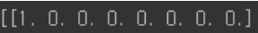
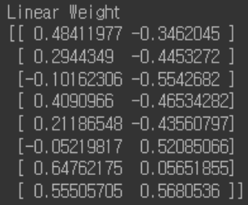
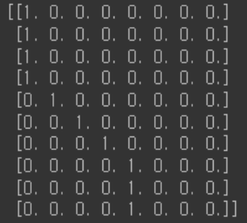
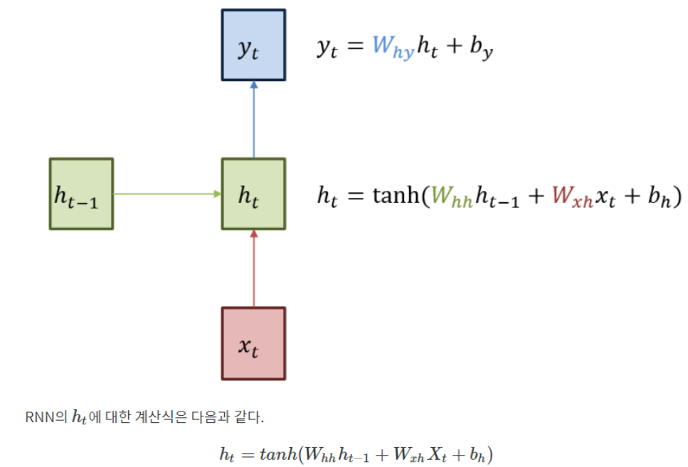
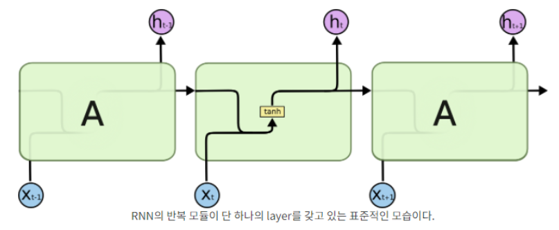
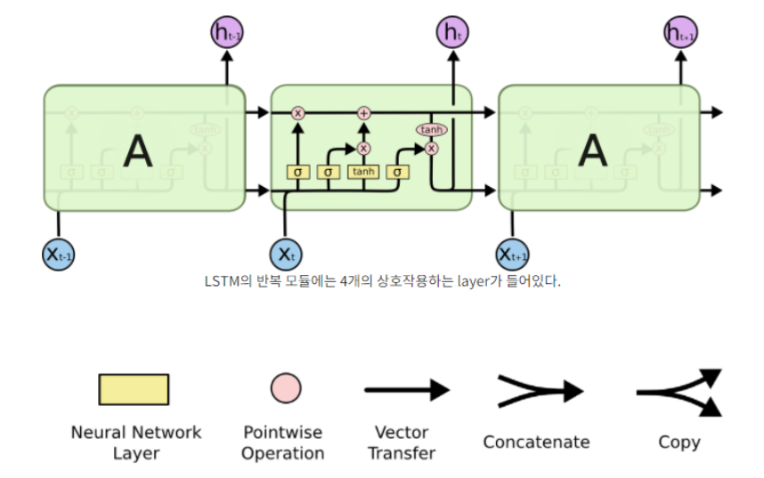

# <span style='background-color: #fff5b1'>임베딩이란..?</span>


단어를 표현하기 위해서는 적어도 1차원에서는 안된다 (의미가 담기기엔 작다)

그래서 벡터의 **특정 차원을 직접** 만들어 의미를 직접 mapping 해야 하고,  
이를 희소 표현 (Sparse Representation) 이라고 한다.

---

반면에 그냥 차원은 일정하게 256차원 이렇게 정해놓고

유사한 맥락에서 자주 나오는 단어들은 의미가 비슷하다고 판단하는 방식을
분포 가설 (distribution hypothesis) 이라고 한다. 그리고 이 가설을 통해 분산표현 (distribution Representation) 이라고 한다.

맥락이라 함은 단어 좌우에 함께 위치하는 단어를 의미한다.

---

분산표현 은 희소표현 과 달리 단어 간 유사도를 구할 수 있다.

embedding 레이어라는 것은

이 단어의 분산표현을 구현하기 위한 레이어!!!!!!!!!!!!!!!!!!!!!!

우리가 단어를 n 개 쓸거야~ k차원으로 구현해조~ 하면

컴퓨터가 n x k 형태의 분산표현 사전을 만든다.

이게 weihght 이 되는 거고 파라미터가 된다.

---

이 임베딩을 훈련시키기 위해

word2vec , FastText, Glove, ELMo 등이 있는 거임 방법들이

---

## 임베딩 레이어는 컴퓨터가 알아먹는 단어사전이다.


weight 은 
1. 단어의 개수
2. 임베딩 사이즈  
로 정의된다.

임베딩 레이어는 input 데이터를 분산 데이터로 연결해주니 LUT 룩업 테이블  
이라고도 한다.

그것은 원-핫 인코딩 이라고도 하는데

----

원핫 인코딩 자체는 sparse 표현이지만

embedding 이랑 함께 결합하여 쓰이면 유용하다.

각 단어가 있으면 그걸 Linear 연산 을 통해 차원값을 만들어낸다!!!

예를 들어



8차원의 원핫 인코딩이 있다고 해보자



이런 가중치 를 가진 레이어가 있다고 치면 
저 위의 1 0 0 0 0 0 0 0 에 각 하나의  [ _ _ ] 가 들어가게 되고,

그 결과값으로 [_ _ ] 의 형태 1 개가 나오겠지 (원핫인코딩의 행이 1이니까)

그럼 원핫 인코딩이  



이렇게 10 개 있으면  
10개에 대한 [_ _ ] 값이 나올 것이다. 그럼 그것이  
바로 유사도를 나타내는 벡터값이 될 수 있다.


---
다시 말해서 임베딩 레이어란

1. 단어들을 원핫 인코딩 한다.
2. 선형변환(레이어 씌우기) 를 한다.
3. 각 단어들을 {index : 선형변환값 } 으로 저장

을 해주는 레이어 인 것!!!!!!

보여주는 코드는 다음과 같다.


```python
import tensorflow as tf

some_words = tf.constant([[3, 57, 35]])
# 3번 단어 / 57번 단어 / 35번 단어로 이루어진 한 문장입니다.

print("Embedding을 진행할 문장:", some_words.shape)
embedding_layer = tf.keras.layers.Embedding(input_dim=64, output_dim=100)
# 총 64개의 단어를 포함한 Embedding 레이어를 선언할 것이고,
# 각 단어는 100차원으로 분산 표현 할 것입니다.

print("Embedding된 문장:", embedding_layer(some_words).shape)
print("Embedding Layer의 Weight 형태:", embedding_layer.weights[0].shape)
```

    Embedding을 진행할 문장: (1, 3)
    Embedding된 문장: (1, 3, 100)
    Embedding Layer의 Weight 형태: (64, 100)


#### 근데 임베딩 레이어는 미분을 할수 없는 애라 어떤 연산 결과를 
#### 임베딩 레이어에 적으면 안된다네

## 그런 임베딩 레이어와 함께 쓰는 문장 특화 레이어

# Recurrent layer




- 딥러닝에서 시퀀스 데이터는 순차적인 특성을 꼭 지닌다.

이런 순차 데이터를 처리하는 레이어가 recurrent layer

RNN 은 단 하나의 Weight 를 순차적으로 업데이트 한다.

다음은 RNN 의 예시이다.


```python
sentence = "What time is it ?"
dic = {
    "is": 0,
    "it": 1,
    "What": 2,
    "time": 3,
    "?": 4
}

print("RNN에 입력할 문장:", sentence)

sentence_tensor = tf.constant([[dic[word] for word in sentence.split()]])

print("Embedding을 위해 단어 매핑:", sentence_tensor.numpy())
print("입력 문장 데이터 형태:", sentence_tensor.shape)

embedding_layer = tf.keras.layers.Embedding(input_dim=len(dic), output_dim=100)
emb_out = embedding_layer(sentence_tensor)

print("\nEmbedding 결과:", emb_out.shape)
print("Embedding Layer의 Weight 형태:", embedding_layer.weights[0].shape)

rnn_seq_layer = \
tf.keras.layers.SimpleRNN(units=64, return_sequences=True, use_bias=False)
rnn_seq_out = rnn_seq_layer(emb_out)

print("\nRNN 결과 (모든 Step Output):", rnn_seq_out.shape)
print("Simple RNN Layer의 Weight 형태:", rnn_seq_layer.weights[0].shape)

rnn_fin_layer = tf.keras.layers.SimpleRNN(units=64, use_bias=False)
rnn_fin_out = rnn_fin_layer(emb_out)

print("\nRNN 결과 (최종 Step Output):", rnn_fin_out.shape)
print("Simple RNN Layer의 Weight 형태:", rnn_fin_layer.weights[0].shape)
```

    RNN에 입력할 문장: What time is it ?
    Embedding을 위해 단어 매핑: [[2 3 0 1 4]]
    입력 문장 데이터 형태: (1, 5)
    
    Embedding 결과: (1, 5, 100)
    Embedding Layer의 Weight 형태: (5, 100)
    
    RNN 결과 (모든 Step Output): (1, 5, 64)
    RNN Layer의 Weight 형태: (100, 64)
    
    RNN 결과 (최종 Step Output): (1, 64)
    RNN Layer의 Weight 형태: (100, 64)


어떤 문장이 긍정인지 부정인지 나누기 위해서라면 문장을 모두 읽은 후,  
최종 Step의 Output만 확인해도 판단이 가능하다.  

하지만 문장을 생성하는 경우라면  
이전 단어를 입력으로 받아 생성된  
모든 다음 단어, 즉 모든 Step에 대한 Output이 필요하다.

모든 step 의 output 은 ` return_sequences=True` 로 조절 가능하다

위의 결과를 보면 결국 마지막에 남는 Weight 은 (100, 64)로 똑같은 값을 가진다.


#### 위의 코드는 아래의 LSTM 사용 코드와 동일하다


```python
lstm_seq_layer = tf.keras.layers.LSTM(units=64, return_sequences=True, use_bias=False)
lstm_seq_out = lstm_seq_layer(emb_out)

print("\nLSTM 결과 (모든 Step Output):", lstm_seq_out.shape)
print("LSTM Layer의 Weight 형태:", lstm_seq_layer.weights[0].shape)

lstm_fin_layer = tf.keras.layers.LSTM(units=64, use_bias=False)
lstm_fin_out = lstm_fin_layer(emb_out)

print("\nLSTM 결과 (최종 Step Output):", lstm_fin_out.shape)
print("LSTM Layer의 Weight 형태:", lstm_fin_layer.weights[0].shape)
```

    WARNING:tensorflow:Layer lstm will not use cuDNN kernels since it doesn't meet the criteria. It will use a generic GPU kernel as fallback when running on GPU.
    
    LSTM 결과 (모든 Step Output): (1, 5, 64)
    LSTM Layer의 Weight 형태: (100, 256)
    WARNING:tensorflow:Layer lstm_1 will not use cuDNN kernels since it doesn't meet the criteria. It will use a generic GPU kernel as fallback when running on GPU.
    
    LSTM 결과 (최종 Step Output): (1, 64)
    LSTM Layer의 Weight 형태: (100, 256)


잠깐잠깐 LSTM 이 뭔데 갑자기 나와..?

# Recuurent layer - LSTM

; Long short Term memory

얘도 RNN 레이어의 일종이다.

---

딥러닝은 back propagation 으로 가중치의 미분을 구한 다음 업데이트한다.

가중치를 업데이트 하는 RNN 의 특성상, input 이 길수록 초기 단어의 미분값이  
매우 작아지거나 커지는 현상이 발생한다.

이 현상을 기울기 소실 (vanishing) 혹은 포화 (exploding) 이라고 한다.

LSTM 은 일반 RNN보다 4배 큰 가중치 값을 가진다.  
위를 보면 RNN =(100,64) , LSTM = (100,256) 인거를 보면 된다.

하지만 단순히 weight 가 4배 '많은' 게 아니라 4베 '다양한' 것이다.

각 weight 는 `Gate` 라는 구조에 포함되어 기억할 정보, 전달할 정보를 결정한다.

LSTM 에는 `Cell state` 를 통해서 긴 문장의 앞부분도 손실 없이 저장해준다.  
앞서 언급한 Gate 가 Cell state 에 정보를 추가/삭제 한다.

---
### 자세한 설명


## 아래의 그림은 하나의 활성함수를 지닌 기본 RNN 이다.




## 이와 달리 LSTM 은 한 레이어의 4 가지 가중치 존재




LSTM 이 가진 가장 큰 특징은 상단에 가로로 그어진 Cell ctate 이다.

얘는 컨베이어 벨트처럼 작은 선형변환을 아주 조금씩 하면서 정보가 나아간다.

LSTM 은 이 능력을 gate 라고 불리는 구조로 조금씩 변형시킨다.

Gate = 시그모이드 와 pointwise 곱셈으로 이루어진 정보전달 방법

시그모이드의 output 은 0과 1로만 이루어져 있어 보낼 정보와 막을 정보를 고른다

LSTM 은 3개의 gate 값을 가지고 있다. 이 3개로 CELL STATE 에 보낼 값을 제어한다.

3개의 GATE 는 다음과 같다.

1. forgat gate layer

cell state 에서 지울 값 선정

2. input gate layer

새로운 cell state 를 기존 cell state 에 반영할 정도를 선정


- (여기서 원래 본연의 가중치를 통해 이전 1,2번에서 정한 일 해줌)


3. output gate layer

cell state 로 필터된 output 배출

---
1번 , 2번, - 번, 4번 이렇게 총 4번의 레이어 활동으로 LSTM 은 작동한다.

---
이 외에도 뭐

엿보기 LSTM,, GRU,,, 

BIRNN 등 뭐 이것저것 많다
아래 코드는 양방향(Bidirectional) RNN 코드임

양방향이라서 가중치가 두배임 앞 뒤에서 가야되니까


```python
import tensorflow as tf

sentence = "What time is it ?"
dic = {
    "is": 0,
    "it": 1,
    "What": 2,
    "time": 3,
    "?": 4
}

sentence_tensor = tf.constant([[dic[word] for word in sentence.split()]])

embedding_layer = tf.keras.layers.Embedding(input_dim=len(dic), output_dim=100)
emb_out = embedding_layer(sentence_tensor)

print("입력 문장 데이터 형태:", emb_out.shape)

bi_rnn = \
tf.keras.layers.Bidirectional(
    tf.keras.layers.SimpleRNN(units=64, use_bias=False, return_sequences=True)
)
bi_out = bi_rnn(emb_out)

print("Bidirectional RNN 결과 (최종 Step Output):", bi_out.shape)
```

    입력 문장 데이터 형태: (1, 5, 100)
    Bidirectional RNN 결과 (최종 Step Output): (1, 5, 128)


```toc

```
