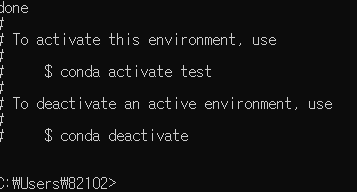
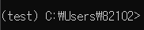
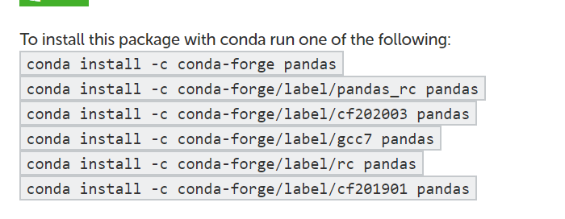
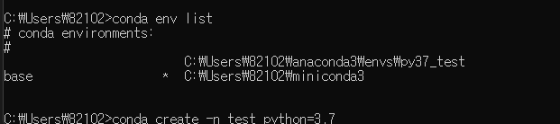

#  😊 파이썬 VSCODE & 아나콘다 가상 환경 설정

## 1. VS code 확장팩

아래의 것을 Extension 에서 설치할 것

다 몸에 좋은 것들이니까 일단 한 번 잡숴봐.

1. Python
2. Python type hint
3. Python extended
4. Python Docstring Generator 
5. Path Autocomplete 
6. indent-rainbow 

---

## 2. 가상환경 설정 및 저장

### 1. `conda env list` 로 가상환경 개수 확인 가능

### 2. **`conda create -n test python=3.7` 로 가상환경 제작 가능**

test 라는 이름의 환경을 파이썬 3.7 로 제작해 만들겠다!

만든 가상환경에 접속하기 / 나오기

가상환경에 들어가면 앞 부분에 괄호가 뜬다

### 3. 가상환경에서 패키지 설치하기

- 해당 링크에서 검색 가능
    
    
    
- 가상환경에 들어간 뒤 링크에 나온 코드 붙여넣기

### 4. 패키지 정리

1. env.yml

yml 파일은 어떤 패키지들이 들어가는지 알려주는 확장자 파일이다.

파이썬 말고도 flutter 나 JS 등 의존성 패키지 등을 알려주는 역할을 하니까

다음에 봐도 긴장하지 말기 

**`conda env export > env.yml`**

위와 같은 명령어를 치면 yml 파일이 생긴다.

그러면 다음 명령어로 yml 속 패키지들이 설치된 새로운 가상환경을 구축할 수 있다.

**conda env create -n test -f env.yml**

(test 는 가상환경 이름)

1. requirement.txt 파일
- `pip freeze` 내 환경을 고정시키고 각 패키지 별 버전을 보여준다.
`pip freeze > requirement.txt` 버전을 txt 파일에 넣어줄 수 있다.
- 다른 가상환경에 접속하여 `pip install -r requirement.txt` 로 설치할 수 있다.