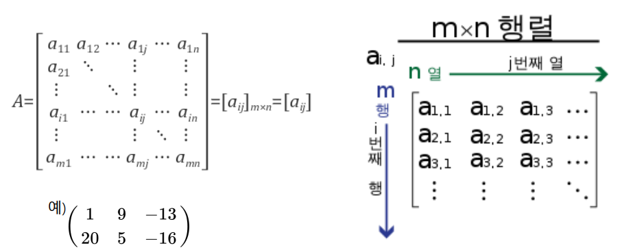
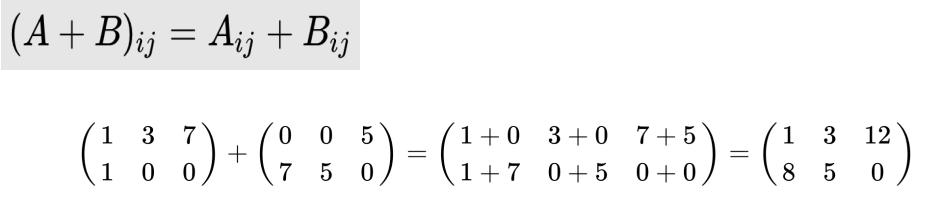
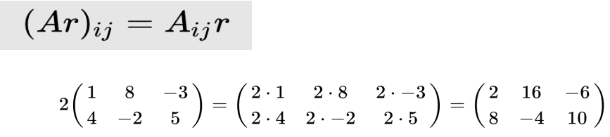
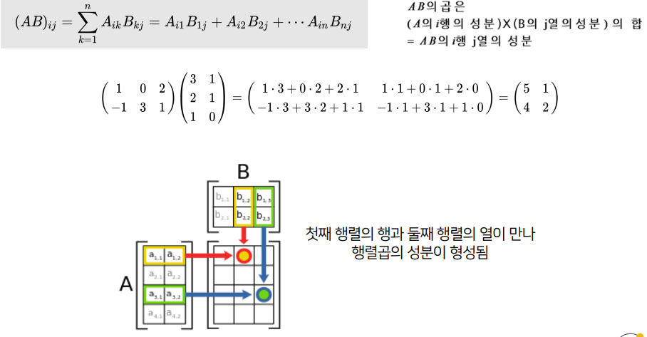
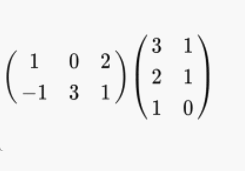
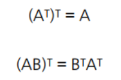
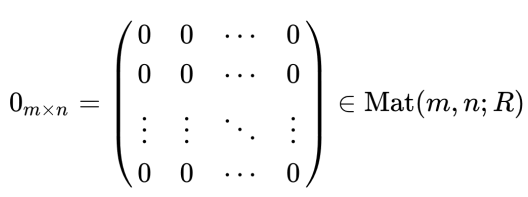
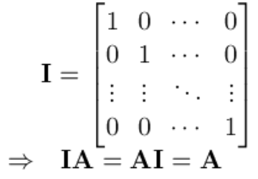
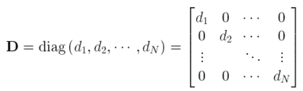
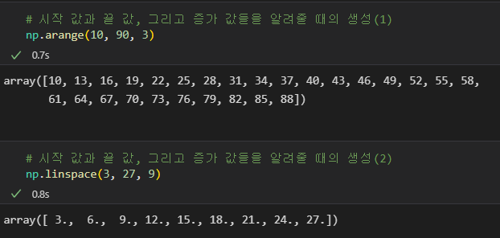

# <span style='background-color: #fff5b1'>선형대수 기초 및 numpy 적용</span>

행렬의 계산, 종류, numpy 내부 메서드를 다룬다.

## 1. 행렬의 계산

- 행렬



- 행렬 + 행렬



- 스칼라 * 행렬

: 각 자리마다 스칼라를 곱한다



- 행렬 * 행렬



**A 의 열 값과 B 의 행 값이 같아야 한다 → A의 행 , B의 열 을 가진 새로운 행렬 탄생**

**dot product / 내적 이라고도 표현한다.**

그림을 보면, A(4,2) 와 B(2,3) 이 만나 (4,3) 이 된다.

곱은 이렇게 이루어진다.



`1*3 + 0*2 + 2*1`

다음의 계산을 2 x 2 번 반복해서 2열 2행의 값이 나온다,

## 2. 행렬의 종류

- 전치 행렬

: 행과 열이 바뀐 행렬


전치행렬의 성질



- 영행렬



R 은 실수(real)

- 단위 행렬

: 대각선만 1인 행렬

기호는 I, E 둘 다 쓴다.



- 대각 행렬

: 대각선만 특정 수로 채워진 행렬 (특정 수는 행마다 다를 수 있음. )



## 3. matmul 과 dot 의 차이


→ 다시 말해서

`matmul()` : 맨 마지막 두 행의 l x m , m x k ⇒ l x k 로 만든다 : 차원 수는 동일해진다

`dot` : A 의 맨 마지막 차원 수 m 과 B 의 마지막에서 두번째 차원 수 m 를 없앤다. 결국 차원이 늘어난다.

## 4. linspace 와 arrange 의 차이

**arange() 함수에서는 간격을 지정**

**linspace()함수에서는 구간의 개수를 지정**



arrange 는 어느 step 만큼 수를 키울 것인지 를 파라미터로 받는다

linspace 는 start - end 사이에 들어갈 숫자의 개수를 파라미터로 받는다

```toc
```